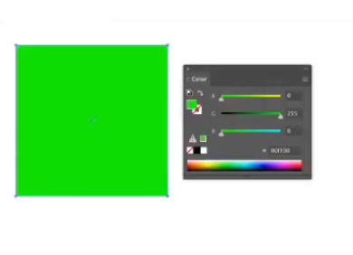
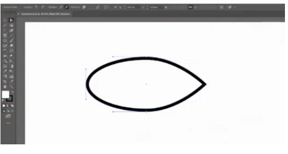

## Adobe AI

#### I kv. Mis juhtuks allpool näidatud objekti täitevärviga, kui kopeerite ja kleebite selle teise Illustratori faili, kus dokumendi värvirežiimiks on määratud CMYK?

- [x] Täitevärv teisendatakse CMYK väärtusteks
- [ ] Täitevärv ei muutuks.
- [ ] Illustrator kuvab veateate, kuna te ei saa RGB-värvidega objekti CMYK-faili kleepida.
- [ ] Täitevärv jääks RGB-ks, kuid selle välimus muutub.

#### Q2. Soovite lisada alloleval pildil olevale ringikujulisele taustaobjektile mõned tähed, kasutades hajutuspintslit. Kuidas tagada, et tähed ilmuvad ainult ringi sees?

- [ ] Valige enne harjamist ekraani segamise režiim.
- [x] Valige ring ja klõpsake enne harjamist tööriistaribal nuppu Joonista sisse.
- [ ] Lisage Scatter Brush suvanditesse fikseeritud vahekaugus.
- [ ] Valige pintslitõmme ja ring ning tehke liittee.

#### Q3. Miks peaksite kasutama käsku Salvesta valik?

- [ ], et säilitada vektorkoopiad objektidest, mida kavatsete rasterdada
- [ ] valitud objektide koopiate salvestamiseks uude faili
- [x], et säilitada valik objekte, mida võite uuesti kasutada
- [ ] valitud objektide salvestamiseks Creative Cloudi teeki

#### 4. kv. Milline toiming sulgeb tee, kui joonistate aktiivselt pliiatsi tööriistaga?

- [x] tee esimese punkti klõpsamine või lohistamine
- [ ] valides Objekt > Tee > Liitu
- [ ] vajutades Return (Mac) või sisestusklahvi (Windows)
- [ ] lülitumine teisele tööriistale

#### K5. Millist efekti kasutati allpool toodud California piirjoonte sügavuse andmiseks?

California kaardil on helebeež põhivärv ja väike tume vari.

- [x] 3D väljapressimine ja kaldnurk
- [ ] Nihkerada
- [ ] 3D-pööramine
- [ ] 3D-pööramine

#### K6. Kui valitud on mitu objekti, kuidas tühistada neist vaid ühe valik?

- [ ] Hoidke all klahvi Option (Mac) või Alt (Windows) ja klõpsake objektil, mille valiku soovite tühistada.
- [ ] Kasutage Lasso tööriista soovimatu objekti valiku tühistamiseks.
- [ ] Tõstuklahvi all hoides klõpsake objektil, mille valiku soovite tühistada
- [x] Vajutage Command+Shift+A (Mac) või Ctrl+Shift+A (Windows) ja klõpsake objektil, mille valiku soovite tühistada.

#### K7. Peate muutma alloleval kaardil kõigi teaberingide täitevärvi. Ringe ei loodud sümbolist. Milline käsk peale Globaalse redigeerimise aitaks teil seda ülesannet tõhusalt täita?

Lõuna-California kaardil on palju helesinisega varjutatud teaberinge.

- [ ] Värvige kunstiteos uuesti
- [ ] Valige > Sama > Välimus
- [ ] Redigeeri värve
- [x] Live Paint

#### Q8. Kuidas saate alloleval pildil spiraalil kõigi noolte suunda ümber pöörata?

Punane joon liigub spiraalselt päripäeva, keskpunkti suunas. Nooled piki joont näitavad selles suunas.

- [x] Valige Objekt > Tee > Teekonna vastupidine suund.
- [ ] Valige Efekt > 3D > Pööra.
- [ ] Kasutage paneeli teisendamismenüü käske Flip Horizontal ja Flip Vertical.
- [ ] Lohistage rada ümberkujundamise tööriistaga.

#### K9. Mida teeksite vasaku kinnituspunktiga, et muuta objekt sümmeetriliseks?

- [ ] Eemaldage see.
- [ ] Lõigake tee kinnituspunktist.
- [x] Teisendage see nurgapunktiks.
- [ ] Teisendage see sujuvaks punktiks.

#### Q10. Millal te Noa tööriista kasutate?

- [ ], kui soovite lõigata objekti olemasolevatest kinnituspunktidest
- [x], kui soovite lõigata objekti võrdseteks tükkideks
- [ ], kui soovite kärpida manustatud või lingitud pilti
- [ ], kui soovite objekti kiiresti poolitada, joonistades kinnised vabakäelised teed

#### Q11. Teil on täisvärviline RGB-dokument ja peate looma halltoonides versiooni, mis prinditakse ainult mustale plaadile. Kuidas saate seda saavutada?

- [x] Valige dokumendis kõik ja seejärel rakendage käsku Convert to Grayscale.
- [ ] Rakendage käsku Convert to Grayscale ja muutke dokumendi värvirežiimiks CMYK.
- [ ] Kasutage käsku Recolor Artwork ja valige eelseadistus 1-Color Job.
- [ ] Kustutage paneelilt Swatches kõik värviproovid, välja arvatud mustvalge.

#### Q12. Olete töötanud Essentialsi tööalal ja muutnud paneelide paigutust, sulgedes mõned vaikimisi avatud paneelidest ja avades teised menüüst Aken. Kuidas naasta paneelide vaikepaigutuse juurde?

- [ ] Lülituge mis tahes muule tööruumile ja seejärel lülituge tagasi Essentialsile.
- [ ] Väljuge Illustratorist, vajutage ja hoidke all klahvikombinatsiooni Command+Shift+Option (Mac) või Ctrl+Shift+Alt (Windows) ja taaskäivitage Illustrator.
- [x] Valige tööruumi menüüst või tööruumi vahetajast Reset Essentials.
- [ ] Väljuge ja käivitage Illustrator uuesti.

#### Q13. Teie ülemusele meeldib teie loodud uus logo
