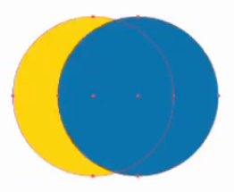
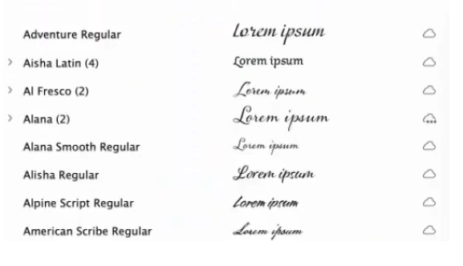
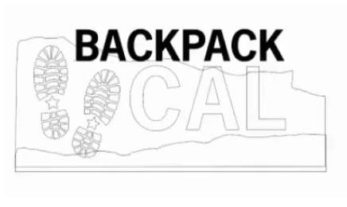

##Adobe AI

#### Domanda 1. Cosa accadrebbe al colore di riempimento dell'oggetto mostrato di seguito se lo copiassi e incollassi in un altro file Illustrator in cui la modalità colore documento era impostata su CMYK?

- [x] Il colore di riempimento verrebbe convertito in valori CMYK
- [ ] Il colore di riempimento rimarrebbe invariato.
- [ ] Illustrator visualizzava un errore perché non è possibile incollare un oggetto con colori RGB in un file CMYK.
- [ ] Il colore di riempimento rimarrebbe RGB ma il suo aspetto cambierebbe.

#### Domanda 2. Vuoi aggiungere alcune stelle all'oggetto di sfondo circolare nell'immagine qui sotto, usando un pennello a dispersione. Come puoi assicurarti che le stelle appaiano solo all'interno del cerchio?

- [ ] Selezionare la modalità di fusione dello schermo prima di spazzolare.
- [x] Seleziona il cerchio e fai clic sul pulsante Disegna all'interno sulla barra degli strumenti prima di spazzolare.
- [ ] Aggiungi un valore di spaziatura fisso nelle opzioni del pennello di dispersione.
- [ ] Seleziona il tratto di pennello e il cerchio e crea un percorso composto.

#### Domanda 3. Perché dovresti utilizzare il comando Salva selezione?

- [ ] per preservare copie vettoriali degli oggetti che intendi rasterizzare
- [ ] per salvare copie degli oggetti selezionati in un nuovo file
- [x] per preservare una selezione di oggetti che potresti riutilizzare
- [ ] per salvare gli oggetti selezionati in una libreria Creative Cloud

#### Q4. Quale azione chiude un tracciato quando stai disegnando attivamente con lo strumento Penna?

- [x] cliccando o trascinando il primo punto del percorso
- [ ] scegliendo Oggetto > Percorso > Unisci
- [ ] premendo Invio (Mac) o Invio (Windows)
- [ ] passaggio a uno strumento diverso

#### D5. Quale effetto è stato utilizzato per dare profondità al profilo della California sottostante?

Una mappa della California ha un colore principale beige chiaro e una piccola ombra scura.

- [x] Estrusione e smusso 3D
- [ ] Percorso di spostamento
- [ ] Ruota 3D
- [ ] Rivoluzione 3D

#### Domanda 6. Quando sono selezionati più oggetti, come si deseleziona solo uno di essi?

- [ ] Tieni premuto il tasto Opzione (Mac) o Alt (Windows) e fai clic sull'oggetto che desideri deselezionare.
- [ ] Utilizzare lo strumento Lazo per deselezionare l'oggetto indesiderato.
- [ ] Fai clic tenendo premuto il tasto Maiusc sull'oggetto che desideri deselezionare
- [x] Premi Comando+Maiusc+A (Mac) o Ctrl+Maiusc+A (Windows) e fai clic sull'oggetto che desideri deselezionare.

#### Domanda 7. Devi cambiare il colore di riempimento di tutti i cerchi informativi nella mappa sottostante. I cerchi non sono stati creati da un simbolo. Oltre alla modifica globale, quale comando ti aiuterebbe a svolgere questa attività in modo efficiente?

Una mappa della California meridionale include molti cerchi informativi ombreggiati in azzurro.

- [ ] Ricolora grafica
- [ ] Selezionare > Uguale > Aspetto
- [ ] Modifica colori
- [x] Pittura dal vivo

#### Domanda 8. Come puoi invertire la direzione di tutte le frecce sulla spirale nell'immagine qui sotto?

Una linea rossa si sviluppa a spirale in senso orario, verso il centro. Le frecce lungo la linea puntano in quella direzione.

- [x] Seleziona Oggetto > Percorso > Inverti direzione del percorso.
- [ ] Selezionare Effetto > 3D > Ruota.
- [ ] Utilizza i comandi Rifletti orizzontalmente e Rifletti verticalmente nel menu del pannello Trasforma.
- [ ] Trascina il tracciato con lo strumento Risagoma.

#### Domanda 9. Cosa faresti con il punto di ancoraggio sinistro per rendere l'oggetto simmetrico?

- [ ] Rimuoverla.
- [ ] Taglia il percorso nel punto di ancoraggio.
- [x] Convertilo in un punto d'angolo.
- [ ] Convertilo in un punto morbido.

#### D10. Quando usi lo strumento Coltello?

- [ ] quando si desidera tagliare un oggetto nei punti di ancoraggio esistenti
- [x] quando vuoi tagliare un oggetto in pezzi uguali
- [ ] quando si desidera ritagliare un'immagine incorporata o collegata
- [ ] quando si desidera dividere rapidamente un oggetto disegnando tracciati chiusi a mano libera

#### Domanda11. Hai un documento RGB a colori e devi creare una versione in scala di grigi che verrà stampata solo sulla lastra nera. Come puoi raggiungere questo obiettivo?

- [x] Seleziona tutto nel documento e quindi applica il comando Converti in scala di grigi.
- [ ] Applica il comando Converti in scala di grigi e modifica la modalità colore del documento in CMYK.
- [ ] Utilizzare il comando Ricolora grafica e selezionare la preimpostazione Lavoro a 1 colore.
- [] Elimina tutti i campioni di colore dal pannello Campioni ad eccezione di Bianco e nero.

#### Domanda12. Hai lavorato nell'area di lavoro Essenziali e hai modificato la disposizione dei pannelli, chiudendone alcuni che erano aperti per impostazione predefinita e aprendone altri dal menu Finestra. Come è possibile ripristinare la disposizione predefinita dei pannelli?

- [ ] Passa a qualsiasi altra area di lavoro, quindi torna a Essentials.
- [ ] Esci da Illustrator, tieni premuto Comando+Maiusc+Opzione (Mac) o Ctrl+Maiusc+Alt (Windows) e riavvia Illustrator.
- [x] Scegli Ripristina elementi essenziali dal menu Area di lavoro o dal commutatore dell'area di lavoro.
- [ ] Esci e riavvia Illustrator.

#### Domanda13. Al tuo capo piace il nuovo logo che hai desideratoGned ma mi piacerebbe vedere alcune variazioni utilizzando combinazioni di colori diversi. Quale funzionalità potresti utilizzare per generare rapidamente queste variazioni?

- [ ] Variabili
- [ ] Ricolora grafica
- [x] Pittura dal vivo
- [ ] Colori di prova

#### Domanda14. Qual è il modo più rapido ed efficiente per garantire che tutti gli oggetti mostrati nella figura seguente siano posizionati esattamente uno accanto all'altro senza spazio tra loro?

- [x] Specificare un oggetto chiave, quindi utilizzare il comando Distribuisci spazio orizzontale nel pannello Allinea con un valore di Spaziatura pari a 0
- [ ] Attiva le guide intelligenti e trascina ciascun oggetto finché non si aggancia a quello accanto.
- [ ] Scegli il comando Sposta e nella finestra di dialogo imposta il valore Distanza su 0.
- [ ] Seleziona gli oggetti con lo strumento Selezione, quindi trascina dal lato del riquadro di selezione finché gli oggetti non si agganciano insieme.

#### D15. Selezioni un nuovo colore nel selettore colori e desideri vedere diverse variazioni in diverse sfumature e tinte. Quale funzionalità ti consente di farlo?

- [ ] Temi Adobe Color
- [ ] Guida ai colori
- [ ] Gruppi di colori
- [x] Ricolora la grafica

#### Domanda 16. Qual è lo scopo del comando Rendi Pixel Perfect?

- [x] per creare grafica web reattiva che può essere ridimensionata senza perdita di qualità
- [ ] per garantire che la grafica utilizzi solo colori sicuri per il Web
- [ ] per fare in modo che Illustrator scelga automaticamente il formato file di esportazione corretto in base al contenuto dell'immagine
- [ ] per creare grafica web nitida senza anti-aliasing delle linee rette

#### D17. Hai solo un oggetto sulla tua tavola da disegno. Vuoi cambiare il colore di riempimento da nero a giallo, quindi apri il selettore colore e seleziona un colore giallo. Ma quando fai clic su OK, il riempimento dell'oggetto diventa grigio, non giallo. Perché sta succedendo?

- [ ] La modalità colore del riempimento è impostata su Scala di grigi.
- [ ] La modalità di fusione Luminosità viene applicata al riempimento.
- [ ] Una delle opzioni Daltonismo viene scelta in Impostazione prova nel menu Visualizza.
- [x] L'anteprima di sovrastampa è attivata nel pannello Anteprima separazioni.

#### Domanda 18. Come puoi assicurarti che i nomi propri non siano sillabati nel documento su cui stai lavorando?

- [x] Disattiva Sillabazione parole in maiuscolo nel pannello Paragrafo.
- [ ] Seleziona Giustifica tutte le linee nel pannello Paragrafo.
- [ ] Diminuisci la spaziatura delle parole nelle opzioni di giustificazione.
- [ ] Aumenta il valore della zona di sillabazione nel pannello Paragrafo in modo che sia maggiore della dimensione in punti del testo.

#### Domanda 19. Come potresti trasformare rapidamente tutti gli esagoni in triangoli nell'immagine qui sotto?

- [ ] Nel pannello Controllo, fai clic sul pulsante per iniziare a modificare forme simili, quindi seleziona Oggetto > Percorso > Semplifica.
- [x] Nel pannello Proprietà, fare clic su Avvia modifica globale e quindi utilizzare i controlli Trasforma per ridurre il conteggio dei lati del poligono a 3.
- [ ] Nel pannello Proprietà, fare clic su Espandi forma. Quindi fare clic su Avvia modifica globale e utilizzare i controlli Trasforma per ridurre il conteggio dei lati del poligono a 3.
- [ ] Nel pannello Controllo, fai clic sul pulsante per iniziare a modificare forme simili, quindi seleziona Oggetto > Trasforma > Trasforma ciascuna.

#### Q20. Stai lavorando con una tavoletta con penna e scopri che utilizzare gli strumenti Ellisse, Rettangolo e Poligono per creare oggetti è alquanto complicato. Quale strumento ti consentirebbe di disegnare, spostare e modificare queste forme con gesti intuitivi?

- [ ] lo strumento Leviga
- [ ] lo strumento Crea forme
- [ ] lo strumento Matita
- [x] lo strumento Modellatore

#### Domanda21. Quando utilizzi lo strumento Secchiello pittura dinamica per riempire la grafica con i colori, non puoi riempire alcune aree a causa delle dimensioni degli spazi tra i tracciati. Cosa puoi fare nella finestra di dialogo Opzioni spazio per risolvere questo problema?

- [ ] Selezionare Spazi piccoli.
- [x] Selezionare Chiudi spazi vuoti con percorsi.
- [ ] Seleziona spazi grandi.
- [ ] Disattiva il rilevamento degli spazi.

#### D22. Utilizzi spesso i pennelli della libreria di pennelli Pattern Arrows. Come puoi fare in modo che questa libreria si apra automaticamente all'avvio di Illustrator?

- [ ] Seleziona Mostra pennelli pattern dal menu del pannello Pennelli.
- [ ] Selezionare Persistente dal menu del pannello della libreria.
- [x] Apri la libreria e salva un'area di lavoro personalizzata.
- [] Seleziona tutti i pennelli nella libreria di pennelli Pattern Arrows e scegli Aggiungi ai pennelli dal menu del pannello della libreria.

#### D23. Nell'immagine seguente, stai tentando di utilizzare lo strumento Unisci per rimuovere le porzioni sovrapposte di due tracciati (evidenziati in giallo), ma sembra che non accada nulla. Perchè è questo?

- [ ] I percorsi non hanno un attributo di riempimento.
- [ ] È selezionato solo uno dei percorsi, ma è necessario selezionarli entrambi.
- [ ] Uno dei percorsi è selezionato ma lo strumento Unisci funziona solo con percorsi non selezionati.
- [x] Gli endpoint devono essere selezionati in entrambi i percorsi prima di poter essere tagliati e uniti.

#### D24. Quale metodo di colorazione dovresti scegliere quando usi un pennello artistico, a dispersione o con pattern per applicare una tinta piatta?

- [x] Nessuno
- [ ] Tinte
- [ ] Tinte e sfumature
- [ ] Cambiamento tonalità

#### D25. Voihai disegnato una stella a cinque punte in un disegno e desideri modificare il raggio interno. Come raggiungeresti questo obiettivo?

- [ ] Il raggio interno di una stella non può essere modificato e dovrebbe essere ridisegnato.
- [ ] Utilizza lo strumento Scala tenendo premuto Opzione+Maiusc (Mac) o Alt+Maiusc (Windows).
- [x] Seleziona i punti interni, quindi utilizza lo strumento Scala per modificare uniformemente il raggio.
- [ ] Fare doppio clic sullo strumento Stella e modificare l'opzione Raggio interno.

#### D26. Qual è il significato dei tre punti sull'icona della nuvola nell'immagine qui sotto?

- [ ] I font Alana sono disattivati.
- [x] I caratteri Alana sono solo per uso web.
- [ ] I font Alana sono attualmente in fase di attivazione.
- [ ] Non tutti i font della famiglia Alana sono attivati.

#### D27. Quale comando applicheresti per rendere visibili gli oggetti sotto l'opera d'arte selezionata all'interno del cerchio?

Un rettangolo giallo ha una selezione circolare al centro.

- [ ] Crea motivo
- [ ] Crea un gruppo di pittura dinamica
- [ ] Crea un percorso composto
- [x] Crea una maschera di ritaglio

#### D28. Lo strumento Spruzzatore di simboli è stato utilizzato per applicare diverse istanze di simboli a un'illustrazione. Desideri modificare l'aspetto di alcune istanze utilizzando gli stili grafici. Come si potrebbe raggiungere questo obiettivo?

- [x] Selezionare le istanze con lo strumento Selezione gruppo e quindi scegliere lo stile grafico desiderato.
- [ ] Le istanze di simboli in un set di simboli non possono essere sovrascritte.
- [ ] Selezionare le istanze con lo strumento Selezione diretta e quindi scegliere lo stile grafico desiderato.
- [ ] Con lo strumento Stile simboli, seleziona uno stile grafico e dipingi lo stile sulle istanze dei simboli.

#### D29. Cosa succede quando fai clic su un punto di ancoraggio esistente con lo strumento Penna?

- [ ] Eventuali maniglie di controllo vengono rimosse, convertendo il punto in un punto d'angolo.
- [ ] Il percorso viene diviso in quel punto.
- [x] Il punto viene cancellato.
- [ ] Il punto è selezionato.

[Riferimento](http://www.photoshopforphotographers.com/3101-1901/Help_guide/tp/Pen_path_tools.html)

#### Q30. Quando crei un oggetto mesh, quando dovresti utilizzare lo strumento Mesh invece del comando Crea mesh sfumata nel menu Oggetto?

- [x] quando si desidera creare mesh più semplici in modo che le prestazioni di Illustrator non vengano influenzate negativamente
- [ ] quando si desidera evidenziare il bordo dell'oggetto
- [ ] quando si desidera creare linee mesh a intervalli equidistanti all'interno dell'oggetto
- [ ] quando si desidera creare linee mesh in una o più posizioni specifiche all'interno dell'oggetto

#### D31. Quando visualizzi l'opera d'arte mostrata di seguito in modalità Struttura, cosa puoi dire della parola "zaino"?

- [ ] È stato convertito in contorni.
- [ ] È testo attivo.
- [ ] È un percorso composto.
- [x] Ha un colore di riempimento nero.

#### D32. Desideri che le colonne di un grafico coprano l'intera lunghezza dell'asse delle categorie. Quale opzione sceglieresti?

- [x] Nella finestra di dialogo Tipo di grafico, scegli Asse categoria e imposta l'opzione Segni di graduazione su Larghezza intera.
- [ ] Nella finestra di dialogo Tipo di grafico, in Opzioni grafico, imposta la larghezza del cluster su 100 nella sezione Opzioni.
- [ ] Nella prima riga di dati, digitare 100% in ciascuna cella corrispondente alle colonne della categoria.
- [ ] Selezionare le colonne con lo strumento Selezione diretta e utilizzare lo strumento Scala per modificare la larghezza.

##### D33. Se stai cercando uno strumento nella barra degli strumenti e non è visibile, cosa dovresti fare?

- [ ] Senza selezionare nulla, fare clic sul pulsante Altri strumenti nel pannello Proprietà.
- [x] Fare clic sui puntini di sospensione nella parte inferiore della barra degli strumenti.
- [ ] Attiva lo strumento nelle preferenze.
- [ ] Nel menu Finestra, fare clic su Finestra > Strumenti.

#### D34. I quattro fiori mostrati nell'immagine qui sotto sono stati creati applicando un pennello artistico su tracciati di diversa lunghezza. Come puoi evitare la distorsione osservata nei fiori 2, 3 e 4 mantenendo la stessa dimensione delle foglie e la larghezza dello stelo in tutti i fiori?

- [ ] Apri la finestra di dialogo Opzioni pennello artistico e seleziona Scala proporzionalmente.
- [x] Espandi l'aspetto dei fiori distorti e trascina i fiori con lo strumento Selezione.
- [ ] Utilizza lo strumento Penna per aggiungere punti nella parte superiore e inferiore del gambo, quindi trascina i punti con lo strumento Selezione diretta per rimuovere la distorsione.
- [ ] Apri la finestra di dialogo Opzioni pennello artistico, seleziona Allunga tra guide, quindi posiziona le guide in modo che solo il gambo sia tra di loro.

#### D35. Quando stampi un'immagine con molti colori fuori gamma, quale intento di rendering sceglieresti per preservare al meglio la relazione visiva tra i colori e non i valori cromatici specifici?

- [ ] Colorimetrico assoluto
- [ ] Percettivo
- [ ] Saturazione
- [x] Colorimetrico relativo

#### D36. Perché dovresti modificare il valore Espandi mesh quando usi lo strumento Deformazione marionetta?

- [ ] Ti permette di lavorare più velocemente perché la modifica di una mesh più grande richiede meno calcoli.
- [ ] Permette di modificare insieme oggetti disgiunti
- [ ] Tuttoconsente di apportare modifiche maggiori a un oggetto.
- [x] Ti permette di vedere la mesh più chiaramente.

#### D37. Quando si utilizza la funzione Traccia immagine, quale opzione ha il maggiore impatto sul numero di percorsi creati nel risultato del tracciamento?

- [ ] Angoli
- [x] Rumore
- [ ] Percorsi
- [ ] Colori

#### D38. Se desideri creare una mappa immagine, quale pannello utilizzeresti per trasformare un oggetto in un'area cliccabile?

- [x] Proprietà CSS
- [ ] Attributi
- [ ] Collegamenti
- [] Interattività SVG

#### D39. Perché utilizzare il comando Semplifica prima di esportare un'immagine Web nel formato SVG?

- [ ] per ridurre il numero di punti che devono essere rappresentati nel codice
- [ ] per rimuovere punti e linee invisibili
- [x] per ridurre la risoluzione di output in modo che sia appropriata per la grafica web
- [ ] per combinare oggetti ridondanti

#### Q40. Hai progettato l'etichetta del prodotto mostrata di seguito. Il tuo cliente desidera che il cerchio nero venga stampato il più scuro possibile e richiede che nessuno degli elementi colorati del logo sia visibile attraverso il cerchio quando l'etichetta viene stampata. Cosa dovresti fare?

- [x] Seleziona il cerchio e attiva Riempimento sovrastampa nel pannello Attributi.
- [ ] Seleziona il cerchio e applica la modalità di fusione Moltiplica.
- [ ] Riempi il cerchio con un colore nero intenso composto da tutti e quattro gli inchiostri di processo.
- [ ] Utilizza il pannello Aspetto per aggiungere un secondo riempimento nero.

#### D41. Stai lavorando con un file Illustrator che include un file Photoshop collegato. Il tuo cliente invia un nuovo file Photoshop con un nome diverso e ti chiede di sostituire quello vecchio nel file Illustrator. Quale comando nel pannello Collegamenti utilizzeresti per ottenere questo risultato?

- [ ] Opzioni di posizionamento
- [ ] Modifica originale
- [x] Collegamento di aggiornamento
- [ ] Ricollega

#### D42. Sono stati modificati i colori di riempimento di diverse istanze di un simbolo dinamico. Qual è il modo più veloce per riportare il colore di riempimento in ogni istanza al suo aspetto originale?

- [ ] imposta il tipo di esportazione su Filmato
- [ ] elimina il simbolo ed espande tutte le istanze
- [ ] converte il simbolo in un simbolo statico
- [x] Interrompe il collegamento al simbolo

#### D43. Nella carta regalo mostrata di seguito, i petali del fiore magenta devono essere stampati con una vernice. Come imposteresti il file in modo che la vernice venga applicata sul colore magenta dei petali?

- [x] Utilizzare Informazioni file per lasciare istruzioni al fornitore di servizi di stampa.
- [] Duplica i petali su un nuovo livello chiamato "Vernice".
- [ ] Assicurarsi che il colore magenta provenga da un campione di tinte piatte.
- [ ] Crea copie dei petali sopra il disegno originale e riempi i petali con un nuovo campione di tinte piatte impostato per la sovrastampa.

#### D44. Al tuo cliente piace il motivo compilato nel testo sottostante, ma desidera che i fiori si sovrappongano maggiormente in modo che ci siano spazi più piccoli. Come potresti realizzarlo?

- [ ] Selezionare Dimensioni piastrella su disegno nella finestra di dialogo Opzioni modello.
- [ ] Aumenta il numero di copie del fiore utilizzato per realizzare il motivo.
- [x] Ridurre la larghezza e l'altezza nella finestra di dialogo Opzioni modello.
- [ ] Utilizzare i pulsanti Sovrapponi nella finestra di dialogo Opzioni modello.

#### D45. Perché dovresti attivare l'opzione Ignora tavole da disegno nella finestra di dialogo Stampa?

- [x] per impedire a Illustrator di stampare segni che mostrano i bordi delle tavole da disegno
- [ ] per stampare tutte le tavole da disegno su un unico pezzo di carta
- [ ] per impedire a Illustrator di stampare i nomi delle tavole da disegno
- [ ] per ridimensionare ciascuna tavola da disegno in base alle dimensioni del supporto

#### D46. È necessario elaborare una grande quantità di file Illustrator, applicando a ciascuno la stessa sequenza di trasformazioni. Qual è il modo più efficace per farlo?

- [ ] Utilizzare il comando Modifica globale.
- [x] Utilizzare il comando Trasforma di nuovo.
- [ ] Utilizzare il comando Trasforma ogni.
- [ ] Utilizzare il pannello Azioni per registrare e riprodurre la sequenza dei passaggi.

#### D47. Perché dovresti scegliere Abilita guide per il ridimensionamento a 9 sezioni durante la creazione di un simbolo?

- [ ] per consentire l'esportazione di porzioni del simbolo come grafica separata
- [ ] per garantire che ogni istanza del simbolo mantenga sempre le sue proporzioni originali quando viene ridimensionata
- [x] per includere guide personalizzate con il simbolo in modo che ogni istanza venga posizionata nella stessa posizione rispetto alla tavola da disegno
- [ ] per consentire il ridimensionamento delle istanze del simbolo senza distorcere gli angoli

#### D48. Cosa puoi fare per modificare il testo in una sola istanza posizionata di un simbolo?

- [x] Fare clic sul pulsante Modifica simbolo nel pannello Controllo o Proprietà.
- [ ] Modifica il nome dell'istanza del simbolo.
- [ ] Fare doppio clic sull'istanza con lo strumento Testo.
- [ ] Fare clic sul pulsante Interrompi collegamento nel pannello Controllo o Proprietà.

#### D49. Il tuo collega ti ha chiesto di prfornire il codice CSS per un oggetto nel documento. Cosa devi fare affinché Illustrator generi automaticamente il codice per quel particolare oggetto?

- [ ] Trascina l'oggetto nel pannello Esportazione risorse.
- [x] Seleziona l'oggetto e scegli Genera CSS dal pannello Proprietà CSS.
- [ ] Seleziona l'oggetto e scegli Copia stile selezionato dal pannello Proprietà CSS.
- [ ] Assegna un nome all'oggetto nel pannello Livelli.

####Q50. Hai disegnato oggetti su piani utilizzando la griglia prospettica, ma ora desideri modificare gli angoli della griglia in nuovi punti di fuga e aggiornare automaticamente la grafica. Quale opzione dovrebbe essere abilitata per ottenere questo risultato?

- [x] Abilita la distorsione prospettica.
- [ ] Abilita l'Angolo di visualizzazione nella finestra di dialogo Definisci griglia.
- [ ] Scegli Visualizza > Griglia prospettica > Blocca punto stazione
- [ ] Abilita trasformazione 3D.
