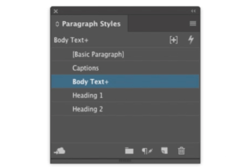

## Adobe InDesign

#### Q1. Quelle est l’une des raisons de cliquer sur Options de bloc de texte > objet ?

- \[x] pour modifier le nombre de colonnes dans un bloc de texte
- \[ ] pour appliquer une ombre portée à l’image
- \[ ] pour changer les coins d’un cadre d’un coin à arrondi
- \[ ] pour modifier le fond et le contour d’un bloc de texte

[Ref.](https://www.agitraining.com/adobe/indesign/tutorials/text-frame-options-in-indesign?page=4#:~:text=You%20can%20have%20InDesign%20determine,choosing%20Object%20%3E%20Text%20Frame%20Options.)

#### Q2. Quel panneau vous permet d’ajouter une pointe de flèche à la fin d’une ligne ?

- \[ ] Effets
- \[x] Avc
- \[ ] Transformer
- \[ ] Éclaireur

[Ref.](https://helpx.adobe.com/in/indesign/using/applying-line-stroke-settings.html#:~:text=Use%20the%20Start%20and%20End,the%20Start%20and%20End%20menus.)

#### Q3. Dans l’image montrée, que savez-vous du style de paragraphe Body Text ?

- \[x] Le texte sélectionné n’a pas été mis en forme à l’aide de la définition de style.
- \[ ] Le texte sélectionné est en texte superposé en dehors des limites du bloc actif.
- \[ ] Le style a été appliqué à deux paragraphes ou plus.
- \[ ] Le style a été ajouté depuis la création des styles principaux.

[Ref.](https://helpx.adobe.com/indesign/using/paragraph-character-styles.html)

#### Q4. Vous voulez vous assurer qu’une image sur votre page est exactement 25% de sa taille d’origine. Comment déterminer si l’image est réglée sur la taille souhaitée ?

- \[x] Double-cliquez sur l’image à l’aide de l’outil Sélection.
- \[ ] Sélectionnez le cadre graphique à l’aide de l’outil Sélection.
- \[ ] Cliquez sur **Fenêtre** > **Info**.
- \[ ] Cliquez sur **Objet** > **Essayage**.

#### Q5. Vous disposez d’un document InDesign vide d’une page. Vous avez utilisé Fichier > Place pour sélectionner un document Word qui contient de nombreuses pages de texte. Qu’est-ce qui vous aidera à placer l’histoire complète rapidement?

- \[ ] Sélectionner **Afficher les options d’importation** dans l' **Lieu** boîte de dialogue.
- \[ ] Cliquez avec le bouton droit sur la page avec le curseur de placement.
- \[x] Cliquez tout en maintenant la touche Maj enfoncée à l’aide du curseur situé à l’intérieur des repères de marge.
- \[ ] Dans le **Pages** , cliquez sur le bouton **Nouvelles pages** avec le curseur de placement.

#### Q6. Vous sélectionnez un cadre graphique qui contient une image Photoshop et utilisez le champ Echelle du Panneau de configuration pour l’agrandir à 200 %. Qu’advient-il de la résolution d’image effective ?

- \[ ] La résolution double.
- \[ ] La résolution d’image effective reste la même jusqu’à ce que vous choisissiez dans le menu Afficher > Performances d’affichage.
- \[ ] La résolution d’image effective est définie dans Photoshop, pas dans InDesign, elle reste donc la même.
- \[x] Correct La résolution est coupée en deux.

#### Q7. Quelle est l’une des raisons pour lesquelles vous souhaiterez peut-être utiliser la fonctionnalité Variables de texte ?

- \[ ] pour créer des légendes sous les images qui se mettent à jour automatiquement
- \[ ] pour inclure les calculs à l’intérieur d’une table dynamique
- \[ ] pour ajuster automatiquement la taille du texte afin de remplir le bloc
- \[x] pour créer des en-têtes en cours d’exécution qui incluent des noms de chapitre

#### Q8. Vous souhaitez placer 4 d’un fichier PDF de plusieurs pages dans un document InDesign. Que devriez-vous faire?

- \[x] Dans le **Lieu** boîte de dialogue, sélectionnez **Afficher les options d’importation**.
- \[ ] Importez le fichier PDF avec le **Média** au lieu de **Fichier>Placer**
- \[ ] Ouvrez le fichier PDF dans Acrobat, sélectionnez la page 4 et faites-le glisser dans InDesign.
- \[ ] Après avoir placé le fichier PDF, désactivez les pages indésirables dans le panneau Média.

#### Q9. Supposons que la page maître B est basée sur la page maître A et que vous modifiez actuellement la gabarit B. Quelle affirmation est vraie?

- \[ ] Les objets de la page maître A ne sont pas visibles.
- \[ ] Les objets de la page maître A doivent toujours apparaître derrière les objets de la page maître B.
- \[x] Les objets de la page maître A ne peuvent pas être sélectionnés à moins que vous ne les remplaciez.
- \[ ] Les objets de la page maître A ne peuvent pas être sélectionnés ou modifiés.

#### Q10. Dans l’image montrée, le texte est sur un chemin. Vous souhaitez déplacer le texte plus loin vers la droite le long du tracé. Comment pouvez-vous y parvenir?

- \[ ] Faites glisser le carré bleu D.
- \[ ] Faites glisser la poignée latérale B
- \[x] Faites glisser la ligne inclinée A.
- \[ ] Faites glisser la coche centrale C.

#### Q11. Lorsque vous sélectionnez un cadre rectangulaire sur la page, InDesign affiche un carré jaune près du coin supérieur droit du bloc. Qu’est-ce que cela vous permet de faire?

- \[x] Changez les coins de carré à arrondi.
- \[ ] Ancrez l’objet dans une autre image.
- \[ ] Modifiez le calque ou l’ordre z de l’image.
- \[ ] Liez le cadre à un autre cadre.

#### Q12. Quelle action l’outil Plume peut-il effectuer sur un objet sélectionné ?

- \[ ] L’outil Plume ne peut pas affecter un objet après sa création.
- \[ ] Vous pouvez cliquer sur un point pour le convertir en courbe.
- \[ ] Vous pouvez faire glisser l’outil Plume à l’intérieur d’un cadre pour le convertir en forme composée.
- \[x] Vous pouvez cliquer sur un point pour le supprimer.

#### Q13. Quelle est l’une des raisons pour lesquelles vous souhaiterez peut-être utiliser la fonctionnalité Span Columns ?

- \[x] Vous avez une liste à puces de six éléments que vous souhaitez diviser en deux colonnes au milieu d’un bloc de texte.
- \[ ] Vous modifiez le nombre de colonnes sur une page et souhaitez vous assurer que le texte circule correctement.
- \[ ] Vous souhaitez qu’une ligne ou une bordure ombrée supérieure s’étende sur le haut d’un cadre à plusieurs colonnes.
- \[ ] Vous avez un en-tête que vous souhaitez répartir sur deux blocs de texte threadés

#### Q14. Quelle déclaration sur les tables est vraie ?

- \[ ] Les tableaux sont toujours ancrés dans un article dans un bloc de texte.
- \[ ] Pour modifier le texte d’un tableau, vous devez d’abord cliquer sur **Table>Convertir le tableau en texte**
- \[ ] Les tables doivent contenir plusieurs cellules.
- \[ ] Les tableaux ne peuvent pas être ancrés dans un article dans un bloc de texte

#### Q15. Quelle fonctionnalité utiliseriez-vous pour créer l’effet affiché, où les cercles groupés se fondent les uns avec les autres mais pas l’objet derrière eux ?

- \[ ] Lumière globale
- \[ ] le mode de fusion d’écran
- \[ ] Mélange d’isolats
- \[ ] Groupe Knockout

#### Q16. Dans l’image montrée, qu’indiquent les bords colorés du cadre ?

- \[ ] sur quel calque se trouve chaque objet
- \[ ] sur quelle page maître se trouve chaque objet
- \[ ] quel style d’objet est appliqué à l’image
- \[ ] que le cadre rouge est verrouillé

#### Q17. Pour redimensionner une image et son contenu et conserver les proportions des deux, sur quelles touches devez-vous appuyer lorsque vous faites glisser à partir d’une poignée d’angle ?

- \[ ] Ctrl (Windows) ou Commande (Mac)
- \[ ] Alt+Maj (Windows) ou Option+Maj (Mac)
- \[ ] Ctrl+Maj (Windows) ou Commande+Maj (Mac)
- \[ ] Alt+Barre d’espace (Windows) ou Options+Barre d’espace (Mac)

#### Q18. Dans l’image montrée, que pouvez-vous déduire sur la façon dont ce document sera imprimé ?

- \[ ] La page sera mise à l’échelle pour s’adapter au papier.
- \[ ] Tous les calques de document seront visibles
- \[ ] Une partie de la page InDesign sera recadrée.
- \[ ] La page maître P est appliquée aux pages du document.

#### Q19. Après avoir cliqué sur une couleur dans le **Pente** pour le sélectionner, comment pouvez-vous définir sa couleur sur une nuance dans le **Échantillons** panneau?

- \[ ] Double-cliquez sur la nuance.
- \[ ] Option +clic (Mac) ou Alt (Windows) sur la nuance.
- \[ ] Vous ne pouvez pas appliquer un échantillon de couleur à un arrêt de couleur dans le **Pente** panneau.
- \[ ] Faites glisser l’arrêt de couleur sur la couleur dans le **Échantillons** panneau.
