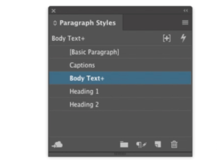
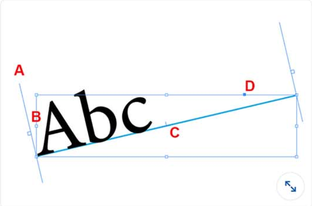

## Adobe InDesign

#### Q1. What is one reason to click Object > Text Frame Options?

- [x] to change the number of columns in a text frame
- [ ] to apply a drop shadow to the frame
- [ ] to change the corners of a frame from corner to rounded
- [ ] to change the fill and stroke of a text frame

[Ref.](https://www.agitraining.com/adobe/indesign/tutorials/text-frame-options-in-indesign?page=4#:~:text=You%20can%20have%20InDesign%20determine,choosing%20Object%20%3E%20Text%20Frame%20Options.)

#### Q2. Which panel allows you to add an arrowhead to the end of a line?

- [ ] Effects
- [x] Stroke
- [ ] Transform
- [ ] Pathfinder

[Ref.](https://helpx.adobe.com/in/indesign/using/applying-line-stroke-settings.html#:~:text=Use%20the%20Start%20and%20End,the%20Start%20and%20End%20menus.)

#### Q3. In the image shown, what do you know about the Body Text paragraph style?

- [x] The selected text was not formatted using the style definition.
- [ ] The selected text is in overset text outside the boundaries of the current frame.
- [ ] The style has been applied to two or more paragraphs.
- [ ] The style has been added since the master styles were created.

[Ref.](https://helpx.adobe.com/indesign/using/paragraph-character-styles.html)

#### Q4. You want to ensure that an image on your page is exactly 25% of its original size. How can you determine whether the image is set to the desired size?

- [x] Double-click the image with the Selection tool.
- [ ] Select the graphic frame with the Selection tool.
- [ ] Click **Window** > **Info**.
- [ ] Click **Object** > **Fitting**.

#### Q5. You have an empty one-page InDesign document. You have used File > Place to select a Word document that contains many pages of text. What will help you place the full story quickly?

- [ ] Select **Show Import Options** in the **Place** dialog box.
- [ ] Right-click the page with the place cursor.
- [x] Shift-click with the place cursor inside the margin guides.
- [ ] In the **Pages** panel, click the **New Pages** button with the place cursor.

#### Q6. You select a graphic frame that contains a Photoshop image and use the Scale field in the Control panel to enlarge it to 200%. What happens to the effective image resolution?

- [ ] The resolution doubles.
- [ ] Effective image resolution stays the same until you choose from the View > Display Performance menu.
- [ ] Effective image resolution is set in Photoshop, not in InDesign, so it stays the same.
- [x] Correct The resolution is cut in half.

#### Q7. What is one reason you might want to use the Text Variables feature?

- [ ] to create captions underneath images that update automatically
- [ ] to include calculations inside a dynamic table
- [ ] to adjust text size automatically to fill the frame
- [x] to create running headers that include chapter names

#### Q8. You want to place 4 of a multipage PDF into an InDesign document. What should you do?

- [x] In the **Place** dialog box, select **Show Import Options**.
- [ ] Import the PDF with the **Media** panel instead of **File>Place**
- [ ] Open the PDF in Acrobat, select page 4, and drag it into InDesign.
- [ ] After placing the PDF, disable the unwanted pages in the Media panel.

#### Q9. Suppose that master page B is based on master page A, and you are currently editing master B. Which statement is true?

- [ ] Objects on master page A are not visible.
- [ ] Objects on master page A must always appear behind objects from master page B.
- [x] Objects on master page A cannot be selected unless you override the objects.
- [ ] Objects on master page A cannot be selected or changed.

#### Q10. In the image shown, the text is on a path. You want to move the text farther to the right along the path. How can you accomplish this?

- [ ] Drag the blue square D.
- [ ] Drag the side handle B
- [x] Drag the slanted line A.
- [ ] Drag the center tick mark C.

#### Q11. When you select a rectangular frame on the page, InDesign displays a yellow square near the frame's upper-right corner. What does this allow you to do?

- [x] Change the corners from square to rounded.
- [ ] Anchor the object into another frame.
- [ ] Change teh layer or z-order of the frame.
- [ ] Link the frame to another frame.

#### Q12. What action can the Pen tool perform on a selected object?

- [ ] The Pen tool cannot affect an object after it has been created.
- [ ] You can click a point to convert it to a curve.
- [ ] You can drag the Pen tool inside a frame to convert it to a compound shape.
- [x] You can click a point to delete it.

#### Q13. What is one reason you might want to use the Span Columns feature?

- [x] You have a bullet list of six items that you want to split into two columns in the middle of a text frame.
- [ ] You are changing the number of columns on a page and want to ensure the text flows properly.
- [ ] You want a line or top shaded borded to span across the top of a multicolumn frame.
- [ ] You have a heading that you want to span across two threaded text frames
