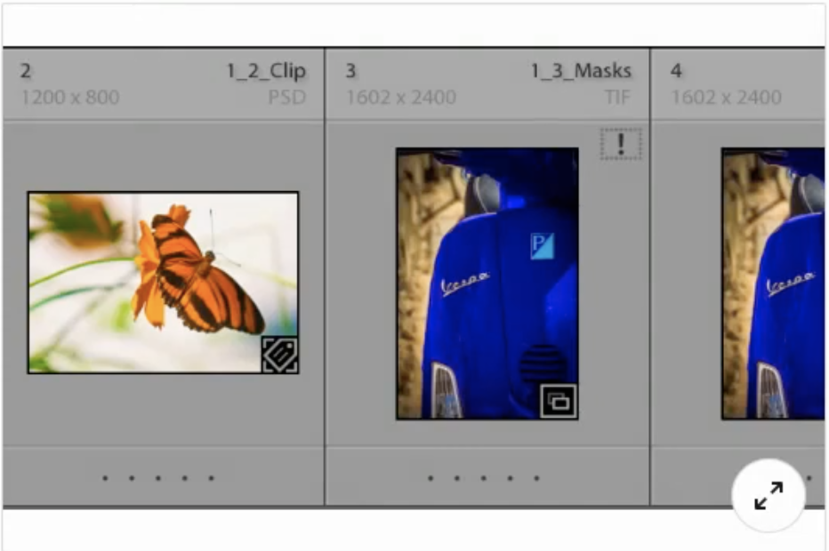
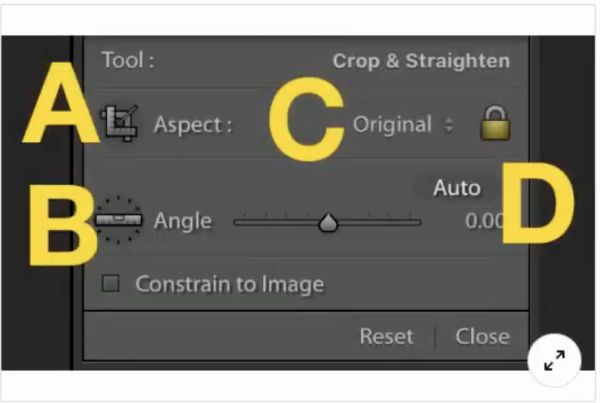
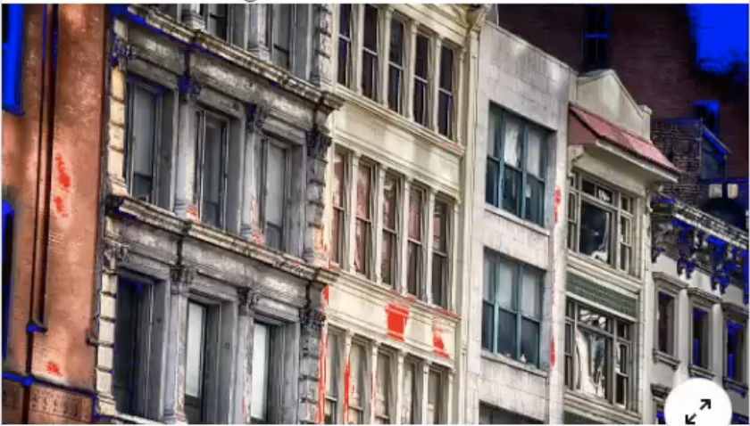
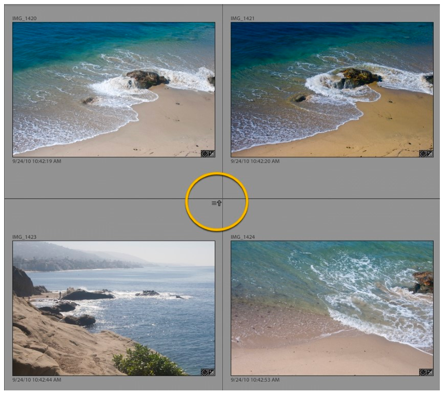

## Adobe Lightroom

#### Q1. Suppose you see a color fringe around the edges of your subject. Which control is best for removing the fringe?

- [ ] Color Noise Reduction
- [x] Remove Chromatic Aberration
- [ ] Split Toning
- [ ] Enable Profile Corrections

#### Q2. If you want to apply the same editing from one image to another, what should you use?

- [ ] metadata
- [ ] Image settings
- [ ] Edit settings
- [x] Develop settings

Note: I just use synchronization. After digging into settings I was able only to discover Settings -> Copy settings.

#### Q3. Which module helps you create a printed photo album?

- [ ] Web
- [x] Book
- [ ] Print
- [ ] Library

#### Q4. Review the image shown. What does the exclamation point adjacent to the thumbnail imply?

- [ ] The image has been edited in Photoshop.
- [ ] The photo is marked as picked.
- [ ] The photo needs at least one keyword.
- [x] A photo is missing and needs to be relocated.

[Reference (adobe.com)](https://helpx.adobe.com/in/lightroom-classic/help/locate-missing-photos.html)

#### Q5. Adjusting the exposure of a raw file by -1 is the equivalent of doing what in the camera?

- [ ] opening the aperture one f-stop
- [x] closing the aperture one f-stop
- [ ] adjusting the ISO by +400
- [ ] adjusting the ISO by -400

#### Q6. Review the image below. Which option lets you manually straighten a photo by drawing a vertical or horizontal line?

- [ ] A
- [x] B
- [ ] C
- [ ] D

#### Q7. Suppose you want to migrate a selection of images to another machine. How can you create a new catalog that contains a copy of all the images?

- [x] Use the Export as Catalog command.
- [ ] When you back up the catalog, the images are backed up as well.
- [ ] Use the Export command.
- [ ] Use the Import from Another Catalog command.

[Reference (adobe.com)](https://helpx.adobe.com/lightroom-classic/help/create-catalogs.html)

#### Q8. Which Spot Healing Brush mode replaces an imperfection with an exact copy of pixels from another area?

- [ ] Patch mode
- [ ] Screen mode
- [ ] Healing mode
- [x] Clone mode

#### Q9. When reviewing images, what task can be accomplished using the number keys?

- [ ] finding images
- [ ] printing images
- [ ] selecting images
- [x] applying ratings

#### Q10. What's the easiest way to reuse your most recent custom export settings?

- [x] Click File > Export with Previous.
- [ ] Click File > Export with Preset.
- [ ] Click File > Export as Catalog.
- [ ] Click File > Export Again.

#### Q11. In the image shown, what do the blue areas indicate?

- [x] crushed details in the shadows
- [ ] a special effect applied to the image
- [ ] too little saturation in the image
- [ ] crushed details in the highlights

#### Q12. When exporting an image, which sharpening method is best for use on displays?

- [ ] Glossy Paper
- [x] Screen
- [ ] Internet
- [ ] Matte Paper

[Reference (digitalphotomentor.com)](https://www.digitalphotomentor.com/the-guide-to-image-sharpening-in-lightroom/)

#### Q13. Which Develop module panel lets you adjust an image based on a color range?

- [x] HSL/Color
- [ ] Split Toning
- [ ] Calibration
- [ ] Basic

#### Q14. Which file type will work with the Enhance Details command?

- [x] raw files
- [ ] PSD
- [ ] JPEG
- [ ] TIFF

#### Q15. Suppose that while using the Post Crop Vignetting tool, the Highlights slider is grayed out. What is the most likely cause?

- [x] You are using the Paint Overlay style.
- [ ] You are editing a raw file.
- [ ] You are using the Color Priority style.
- [ ] You are using the Highlight Priority style.

#### Q16. In the image shown, what is the icon circled in yellow?

- [ ] Virtual copy
- [ ] Synced with Lightroom
- [x] Metadata conflict warning
- [ ] Missing photo

#### Q17. Which criteria CANNOT be used with a smart collection?

- [x] Export Date
- [ ] Capture Date
- [ ] Rating
- [ ] Camera Serial Number
