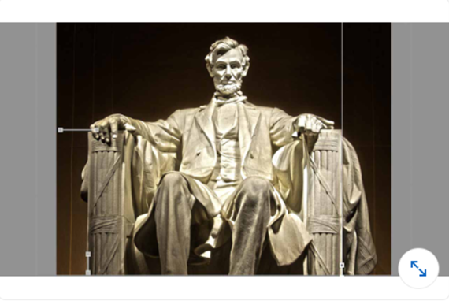
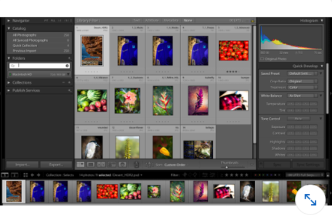
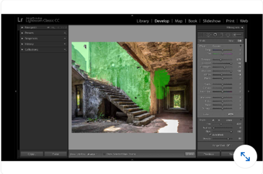
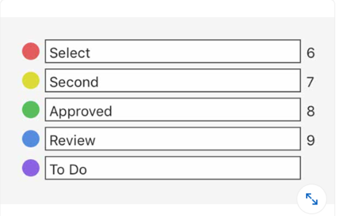

## Adobe Lightroom

#### Q1. Suppose you see a color fringe around the edges of your subject. Which control is best for removing the fringe?

- [ ] Color Noise Reduction
- [x] Remove Chromatic Aberration
- [ ] Split Toning
- [ ] Enable Profile Corrections

#### Q2. If you want to apply the same editing from one image to another, what should you use?

- [ ] Metadata
- [ ] Image settings
- [ ] Edit settings
- [x] Develop settings

Note: I just use synchronization. After digging into settings I was able only to discover Settings -> Copy settings.

#### Q3. Which module helps you create a printed photo album?

- [ ] Web
- [x] Book
- [ ] Print
- [ ] Library

#### Q4. Review the image shown. What does the exclamation point adjacent to the thumbnail imply?

- [ ] The image has been edited in Photoshop.
- [ ] The photo is marked as picked.
- [ ] The photo needs at least one keyword.
- [x] A photo is missing and needs to be relocated.

[Reference (adobe.com)](https://helpx.adobe.com/in/lightroom-classic/help/locate-missing-photos.html)

#### Q5. Adjusting the exposure of a raw file by -1 is the equivalent of doing what in the camera?

- [ ] opening the aperture one f-stop
- [x] closing the aperture one f-stop
- [ ] adjusting the ISO by +400
- [ ] adjusting the ISO by -400

#### Q6. Review the image below. Which option lets you manually straighten a photo by drawing a vertical or horizontal line?

- [ ] A
- [x] B
- [ ] C
- [ ] D

#### Q7. Suppose you want to migrate a selection of images to another machine. How can you create a new catalog that contains a copy of all the images?

- [x] Use the Export as Catalog command.
- [ ] When you back up the catalog, the images are backed up as well.
- [ ] Use the Export command.
- [ ] Use the Import from Another Catalog command.

[Reference (adobe.com)](https://helpx.adobe.com/lightroom-classic/help/create-catalogs.html)

#### Q8. Which Spot Healing Brush mode replaces an imperfection with an exact copy of pixels from another area?

- [ ] Patch mode
- [ ] Screen mode
- [ ] Healing mode
- [x] Clone mode

#### Q9. When reviewing images, what task can be accomplished using the number keys?

- [ ] finding images
- [ ] printing images
- [ ] selecting images
- [x] applying ratings

#### Q10. What's the easiest way to reuse your most recent custom export settings?

- [x] Click File > Export with Previous.
- [ ] Click File > Export with Preset.
- [ ] Click File > Export as Catalog.
- [ ] Click File > Export Again.

#### Q11. In the image shown, what do the blue areas indicate?

- [x] crushed details in the shadows
- [ ] a special effect applied to the image
- [ ] too little saturation in the image
- [ ] crushed details in the highlights

#### Q12. When exporting an image, which sharpening method is best for use on displays?

- [ ] Glossy Paper
- [x] Screen
- [ ] Internet
- [ ] Matte Paper

[Reference (digitalphotomentor.com)](https://www.digitalphotomentor.com/the-guide-to-image-sharpening-in-lightroom/)

#### Q13. Which Develop module panel lets you adjust an image based on a color range?

- [x] HSL/Color
- [ ] Split Toning
- [ ] Calibration
- [ ] Basic

#### Q14. Which file type will work with the Enhance Details command?

- [x] raw files
- [ ] PSD
- [ ] JPEG
- [ ] TIFF

#### Q15. Suppose that while using the Post Crop Vignetting tool, the Highlights slider is grayed out. What is the most likely cause?

- [x] You are using the Paint Overlay style.
- [ ] You are editing a raw file.
- [ ] You are using the Color Priority style.
- [ ] You are using the Highlight Priority style.

#### Q16. In the image shown, what is the icon circled in yellow?

- [ ] Virtual copy
- [ ] Synced with Lightroom
- [x] Metadata conflict warning
- [ ] Missing photo

#### Q17. Which criteria CANNOT be used with a smart collection?

- [x] Export Date
- [ ] Capture Date
- [ ] Rating
- [ ] Camera Serial Number

#### Q18. Which of these is not present as an option when exporting a photobook?

- [ ] Post to Blurb
- [ ] Export as PDF
- [x] Export to Print
- [ ] Export as JPEG

[Reference](https://helpx.adobe.com/in/lightroom-classic/help/create-photo-book.html)

#### Q19. Saturation and Vibrance both strengthen the intensity of the color in your image, however, Vibrance is more specific to \_\_.

- [x] Midtones
- [ ] Shadows
- [ ] Highlights
- [ ] Global

[Reference](https://www.slrlounge.com/vibrance-vs-saturation-what-is-the-difference/)

#### Q20. At the time of sharing a Lightroom preset, which format is used to export the image having the desired preset?

- [ ] JPG
- [x] DNG
- [ ] TIF
- [ ] Raw

[Reference](https://www.bwillcreative.com/how-to-share-lightroom-mobile-presets/)

#### Q21. If you want to use third-party filters and make them non-destructive, what is the best workflow?

- [ ] Click Photo > Edit In and select the desired plugin.
- [ ] Click File > Plug-in Extras.
- [ ] Click Photo > Edit In > Open in Photoshop as Smart Object.
- [x] Click Photo > Edit In > Edit in Photoshop

#### Q22. What is NOT an advantage of grouping images into a regular collection?

- [ ] Images matching specific criteria are automatically added to the collection.
- [ ] You can rearrange image order in the Filmstrip view.
- [x] You can rearrange the image order in the Grid view.
- [ ] You can remove images from the group to help narrow down your selects.

#### Q23. Which option is useful if you want to display text details overlaid onto your images?

- [ ] View > Compare
- [x] View > Loupe Info > Show Info Overlay
- [ ] View > Survey
- [ ] View > View Options

#### Q24. Which controls are a choice when working with Grain? (Select three items.)

    A. Amount

    B. Size

    C. Roughness D. Intensity

    E. Color

- [ ] A, B, E
- [x] A, B, C
- [ ] B, C, E
- [ ] A, C, E

#### Q25. Which format can be used when using an external image editor to work with a raw file?

- [x] TIFF
- [ ] PNG
- [ ] PSB
- [ ] GIF

#### Q26. Which format is meant to be used as a universal archival format for raw photos?

- [x] DNG
- [ ] TIFF
- [ ] ARW
- [ ] CR3

#### Q27. Which methods are available when tagging images? (Choose 3 items.)

    A. flags

    B. color labels

    C. ratings

    D. favorites

    E. client selects

- [x] A, B, C
- [ ] B, C, D
- [ ] A, B, D
- [ ] A, C, E

#### Q28. You have developed images on your laptop, and you want to move them and their adjustments to your desktop computer. Which command is the most useful for this? (The media and catalog are stored on an external drive.)

- [ ] File > Auto Import
- [x] File > Import from Another Catalog
- [ ] File > Import Photos and Video
- [ ] File > Import a Photoshop Elements Catalog

#### Q29. What do you call information saved with an image file, such as the date of capture and type of camera?

- [ ] Level
- [ ] Auto
- [ ] Full
- [x] Guided

#### Q30. What do you call information saved with an image file, such as the date of capture and type of camera?

- [x] Metadata
- [ ] file data
- [ ] sidecar files
- [ ] camera data

#### Q31. Suppose, as shown here, that you see no folders in the Folders list despite knowing some have been imported. How can you fix this?

- [ ] Double-click the disclosure triangle next to a drive's name.
- [ ] Double-click the disclosure triangle next to the Folder label.
- [x] Click the X on the Folders search box to clear the filtered view.
- [ ] Reimport the folders.

#### Q32. In this image, the Adjustment brush is having an unwanted effect on some areas. What is the best way to clean this up?

- [ ] Hold down the Shift key to paint over the unwanted areas.
- [x] Hold down the Option (Alt) key to paint over the unwanted areas.
- [ ] Hold down the Command (Ctrl) key to paint over the unwanted areas.
- [ ] Set the brush to 0% opacity and paint over the unwanted areas.

#### Q33. What area at the bottom of your work area is useful for navigating images?

- [ ] Slideshow panel
- [ ] Book panel
- [x] Filmstrip panel
- [ ] Navigator panel

#### Q34. Which color space is most compatible with internet delivery?

- [ ] ProPhoto RGB
- [ ] Display P3
- [x] SRGB
- [ ] Adobe RGB

#### Q35. Which color label set is in use?

- [ ] a custom set
- [x] Lightroom Default
- [ ] Bridge Default
- [ ] Review Status

#### Q36. Which masking methods are available with the Range Mask command? (Choose 3 items.)

    A. Luminance

    B. Color

    C. Depth

    D. Saturation

    E. Tolerance

- [x] A, B, D

- [ ] A, B, C

- [ ] B, C, E

- [ ] B, C, D

#### Q37. Which view is most useful for refining a selection of several images?

- [x] Compare view
- [ ] Grid view
- [ ] Survey view
- [ ] Loupe view

#### Q38. Which export options are available when working in the Book module? (Choose 3 items.)

    A. Printing

    B. Export to Blurb

    C. PDF

    D. TIFF

    E. JPEG

- [ ] B, C, E
- [ ] A, C, E
- [ ] A, B, C
- [x] B, C, D

#### Q39. Which sorting order is NOT available when using a smart collection?

- [ ] Edit Time
- [ ] Capture Time
- [ ] Custom
- [x] Added Order

#### Q40. What is backed up when you create a backup of your library catalog? (Choose 3 items.)

    A. the image files

    B. the adjustments made C. JPEG exports

    D. the keywords

    E. the image metadata

- [ ] C, D, E
- [x] B, D, E
- [ ] A, B, E
- [ ] A, C, E

#### Q41. Which key would you press to add images to a targeted Quick Collection?

- [ ] C
- [x] в
- [ ] A
- [ ] P

#### Q42. In Lightroom, what is the purpose of the "Dehaze" tool, and how does it affect your images during post-processing?

- [ ] It enhances image sharpness.
- [ ] It adds a soft focus effect.
- [ ] It applies artistic filters.
- [x] It reduces or increases atmospheric haze and improves image clarity.

#### Q43. When exporting photos in Lightroom, what is the difference between the "sRGB" and "Adobe RGB" color space options, and when might you choose one over the other for specific output requirements?

- [ ] Both options have no impact on image color.
- [ ] "sRGB" is for print, and "Adobe RGB" is for web use.
- [ ] "Adobe RGB" is the default choice for all exports.
- [x] "sRGB" is suitable for web and display use, while "Adobe RGB" is preferred for high-quality printing to maintain a wider color gamut.

#### Q44. In Lightroom, which feature allows you to apply specific adjustments to parts of an image using a brush, gradient, or radial filter?

- [ ] Tone Curve
- [ ] White Balance
- [x] Local Adjustments
- [ ] Lens Corrections
