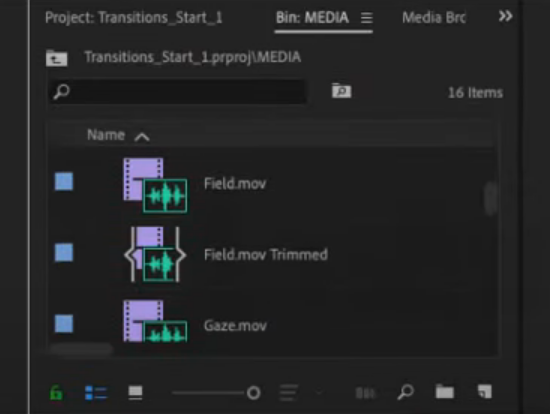
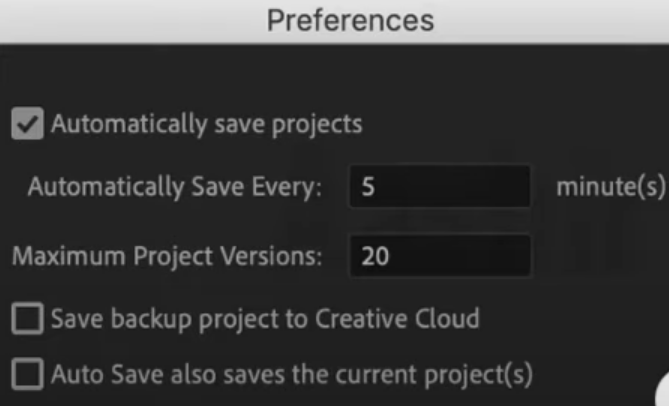
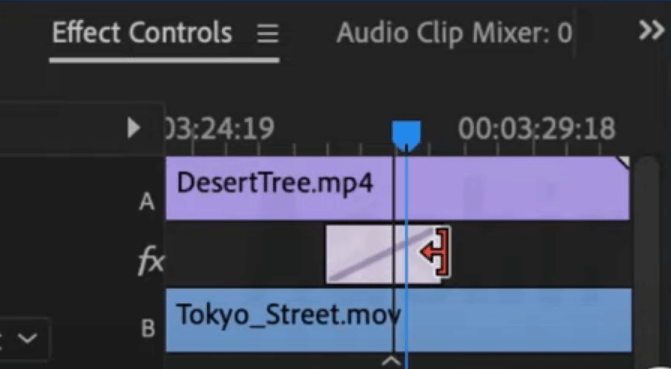
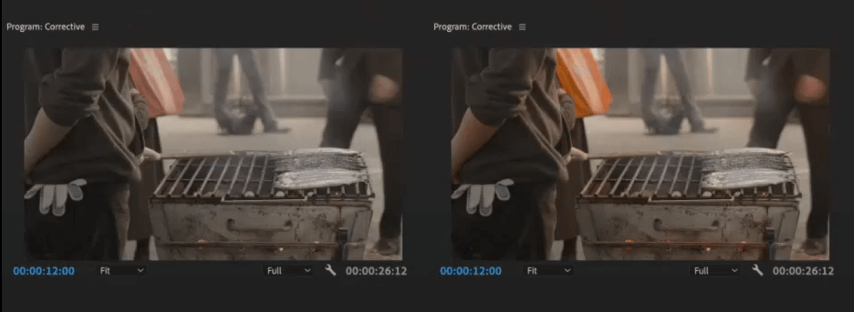
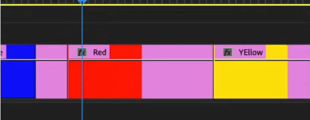
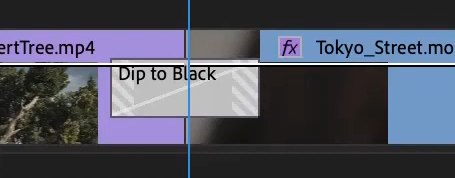
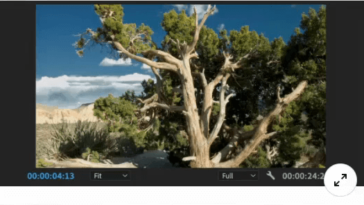
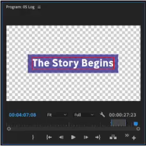
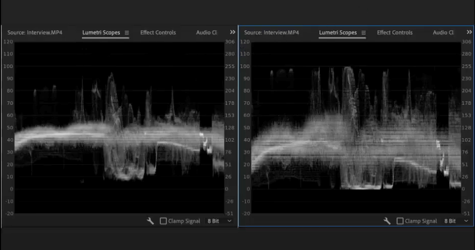
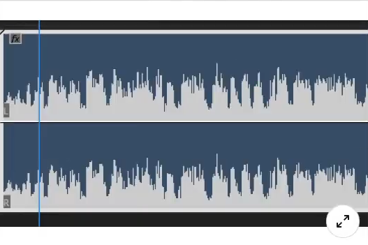

## Adobe Premiere Pro

#### P1. Se abre una secuencia anidada para recortar la longitud de un clip. La duración total de los clips se alarga. ¿Qué sucede con la duración del nido en la secuencia principal?

- \[x] Nada, la duración del nido sigue siendo la misma en la secuencia original.
- \[ ] La duración del nido cambia y una edición de sobrescritura empuja los clips restantes para hacer espacio.
- \[ ] Los clips cambian de velocidad para que coincida con la duración del nido.
- \[ ] La duración del nido cambia y una edición de ondulación empuja los clips restantes para hacer espacio.

#### P2. ¿Cuál es una buena razón para usar una secuencia anidada?

- \[ ] El anidamiento mejora el rendimiento de reproducción.
- \[ ] El anidamiento facilita la reducción del desorden en el panel Proyecto, ahorrando tiempo y potencialmente presupuesto del proyecto.
- \[x] El anidamiento permite aplicar un solo efecto a todo lo que está dentro del nido, como una corrección de color o un limitador de video.
- \[ ] El anidamiento ayuda a Adobe Premiere Pro a renderizar más rápido.

#### P3. ¿Qué sucede en el disco duro cuando creas un subclip?

- \[x] Nada, ya que un subclip no crea un nuevo archivo multimedia en su disco duro.
- \[ ] Se crea un archivo de puntero en el disco duro.
- \[ ] Se crea un nuevo clip maestro en el disco duro y se agrega al proyecto.
- \[ ] Se crea un nuevo archivo multimedia junto al medio original.

#### P4. ¿Qué declaración es _falso_ con respecto a la exportación de medios desde Adobe Premiere Pro?

- \[ ] Adobe Premiere puede exportar archivos directamente.
- \[ ] Puede codificar secuencias en uno o más formatos con Adobe Media Encoder.
- \[ ] Mientras utiliza Adobe Media Encoder, puede seguir trabajando en la misma secuencia en Adobe Premiere Pro.
- \[x] Al hacer clic en Exportar, Adobe Premiere Pro codificará el archivo en segundo plano y le permitirá continuar editando.

#### P5. Mientras trabaja en Premiere Pro, ¿cómo puede crear rápidamente una nueva composición de After Effects con ajustes que coincidan con la secuencia actual?

- \[ ] Seleccione Archivo > Adobe Dynamic Link > Importar composición de After Effects.
- \[ ] Importe un proyecto desde After Effects y elija Igualar el tamaño del proyecto al importar.
- \[x] Seleccione Archivo > Adobe Dynamic Link > Nueva composición de After Effects.
- \[ ] Cambie a After Effects y configure manualmente el proyecto para mayor precisión.

#### P6. ¿Cuál NO es una etiqueta disponible en el panel Sonido esencial?

- \[x] Narración
- \[ ] SFX
- \[ ] Ambiente
- \[ ] Música

#### P7. La corrección de color secundaria HSL le permite ajustar cuál de los siguientes? (Seleccione tres elementos.)

```markdown
A. Clarity
B. Contrast
C. Saturation
D. Temperature
E. Blur
```

- \[x] B, C, D
- \[ ] A, B, C
- \[ ] B, D, E
- \[ ] A, C, E

#### P8. ¿Cuál es el único panel en el que la herramienta Estirar velocidad puede modificar un clip?

- \[ ] Panel Monitor de programa
- \[ ] Panel Monitor de origen
- \[x] Panel Línea de tiempo
- \[ ] Panel Explorador de medios

#### P9. ¿Qué puede hacer para que la capa de forma ajuste automáticamente el tamaño a medida que cambia la capa de texto?


- \[x] Seleccione la opción Máscara con forma.
- \[ ] Seleccione Diseño responsivo y Anclar a la capa de texto.
- \[ ] Seleccione Diseño responsivo y Anclar al fotograma de vídeo.
- \[ ] Utilice los controles Alinear y Transformar.

#### P10. ¿En qué panel se ensamblan los medios para crear una secuencia?

- \[ ] Panel Línea de tiempo
- \[ ] Panel Explorador de medios
- \[ ] Panel de captura
- \[x] Panel Monitor de origen

#### P11. ¿Qué panel le permite modificar los efectos de vídeo después de que se hayan aplicado a un clip?

- \[x] Panel Efectos
- \[ ] Panel Línea de tiempo
- \[ ] Panel Monitor de origen
- \[ ] Panel Controles de efectos

#### P12. Supongamos que sus clips se vinculan a archivos multimedia almacenados en varias ubicaciones. Desea tener los archivos multimedia en una sola ubicación en su formato actual. ¿Qué opción debe elegir en el Project Manager?

- \[ ] Excluir clips no utilizados
- \[ ] Consolidar y transcodificar
- \[x] Recopilar archivos y copiarlos en una nueva ubicación
- \[ ] Crear nuevo proyecto recortado

#### P13. ¿Cuál es la transición de vídeo predeterminada en Adobe Premiere Pro?

- \[ ] disolver la película
- \[ ] disolución aditiva
- \[x] disolución cruzada
- \[ ] disolución del impacto

#### P14. ¿Qué término describe el algoritmo que se utiliza para codificar y decodificar un archivo de vídeo?

- \[ ] contenedor
- \[ ] formato
- \[ ] compresor
- \[x] códec

#### P15. Desea guardar una pequeña parte de un clip más largo para facilitar el acceso. ¿Cómo puedes hacer esto?



- \[ ] en el Explorador de medios, marque los puntos de entrada y salida de un clip y, a continuación, impórtelos.
- \[ ] Marque los puntos de entrada y salida del clip en el Monitor de programa y seleccione elegir Clip > Crear subclip.
- \[ ] Marque los puntos de entrada y salida de un clip en el panel Línea de tiempo y, a continuación, arrástrelo de nuevo a una papelera.
- \[x] Marque los puntos de entrada y salida del clip en el Monitor de origen y seleccione Clip > Crear subclip.

#### P16. ¿Qué ajuste puede ayudar a devolver los detalles de borde a las imágenes de video?

- \[ ] Intensidad
- \[ ] Contraste
- \[x] Afilar
- \[ ] Claridad

#### P17. ¿Dónde se puede ajustar la duración de una transición?

- \[ ] Panel Efectos
- \[ ] Panel del proyecto
- \[x] Panel Controles de efectos
- \[ ] Panel Monitor de programa

#### P18. Estás trabajando con un nuevo proyecto y has estado editando durante dos horas. ¿Cuál es el número de proyectos de copia de seguridad que esperaría encontrar?



- \[ ] 2
- \[ ] 12
- \[x] 20
- \[ ] 24

#### P19. ¿Qué panel utilizaría para examinar e importar activos para obtener la máxima compatibilidad con Premiere Pro?

- \[ ] Biblioteca
- \[ ] Efectos
- \[ ] Proyecto
- \[x] Navegador de medios

Referencia : https://helpx.adobe.com/in/premiere-pro/how-to/import-with-media-browser.html#:~:text=The%20Media%20Browser%20panel%20should,with%20fragmented%20media%20file%20types.\&text=To%20import%20selected%20clips%20into,on%20them%20and%20choose%20Import.

#### P20. Una transición se establece en alineado al centro. ¿Cuál sería el resultado de arrastrar con la herramienta seleccionada, a la derecha?



- \[x] La transición se deslizaría hacia la derecha.
- \[ ] Extenderías solo el lado derecho de la transición.
- \[ ] Realizaría una edición de ondulación y extendería la duración del primer clip.
- \[ ] La transición crecería en ambos lados.

#### P21. ¿Qué aplicación NO es compatible con Dynamic Link?

- \[ ] Adobe Photoshop
- \[ ] Adobe Premiere Pro
- \[x] Adobe Audition
- \[ ] Adobe After Effects

#### P22. ¿Qué panel de preferencias incluye la Duración predeterminada de la transición de vídeo y la Duración predeterminada de la transición de audio?

- \[ ] Medios de comunicación
- \[ ] Reproducción
- \[ ] Generalidades
- \[x] Cronología

#### P23. Si un efecto tiene una estrella junto a su icono, ¿qué tipo de efecto es?

- \[ ] audio
- \[ ] plantilla
- \[ ] transición
- \[x] ajuste preestablecido

#### P24. ¿Cómo se manipuló este clip mediante un ajuste de curvas?



- \[x] Hue vs. Luma
- \[ ] Saturación vs. Saturación
- \[ ] Tono vs. Saturación
- \[ ] Luma vs. Saturación

#### P25. ¿Dónde se almacenan los datos de transparencia al componer medios?

- \[ ] Panel Gráficos esenciales
- \[x] Panel Efectos
- \[ ] canal alfa
- \[ ] montaje editar

#### P26. Cuando parte de su material de archivo es transparente, ¿dónde se almacena la información de transparencia en el archivo?

- \[ ] monitor de origen
- \[x] canal alfa
- \[ ] efecto de opacidad
- \[ ] efecto alfa

#### P27. ¿Qué opción le permite reutilizar archivos de renderizado creados previamente para una exportación?

- \[x] Usar vistas previas
- \[ ] Usar mezcla de marcos
- \[ ] Utilice la máxima calidad de renderizado
- \[ ] Configuración de la secuencia de coincidencias

#### P28. En el escenario que se muestra a continuación, desea extender el final del clip rojo en la línea de tiempo y no cambiar la duración del clip adyacente. ¿Cuál es la opción de recorte más adecuada para lograr esto?



- \[ ] Recortar en
- \[x] Recortar
- \[ ] Recorte de ondulación en
- \[ ] Recorte de ondulación

#### P29. ¿Qué formatos admite Adobe Media Encoder? (Seleccione tres elementos.)

```markdown
A. GIF
B. DCP
C. QuickTime
D. HEVC
E. FLV
```

- \[ ] A, B, C
- \[ ] A, C, E
- \[x] B, C, D
- \[ ] B, D, E

#### P30. ¿Qué formato de archivo de vídeo se puede exportar con Adobe Media Encoder? (Seleccione tres elementos.)

```markdown
A. AVCHD
B. HEVC
C. Animated GIF
D. MXF OP1a
E. M4A
```

- \[ ] A, B, C
- \[ ] A, C, E
- \[ ] B, C, D
- \[x] B, D, E

#### P31. Si ha colocado un efecto acelerado por GPU en un clip de la línea de tiempo y no lo ha representado, ¿qué color aparece en la parte superior de la línea de tiempo?

- \[x] rojo
- \[ ] azul
- \[ ] amarillo
- \[ ] verde

#### P32. ¿Qué afirmación es cierta acerca de las preferencias de Apariencia?

- \[ ] El brillo predeterminado es la posición intermedia entre más oscuro y más claro.
- \[ ] Puede configurar la barra superior de las ventanas en un color de acento personalizado.
- \[ ] Puede ajustar la intensidad del indicador de enfoque para ayudar a identificar fácilmente qué ventana está activa.
- \[x] Puede cambiar el color de resaltado.

#### P33. ¿Qué puedes contar sobre esta transición?



- \[ ] Premiere insertará blanco para llenar los mangos necesarios.
- \[ ] Premiere insertará negro para llenar los mangos necesarios.
- \[ ] No hay suficientes medios (manijas) para cubrir la duración de la transición.
- \[ ] La transición se acorta automáticamente para usar solo los medios disponibles y el área debajo de las líneas diagonales no tendrá transiciones aplicadas.

#### P34. El proyecto tiene varias secuencias que ya no son necesarias. ¿Cómo utilizaría el Project Manager para producir una nueva versión del proyecto que excluya las secuencias no deseadas?

- \[ ] Anule la selección de las secuencias no deseadas en el área Secuencia.
- \[ ] Seleccione Crear nuevo proyecto recortado.
- \[ ] Seleccione Consolidar y transcodificar.
- \[x] Elija Recopilar archivos y Copiar a una nueva ubicación.

#### P35. Desea tomar un clip parcial que se utiliza en la línea de tiempo y enviarlo a After Effects para su procesamiento adicional mediante dynamic Link. ¿Qué método logra esto mejor?

- \[ ] Seleccione el clip en la línea de tiempo y elija Archivo > Adobe Dynamic Link > Importar composición de After Effects.
- \[ ] Seleccione el clip en la línea de tiempo y elija Archivo > Adobe Dynamic Link > Reemplazar con composición de After Effects.
- \[ ] Seleccione el clip en la línea de tiempo y elija Archivo > Adobe Dynamic Link > Nueva composición de After Effects.
- \[ ] Seleccione el clip en la línea de tiempo y elija Editar > Copiar. Cambie a After Effects y elija Editar > Pegar.

#### P36. Desea reducir la saturación solo en las nubes que se muestran a continuación. ¿Qué ajuste de curvas hace que esto sea más fácil?



- \[ ] Tono vs. Saturación
- \[ ] Curvas RGB
- \[ ] Luma vs. Saturación
- \[ ] Hue vs. Luma

#### P37. ¿Qué es un nuevo tipo de capa gráfica? (Seleccione tres elementos.)

```markdown
A. Logo
B. Text
C. Rectangle
D. Circle
E. Ellipse
```

- \[ ] A, B, C
- \[ ] A, C, E
- \[ ] B, C, E
- \[ ] B, D, E

#### P38. ¿Qué opción puede crear un campo de color que ajuste automáticamente el tamaño a medida que agrega o resta de una capa de texto?



- \[ ] Elija Relleno en los controles Apariencia.
- \[ ] Elija Trazo en los controles Apariencia.
- \[ ] Elija Background (Fondo) en los controles Apariencia.
- \[ ] Elija Sombra en los controles Apariencia.

#### P39. Si desea aclarar solo las áreas más oscuras de una imagen, ¿qué control deslizante debe ajustar en el efecto Lumetri?

- \[ ] Sombras
- \[ ] Contraste
- \[ ] Tonos medios
- \[ ] Negros

#### P40. Mirando el histograma a continuación, ¿qué control deslizante de ajuste único podría crear este cambio?



- \[ ] Negros
- \[x] Contraste
- \[ ] Blancos
- \[ ] Exposición

#### P41. ¿En qué menú desplegable se pueden eliminar efectos?

- \[ ] Secuencia
- \[ ] Archivo
- \[ ] Editar
- \[ ] Clip

#### P42. ¿Qué ajuste puede utilizar para convertir rápidamente el metraje de registro utilizando la configuración recomendada por un fabricante de cámaras?

- \[ ] Aspecto creativo
- \[ ] Película descolorida
- \[ ] LUT de entrada
- \[ ] Intensidad

#### P43. ¿Qué modo de automatización del mezclador de audio permite que una automatización vuelva al estado anterior después de realizar los ajustes?

- \[ ] Toque
- \[ ] Pestillo
- \[ ] Escribir
- \[ ] Leer

#### P44. Desea que Premiere Pro cree una segunda instancia de sus archivos multimedia y agregue una versión adicional en un borrador de resolución. ¿Qué opción funciona mejor en la configuración de ingesta?

- \[ ] Transcodificar
- \[ ] Copiar y crear proxies
- \[ ] Crear proxies
- \[ ] Copiar

#### P45. Si ha importado varias secuencias de lapso de tiempo en su proyecto como secuencias de imágenes, ¿qué opción del Administrador de proyectos es más útil para archivar el proyecto?

- \[ ] Convertir secuencias de imágenes en clips
- \[ ] Convertir composiciones de After Effects en clips
- \[ ] Incluir archivos de vista previa
- \[ ] Consolidar y transcodificar

#### P46. ¿Qué opción está habilitada para afectar la vista de las formas de onda de audio como se muestra a continuación?



- \[ ] Mostrar unidades de tiempo de audio
- \[ ] Forma de onda de audio rectificada
- \[ ] Formas de onda de audio grandes
- \[ ] Escalado logarítmico de fotogramas clave

#### P47. Desea hacer flotar el panel Historial de forma independiente para colocarlo en otro monitor como una ventana flotante. ¿Qué opción del submenú del panel debe seleccionar?

- \[ ] Panel de desacoplamiento
- \[ ] Desacoplar marco
- \[ ] Maximizar panel
- \[ ] Maximizar el marco

#### P48. Para organizar rápidamente los paneles en Adobe Premiere Pro para una tarea específica, ¿qué utiliza?

- \[x] espacios de trabajo
- \[ ] diseños
- \[ ] ajustes preestablecidos del panel
- \[ ] eventos
