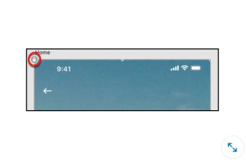
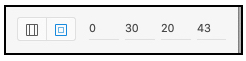
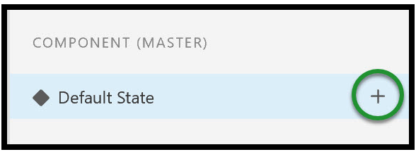
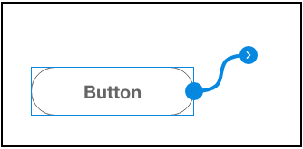
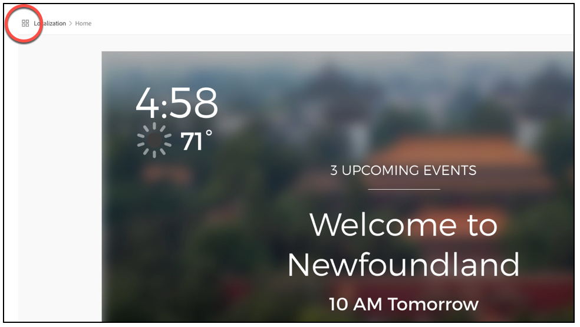

## Adobe XD

#### Q1. Où était-ce `Lock` icône appliquée?

- \[ ] dans le `Components` panneau
- \[x] dans le `Layers` panneau
- \[ ] dans le `Property Inspector`
- \[ ] en mode Partager

#### Q2. Dans cette figure, quelle valeur représente la marge inférieure de la grille de mise en page ?

- \[ ] 30
- \[x] 20
- \[ ] 43
- \[ ] 0

#### Q3. Qu’est-ce que le fait de cliquer sur l’icône encerclée vous permet de faire ?

- \[ ] Modifiez le déclencheur.
- \[ ] Choisissez une destination.
- \[ ] Ajouter une nouvelle interaction.
- \[x] Ajoutez un nouvel état.

#### Q4. Vous souhaitez partager votre projet sur un blog ou un réseau social. Comment y parviendriez-vous?

- \[x] Lien vers le projet à partir de votre compte Creative Cloud.
- \[ ] Utilisez le lien prototype.
- \[ ] Ajouter le lien prototype à un blog.
- \[ ] Ajoutez vos comptes de médias sociaux à votre liste d’invitations.

#### Q5. Vous devez faire apparaître un clavier lorsqu’une zone de texte est touchée. Quel type d’action devez-vous appliquer ?

- \[ ] Animation automatique
- \[ ] Superposition
- \[ ] Plan de travail précédent.
- \[ ] Transition.

#### Q6. Comment empêcher les guides de s’accrocher aux objets sur le plan de travail ?

- \[ ] Appuyez sur Option (Mac) ou Alt (Windows) lorsque vous faites glisser le guide.
- \[х] Appuyez sur Commande (Mac) ou Ctrl (Windows) lorsque vous faites glisser le guide.
- \[ ] Appuyez sur la touche Maj lorsque vous faites glisser le repère.
- \[ ] Faites glisser le guide jusqu’à son emplacement sur la planche graphique.

#### Q7. Votre développeur vous avertit que l’alignement à gauche d’une partie du texte d’une diapositive dans le menu est désactivé de 2 pixels. Comment le développeur a-t-il attrapé cela?

- \[ ] Les valeurs de distance sont affichées dans l’écran de partage du développeur.
- \[ ] Le développeur les a survolés dans l’écran de partage du développeur.
- \[ ] Les différentes valeurs ont été notées dans le CSS.
- \[ ] Les guides du plan de travail s’affichent dans l’écran de partage du développeur.

#### Q8. Comment pouvez-vous échanger un composant contre un autre qui est déjà dans le projet?

- \[ ] Copiez le composant dans le panneau Actifs, sélectionnez-le dans le projet et collez-le.
- \[ ] Supprimez le composant dans le projet et faites-le glisser à partir du panneau Actifs
- \[ ] Cliquez avec le bouton droit sur le composant que vous souhaitez remplacer et sélectionnez Modifier le gabarit dans le document source.
- \[ ] Faites glisser le nouveau composant du panneau Actifs au-dessus du composant existant dans le projet.

#### Q9. Vous avez créé un bouton et l’avez converti en composant afin de le rendre interactif. Lorsque vous ouvrez la zone Composant (maître) dans l’Inspecteur des propriétés et que vous cliquez sur État par défaut, vous remarquez qu’un état est déjà appliqué au bouton. Quel état est appliqué?

- \[x] Survol
- \[ ] Faire glisser
- \[ ] Voix
- \[ ] Appuyez sur

#### Q10. Vous avez copié une interaction dans le Presse-papiers. Comment appliqueriez-vous cette interaction à plusieurs objets ?

- \[ ] Tout en maintenant la touche Maj enfoncée, cliquez sur chaque objet et collez l’interaction.
- \[ ] Sélectionnez les plans de travail et collez l’interaction.
- \[ ] Sélectionnez chaque objet et collez l’interaction.
- \[ ] Marquez les objets et collez l’interaction.

#### Q11. L’aperçu de l’appareil nécessite un \_

- \[ ] appareil mobile avec NFC
- \[ ] connexion bluetooth
- \[ ] Connexion USB
- \[ ] connexion sans fil

#### Q12. Quel paramètre d’exportation utiliseriez-vous pour créer une ressource basse résolution dont la taille est égale à 50 % de la ressource à l’écran ?

- \[ ] Conçu à 3X
- \[ ] Conçu pour le Web
- \[ ] Conçu à 1X
- \[ ] Conçu à 2X

#### Q13. Qu’est-ce que ce fil attaché à un composant indique?

- \[ ] destination.
- \[x] interaction.
- \[ ] déclencheur
- \[ ] animation.

#### Q14. Que se passe-t-il lorsque vous cliquez sur cette icône encerclée dans l’aperçu de la conception ?

- \[x] L’aperçu bascule vers la vue plan de travail.
- \[ ] L’aperçu bascule vers le flux utilisateur.
- \[ ] L’aperçu bascule vers la vue développeur.
- \[ ] Les propriétés du plan de travail sont affichées

#### Q15. Quelle méthode d’introduction de contenu Illustrator dans XD n’est pas possible ?

- \[ ] Faites glisser un fichier Illustrator (. Al) dans un projet XD.
- \[x] Copiez et collez du contenu d’Illustrator vers XD.
- \[ ] Ouvrez un fichier Illustrator (. Al) dans XD pour le convertir en projet XD.
- \[ ] Importer un fichier Illustrator (. Al) dans un projet XD.

#### Q16. Après avoir terminé un projet, vous avez désactivé quelques polices Adobe. Vous devez maintenant apporter des modifications au fichier XD. Comment réactiver les polices Adobe dans XD ?

- \[ ] Ouvrez vos polices Creative Cloud et cliquez sur Activer.
- \[ ] Activez les polices dans les paramètres de polices de votre ordinateur.
- \[ ] Les polices Adobe sont automatiquement réactivées via Creative Cloud.
- \[ ] Reliez les polices à votre bibliothèque Creative Cloud.
