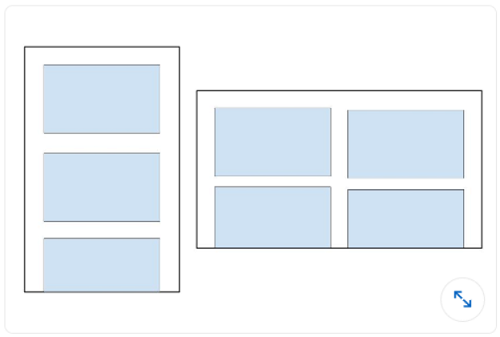

## Android

#### Q1. 要为您的 Android 应用添加功能、组件和权限,需要编辑哪个文件?

- [x] AndroidManifest.xml
- [ ] Components.xml
- [ ] AppManifest.xml
- [ ] ComponentManifest.xml

#### Q2. 应使用哪个 XML 属性使 Image View 可访问?

- [ ] android:talkBack
- [ ] android:labelFor
- [ ] android:hint
- [x] android:contentDescription

#### Q3. 您启动应用程序,当导航到新屏幕时应用崩溃,以下哪种操作无法帮助您诊断问题?

- [ ] 设置断点,然后逐行调试代码
- [ ] 使用 Android Studio 中的分析工具检测 CPU 和网络使用中的异常
- [x] 在启动新活动之前添加 Thread.sleep() 调用
- [ ] 检查 Logcat 中的日志

#### Q4. 为什么推送通知可能会停止工作?

- [x] 以上所有答案
- [ ] 设备令牌未正确发送到推送提供商
- [ ] 设备/模拟器上未安装 Google Play Services
- [ ] 设备上启用了电池优化

#### Q5. 实现一个垂直显示小部件列表的 RecyclerView 所需的正确组件类集合是什么?

- [ ] A

```java
    RecycleView
    RecyclerView.Adapter<T extends BaseAdapter>
    RecyclerView.ViewHolder<T extends BaseViewHolder>
    LinearLayoutManager
```

- [ ] B

```java
    RecycleView
    RecyclerView.Adapter
    RecyclerView.ViewHolder<T extends BaseViewHolder>
    LinearLayoutManager
```

- [ ] C

```java
    RecycleView
    RecyclerView.Adapter
    RecyclerView.ViewHolder
    LinearLayoutManager
```

- [x] D

```java
    RecycleView
    RecyclerView.Adapter<VH extends ViewHolder>
    RecyclerView.ViewHolder
    LinearLayoutManager
```


#### Q6. 当 Android 系统需要释放内存时,会终止进程。系统终止某个进程的可能性取决于进程的状态和活动的状态。哪种进程和活动状态组合最有可能被终止?

- [x] Process:In the background;Activity:Is stopped
- [ ] Process:In the background;Activity:Is paused
- [ ] Process:In the foreground;Activity:Is started
- [ ] Process:In the foreground;Activity:Is paused

#### Q7. 您创建了一个依赖于通过 intent 传递的字符串数据的 NextActivity 类,以下哪段代码可以启动您的活动?

- [ ] A

```java
    Intent(this, NextActivity::class.java).also { intent ->
        startActivity(intent)
    }
```

- [ ] B

```java
    Intent(this, NextActivity::class.java).apply {
        put(EXTRA_NEXT, "some data")
    }.also { intent ->
        activityStart(intent)
    }
```

- [x] C

```java
    Intent(this, NextActivity::class.java).apply {
        putExtra(EXTRA_NEXT, "some data")
    }.also { intent ->
        startActivity(intent)
    }
```

- [ ] D

```java
    Intent(this, NextActivity::class.java).apply {
        put(EXTRA_NEXT, "some data")
    }.also { intent ->
        activityStart(intent)
    }
```


#### Q8. 您想在项目中包含 about 和 settings 模块。以下哪个文件准确反映了它们的包含?

- [ ] `in build.gradle:include ':app',':about' ':settings'`
- [x] `in settings.gradle:include ':app',':about' ':settings'`
- [ ] `in settings.gradle:include ':about',':settings'`
- [ ] `in gradle.properties:include ':app',':about' ':settings'`

#### Q9. 使用 @VisibleForTesting 注解的好处是什么?

- [x] 表示类、方法或字段的可见性被放宽以使代码可测试
- [ ] 表示类、方法或字段仅在测试代码中可见
- [ ] 表示类、方法或字段的可见性被提高以使代码不易测试
- [ ] 如果不正确访问带有此注解的类、方法或字段,则抛出运行时错误

#### Q10. 如何在 build.gradle 文件中指定您的应用至少需要 API level 21 才能运行,但可以在 API level 28 上进行测试?

- [ ] A

```
      defaultConfig {
        ...
        minApiVersion 21
        targetApiVersion 28
      }
```

- [ ] B

```
      defaultConfig {
        ...
        targetSdkVersion 21
        testSdkVersion 28
      }
```

- [ ] C

```
      defaultConfig {
        ...
        minSdkVersion 21
        testApiVersion 28
      }
```

- [x] D

```
      defaultConfig {
        ...
      minSdkVersion 21
        targetSdkVersion 28
      }
```


#### Q11. 什么时候会调用 activity 的 onActivityResult()?

- [ ] 在父 activity 中调用 finish() 时
- [ ] 将应用置于后台并切换到另一个应用时
- [ ] 在目标 activity 中调用 onStop() 时
- [x] 在目标 activity 中调用 finish() 时

[Reference](https://developer.android.com/reference/android/app/Activity)

#### Q12. 您需要根据 Event 的 ID 从 API 中删除一个 Event,以下哪段代码定义了 Retrofit 中的请求?

- [ ] @DELETE("events)
      fun deleteEvent(@Path("id") id: Long): Call<Unit>
- [x] @DELETE("events/{id}")
      fun deleteEvent(@Path("id") id: Long): Call<Unit>
- [ ] @REMOVE("events/{id}")
      fun deleteEvent(@Path("id") id: Long): Call<Unit>
- [x] @DELETE("events/{id}")
      fun deleteEvent(@Path("id") id: Long): Call<Unit>

#### Q13. 什么时候会在构建设置中使用 product flavor?

- [ ] 当您需要让应用的字符串以多种语言显示时
- [ ] 当您需要根据物理设备大小提供不同版本的应用时
- [ ] 当您需要根据设备屏幕密度提供不同版本的应用时
- [x] 当您需要提供具有自定义配置和资源的不同版本的应用时

#### Q14. 给定以下 fragment,如何访问 Fragment 类布局文件中 ID 为 text_home 的 TextView?

```java
    private lateinit var textView: TextView
    override fun onCreateView(...): View? {
        val root = inflator.inflator(R>layout.fragment_home, container, false)
        textView = ??
        return root
    }
```

- [ ] root.getById(R.id.text_home)
- [ ] findViewByID(R.id.text_home)
- [x] root.findViewById(R.id.text_home)
- [ ] root.find(R.id.text_home)

#### Q15. 为什么在运行 UI 测试时使用 AndroidJUnitRunner?

Notice: AndroidJUnitRunner lets us run JUnit3/4-style tests on Android Devices

- [x] 测试运行器帮助将测试包和被测应用加载到设备或模拟器上,运行测试并报告结果
- [ ] 测试运行器会创建每个屏幕的截图,显示测试执行时的屏幕
- [ ] 测试运行器通过为每个测试类提供并行化功能
- [ ] 测试运行器帮助与设备上的可见元素交互,无论 activity 或 fragment 是否有焦点

#### Q16. 什么可以让您在 activity 重新启动时正确恢复用户状态?

- [ ] onSaveInstance() 方法
- [x] 以上所有答案
- [ ] persistent storage
- [ ] ViewModel 对象

[Refrence](https://developer.android.com/topic/libraries/architecture/saving-states)

#### Q17. 如果主线程被阻塞太久,系统会显示 \_ 对话框。

- [ ] Thread Not Responding
- [ ] Application Paused
- [x] Application Not Responding
- [ ] Application Blocked

#### Q18. 如何从 SharedPreferences 中检索用户的 email 值并确保返回值不为 null?

- [ ] getPreferances(this).getString(Email,"")
- [ ] getDefaultSharedPrefarances(this).getString(EMAIL,null)
- [x] getDefaultSharedPreferances(this).getString(EMAIL,"")
- [ ] getPreferances(this).getString(EMAIL,null)

**Explanation:** `In Method "getDefaultSharedPrefarances(this).getString()" The Second parameter is passed so that it can be returned, in case the key doesn't exist. So we need to pass an empty string to be returned in case the key doesn't exist.`

#### Q19. 为什么在 Android 中使用像素定义大小会有问题?

- [ ] 尽管屏幕像素密度不同,但这不会影响使用像素定义大小
- [ ] 大型设备总是有更多像素,因此如果使用像素定义大小,UI 元素会受到影响
- [x] 相同数量的像素可能对应不同的物理大小,从而影响 UI 元素的外观
- [ ] 不同设备对像素的理解不同,从而影响 UI 元素的外观

[Reference](https://developer.android.com/training/multiscreen/screendensities#:~:text=The%20first%20pitfall%20you%20must,physical%20sizes%20on%20different%20devices.)

#### Q20. 您需要获取连接到计算机并启用了 USB debugging 的设备列表。使用 Android Debug Bridge 应执行哪个命令?

- [ ] list devices
- [x] adb devices
- [ ] list avd
- [ ] dir devices

#### Q21. 哪种 drawable 定义可以实现以下形状?


- [ ] A

```xml
    <shape xmlns:android="http://schemas.android.com/apk/res/android"
        android:shape="oval">
        <stroke
            android:width="4dp"
	    android:color="@android:color/white" />
	<solid android:color="@android:color/black" />
    </shape>
```

- [ ] B

```xml
    <oval xmlns:android="http://schemas.android.com/apk/res/android">
        <stroke android:width="4dp" android:color="@android:color/black"/>
        <solid android:color="@android:color/white"/>
    </oval>
```

- [x] C

```xml
    <shape xmlns:android="http://schemas.android.com/apk/res/android"
        android:shape="oval">
        <stroke
            android:width="4dp"
            android:color="@android:color/black" />
        <solid android:color="@android:color/white" />
    </shape>
```

- [ ] D

```xml
    <shape xmlns:android="http://schemas.android.com/apk/res/android"
        android:shape="oval">
        <stroke
            android:width="4dp"
            android:color="@android:color/white" />
        <solid android:color="@android:color/white" />
    </shape>
```


#### Q22. 要持久化一小部分键值数据,应该使用什么?

- [ ] external file storage
- [x] SharedPreferences
- [ ] SQLite
- [ ] internal file storage

#### Q23. 您需要从 API 中检索照片列表。以下哪段代码定义了 Retrofit 中的 HTML GET 请求?

- [ ] @GET("photo/{id}"}
      fun listPhotos(@Path("id") id:Long?) : Call<Photo>
- [ ] @LIST("photo")
      fun listPhotos() : Call<List<Photo>>
- [ ] @GET("photo")
      fun listPhotos() : Call<Photo>
- [x] @GET("photo")
      fun listPhotos() : Call<List<Photo>>

#### Q24. 给定以下测试类,哪段代码是正确的断言?

- [ ] assertThat(resultAdd).is(2.0)
- [x] assertNotNull(resultAdd)
- [ ] assertThat(resultAdd).isWqualTo(2.0)
- [ ] assertThat(resultAdd)

#### Q25. 应使用哪个标签将可重用的视图组件添加到布局文件中?

- [ ] `<merge/>`
- [x] `<include/>`
- [ ] `<layout/>`
- [ ] `<add/>`

#### Q26. 您希望为处于 landscape 模式且语言设置为法语的设备提供不同的 drawable,哪个目录命名正确?

- [ ] fr-land-drawable
- [x] drawable-fr-land
- [ ] drawable-french-land
- [ ] french-land-drawable

#### Q27. 为什么需要在应用中包含以下权限?

`android.permission.ACCESS_NETWORK_STATE`

- [ ] 监控设备位置,以便在用户静止时不尝试进行网络调用
- [x] 监控网络连接
- [ ] 请求和启用 Wi-Fi 连接到本地网络
- [ ] 监控无线电数据流量

#### Q28. Jetpack Compose 的核心目标是什么?

- [ ] 从应用中删除旧代码
- [x] 简化和加速 Android 上的 UI 开发
- [ ] 使应用的构建过程更快
- [ ] 确保应用的代码库更小

#### Q29. 您的应用需要一些可能经常更新的数据。您不希望每次需要数据时都进行 API 调用。应该使用什么数据存储方法?

- [x] 缓存
- [ ] 临时文件
- [ ] 内部存储
- [ ] 外部存储

#### Q30. 如何在 ListView 中设置滚动监听器?

- [ ] myListView.setOnChangeListener()
- [ ] myListView.setOnScrollListener()
- [x] myListView.setOnScrollChangeListener()
- [ ] myListView.addOnScrollChangedListener()

#### Q31. 您希望为包含 listview 的 RecyclerView 项添加 ripple 效果。以下哪项是正确的方法?

- [ ] 通过 listview 的 `android:id` 属性
- [ ] 通过 android:clickable 属性
- [x] 通过 item root view 的 `android:background` 属性
- [ ] 通过 `android:foreground` 属性

#### Q32. 您需要为 activity 提供用户位置。使用以下代码片段,您应该在哪里向用户请求位置权限?

```java
public void onCreate(Bundle savedInstanceState){
    super.onCreate(savedInstanceState);
    setContentView(R.layout.activity_main);
    if(ContextCompat.checkSelfPermission(this,
        Manifest.permission.ACCESS_FINE_LOCATION)
        != PackageManager.PERMISSION_GRANTED){
        // A
    } else {
        // B
    }
}
```

- [ ] A 和 B
- [x] A
- [ ] B
- [ ] 两者都不是 - 应在 AndroidManifest.xml 中请求权限

#### Q33. 您创建了一个需要用户名、密码和服务器 URL 的类。应该如何获取这些值?

- [ ] 在 strings.xml 文件中定义它们以便轻松访问和更新
- [x] 使用 BuildConfig 类将它们作为 build 变量包含进来
- [ ] 添加一个可编辑的配置文件,并在 /settings 中存储这些值
- [ ] 添加一个 Gradle 配置文件并将这些值作为构建依赖项导入

#### Q34. 您希望启用数据绑定以避免在 activity 中写出 `findViewById()`。应该采取以下哪种步骤?

- [ ] 在应用的 AndroidManifest.xml 文件中设置 `android:dataBindingEnabled="true"` 属性
- [x] 将 `<layout>` 标签添加到布局 XML 文件的顶部
- [ ] 创建模型类来保存数据
- [ ] 以上所有步骤都是必需的

#### Q35. Android Jetpack 是什么?

- [ ] Android 官方 IDE
- [x] 一组库,帮助开发人员更轻松地遵循最佳实践
- [ ] 用于部署 Android 应用的工具集
- [ ] 内部数据库

#### Q36. 应使用什么来添加视图?

- [ ] Thread
- [ ] Handler
- [x] AsyncTask
- [ ] ViewRunnable

#### Q37. ConstraintLayout 为什么有用?

- [ ] 它允许您创建没有布局组的视图层次结构
- [ ] 它允许您将屏幕分成九个部分,以进行关键 UI 元素的定位
- [ ] 它根据 view 及其 sibling 之间的关系调整视图的大小
- [x] 以上所有答案

#### Q38. 您希望确保 RecyclerView 的 RecyclerView.Adapter 在数据发生变化时在正确的时间有正确的可用数据。应该使用哪个 observer?

- [ ] ActivityLifecycleObserver
- [x] LiveDataObserver
- [ ] ViewModelObserver
- [ ] AdapterObserver

#### Q39. 您希望在 Kotlin 代码中初始化 ListView,但不希望它在其视图层次结构中监听 click events。应该如何使 ListView 实现此效果?

- [x] 使用 `listView.isClickable = false`
- [ ] 使用 `listView.setClickable(false)`
- [ ] 使用 `listView.clickable(false)`
- [ ] 不要为 ListView 设置 OnClickListener

#### Q40. 应该使用什么为 image view 指定图像源?

- [x] `android:src`
- [ ] `android:img`
- [ ] `android:image`
- [ ] `android:source`

#### Q41. 您创建了一个正在开发的功能分支,希望在测试时暂时增加 HTTP 连接超时时间。您应该如何进行这个更改?

- [ ] 编辑主分支中的 http_config.xml 并提交更改
- [ ] 使用 Gradle 变量在 build.gradle 文件中提供新值
- [ ] 创建一个包含临时超时的新产品风味并使用该风味进行测试
- [x] 创建一个构建变体并使用该变体进行测试

#### Q42. 当运行设备的主题设置为深色时,您希望为应用提供自定义暗色主题。应该怎么做?

- [x] 创建一个 values-night 资源目录并提供替代颜色资源
- [ ] 添加一个 night-theme 属性到应用的清单文件中
- [ ] 当应用启动时,以编程方式检查主题并设置适当的应用主题
- [ ] 您无法在 Android 中实现这个功能

#### Q43. EditText 类的 inputType 属性是什么?

- [ ] 它配置 text 的样式
- [ ] 它定义输入的数据类型
- [x] 它定义输入值的宽度
- [ ] 它配置文本编辑器的字体

#### Q44. 您使用 API 21 创建了应用,以支持 Android 5.0(Lollipop)及更高版本,但 Google Play 商店显示您的应用只对 Android 7.0(API 24)及更高版本的设备可用。应该如何解决这个问题?

- [ ] 在 build.gradle 文件的 `productFlavors` 块中添加 API 21 支持
- [ ] 在应用清单的 `<uses-sdk>` 中添加 API 21 支持
- [x] 在 `build.gradle` 文件的 `defaultConfig` 块中添加 API 21 支持
- [ ] 降级应用以最低支持 API 21

#### Q45. 测试必须是 **\_** ,以便它们可以独立于其他测试执行?

- [ ] 可执行的
- [x] 独立的
- [ ] 独特的
- [ ] 自动化的

#### Q46. 根据 Google 的推荐,使用 Android KTX 开发时,应该使用哪种依赖项注入?

- [x] Koin
- [ ] Dagger
- [ ] Hilt
- [ ] Kodein

#### Q47. 您希望在测试时测试 GPS 功能,但需要在设备上模拟位置数据。应该使用什么来实现这一点?

- [x] 使用 Android Debug Bridge (ADB) 将模拟位置发送到运行应用的设备
- [ ] 使用 Google 的 FusedLocationProviderClient 将模拟位置发送到设备
- [ ] 使用 emulator_geo_input 类在设备上设置模拟位置
- [ ] 使用 Sensor 类在设备上配置模拟位置

#### Q48. onCreate() 是 Activity 生命周期中的第一个回调。在这个回调中应该完成什么任务?

- [ ] 任何对用户可见的任务
- [ ] 与用户的任何交互任务
- [x] 任何一次性初始化任务
- [ ] 任何网络请求或数据库查询

#### Q49. 为什么字符串应该在 strings.xml 文件中定义而不是硬编码到应用的 activities 和 layouts 中?

- [ ] 资源字符串文件的加载速度比 activities 和 layouts 中的硬编码字符串快
- [x] 它允许更容易地将应用本地化到其他语言
- [ ] 字符串资源文件中的字符串使用的内存比硬编码的字符串少
- [ ] 以上所有答案

#### Q50. 在 onCreate() 中可能执行的任务中,以下哪些选项应该推迟到 onResume() 中?

- [ ] 初始化依赖于 UI 维度的值
- [x] 创建当前 UI 的快照
- [ ] 检索 activity intent 数据
- [ ] 初始化数据绑定视图

#### Q51. 您启动了应用,当检索数据时它崩溃了。应用启动到崩溃的时间太快,无法打开 Logcat。您可以使用哪个命令查看 Logcat 数据?

- [ ] `android logcat`
- [ ] `cd logcat`
- [x] `adb logcat`
- [ ] `gradle logcat`

#### Q52. 为什么应该在开发时为您的应用使用 fragments?

- [ ] Fragments 允许 activity 拥有多个布局文件
- [ ] Fragments 在较旧的 Android 设备上更快
- [x] Fragments 可以重用并允许使用多屏幕 layouts
- [ ] Fragments 占用的内存更少

#### Q53. 在 Kotlin 中,`by lazy` 属性应该用于什么?

- [ ] 当某个属性是 lateinit 且应该被重新初始化时
- [x] 当某个属性需要被定义但在首次使用之前不应该被初始化时
- [ ] 当某个属性需要从 strings.xml 文件中检索时
- [ ] 当某个属性在 activity 可见时不应该可用

#### Q54. 您已经有一个 Activity,并且您想通过点击按钮加载一个 Fragment。以下代码有什么作用?

```java
public void onCreate(Bundle savedInstanceState){
    super.onCreate(savedInstanceState);
    setContentView(R.layout.activity_main);

	if (savedInstanceState != null) return

	val fragment = CreatePostFragment()
		supportFragmentManager
		.beginTransaction()
		.add(R.id. fragment_container, fragment)
		.commit()

}
```

- [ ] 确保当 savedInstanceState 不为 null 时 activity 结束
- [x] 确保每次从之前的状态恢复 activity 时创建一个新的 fragment
- [ ] 防止在 activity 从之前的状态恢复时显示两个并排的 fragment
- [ ] 防止在 activity 从之前的状态恢复时创建重叠的 fragment

#### Q55. 以下哪个组件不是系统或用户进入应用程序的入口点?

- [ ] activity
- [ ] content provider
- [x] fragment
- [ ] service

#### Q56. 应该使用什么来显示一个大型的可滚动元素列表?

- [ ] ListView
- [x] RecyclerView
- [ ] LinearLayout
- [ ] Scrollview

#### Q57. 您创建了一个显示应用详细信息的 AboutActivity 类。以下哪段代码可以启动您的 activity?

- [ ] `Intent(this, AboutActivity::class).also { intent -> startService(intent)}`
- [x] `Intent(this, AboutActivity::class.java).also { intent -> startActivity(intent)}`
- [ ] `Intent(this, AboutActivity::class).also { intent -> activity(intent)}`
- [ ] `Intent(this, AboutActivity::class).also { intent -> startActivity(intent)}`

**Explanation:** `Intent(Context packageContext, Class<?> cls) Notice: Class not KClass`

#### Q58. AndroidManifest.xml 文件的用途是什么?

- [x] 它描述了应用程序的组件
- [ ] 它声明了应用程序所需的最低 Android API 级别
- [ ] 它通过指定包名为应用程序提供唯一名称
- [ ] 以上全部

#### Q59. 元素 <uses-sdk> 的哪个属性用于指定应用程序运行所需的最低 API level?

- [ ] android:targetSdkVersion
- [x] android:minSdkVersion
- [ ] android:maxSdkVersion
- [ ] 以上都不是

#### Q60. 为了在发布版本中缩减代码,Android Studio 使用了什么工具?

- [x] R8
- [ ] ProGuard
- [ ] Shrinker
- [ ] D8

**Explanation:** `When you build your project using Android Gradle plugin 3.4.0 or higher, the plugin no longer uses ProGuard to perform compile-time code optimization. Instead, the plugin works with the R8 compiler.`

[Reference](https://developer.android.com/studio/build/shrink-code)

#### Q61. 哪种布局层次结构可能绘制得最快?

- [x] A
      

- [ ] B
      

- [ ] C
      

- [ ] D
      

#### Q62. 当前推荐的处理长时间运行的后台任务的方法是什么?

- [x] WorkManager
- [ ] AsyncTask
- [ ] IntentService
- [ ] Thread
[Reference](https://developer.android.com/guide/background)

#### Q63. 您需要通过 Google Play 按需或作为即时体验向用户提供应用的某些功能。您应该创建哪种类型的模块?

- [ ] library module
- [x] dynamic feature module
- [ ] Android app module
- [ ] Google Cloud module

1. [Reference](https://youtu.be/QdfStuj-MuA?t=86)
2. [Reference](https://developer.android.com/guidgite/playcore/feature-delivery/on-demand)

#### Q64. 以下哪种方法不推荐用于在应用中提供有用的离线状态?

- [ ] caching data
- [ ] storing data locally
- [ ] queuing outbound requests to action when connectivity has been lost
- [x] always notifying users that connectivity has been lost

[Reference](https://developer.android.com/docs/quality-guidelines/build-for-billions/connectivity#network-offline)

#### Q65. 如果您需要应用代码检查当前构建的信息,应该使用哪个类?

- [x] `BuildConfig`
- [ ] `BuildInfo`
- [ ] `ConfigParams`
- [ ] `ConfigInfo`

#### Q66. 在下面的 ConstraintLayout 中,为什么按钮不会扩展填满 parent 的宽度?

```xml
    <androidx.constraintlayout.widget.ConstrantLayout
        ...>
	    <Button
            android:layout_width="0dp"
            android:layout_height="wrap_content"
            android:text="Button"
            app:layout_constraintStart_toStartOf="parent"
            app:layout_constraintTop_toTopOf="parent"/>

    </androidx.constraintlayout.widget.ConstrantLayout>
```

- [ ] `The button does not have a size`
- [x] `The button is not constrained to the end of the parent container`
- [ ] `Buttons cannot expand beyond their default size`
- [ ] `The button should have its height set to 0dp as well`

#### Q67. 以下哪种情况不是在 Espresso 测试中使用 idling resources 的用途?

- [ ] `managing system services`
- [x] `processing user input events`
- [ ] `loading data from the internet or a local data source`
- [ ] `performing bitmap transformations`

#### Q68. 以下哪种不是为应用提供字符串的资源类型?

- [ ] `String`
- [x] `Text`
- [ ] `String-array`
- [ ] `Plurals`

#### Q69. 以下哪个不是 activity lifecycle 中的方法?

- [ ] `onPause()`
- [ ] `onResume()`
- [x] `onOpen()`
- [ ] `onStart()`

#### Q70. 您希望允许用户在应用中拍摄照片。以下哪个代码片段是正确的方法?

- [ ] A

```java
  fun showCamera(view: View) {
      Log.i(TAG, "Show camera button pressed.")
      if (ContextCompat.shouldShowRequestPermissionRationale(thisActivity,
      Manifest.permission.CAMERA) {
        showCameraPreview()
      }
       else {
         requestPermissionLauncher.launch(Manifest.permission.CAMERA)
       }
   }
```

- [x] B

```java
  fun showCamera(view: View) {
      Log.i(TAG, "Show camera button pressed.")
      if (ContextCompat.checkSelfPermission(thisActivity,
      Manifest.permission.CAMERA)
      == PackageManager.PERMISSION_GRANTED) {
        showCameraPreview()
      }
      else {
         requestPermissionLauncher.launch(Manifest.permission.CAMERA)
      }
  }
```

- [ ] C

```java
  fun showCamera(view: View) {
      Log.i(TAG, "Show camera button pressed.")
      showCameraPreview()
  }
```

- [ ] D

```java
  fun showCamera(view: View) {
      Log.i(TAG, "Show camera button pressed.")
      if (ContextCompat.checkSelfPermission(thisActivity,
      Manifest.permission.CAMERA)
      != PackageManager.PERMISSION_GRANTED) {
         showCameraPreview()
       }
       else {
          requestPermissionLauncher.launch(Manifest.permission.CAMERA)
       }
  }
```

#### Q71. 给定以下字符串资源,哪个代码片段是有效的?

```
<string name="upload_photo_notification">%1$d of %2$d photos uploaded</string>
```

- [ ] A

```
val string: String = getString(
   R.string.upload_photo_notification,
   "2",
   "5"
)
```

- [ ] B

```
val string: String = getString(
   R.id.upload_photo_notification,
   2,
   5
)
```

- [x] C

```
val string: String = getString(
   R.string.upload_photo_notification,
   2,
   5
)
```

- [ ] D

```
val string: String = getString(
   R.id.upload_photo_notification,
   "2",
   "5"
)
```

[Reference](https://developer.android.com/guide/topics/resources/string-resource#formatting-strings)

#### Q72. 不同语言对数量的语法规则不同。为了在应用中支持以下两个字符串,理想的资源定义是什么?

```
"You have 1 day remaining"
"You have 2 days remaining"
```

- [ ] A

```
<string name="trial_days_left_one"> You have %1$d day remaining</string>
<string name="trial_days_left_other">You have %1$d days remaining</string>
```

- [ ] B

```
<plurals name="trial days left">
    <plural quantity="one">You have %1$d day remaining</plural>
    <plural quantity="other">You have %1$d days remaining</plural>
</plurals>
```

- [x] C

```
<plurals name="trial_days_left">
    <item quantity="one">You have %1$d day remaining</item>
    <item quantity="other">You have %1$d days remaining</item>
</plurals>
```

- [ ] D

```
<string name="trial_days_left">
    <plural quantity="one">You have %1$d day remaining</plural>
    <plural quantity="other">You have &1$d days remaining</plural>
</string>
```

#### Q73. 操作系统何时会使用 onTrimMemory() 方法?

- [ ] `when the app is uninstalled`
- [x] `when the app is backgrounded`
- [ ] `when the device is in battery optimization mode`
- [ ] `when network requests are made on the main thread`

[Reference](https://developer.android.com/guide/topics/resources/string-resource#Plurals)

#### Q74. 在您的应用中,有一个 RecyclerView 列表。您希望为 portrait 和 landscape 模式提供不同的配置。以下哪个代码片段最适合支持下面的布局?



- [ ] A

```
recyclerView.setLayoutManager(GridLayoutManager(this, 3))
```

- [x] B

```
val coulumnCount = resources.getInteger(R.integer.column_count)
recyclerView.setLayoutManager(GridLayoutManager(this, columnCount))
```

- [ ] C

```
recyclerView.setLayoutManager(LinearLayoutManager(this))
```

- [ ] D

```
val coulumnCount = resources.getInteger(R.integer.column_count)
recyclerView.setLayoutManager(LinearLayoutManager(this, columnCount))
```

#### Q75. 您需要根据 Event 的 ID 从 API 中删除一个 Event。以下哪个代码片段定义了 Retrofit 中的请求?

- [ ] @DELETE("events)
      fun deleteEvent(@Path("id") id: Long): Call<Unit>
- [x] @DELETE("events/{id}")
      fun deleteEvent(@Path("id") id: Long): Call<Unit>
- [ ] @REMOVE("events/{id}")
      fun deleteEvent(@Path("id") id: Long): Call<Unit>
- [x] @DELETE("events/{id}")
      fun deleteEvent(@Path("id") id: Long): Call<Unit>

#### Q76. 您希望允许用户在应用中拍摄照片。以下哪项不是创建适当 `intent` 而不是直接请求 camera permission 的优势?

- [ ] 用户可以选择他们喜欢的拍照应用来拍摄照片
- [ ] 您不需要在应用中请求权限来拍摄照片
- [x] 您可以完全控制用户体验。处理 camera `intent` 的应用会遵循您的设计选择
- [ ] 您不需要设计 UI。处理 camera `intent` 的应用会提供 UI

#### Q77. 当前推荐的处理长时间运行后台任务的方法是什么?

- [x] WorkManager
- [ ] AsyncTask
- [ ] IntentService
- [ ] Thread
