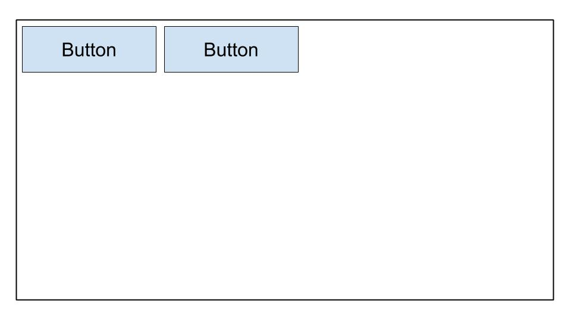
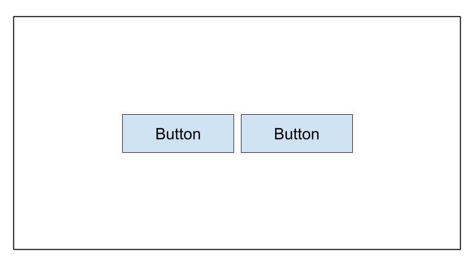
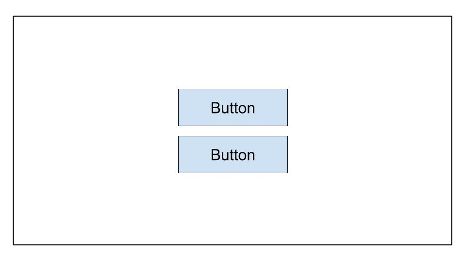
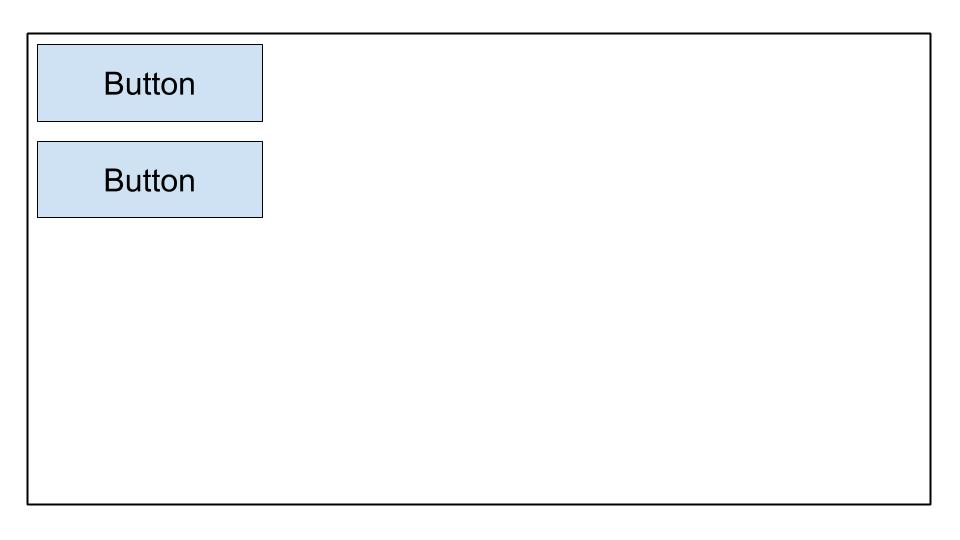
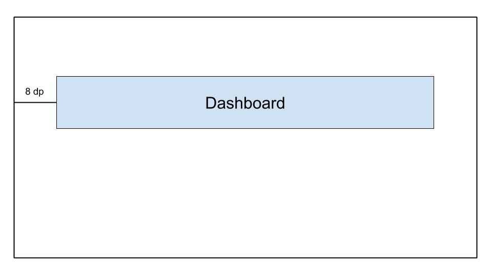
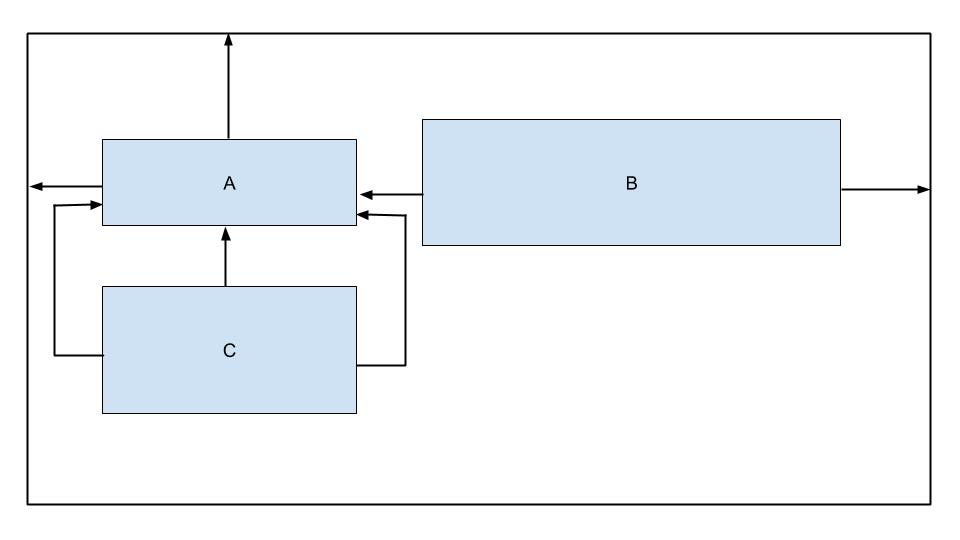

## Androïde

#### Q1. Pour ajouter des fonctionnalités, des composants et des autorisations à votre application Android, quel fichier doit être modifié ?

- \[x] AndroidManifest.xml
- \[ ] Composants.xml
- \[ ] AppManifest.xml
- \[ ] ComponentManifest.xml

#### Q2. Quel attribut XML doit être utilisé pour rendre une vue d’image accessible ?

- \[ ] android:talkBack
- \[ ] android:labelPour
- \[ ] android:indice
- \[x] android:contentDescription

#### Q3. Vous lancez votre application et lorsque vous accédez à un nouvel écran, elle se bloque, quelle action ne vous aidera PAS à diagnostiquer le problème ?

- \[ ] Définissez des points d’arrêt, puis parcourez le code ligne par ligne
- \[ ] Utilisez les outils de profilage dans Android Studio pour détecter les anomalies CPU et l’utilisation du réseau.
- \[x] Ajoutez un appel Thread.sleep() avant de commencer la nouvelle activité.
- \[ ] inspectez les journaux dans Logcat.

#### Q4. Pourquoi les notifications push peuvent-elles cesser de fonctionner ?

- \[x] toutes ces réponses
- \[ ] Le jeton de périphérique n’est pas envoyé correctement au fournisseur push.
- \[ ] Les services Google Play ne sont pas installés sur le deivce/émulateur.
- \[ ] L’optimisation de la batterie est activée sur l’appareil.

#### Q5. Quel est l’ensemble correct de classes de composants nécessaires pour implémenter un RecyclerView d’éléments qui affiche une liste de widgets verticalement ?

- \[ ]

```java
  RecycleView
  RecyclerView.Adapter<T extends BaseAdapter>
  RecyclerView.ViewHolder<T extends BaseViewHolder>
  LinearLayoutManager
```

- \[ ]

```java
  RecycleView
  RecyclerView.Adapter
  RecyclerView.ViewHolder<T extends BaseViewHolder>
  LinearLayoutManager
```

- \[ ]

```java
  RecycleView
  RecyclerView.Adapter
  RecyclerView.ViewHolder
  LinearLayoutManager
```

- \[x]

```java
  RecycleView
  RecyclerView.Adapter<VH extends ViewHolder>
  RecyclerView.ViewHolder
  LinearLayoutManager
```

#### Q6. Le système Android tue le processus lorsqu’il a besoin de libérer de la mémoire. La probabilité que le système tue un processus donné dépend de l’état du processus et de l’activité à ce moment-là. Avec la combinaison du processus et de l’activité, l’état est-il le plus susceptible d’être tué?

- \[x] Processus:En arrière-plan; Activité:Est arrêté
- \[ ] Processus:En arrière-plan; Activité:Est en pause
- \[ ] Processus:Au premier plan; Activité:Est démarré
- \[ ] Processus:Au premier plan; Activité:Est en pause

#### Q7. Vous avez créé une classe NextActivity qui repose sur une chaîne contenant des données qui passent à l’intérieur de l’intention Quel extrait de code vous permet de lancer votre activité ?

- \[ ]

```java
  Intent(this, NextActivity::class.java).also { intent ->
      startActivity(intent)
  }
```

- \[ ]

```java
  Intent(this, NextActivity::class.java).apply {
      put(EXTRA_NEXT, "some data")
  }.also { intent ->
      activityStart(intent)
  }
```

- \[x]

```java
  Intent(this, NextActivity::class.java).apply {
      putExtra(EXTRA_NEXT, "some data")
  }.also { intent ->
      startActivity(intent)
  }
```

- \[ ]

```java
  Intent(this, NextActivity::class.java).apply {
      put(EXTRA_NEXT, "some data")
  }.also { intent ->
      activityStart(intent)
  }
```

#### Q8. Vous souhaitez inclure des modules à propos et des modules de définition dans votre projet. Quels fichiers reflètent fidèlement leur inclusion ?

- \[ ] dans build.gradle:include ':app',':about' ':settings'
- \[x] dans settings.gradle:include ':app',':about' ':settings'
- \[ ] dans settings.gradle:include ':about',':settings'
- \[ ] dans gradle.properties:include ':app',':about' ':settings'

#### Q9. Quel est l’avantage d’utiliser @VisibleForTesting annotation ?

- \[x] pour indiquer qu’une classe, un méthos ou un champ a sa visibilité détendue pour rendre le code testable
- \[ ] pour indiquer qu’une classe, une méthode ou un champ est visible uniquement dans le code de test
- \[ ] pour indiquer qu’une classe, une méthode ou un champ voit sa visibilité augmentée pour rendre le code moins testable
- \[ ] pour générer une erreur d’exécution si une classe, un methos ou un champ avec cette annotation est accédé de manière incorrecte

#### Q10. Comment spécifieriez-vous dans votre fichier build.gradle que votre application nécessitait au moins le niveau d’API 21 pour s’exécuter, mais qu’elle peut être testée au niveau d’API 28 ?

- \[ ]

```
  defaultConfig {
    ...
    minApiVersion 21
    targetApiVersion 28
  }
```

- \[ ]

```
  defaultConfig {
    ...
    targetSdkVersion 21
    testSdkVersion 28
  }
```

- \[ ]

```
  defaultConfig {
    ...
    minSdkVersion 21
    testApiVersion 28
  }
```

- \[x]

```
  defaultConfig {
    ...
  minSdkVersion 21
    targetSdkVersion 28
  }
```

#### Q11. Quand onActivityResult() d’une activité sera-t-il appelé ?

- \[ ] lors de l’appel de finish()dans l’activité parente
- \[ ] lors du placement d’une application en arrière-plan en accédant à une autre application
- \[ ] Lorsque onStop() est appelé dans l’activité cible
- \[x] lors de l’appel de finish() dans l’activité cible

[Pour plus d’informations](https://developer.android.com/reference/android/app/Activity)

#### Q12. Vous devez supprimer un événement basé sur son id de votre API, Quel extrait de code définit cette demande dans Retrofit ?

- \[ ] @DELETE(« événements »)
  fun deleteEvent(@Path(« id ») id: Long): Appel<Unit>
- \[x] @DELETE(« events/{id} »)
  fun deleteEvent(@Path(« id ») id: Long): Appel<Unit>
- \[ ] @REMOVE(« events/{id} »)
  fun deleteEvent(@Path(« id ») id: Long): Appel<Unit>
- \[x] @DELETE(« events/{id} »)
  fun deleteEvent(@Path(« id ») id: Long): Appel<Unit>

#### Q13. Quand utiliseriez-vous une saveur de produit dans votre configuration de construction ?

- \[ ] lorsque vous devez avoir les chaînes de l’application présentes dans plusieurs lanuages
- \[ ] lorsque vous devez fournir différentes versions de votre application en fonction de la taille physique de l’appareil
- \[ ] lorsque vous souhaitez fournir différentes versions de votre application en fonction de la densité de l’écran de l’appareil
- \[x] lorsque vous souhaitez fournir une version différente de votre application avec une configuration et des ressources personnalisées

#### Q14. Compte tenu du fragment ci-dessous, comment accéder à un TextView avec un ID de text_home contenu dans le fichier de mise en page d’une classe Fragment ?

```java
  private lateinit var textView: TextView
  override fun onCreateView(...): View? {
      val root = inflator.inflator(R>layout.fragment_home, container, false)
      textView = ??
      return root
  }
```

- \[ ] root.getById(R.id.text_home)
- \[ ] findViewByID(R.id.text_home)
- \[x] root.findViewById(R.id.text_home)
- \[ ] root.find(R.id.text_home)

#### Q15. Pourquoi utilisez-vous AndroidJUnitRunner lors de l’exécution de tests d’interface utilisateur ?

Remarque: AndroidJUnitRunner nous permet d’exécuter des tests de style JUnit3 / 4 sur les appareils Android

- \[x] Le testeur facilite le chargement de votre package de test et de l’application testée sur un appareil ou un émulateur, exécute le test et signale les résultats.
- \[ ] Le testeur créant des captures d’écran de chaque écran qui s’affichait pendant l’exécution des tests.
- \[ ] Le testeur facilite la parallélisation des classes de test en fournissant pour chaque classe de test.
- \[ ] Le coureur d’essai facilite l’interaction avec les éléments visibles sur un appareil, quelle que soit l’activité ou le fragment qui a le focus.

#### Q16. Qu’est-ce qui vous permet de restaurer correctement l’état d’un utilisateur lorsqu’une activité est redémarrée ?

- \[ ] la méthode onSaveInstance()
- \[x] toutes ces réponses
- \[ ] stockage persistant
- \[ ] Objets ViewModel

[Réfrence](https://developer.android.com/topic/libraries/architecture/saving-states)

#### Q17. Compte tenu de la définition ci-dessous. Comment accéder à un TextView avec un ID de text_home contenu dans le fichier de mise en page d’une classe Fragment ?

- \[ ] root.find(R.id.text_home)
- \[ ] findViewById(R.id.text_home)
- \[ ] root.getById(R.id.text_home)
- \[x] root.findViewById(R.id.text_home)

#### Q18. SI le thread principal est bloqué trop longtemps, le système affiche la boîte de dialogue \_ ?

- \[ ] Thread ne répond pas
- \[ ] Application suspendue
- \[x] L’application ne répond pas
- \[ ] Application bloquée

#### Q19. Comment récupérer la valeur de l’e-mail d’un utilisateur à partir de SharedPreferences tout en vous assurant que la valeur renvoyée n’est pas nulle ?

- \[ ] getPreferances(this).getString(Email," »)
- \[ ] getDefaultSharedPrefarances(this).getString(EMAIL,null)
- \[x] getDefaultSharedPreferances(this).getString(EMAIL," »)
- \[ ] getPreferances(this).getString(EMAIL,null)

**Explication:** Dans la méthode « getDefaultSharedPrefarances(this).getString() » Le deuxième paramètre est passé afin qu’il puisse être retourné, au cas où la clé n’existerait pas. Nous devons donc passer une chaîne vide à renvoyer au cas où la clé n’existerait pas.

#### Q20. Pourquoi est-il problématique de définir des tailles à l’aide de pixels sur Android?

- \[ ] Bien que la densité des pixels de l’écran varie, cela n’a pas d’impact sur l’utilisation des pixels pour définir les tailles.
- \[ ] Les gros appareils ont toujours plus de pixels, de sorte que vos éléments d’interface utilisateur seront e=affectés si vous les définissez avec des pixels.
- \[x] Le même nombre de pixels peut correspondre à différentes tailles physiques, ce qui affecte l’apparence de vos éléments d’interface utilisateur.
- \[ ] Différents appareils ont une compréhension différente de ce qu’est un pixel, affectant l’apparence de vos éléments d’interface utilisateur

[Référence](https://developer.android.com/training/multiscreen/screendensities#:~:text=The%20first%20pitfall%20you%20must,physical%20sizes%20on%20different%20devices.)

#### Q21. Vous devez obtenir une liste des périphériques connectés à votre ordinateur avec l’activation du débogage USB. Quelle commande s’exécuterait à l’aide du pont de débogage Android?

- \[ ] liste des périphériques
- \[x] périphériques adb
- \[ ] liste avd
- \[ ] appareils dir

#### Q22. Quelle définition dessinable vous permet d’obtenir la forme ci-dessous?


- \[ ]

```xml
  <shape xmlns:android="http://schemas.android.com/apk/res/android"
      android:shape="oval">
      <stroke
          android:width="4dp"
    android:color="@android:color/white" />
    <solid android:color="@android:color/black" />
  </shape>
```

- \[ ]

```xml
  <oval xmlns:android="http://schemas.android.com/apk/res/android">
      <stroke android:width="4dp" android:color="@android:color/black"/>
      <solid android:color="@android:color/white"/>
  </oval>
```

- \[x]

```xml
  <shape xmlns:android="http://schemas.android.com/apk/res/android"
      android:shape="oval">
      <stroke
          android:width="4dp"
          android:color="@android:color/black" />
      <solid android:color="@android:color/white" />
  </shape>
```

- \[ ]

```xml
  <shape xmlns:android="http://schemas.android.com/apk/res/android"
      android:shape="oval">
      <stroke
          android:width="4dp"
          android:color="@android:color/white" />
      <solid android:color="@android:color/white" />
  </shape>
```

#### Q23. Pour conserver une petite collection de données clé-valeur, que devez-vous utiliser ?

- \[ ] stockage de fichiers externes
- \[x] SharedPereferences
- \[ ] SQLite
- \[ ] stockage de fichiers interne

#### Q24. Vous devez récupérer une liste de photos à partir d’une API. Quel extrait de code définit une requête HTML GET dans Retrofit ?

- \[ ] @GET(« photo/{id}"}
  fun listPhotos(@Path(« id ») id:Long?) : Appel<Photo>
- \[ ] @LIST(« photo »)
  fun listPhotos() : Call\<List<Photo>>
- \[ ] @GET(« photo »)
  fun listPhotos() : Appel<Photo>
- \[x] @GET(« photo »)
  fun listPhotos() : Call\<List<Photo>>

#### Q25. Compte tenu de la classe de test ci-dessous, quel extrait de code serait une assertion correcte ?

- \[ ] assertThat(resultAdd).is(2.0)
- \[x] assertNotNull(resultAdd)
- \[ ] assertThat(resultAdd).isWqualTo(2.0)
- \[ ] assertThat(resultAdd)

#### Q26. Quelle balise devez-vous utiliser pour ajouter un composant d’affichage réutilisable à un fichier de mise en page ?

- \[ ] `<merge/>`
- \[x] `<include/>`
- \[ ] `<layout/>`
- \[ ] `<add/>`

#### Q27. Vous souhaitez fournir un dessin différent pour les appareils qui sont en mode paysage et dont la langue est définie sur Français. quel répertoire est nommé correctement ?

- \[ ] fr-land-drawable
- \[x] tirable-fr-land
- \[ ] français-land traçable
- \[ ] français-land-drawable

#### Q28. Pourquoi devrez-vous inclure l’autorisation suivante dans votre application ?

`android.permission.ACCESS_NETWORK_STATE`

- \[ ] pour surveiller l’emplacement des périphériques afin de ne pas tenter de passer des appels réseau lorsque l’utilisateur est à l’arrêt
- \[ ] pour demander la possibilité d’effectuer des appels réseau à partir de votre application
- \[ ] pour surveiller l’état du réseau de l’appareil afin que vous puissiez afficher une bannière dans l’application à l’utilisateur
- \[x] pour surveiller l’état du réseau des périphériques afin de ne pas tenter d’effectuer d’appels réseau lorsque le réseau n’est pas disponible

#### Q29. Quelle image correspond le mieux à ce qui suit `LinearLayout`?

```xml
  <LinearLayout
      android:layout_width="match_parent"
      android:layout_height="match_parent"
      android:orientation="horizontal"
      android:gravity="center">
      <Button
                android:layout_width="wrap_content"
                android:layout_height="wrap_content"
                android:text="Button" />
      <Button
                android:layout_width="wrap_content"
                android:layout_height="wrap_content"
                android:text="Button" />
  </LinearLayout>
```

- \[ ] A
  
- \[x] B
  
- \[ ] C
  
- \[ ] D
  

#### Q30. Vous souhaitez ouvrir l’application Dialer par défaut sur un appareil. Qu’est-ce qui ne va pas avec ce code ?

```java
  val dialerIntent = Intent()
  val et = findViewById(R.id.some_edit_text)
  dialerIntent.action = Intent.ACTION_DIAL
  dialerIntent.data = Uri.parse("tel:" + et.getText()?.toString())
  startActivity(dialerIntent)
```

- \[x] `startActivityWithResult()` devrait être utilisé à la place de `startActivity()` lors de l’utilisation `Intent.ACTION_DIAL`.
- \[ ] Pour `Intent.ACTION_DIAL`le `Intent` option `Intent.FLAG_ACTIVITY_NEW_TASK` doit être ajouté lors de l’utilisation de ce `dialerIntent`.
- \[ ] Le `dialerIntent` entraînera la levée d’une exception ActivityNotFoundException sur les appareils qui ne prennent pas en charge `Intent.ACTION_DIAL`.
- \[ ] L’autorisation `android.permission.CALL_PHONE` doit être demandé avant `Intent.ACTION_DIAL` peut être utilisé.

#### Q31. Quand devez-vous stocker des fichiers dans le `/assets` répertoire?

- \[x] lorsque vous avez besoin d’accéder aux noms de fichiers et à la hiérarchie de fichiers d’origine [(Référence)](https://medium.com/mobile-app-development-publication/assets-or-resource-raw-folder-of-android-5bdc042570e0)
- \[ ] lorsque vous avez besoin d’accéder au fichier avec son `resource ID`comme `R.assets.filename`
- \[ ] lorsque vous avez des fichiers XML qui définissent des animations d’interpolation
- \[ ] lorsque vous devez accéder au fichier sous sa forme brute en utilisant `Resources.openRawResource()`

#### Q32. Vous souhaitez autoriser les utilisateurs à prendre des photos dans votre application. Ce qui est _non_ un avantage de créer un `intent`, au lieu de demander directement l’autorisation de la caméra ?

- \[ ] Les utilisateurs peuvent sélectionner leurs applications photo préférées pour prendre des photos.
- \[ ] Vous n’avez pas besoin de faire une demande d’autorisation dans votre application pour prendre une photo.
- \[x] Vous avez un contrôle total sur l’expérience utilisateur. L’application qui gère l’appareil photo `intent` respectera vos choix de conception.
- \[ ] Vous n’avez pas besoin de concevoir l’interface utilisateur. L’application qui gère l’appareil photo `intent` fournira l’interface utilisateur.

#### Q33. Quand utiliseriez-vous le `ActivityCompat.shouldShowRequestPermissionRationale()` fonction?

- \[ ] lorsqu’un utilisateur ouvre votre application pour la première fois et que vous souhaitez fournir une explication de l’utilisation d’une autorisation donnée
- \[ ] lorsqu’un utilisateur a précédemment refusé la demande d’une autorisation donnée et sélectionne « En savoir plus »
- \[ ] lorsqu’un utilisateur a précédemment refusé la demande d’une autorisation donnée et que vous souhaitez fournir une explication de son utilisation
- \[x] lorsqu’un utilisateur a précédemment refusé la demande d’autorisation donnée et a sélectionné « Ne plus demander », mais que vous avez besoin de l’autorisation pour que votre application fonctionne

#### Q34. Vous souhaitez activer le suivi analytique uniquement dans `release` Construit. Comment créer un nouveau champ dans le champ généré `BuildConfig` classe pour stocker cette valeur ?

- \[ ]

```
  buildTypes {
    debug {
      buildConfig 'boolean', 'ENABLE_ANALYTICS', 'false'
    }
    release {
      buildConfig 'boolean', 'ENABLE_ANALYTICS', 'true'
    }
  }
```

- \[ ]
```
  buildTypes {
    debug {
      buildConfig 'String', 'ENABLE_ANALYTICS', 'false'
    }
    release {
      buildConfig 'String', 'ENABLE_ANALYTICS', 'true'
    }
  }
```

- \[x]

```
  buildTypes {
    debug {
      buildConfigField 'boolean', 'ENABLE_ANALYTICS', 'false'
    }
    release {
      buildConfigField 'boolean', 'ENABLE_ANALYTICS', 'true'
    }
  }
```

- \[ ]

```
  buildTypes {
    debug {
      buildConfigField 'boolean', 'ENABLE_ANALYTICS', 'true'
    }
    release {
      buildConfigField 'boolean', 'ENABLE_ANALYTICS', 'false'
    }
  }
```

#### Q35. Pour optimiser votre taille APK, quel codec d’image devez-vous utiliser?

- \[ ] JPG
- \[ ] PNG
- \[ ] MPEG
- \[x] WebP [(Référence)](https://developer.android.com/topic/performance/reduce-apk-size#:~:text=packJPG%20and%20guetzli.-,Use%20WebP%20file%20format,than%20either%20JPEG%20or%20PNG.)

#### Q36. Vous avez créé du code pour effectuer un appel réseau et testé son fonctionnement dans votre environnement de développement. Toutefois, lorsque vous le publiez sur la console Play, l’appel réseau ne fonctionne pas. Qu’est-ce qui va _non_ vous aider à résoudre ce problème ?

- \[ ] vérifier si `ProGuard` -keepclassmembers ont été ajoutés aux objets de transfert de données réseau (DTO) en question
- \[x] utilisation des outils de profilage d’Android Studio pour détecter les anomalies dans l’utilisation du processeur, de la mémoire et du réseau
- \[ ] recherche d’exceptions dans les journaux du serveur ou la console du serveur
- \[ ] vérifiant que l’objet de transfert de données réseau a `@SerizlizedName` appliqué à ses propriétés membres

#### Q37. Quel extrait de code permettrait d’obtenir la mise en page affichée ci-dessous ?



- \[ ]

```xml
  <androidx.constraintlayout.widget.ConstraintLayout
  ...>

    <TextView
      android:id="@+id/text_dashboard"
      android:layout_width="match_parent"
      android:layout_height="wrap_content"
      android:layout_marginTop="16dp"
      android:padding="8dp"
      android:textAlignment="center"
      android:text="Dashboard"
      app:layout_constraintEnd_toEndOf="parent"
      app:layout_constraintStart_toStartOf="parent"
      app:layout_constraintTop_toTopOf="parent" />

  </androidx.constraintlayout.widget.ConstraintLayout>
```

- \[x]

```xml
  <androidx.constraintlayout.widget.ConstraintLayout
    	...>
    	<TextView
    		android:id="@+id/text_dashboard"
    		android:layout_width="match_parent"
    		android:layout_height="wrap_content"
    		android:layout_marginStart="8dp"
    		android:layout_marginEnd="8dp"
    		android:textAlignment="center"
    		android:text="Dashboard"
    		app:layout_constraintEnd_toEndOf="parent"
    		app:layout_constraintStart_toStartOf="parent"
    		app:layout_constraintTop_toTopOf="parent" />

  </androidx.constraintlayout.widget.ConstraintLayout>
```

- \[ ]

```xml
  <androidx.constraintlayout.widget.ConstraintLayout
    	...>

    	<TextView
    		android:id="@+id/text_dashboard"
    		android:layout_width="match_parent"
    		android:layout_height="wrap_content"
    		android:layout_marginStart="8dp"
    		android:layout_marginTop="16dp"
    		android:layout_marginEnd="8dp"
    		android:padding="8dp"
    		android:textAlignment="center"
    		android:text="Dashboard"
    		app:layout_constraintEnd_toEndOf="parent"
    		app:layout_constraintStart_toStartOf="parent"
    		app:layout_constraintTop_toTopOf="parent" />

  </androidx.constraintlayout.widget.ConstraintLayout>
```

- \[ ]

```xml
  <androidx.constraintlayout.widget.ConstraintLayout
    	...>
    	<TextView
    		android:id="@+id/text_dashboard"
    		android:layout_width="match_parent"
    		android:layout_height="wrap_content"
    		android:layout_marginStart="8dp"
    		android:layout_marginTop="16dp"
    		android:layout_marginEnd="8dp"
    		android:padding="8dp"
    		android:text="Dashboard"
    		app:layout_constraintEnd_toEndOf="parent"
    		app:layout_constraintStart_toStartOf="parent"
    	/>

  </androidx.constraintlayout.widget.ConstraintLayout>
```

#### Q38. Quel ensemble de sources est `_not_` disponible par défaut lorsqu’Android Studio crée un nouveau projet ?

- \[x]

```xml
  <activity android:name=".ExampleActivity" />
```

- \[ ]

```xml
  <activity android:name=".ExampleActivity">
    <intent-filter>
      <action android:name="android.intent.action.SEND" />
    </intent-filter>
  </activity>
```

- \[ ]

```xml
  <activity android:name=".ExampleActivity">
    <intent-filter>
      <action android:name="android.intent.action.MAIN" />
      <category android:name="android.intent.category.LAUNCHER" />
    </intent-filter>
  </activity>
```

- \[ ]

```xml
  <activity android:name=".ExampleActivity">
    <intent-filter>
      <action android:name="android.intent.action.VIEW" />
    </intent-filter>
  </activity>
```

**Explication:** Les filtres d’intention sont utilisés pour rendre les activités accessibles à d’autres applications à l’aide d’intentions. Nous devons donc choisir des options qui n’ont pas de filtre d’intention pour s’assurer qu’elles ne sont pas accessibles par intention.

#### Q40. Pour préserver la mémoire sur l’appareil, comment pouvez-vous déterminer que l’appareil de l’utilisateur a des capacités de stockage limitées ?

- \[x] Utilisez le `ActivityManager.isLowRamDevice()` pour savoir si un périphérique se définit comme « faible RAM ».
- \[ ] Utilisez le `Activity.islowRam()` pour savoir si un périphérique se définit comme « faible RAM ».
- \[ ] Utilisez le `ConnectivityManager.hasLowMemory()` pour savoir si un périphérique se définit comme « faible RAM ».
- \[ ] Faites une demande de téléchargement d’image et vérifiez l’utilisation restante du stockage de l’appareil.

#### Q41. Quoi `_not_` un bon moyen de réutiliser le code Android?

- \[ ] Utilisez un module Gradle commun partagé par différents projets Android.
- \[ ] Préférez créer des vues ou des fragments personnalisés plutôt que des activités.
- \[x] Préférez construire des activités plutôt que des fragments.
- \[ ] Décomposer les mises en page de l’interface utilisateur en éléments communs et utiliser `<include/>` pour les inclure dans d’autres fichiers XML de mise en page.

#### Q42. Quelle disposition convient le mieux aux grandes hiérarchies complexes ?

- \[ ] LinearLayout
- \[x] ConstraintLayout
- \[ ] FrameLayout
- \[ ] RelativeLayout

#### Q43. Vous devez mettre à niveau vers la dernière version du plugin Android Gradle. Quel fichier devez-vous modifier ?

- \[ ] root_project_dir/app/build.gradle.
- \[ ] root_project_dir/settings.gradle.
- \[x] root_project_dir/build.gradle.
- \[ ] root_project_dir/app/gradle.properties.

[référence](https://developer.android.com/studio/releases/gradle-plugin#updating-plugin)

#### Q44. Pourquoi les développeurs placent-ils souvent le code d’initialisation des applications dans la classe Application ?

- \[x] La classe Application est instanciée avant toute autre classe lorsque le processus de l’application est créé.
- \[ ] La classe Application est instanciée après toute demande d’autorisation lors de la création du processus de l’application.
- \[ ] La classe Application est créée chaque fois qu’une nouvelle activité est lancée, ce qui la rend idéale pour le code d’initialisation.
- \[ ] La classe Application est créée chaque fois qu’un service d’arrière-plan est appelé, ce qui la rend idéale pour le code d’initialisation.

[référence](https://developer.android.com/reference/android/app/Application)

#### Q45. Quel dossier devez-vous utiliser pour les icônes du lanceur de votre application ?

- \[ ] /dessinable
- \[ ] /icône
- \[x] /mipmap
- \[ ] /lanceur

#### Q46. Quelle définition dessinable vous permet d’obtenir la forme ci-dessous?


- \[ ]

```xml
  <shape xmlns:android-"http://schemas.android.com/apk/res/android"
      android:shape-"oval">
      <gradient
                android:startColor-"@android:color/white"
                android:endColor-"@android:color/black"
                android:angle-"45"/>
  </shape>
```

- \[ ]

```xml
  <rectangle xmlns:android-"http://schemas.android.com/apk/res/android">
      <gradient
        android:startColor-"@android:color/white"
        android:endColor-"android:color/black"
        android:angle-"135"/>
  </rectangle>
```

- \[x]

```xml
  <shape xmlns:android-"http://schemas.android.com/apk/res/android"
      android:shape-"rectangle">
      <gradient
        android:startColor-"@android:color/white"
        android:endColor-"@android:color/black"
        android:angle-"135"/>
  </shape>
```

- \[ ]

```xml
  <shape xmlns:android-"http://schemas.android.com/apk/res/android"
      android:shape-"rectangle">
      <gradient
        android:startColor-"@android:color/white"
        android:endColor-"@android:color/black"
        android:angle-"98"/>
  </shape>
```

#### Q47. Compte tenu de la ConstraintLayout ci-dessous, quelle instruction est vraie ?



- \[ ] La vue B n’est pas contrainte horizontalement.
- \[ ] La vue C a trop de contraintes.
- \[x] La vue B n’est pas contrainte verticalement.
- \[ ] La vue C est limitée au parent.

#### Q48. Compte tenu de ce snippey de code à partir d’un fichier build.gradle, quel choix n’est pas une variante de build possible ?

 ```
  android {
      ...
      defaultConfig{...}

      buildTypes{
      debug{...}
      releasae{...}
  }

    flavorDimensions "environment"
    productFlavors {
        producation {...}
        staging {...}
    }
  }
```

- \[ ] productionDébug.
- \[x] developmentDebug.
- \[ ] stagingDebug.
- \[ ] stagingRelease.

[Référence](https://developer.android.com/studio/build/build-variants#flavor-dimensions)

#### Q49. Quand devriez-vous utiliser le répertoire androidTest pour stocker vos classes de test?

- \[ ] lorsque les tests consistent uniquement en tests unitaires.
- \[ ] lorsque le nombre de tests à exécuter est important (500+).
- \[ ] lorsque les tests doivent s’exécuter sur votre ordinateur local.
- \[x] lorsque les tests doivent s’exécuter sur des appareils réels ou virtuels.

[Référence](https://developer.android.com/studio/test#test_types_and_location)

#### Q50. Compte tenu d’un APK nommé app-internal-debug.apk produit à partir du processus de génération, quelle déclaration est susceptible d’être vraie?

- \[ ] Cet APK est créé sur une machine de développement à partir de la version du produit de débogage.
- \[ ] Cet APK est créé à partir de la saveur du produit internalDebug.
- \[ ] Cet APK créé à partir de la saveur du produit de débogage et du type de build interne.
- \[x] Cet APK est créé à partir du type de build de débogage et de la saveur interne du produit.

#### Q51. Lorsque vous tentez de générer votre projet, qu’est-ce que l’erreur suivante peut indiquer ?

`Conversion to Dalvik format filed: Unable to execute dex: method ID not in [0, 0xffff]: 65536`

- \[ ] Vous avez inclus des informations de format incorect dans votre fichier build.gradle.
- \[ ] Vous avez ajouté plus de 20 dépendances à votre build.gradle.
- \[x] Vous avez dépassé le nombre total de méthodes pouvant être référencées dans un seul fichier DEX.
- \[ ] Vous avez une NullPointerException dans votre code.

#### Q52. Quelle instruction, dans le fichier build.gradle, indique correctement que le module correspondant est un module de bibliothèque Android ?

- \[ ] appliquer plugin: 'com.module.library'
- \[x] appliquer le plugin: 'com.android.library'
- \[ ] appliquer plugin: 'com.module.library'
- \[ ] inclure le plugin: 'com.module.library'

#### Q53. Compte tenu des dimens.xml fichier suivants, comment définiriez-vous un ImageView avec un espacement moyen en bas ?

```xml
<?xml version=1.0 encoding="utf-8"?>
<resources>
    <dimen name="spacing_medium">8dp</dimen>
    <dimen name="spacing_large">12dp</dimen>
</resources>
```

- \[ ]

```xml
  <ImageView
      android:id="@+id/image_map_pin"
      android:layout_width="wrap_content"
      android:layout_heignt="wrap_content"
      android:src=@drawable/map_pin />
```

- \[ ]

```xml
  <ImageView
    android:id="@+id/image_map_pin"
    android:layout_width="wrap_content"
    android:layout_heignt="wrap_content"
    androi:layout_botttom="@dimen/spacing_medium"
    android:src=@drawable/map_pin />
```

- \[ ]

```xml
  <ImageView
      android:id="@+id/image_map_pin"
      android:layout_width="wrap_content"
      android:layout_heignt="wrap_content"
      android:layout_marginBottom="@resources/spacing_medium"
      android:src=@drawable/map_pin />

- \[x]

```xml
    <ImageView
      android:id="@+id/image_map_pin"
      android:layout_width="wrap_content"
      android:layout_heignt="wrap_content"
      android:layout_marginBottom="@dimen/spacing_medium"
      android:src=@drawable/map_pin />
```

#### Q54. Quel n’est-ce pas un avantage de l’externalisation des ressources d’application telles que l’image et la chaîne à partir d’un code ?

- \[ ] Il permet à Android de choisir la ressource appropriée en fonction de la configuration actuelle pendant l’exécution.
- \[x] Il vous permet d’avoir des applications plus performantes car le code et les ressources sont séparés.
- \[ ] Il vous permet de fournir une expérience Ul différente en fonction des paramètres de langue de l’utilisateur.
- \[ ] Il vous permet de fournir une expérience Ul différente en fonction de la taille de l’appareil de l’utilisateur.

#### Q55. Quel est l’objectif principal de la ligne cinq de cet extrait de code ?

```java
  override fun onCreate(savedInstanceState: Bundle?) { super.onCreate(savedInstanceState) setContentView(R.layout.activity_post_create)

    if (savedInstanceState != null) return

    val fragment = CreatePostFragment()
      supportFragmentManager
      .beginTransaction()
      .add(R.id. fragment_container, fragment)
      .commit()

  }
```

- \[ ] pour s’assurer que l’activité se termine lorsque savedInstanceState n’est pas null
- \[x] pour s’assurer que l’activité crée un nouveau fragment chaque fois qu’elle est restaurée à partir d’un état précédent
- \[ ] pour empêcher l’affichage de deux fragments côte à côte dans les cas où l’activité est restaurée à partir d’un état précédent
- \[ ] pour éviter la création de fragments qui se chevauchent dans les cas où l’activité est restaurée à partir d’un état antérieur

#### Q56. Quel composant n’est pas un point d’entrée par lequel le système ou un utilisateur peut accéder à votre application ?

- \[ ] activité
- \[ ] fournisseur de contenu
- \[x] fragment
- \[ ] service

#### Q57. Que devez-vous utiliser pour afficher une grande liste déroulante d’éléments ?

- \[ ] ListView
- \[x] Vue recycleur
- \[ ] LinearLayout
- \[ ] Vue de défilement

#### Q58. Vous avez créé une classe AboutActivity qui affiche des détails sur votre application. Quel extrait de code vous permet de lancer votre activité ?

- \[ ] Intent(this, AboutActivity::class).also { intent ->
  startService(intention)
  }

- \[x] Intent(this, AboutActivity::class.java).also { intent ->
  startActivity(intention)
  }

- \[ ] Intent(this, AboutActivity::class).also { intent ->
  activité(intention)
  }

- \[ ] Intent(this, AboutActivity::class).also { intent ->
  startActivity(intention)
  }
  Explication : Intent(Context packageContext, Class\<?> cls)
  Avis : Classe et non KClass

#### Q59. Quelle est l’utilisation du fichier androidManifest.xml?

- \[x] Il décrit le composant de l’application
- \[ ] Il déclare le niveau minimum de l’API Android requis par l’application
- \[ ] Il facilite la fourniture d’un nom uinque pour l’application en spécifiant le nom du package
- \[ ] Tout ce qui précède

#### Q60. Quel attribut de l’élément <uses-sdk> est utilisé pour spécifier le niveau d’API minimum requis pour l’exécution de l’application ?

- \[ ] android:targetSdkVersion
- \[x] android:minSdkVersion
- \[ ] android:maxSdkVersion
- \[ ] Aucun des éléments ci-dessus

#### Q61. Pour réduire votre code dans les versions finales, quel outil Android Studio utilise-t-il ?

- \[x] R8
- \[ ] ProGuard
- \[ ] Rétrécisseur
- \[ ] D8
  Explication: Lorsque vous générez votre projet à l’aide du plugin Android Gradle 3.4.0 ou supérieur, le plugin n’utilise plus ProGuard pour effectuer l’optimisation du code au moment de la compilation. Au lieu de cela, le plugin fonctionne avec le compilateur R8 pour gérer

[Référence](https://developer.android.com/studio/build/shrink-code)

#### Q62. Quelle hiérarchie de mise en page est susceptible d’être dessinée le plus rapidement ?

- \[x] A
  

- \[ ] B
  

- \[ ] C
  

- \[ ] D
  

#### Q63. Quelle est la méthode actuellement recommandée pour gérer les tâches en arrière-plan de longue durée ?

- \[x] Gestionnaire de travail
- \[ ] AsyncTask
- \[ ] IntentService
- \[ ] Fil de discussion

[Référence](https://developer.android.com/guide/background)

#### Q64. Vous devez fournir à vos utilisateurs certaines fonctionnalités de votre application à la demande ou sous forme d’expériences instantanées via Google Play. Quel type de module devez-vous créer ?

- \[ ] module de bibliothèque
- \[x] module de fonctionnalité dynamique
- \[ ] Module d’application Android
- \[ ] Module Google Cloud

1.  [Référence](https://youtu.be/QdfStuj-MuA?t=86)
2.  [Référence](https://developer.android.com/guide/playcore/feature-delivery/on-demand)

#### Q65. Quelle approche n’est pas recommandée pour fournir un état hors connexion utile dans votre application ?

- \[ ] mise en cache des données
- \[ ] stockage local des données
- \[ ] mise en file d’attente des demandes sortantes à l’action lorsque la connectivité a été perdue
- \[ ] toujours informer les utilisateurs que la connectivité a été perdue

#### Q66. Si vous avez besoin de votre code d’application pour inspecter les informations sur la version actuelle, quelle classe devez-vous utiliser ?

- \[x] `BuildConfig`
- \[ ] `BuildInfo`
- \[ ] `ConfigParams`
- \[ ] `ConfigInfo`

#### Q67. Dans la ConstraintLayout ci-dessous, pourquoi le bouton ne se développerait-il pas pour remplir la largeur du parent ?

```xml
  <androidx.constraintlayout.widget.ConstrantLayout
      ...>
    <Button
          android:layout_width="0dp"
          android:layout_height="wrap_content"
          android:text="Button"
          app:layout_constraintStart_toStartOf="parent"
          app:layout_constraintTop_toTopOf="parent"/>

  </androidx.constraintlayout.widget.ConstrantLayout>
```

- \[ ] `The button does not have a size`
- \[x] `The button is not constrained to the end of the parent container`
- \[ ] `Buttons cannot expand beyond their default size`
- \[ ] `The button should have its height set to 0dp as well`

#### Q68. Qu’est-ce qui n’est pas un cas d’utilisation pour les ressources au ralenti dans vos tests Espresso?

- \[ ] `managing system services`
- \[x] `processing user input events`
- \[ ] `loading data from the internet or a local data source`
- \[ ] `perfoming bitmap transformatinos`

#### Q69. Qu’est-ce qui n’est pas un type de ressource pour fournir des chaînes à votre application ?

- \[ ] `String`
- \[x] `Text`
- \[ ] `String-array`
- \[ ] `Plurals`
