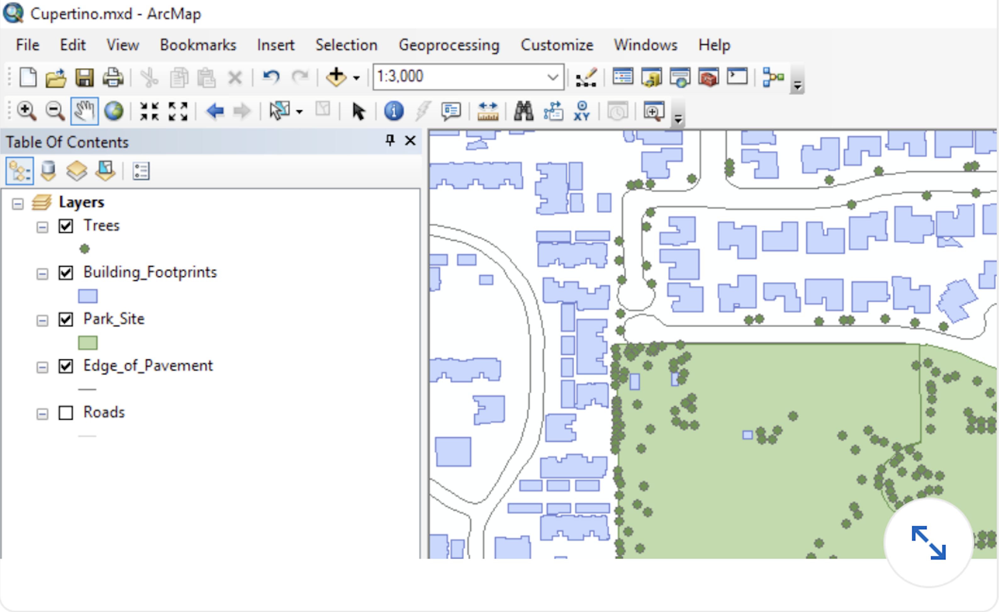
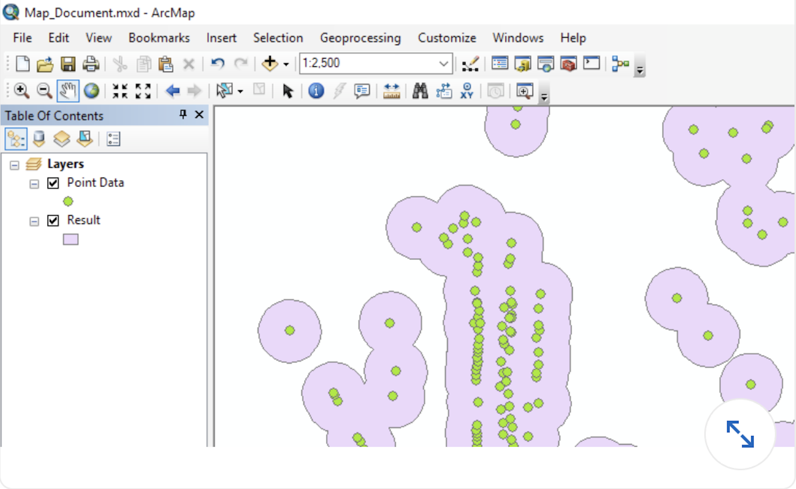

## Arc GIS

#### Q1. Which is the most effective way to have labels for different street types be shown at different scale ranges?

- [ ] Use the **Draw** toolbar to create text boxes for each street type
- [ ] Create label classes for each type of street
- [x] Create a separate layer for each street type
- [ ] This is not possible. Labels are the same at all scale ranges

#### Q2. In ArcGIS Pro, what are the two viewing modes for scenes?

- [ ] 2D and 3D
- [x] Global and Local
- [ ] Small scale and Large scale
- [ ] Solid and Wireframe

[Reference](https://doc.arcgis.com/en/arcgis-online/create-maps/choose-global-local-scene.htm)

#### Q3. When an ArcMap .mxd file is imported into ArcGIS Pro, what is each data frame in the original document converted to in the ArcGIS Pro project?

- [ ] basemap
- [ ] layout
- [ ] local scene
- [x] map

[Reference](https://pro.arcgis.com/en/pro-app/latest/get-started/migrate-content-to-arcgis-pro.htm#:~:text=Each%20data%20frame%20in%20an%20ArcMap%20document%20becomes%20a%20separate%20map%20in%20ArcGIS%20Pro.)

#### Q4. Which is a collection of raster datasets stored as a catalog that allows you to view or access the datasets as a single merged image or individual images?

- [ ] an image collection dataset
- [x] a mosaic dataset
- [ ] raster tiles
- [ ] a folder of raster data files

[Reference](https://desktop.arcgis.com/en/arcmap/10.7/manage-data/raster-and-images/how-raster-data-is-stored-and-managed.htm#:~:text=A%20mosaic%20dataset%20is%20a,size%20and%20number%20of%20datasets.)

#### Q5. Using the explore tool in ArcGIS Pro, how do you zoom in and out of the map?

- [ ] Press shift and left-click to zoom in. Press ctrl and left-click to zoom out.
- [ ] Hold the left mouse button, and drag up to zoom in and drag down to zoom out.
- [x] Move the mouse scroll wheel forward to zoom out and backward to zoom in.
- [ ] Click and drag a box with the left mouse button to zoom in; press shift and drag a box to zoom out.

[Reference](https://pro.arcgis.com/en/pro-app/latest/help/mapping/navigation/navigation-in-arcgis-pro.htm#:~:text=Explore%20maps%20and%20scenes,-The%20default%20tool&text=%2C%20which%20is%20used%20to%20move,up%20or%20down%20to%20zoom.)

#### Q6. Which Layer in this map is currently not visible in the data frame?

- [ ] Trees
- [ ] Building_Footprints
- [ ] Sewer_Lines
- [x] Roads

#### Q7. When you zoom in on a map, how are you changing the view

- [ ] from a higher scale to a lower scale
- [ ] from a smaller scale to a larger scale
- [x] from a lower scale to a higher scale
- [ ] from a larger scale to a smaller scale

#### Q8. Where are parcel fabrics, geometric networks, and topologies created?

- [ ] inside of file geodatabases
- [ ] inside of enterprise geodatabases
- [x] inside of feature datasets
- [ ] inside of feature classes

#### Q9. Which of these methods is best for sharing a map with colleagues who do not have ArcMap or ArcGis Pro?

- [ ] Export the map to PDF and send your colleagues the PDF.
- [ ] Export the map to KML and ask your colleagues to download Google Earth.
- [x] Publish the map as a service and then create a web map that you can share with your colleagues
- [ ] Export the map to a map package, and ask your colleagues to download and install the free Map Package Viewer software

#### Q10. You built a model and verified that it works as intended by running it on your own data files. What is the best way to share the entire procedure with colleagues so that they can study it, reproduce your results exactly, and then apply the model to their own data?

- [ ] Convert the model to Python and upload the results to ArcGIS Online as a service.
- [x] Create a geoprocessing package.
- [ ] Run the consolidated Model tool to gather the model and input datasets into a shared folder
- [ ] Create a map Package

#### Q11. Which is an example of geographic coordinate system?

- [x] WGS 1984
- [ ] Winkel Tripel
- [ ] Universal Transverse Mercator
- [ ] Natural Earth

#### Q12. When you create a bookmark of your current map view, what is being saved?

- [x] the map's current scale and center point
- [ ] the visibility status of each layer
- [ ] the center point of the current view
- [ ] the map's current scale

#### Q13. What geoprocessing tool, when applied to the Point Data Layer, is most likely responsible for the data shown in the Result Layer?

- [ ] Dissolve
- [x] Buffer
- [ ] Merge
- [ ] Intersect

#### Q14. By default, as what do all geoprocessing tools run from dialog boxes execute?

- [ ] Python Scripts
- [x] foreground processes
- [ ] background processes
- [ ] in-memory processes

#### Q15. A grayscale raster is said to have a single \***\*\_\*\*** while a full-color RGB raster has three \***\*\_\*\***.

- [x] band; bands
- [ ] color; colors
- [ ] channel; channels
- [ ] value; values

#### Q16. Which Classification method places approximately the same number of values in each class \***\*\_\*\***.

- [ ] defined intervals
- [ ] equal intervals
- [x] quantile
- [ ] standard deviation

#### Q17. You want to add a time and date to your map layout that will update when the map is printed. What element should you add to do this ? \***\*\_\*\***.

- [ ] variable data
- [x] dynamic text
- [ ] datestamp
- [ ] system information

#### Q18. Linear referencing datasets are comprised of what two data types? \***\*\_\*\***.

- [ ] polyline feaature classes and point location tables
- [ ] line event tables and point event tables
- [ ] reference control points feature class and target tables
- [x] route feature classes and event tables

#### Q19. How can you link the size of text and symbols to a specific zoom level of the map so that they increase and decrease in size as you zoom in and out? \***\*\_\*\***.

- [ ] Right click the map in the **Contents** pane and click **Set Reference Scale**.
- [ ] Right click the data layer and choose **Symbology > Variable**.
- [ ] Turn on the option for **Zoom Symbology and Labels** in the map's properties.
- [x] In the **Layer Properties** dialog box, click **Display**, and then clear **Fixed Sizing**

[Reference](https://pro.arcgis.com/en/pro-app/latest/help/mapping/layer-properties/scale-based-symbol-sizing.htm)

#### Q20. When trying to publish a web feature layer from ArcGIS Pro to ArcGIS Online, the analyzer returns the error message "Layer uses an unsupported renderer or property." Which symbology method would cause this error?

- [x] unique values
- [ ] dot density
- [ ] graduated symbols
- [ ] unclassed colors

[Reference](https://pro.arcgis.com/en/pro-app/latest/help/sharing/analyzer-error-messages/00085-layer-uses-an-unsupported-renderer.htm)

#### Q21. Which data source cannot be added to ArcGIS Online to be used as a hosted feature layer?

- [ ] Microsoft Excel workbooks
- [ ] personal geodatabases
- [x] Google Sheets spreadhssts stored in Google Drive
- [ ] GeoJSON files

[Reference](https://enterprise.arcgis.com/en/portal/latest/use/publish-features.htm)

#### Q22. You need to attach photographs to a geodatabase feature class called `Bus_Stops`. To enable this capability using ArcCatalog, you right-click the `Bus_Stops` feature class, point to Manage, and then click **Create Attachments**. What does this create in the geodatabase?

- [x] A geodatabase table called `Bus_Stops_REL` is created that references a `Bus_Stops_ATTACHMENTS` folder in the same parent folder as the geodatabase
- [ ] A geodatabase table called `Bus_Stops_ATTACH` and a relationship class called `Bus_Stops_ATTACHREL` are created.
- [ ] A feature class called `Bus_Stops_ATTACH` and a relationship class called `Bus_Stops_RELATION` are created.
- [ ] A new raster feature dataset called `Bus_Stops_ATTACHMENTS` is created.

[Reference](https://pro.arcgis.com/en/pro-app/latest/help/editing/edit-file-attachments.htm#:~:text=Enable%20attachments,-By%20default%2C%20features&text=On%20the%20Analysis%20tab%2C%20in,enable%20and%20click%20Enable%20Attachments.&text=and%20choose%20the%20source%20geodatabase,you%20want%20to%20attach%20files.)

#### Q23. A file geodatabase table field that will be used to store scans of historical records in `.pdf` format needs to be what data type?

- [x] attachment
- [ ] blob
- [ ] document
- [ ] OLE object

#### Q24. You want to create a tool for your organization that will walk users through a best-practice workflow in a consistent manner. What is the best way to go about this?

- [ ] Script the procedure using Python..
- [ ] Build an ArcGIS model.
- [x] Build an ArcGIS Pro task.
- [ ] Publish an ArcGIS Online story map.

#### Q25. When creating a feature class, which field data type would be the most appropriate to store values in the expected range of 1,000 to 10,000?

- [ ] double
- [x] short integer
- [ ] float
- [ ] long integer

#### Q26. If you are looking for all features containing a specific company name in the attribute table, but don't know the name of the column containing the company name, or even which layers it is in, which tool should you use to search all of the attributes in all of the layers at once?

- [x] Find
- [ ] Select by Attribute
- [ ] Select by Location
- [ ] Definition Query

#### Q27. You need to prepare an ArcGIS Online hosted feature layer that will be used to collect fire hydrant maintenance data using the Collector for ArcGIS mobile app. You would like Collector to display a drop-down menu of valid choices for the hydrant manufacturer attribute so that data can be entered with just a couple of taps, as pictured. How would you do this?

- [ ] Attach the list of values as a subtype of the Hydrant feature layer.
- [ ] For the Manufacturer field, create the list of values as a range domain.
- [ ] Create the list of values as default values for the feature layer.
- [x] For the Manufacturer field, create the list of values as a coded-value domain.

[Reference](https://doc.arcgis.com/en/arcgis-online/manage-data/hosted-web-layers.htm)

#### Q28. You add a north arrow to a layout in ArcGIS Pro. Which direction does it point by default?

- [x] Map North
- [ ] Magnetic North
- [ ] True North
- [ ] Grid North

[Reference](https://pro.arcgis.com/en/pro-app/latest/help/layouts/north-arrows.htm)

#### Q29. Which classification method places approximately the same number of values in each class?

- [ ] Defined Interval
- [ ] Equal Interval
- [x] Quantile
- [ ] Standard Deviation

[Reference](https://pro.arcgis.com/en/pro-app/latest/help/mapping/layer-properties/data-classification-methods.htm)

#### Q29. You want to add a time and date to your map layout that will update when the map is printed. What element should you add to do this?

- [ ] Variable data
- [x] Dynamic text
- [ ] Datestamp
- [ ] System information

[Reference](https://desktop.arcgis.com/en/arcmap/latest/map/page-layouts/working-with-dynamic-text.htm)
