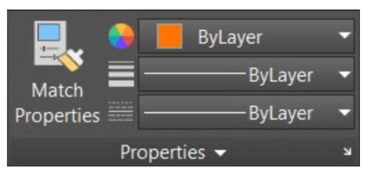
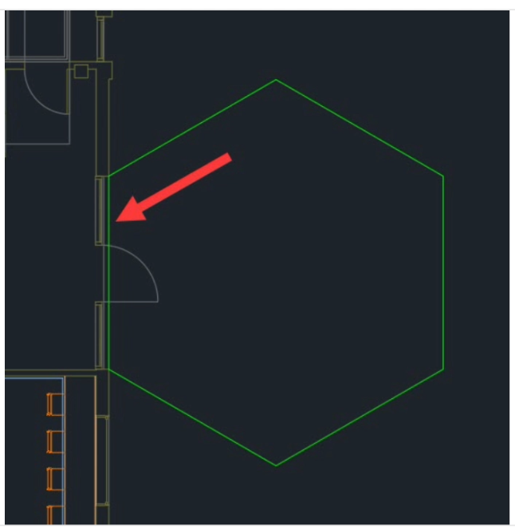
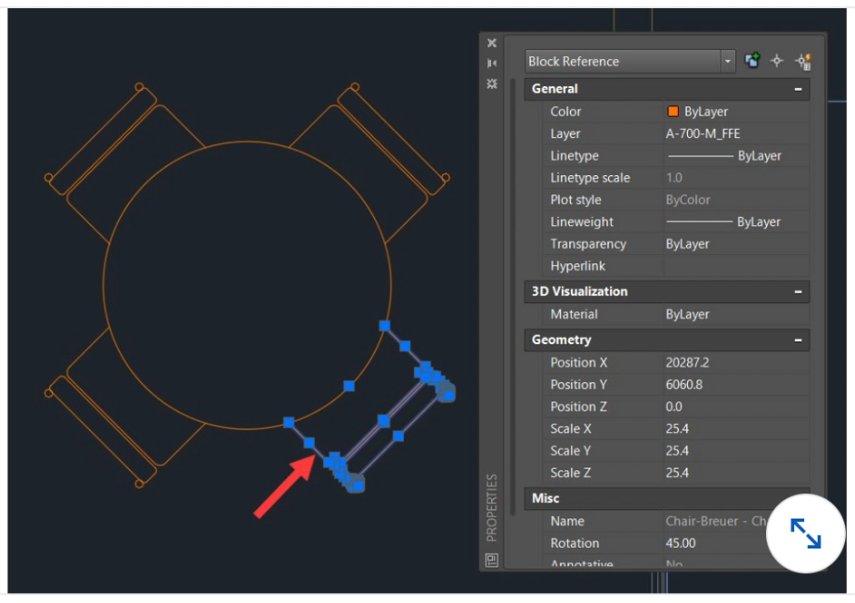

## AutoCAD

#### Q1. You have an application using a 100 GB MySQL database that you are migrating into AWS. What should you consider when deciding between whether to host the database on RDS for MySQL or Aurora?

- [ ] cost
- [ ] ease of maintenance vs. granularity of control
- [x] all of these answers
- [ ] the current storage engine used by the application, such as InnoDB or MyISAM

#### Q2. The LAYOFF command turns off the layer of any selected object. What happens if you select an object on the current drafting layer?

- [ ] AutoCAD turns off the current drafting layer and sets up a new layer in the Layer Properties Manager.
- [ ] AutoCAD turns off the current drafting layer and sets the current drafting layer to Layer 0 (zero).
- [x] AutoCAD prompts you if you want to turn off that layer.
- [ ] AutoCAD turns off the current drafting layer with no prompt.

#### Q3. Sometimes you will need to match properties of one object to another using the Match Properties (MATCHPROP) command. When matching the properties of an existing viewport to a new one, which setting do you turn off in Match Properties to ensure that the viewport scale is not matched across to the new viewport?

- [ ] Special Properties/Viewport
- [ ] Basic Properties/Layer
- [ ] Special Properties/Center object
- [x] Basic Properties/Linetype Scale

#### Q4. When using the Multiple Points (POINT) command, which specific AutoCAD setting should you change from the default setting?

- [ ] Change your layer (LAYER) so that points can be seen easily.
- [ ] Change your color (COLOR) so that points can be seen easily.
- [ ] Change your linetype (LINETYPE) so that points can be seen easily.
- [x] Change your point style (PTYPE) so that points can be seen easily.

#### Q5. When working in a layout, if a viewport is activated and locked and you accidentally zoom in or out, what happens to your viewport scale?

- [ ] Nothing. The viewport scale remains the same.
- [ ] The viewport scale returns to the default 1:1 scale.
- [ ] The viewport scale changes to the next available standard scale.
- [x] The viewport scale changes to a nonstandard scale.

#### Q6. Dynamic Input (DYNMODE) is switched on by default. Which function key do you use to control the Dynamic Input toggle?

- [ ] F8
- [ ] F1
- [ ] F9
- [x] F12 (Windows) or Shift+Command+D (Mac)

#### Q7. What specific annotation setting must be in place in order to place a text annotation in a drawing?

- [ ] a multileader style
- [ ] a dimension style
- [ ] a table style
- [x] a text style

#### Q8. In a standard AutoCAD installation, what does rolling the mouse backward do?

- [x] zoom out
- [ ] zoom left
- [ ] zoom in
- [ ] zoom right

#### Q9. When an inserted block is selected, a single grip is displayed on the block, as shown in the image below. What is this point known as when the block is created with the Create Block (BLOCK) command?

- [ ] origin point
- [ ] zero point
- [ ] block origin point
- [x] insertion point

#### Q10. External reference files (XREFs) link external drawings to the host drawing. You can set the XREF path type to no path, relative path, or full path. What value should be used for the relative path type?

- [ ] REFPATHTYPE = 2
- [ ] REFPATHTYPE = 3
- [x] REFPATHTYPE = 1
- [ ] REFPATHTYPE = 0

#### Q11. One of the benefits of a locked viewport in a layout is that you can activate it and work through the viewport on the objects and annotation in the model space, without worrying about affecting the viewport scale. What is the space in the activated viewport commonly known as when you do this?

- [ ] scaled model space
- [x] layout model space
- [ ] floating model space
- [ ] viewport model space

#### Q12. When working in a layout, if a viewport is activated and unlocked and you accidentally zoom in or out, what happens to your viewport scale?

- [ ] The viewport scale changes to the next available standard scale.
- [ ] Nothing. The viewport scale remains the same.Nothing. The viewport scale remains the same.
- [ ] The viewport scale returns to the default 1:1 scale.
- [x] The viewport scale changes to a nonstandard scale.

#### Q13. When using annotative scaling with dimensions and an annotative dimension style, which two variables need to match for the dimensioning to display in a scaled viewport?

- [ ] drawing scale and viewport scale
- [ ] insertion scale and viewport scale
- [ ] block scale and viewport scale
- [x] annotation scale and viewport scale

#### Q14. You can share tool palettes with other AutoCAD users, provided that the palette source drawing location does not change. What file do you need to share to ensure that another user is using the same tool palette?

- [ ] Shared Tool Palette (STP) file
- [ ] New Tool Palette (NTP) file
- [x] Exported Tool Palette (XTP) file
- [ ] User Tool Palette (UTP) file

#### Q15. A crossing selection selects what objects?

- [ ] only the objects completely outside the crossing selection
- [ ] only the objects not encompassed nor crossed by the crossing selection
- [ ] only the objects completely encompassed by the crossing selection
- [x] only the objects completely encompassed and crossed by the crossing selection

#### Q16. You can dimension objects in AutoCAD from the Annotation panel on the Home tab of the ribbon. Where else can you dimension on the ribbon?

- [x] the Dimension panel on the Annotate tab
- [ ] the Dimensional panel on the Parametric tab
- [ ] the Palettes panel on the View tab
- [ ] the Reference panel on the Insert tab

#### Q17. When drawing a group of line segments with the LINE command, which command on the right-click shortcut menu allows you to form a closed boundary and snap back to the start point of the first line segment?

- [x] CLOSE
- [ ] ENTER
- [ ] CANCEL
- [ ] UNDO

#### Q18. AutoCAD allows you to create elliptical arcs in drawings. When creating one of these arcs, which default drafting rule do you need to follow?

- [ ] Arcs follow a counterclockwise (positive angle value) path.
- [ ] Arcs follow a clockwise (positive angle value) path.
- [ ] Arcs always follow a path with a negative angle value.
- [x] Arcs follow a user-defined path.

#### Q19. Linetype Scale (LTSCALE) is applied to what sort of linetypes in AutoCAD drawings?

- [ ] any objects that utilize a continuous linetype
- [x] any objects that utilize any linetype
- [ ] any objects that utilize a dashed or dotted linetype, or a combination of both
- [ ] any objects that utilize a colored or continuous linetype, or a combination of both

#### Q20. By default, all of the ARRAY commands make their respective arrays associative and group the selected objects in the array. What command would you use to convert the selected array into individual AutoCAD objects?

- [ ] EATTEDIT
- [ ] WBLOCK
- [x] EXPLODE
- [ ] PROPERTIES

#### Q21. Which command opens a folder where you can start the Add-a-Plotter wizard?

- [ ] QUICKSETUP
- [ ] STYLESMANAGER
- [x] PLOTTERMANAGER
- [ ] PLOTTERWIZARD

#### Q22. Dimensions in a drawing can be spaced automatically with the Adjust Space (DIMSPACE) command. You can specify a distance between spaced dimensions or you can use the Auto option. What does Auto do to the dimensions being spaced?

- [ ] calculates the Auto space as one and a half times (1.5x) the text height of the text in the dimension style being used
- [x] calculates the Auto space as twice the distance between the first and second dimensions selected for spacing
- [ ] calculates the Auto space as three times (3x) the text height of the text in the dimension style being used

#### Q23. There is often a need to hide or isolate selected objects, especially in complex drawings when detailing geometry. Where would you find the Isolate menu option—which is not on the ribbon?

- [ ] the status bar
- [x] a right-click shortcut menu after object selection
- [ ] the Quick Access toolbar (QAT)
- [ ] the navigation bar

#### Q24. System variables can be monitored in AutoCAD. When monitored, they can also be reset to preferred values. What command is used to control these system variables?

- [x] SYSVARMONITOR
- [ ] SYSVARMON
- [ ] SYSTEMVARIABLEMON
- [ ] SYSVARIABLEMONITOR

#### Q25. When using HIDE or ISOLATE in a drawing, the objects are either hidden or isolated for clarity. What happens to the layers of hidden or isolated objects?

- [ ] The hidden and isolated object layers go on to their own layer.
- [ ] The isolated object layers stay on; all other layers are turned off in the Layer Properties Manager.
- [x] Nothing happens.
- [ ] The hidden object layers turn off; all other layers stay on in the Layer Properties Manager.

#### Q26. When scaling a drawing from imperial feet and inches to metric millimeters, what scale factor do you use in the SCALE command, before adjusting your units settings?

- [x] 25.4
- [ ] 0.03937
- [ ] 12.0
- [ ] 0.08333

#### Q27. When drawing line objects in a drawing, you may use coordinates to define distance and direction. One type of coordinate is a relative coordinate, which is relative to the last point specified—often the second point when drawing a line using the LINE command. What prefix symbol should you type in front of 2D X,Y coordinates to ensure that AutoCAD knows it is a relative coordinate input?

- [ ] `#X,Y`
- [x] `@X,Y`
- [ ] `R-(X,Y)`
- [ ] `REL X,Y`

#### Q28. Center Mark (CENTERMARK), a new annotation tool for circles and arcs, provides an associative center mark that can be edited easily and remains associative to its geometry. Which AutoCAD system variable controls the extension line overshoots that go past the circumference of the circle or arc?

- [ ] CENTERRESET
- [ ] CENTEREXE
- [ ] CENTERLTSCALE
- [x] CENTERMARKEXE

#### Q29. Where would you find the Application menu in AutoCAD?

- [ ] bottom-left corner of the screen
- [ ] bottom-right corner of the screen
- [ ] top-right corner of the screen
- [x] top-left corner of the screen

#### Q30. When plotting in AutoCAD, the default plotting style is a color-dependent plot style table (CTB). You can also use named plot style tables (STB). You can change a CTB drawing to an STB drawing using which command?

- [ ] CONVERTPSTYLES
- [ ] CONVSTYLES
- [ ] CONVERTPLOT
- [ ] CONVPLOTSTYLE

#### Q31. Single-line text can be added anywhere in a drawing. If middle-center justified text with height of 0 was required in model space that was 300 millimeters high, what workflow would you use?

- [ ]

1. Right-click and select Justify.
2. Select MC.
3. Pick a middle point.
4. Type text.
5. Specify the height.
6. Specify the rotation angle.

- [x]

1. Right-click and select Justify.
2. Select MC.
3. Specify the height.
4. Specify the rotation angle.
5. Pick a middle point.
6. Type text.

- [ ]

1. Right-click and select Justify.
2. Select MC.
3. Specify the height.
4. Specify the rotation angle.
5. Pick a middle point.
6. Type text.

- [ ]

1. Right-click and select Justify.
2. Select MC.
3. Pick a middle point.
4. Drag the mouse to set the height.
5. Drag the mouse to set the rotation angle.
6. Type text.

#### Q32. A circle has five grips: a center grip and four quadrant grips. When using the Tan Tan Radius (TTR) method to draw a circle in a right-angled corner, which of the two quadrant grips will be touching other objects?

- [x] the two grips that also act as the tangents in the TTR circle command
- [ ] the bottom and left grips the
- [ ] top and right grips
- [ ] the center and top grips

#### Q33. The Quick Access toolbar (QAT) is located in the top left of the AutoCAD application window. Which two commands in the QAT allow you to go backward and forward in your AutoCAD workflow?

- [ ] Left and Right
- [ ] Undo and Redo
- [ ] Rewind and Fast
- [ ] Forward Unfix and Fix

#### Q34. When you are in a drawing and want to make an object's layer the current drafting layer, what command can you use?

- [ ] Make Current (LAYMCUR)
- [ ] Change individual properties in the Properties panel.
- [ ] Match Properties (MATCHPROP)
- [x] Match Layer (LAYMCH)

#### Q35. AutoCAD uses coordinates as the basis of all drawings. The coordinate system is always displayed in the bottom-left corner of the Model tab. In a regular 2D drawing, what axis notation is used for the horizontal and vertical coordinates?

- [x] X = horizontal, Y = vertical
- [ ] H = horizontal, V = vertical
- [ ] A = horizontal, B = vertical
- [ ] 1 = horizontal, 2 = vertical

#### Q36. When using coordinates in your drawings, you may need to get an exact coordinate value of a point. For example, it might be the corner of an object for setting out purposes, or the center of a circle for modifying the circle's position. What command do you use to obtain a point's exact coordinate value?

- [ ] Object Snaps (OSNAP)
- [ ] Distance (DIST)
- [x] ID Point (ID)
- [ ] List (LIST)

#### Q37. The DONUT command creates donut-shaped drawing objects. Which two values are needed to place a donut on a drawing?

- [ ] internal and external quadrants
- [ ] internal and external circumference
- [ ] internal and external diameter
- [ ] internal and external radius

#### Q38. An inscribed polygopoln gives you what type of point at the end of the polygon radius?

- [ ] a node
- [ ] a midpoint
- [ ] a vertex
- [x] a center point

#### Q39. In order for object snap tracking to function effectively, what other drafting setting must be switched on?

- [ ] Snap and Grid
- [ ] Dynamic Input
- [ ] Object Snaps
- [x] Polar Tracking

#### Q40. When you use the ARRAY command to create copies of objects in AutoCAD, what do you use to orient a rectangular array?

- [ ] center point and rotation angle
- [x] X and Y coordinates
- [ ] Grid and Snap values
- [ ] rows and columns

#### Q41. What type of coordinate is given when using the ID Point command?

- [ ] polar—relative to the last center point selected
- [x] absolute—relative to the origin 0,0
- [ ] relative—relative to the last point selected
- [ ] angled—relative to the last angle of the last object selected

#### Q42. When working with objects in your drawings, you normally define their properties via their respective layers. However, you can define individual object properties with the Properties panel on the Home tab of the AutoCAD ribbon. Individual color and linetype can be defined there, along with what other typical object property?

- [ ] description
- [x] plottable or not plottable
- [ ] linetype scale
- [ ] lineweight

#### Q43. The Text Align (TEXTALIGN) command does more than just align text vertically or horizontally. Which TEXTALIGN setting allows you to set up evenly aligned text to a defined spacing in a drawing?

- [ ] setting the spacing distance in the Properties palette
- [ ] setting the spacing distance on the right-click shortcut menu
- [ ] the Distribute option
- [x] the Set Spacing option

#### Q44. When utilizing named views in the Model tab to navigate, why should you keep an eye on your current drafting layer?

- [ ] Each named view has its own current drafting layer.
- [ ] Each named view can be saved with a layer snapshot, which might change your current drafting layer.
- [ ] Each named view has its own current drafting layer, with the layer name being the same as the name of the named view.
- [ ] Each named view changes the current drafting layer to a default drafting layer.

#### Q45. When using palettes in AutoCAD, why would you dock a palette and then use the auto-hide function?

- [ ] to make sure AutoCAD works properly
- [ ] to isolate all the blocks you are using in the current drawing
- [ ] to stop anyone seeing which AutoCAD palettes you are using
- [x] to automatically hide the palette content and display only the docked palette title bar

#### Q46. The navigation bar is normally on by default and is located to the right-hand side of the drawing area. Which variable controls the display of the navigation bar, and to what value does it need to be set for the navigation bar to display on the screen?

- [ ] The NAVBARDISPLAY value should be set to 1
- [ ] The NAVBARDISPLAY value should be set to 0.
- [ ] The NAVIGATIONBARDISPLAYON value should be set to 1.
- [ ] The NAVIGATIONBARDISPLAYON value should be set to 0.

#### Q47. In a complex drawing, it is sometimes difficult to select the geometry you wish to modify. You might want to move, scale, or rotate geometry and make sure the appropriate objects are selected. You can do this with window and crossing selections, but what other selection method can make this easier?

- [x] SELECT (S)
- [ ] LAST (L)
- [ ] PREVIOUS (P)
- [ ] FENCE (F)

#### Q48. When working with layers in your drawings, you may regularly go to the Layer drop- down menu on the Layers panel on the Home tab of the ribbon. Which part of the AutoCAD interface can you customize to allow the Layer drop-down menu to be available regardless of which ribbon tab you are currently using?

- [ ] the status bar
- [ ] the navigation bar
- [ ] the Quick Access toolbar (QAT)
- [ ] the info bar

#### Q49. When drafting with object snaps and object snap tracking, what other drafting setting can you use to set object snap tracking points?

- [x] Polar Tracking (POLAR)
- [ ] Grid (GRID)
- [ ] Dynamic Input (DYNMODE)
- [ ] Snap (SNAP)

#### Q50. When using the MOVE or COPY command, what is the first point that you must select?

- [ ] a displacement point
- [ ] an endpoint
- [x] a base point
- [ ] a midpointa

#### Q51. When using the OFFSET command, you specify an offset distance and then select the object you want to offset. How do you then specify which side of the original object to offset?

- [ ] Use the Tab key to alternate which side you want to offset to. Then press Enter (Windows) or Return (Mac) to confirm.
- [ ] Move the cursor to the appropriate side of the original object and the OFFSET command automatically offsets that side.
- [ ] Right-click and use options on the shortcut menu.
- [x] Click to the side of the original object where you want the offset object to appear.

#### Q52. When using the ELLIPSE command with the Axis, End, and Center methods, how many axes are needed to form an ellipse?

- [ ] eight
- [x] two
- [ ] six
- [ ] four

#### Q53. When hatching in a drawing with the Hatch (HATCH) command and the pick points selection method, what hatch setting needs to be switched OFF in order to make sure that all hatch boundaries selected form one hatch object?

- [ ] Create Separate Hatches
- [ ] Associative Boundaries
- [ ] Set the HATCHMULTIPLE variable to 0 (OFF).
- [ ] Set the HATCHMULTIPLE variable to 1 (ON).

#### Q54. AutoCAD allows you to select individual objects cumulatively to create a selection set. You can remove individual objects from that selection by using a mouse click combined with which keystroke?

- [ ] Tab
- [ ] Ctrl (Windows) or Command (Mac)
- [ ] Alt (Windows) or Option (Mac)
- [x] Shift

#### Q55. Multileaders are defined with a multileader style, which can have text (MTEXT), a block, or nothing added to the multileader line coming from the arrowhead. When using the block option for multileader content, default blocks are available with attributes for easy annotation; a user block can also be defined. Where does AutoCAD first look for the user blocks that can be used with multileaders?

- [ ] in a known server folder path
- [ ] in a known cloud server folder path
- [x] in the drawing folder
- [ ] in the drawing file

#### Q56. When using the Edit Polyline (PEDIT) command, there may be occasions when you want to join line segments that have a gap. The PEDIT command can close these gaps automatically using a specific workflow. What is that workflow?

- [ ] When in the PEDIT command, select multiple lines to convert; then when selecting the Join option, you are prompted for a GAPDIST variable. This is the minimum gap distance for automatic joining.
- [x] When in the PEDIT command, select multiple lines to convert; then when selecting the Join option, you are prompted for a FUZZ DISTANCE. This is the minimum gap distance for automatic joining.
- [ ] When in the PEDIT command, select multiple lines to convert; then when selecting the Join option, you are prompted for a MINIGAP DISTANCE. This is the minimum gap distance for automatic joining.
- [ ] When in the PEDIT command, select multiple lines to convert; then when selecting the Join option, you are prompted for a MIN GAP DISTANCE. This is the minimum gap distance for automatic joining.

#### Q57. When creating a block with attributes, why should you use underscores between words in the attribute tag?

- [ ] Attribute tags must have an underscore to be recognized for data extraction.
- [ ] Attribute tags do not allow spaces.
- [x] Attribute tags need an underscore to be recognized by the BLOCK command.
- [ ] Attribute tags must have an underscore in them.

#### Q58. To insert a table in a drawing, you use the TABLE command. What is a prerequisite to control a table's appearance before inserting a table into a drawing?

- [ ] a table dimension style
- [x] a table style
- [ ] a table layer
- [ ] a table linetype

#### Q59. When plotting multiple layouts, you can use the Batch Plotting (PUBLISH) command. What type of file can be saved to retain the batch plotting settings?

- [ ] Batch Plotting Description (BPD)
- [ ] file Drawing Publishing Description (DPD)
- [x] file Batch Sheet Description (BSD)
- [ ] file Drawing Set Description (DSD) file

#### Q60. To create clean, professional plots of your drawings, which object should be set to not plot in the Layer Properties Manager palette?

- [ ] dimensions
- [x] viewports
- [ ] blocks
- [ ] text

#### Q61. Selection cycling can be used to select an object that shares concurrent geometry with another object. Which AutoCAD system variable needs to be used, and what value needs to be set, to ensure that selection cycling is switched on and the dialog box appears?

- [ ] SELECTIONCYCLING = 0
- [x] SELECTIONCYCLING = 2
- [ ] SELECTIONCYCLING = 1
- [ ] Press Ctrl+W (Windows) or Command+W (Mac).

#### Q62. Splines use the NURBS algorithm in AutoCAD. What does NURBS stand for?

- [ ] Non-Unified Rotated Bend Spline
- [ ] Non-United Rotational Bend Spline
- [x] Non-Uniform Rational Basis Spline
- [ ] Not Uniform Rotational Build Spline

#### Q63. You can freeze layers in a current viewport in a layout tab. This is done by activating the viewport and selecting the layers to be frozen either in the Layer drop-down menu or the Layer Properties Manager. Which layer setting makes sure that layers are automatically frozen in any new viewports?

- [ ] VP Freeze
- [x] Freeze in Viewport
- [ ] Freeze in New Viewport
- [ ] New VP Freeze

#### Q64. When using multiline text in a drawing, you can import text from other applications using the Import Text command. Application-neutral text, TXT format, can be imported this way. What other types of text that preserve formatting and fonts can you import?

- [ ] Simplex (SHX) text
- [ ] Microsoft Word text in a TrueType (TTF) font
- [x] Rich Text Format (RTF) text
- [ ] any other type of text apart from TXT text

#### Q65. When using the MOVE command from the right-click shortcut menu, why are you automatically asked to select a base point for your move?

- [ ] The object(s) is selected automatically after the base point is selected.
- [ ] The object(s) automatically associates into a group once you have selected the base point.
- [ ] You are asked to select the object(s) after the base point is selected.
- [x] You have already selected the object(s) to move.

#### Q66. You can use Polar Tracking to rotate objects when using the ROTATE command. What would you need to set to control the angle?

- [ ] Set the Grid and Snap settings.
- [ ] Set up the running object snaps.
- [x] Set the Polar Tracking increment angle.
- [ ] Set up object snap tracking.

#### Q67. When working with annotative text styles and dimension styles in model space, what two values must match for the annotative annotation to display in the corresponding viewports in the layout tab?

- [ ] annotation scale and linetype scale
- [ ] linetype scale and viewport scale
- [x] annotation scale and viewport scale
- [ ] insertion scale and annotation scale

#### Q68. The SCALE command needs a scale factor in order to function. The value has to be a positive integer. If you use a scale factor of 2, what does this value represent?

- [ ] two times bigger in the X direction (200%
- [x] twice as big (200%)
- [ ] two percent bigger (2%)
- [ ] half as big (50%)

#### Q69. Which keys can you press to repeat your last-used AutoCAD command?

- [ ] the Page Up key or the Page Down key
- [ ] the R key or the C key
- [ ] the Tab key
- [x] the Spacebar or the Enter (Windows) or Return (Mac) key

#### Q70. When using the Polyline (PLINE) command to draw an arrowhead, what polyline properties do you need to use?

- [ ] the Halfwidth setting
- [x] starting width and ending widths
- [ ] polyline start and polyline end
- [ ] the START and END variables in the PLINE command

#### Q71. Where do you perform the majority of drawing tasks in AutoCAD?

- [ ] innerspace
- [ ] paper space
- [ ] layout space
- [x] model space

#### Q72. To plot the same drawing with the same settings each time, what needs to be set up in AutoCAD?

- [ ] the Output tab
- [ ] the Plot dialog boxt
- [ ] batch plotting
- [x] Page Setup Manager (Windows) or Page Setup (Mac)

#### Q73. Using the Array command, you have the option to create an associative array. What does this mean?

- [ ] When dimensioning an array, the dimensions displayed are associative.
- [x] The arrayed objects becomes a single entity and, when selected, display as a single entity.
- [ ] The arrayed objects become associated to the X and Y coordinates used for the array.
- [ ] The array is associated to the linetype scale.

#### Q74. When drawing a Start, Center, End arc, which key do you press to draw the arc in a clockwise direction?

- [ ] C (clockwise)
- [ ] Alt
- [ ] D (direction)
- [x] Ctrl

#### Q75. When using the POLYGON command in AutoCAD, you can create an inscribed polygon and a circumscribed polygon. What other type of polygon is available?

- [ ] side polygon
- [ ] polyline polygon
- [ ] line polygon
- [x] edge polygon

#### Q76. When using blocks in a drawing, a selected block displays only one grip: the insertion point. How would you get a block to display all of its associated grips?

- [ ] Change the GRIPBLOCK system variable to 1.
- [ ] Select the block and change it in the Properties palette.
- [ ] Change the GRIPBLOCK system variable to 0.
- [ ] Select the block and change it in the right-click shortcut menu.
