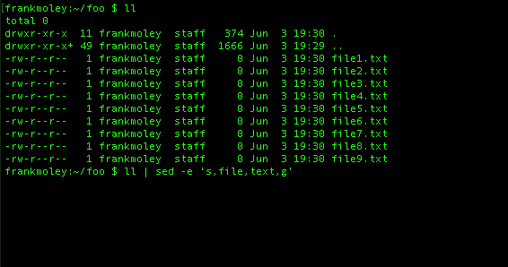
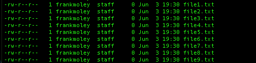
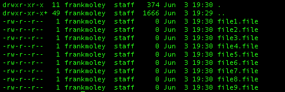
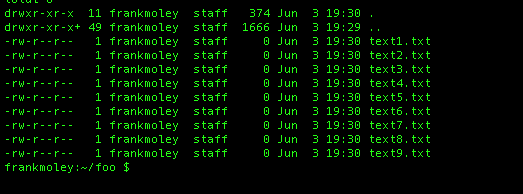

## Bash

#### Q1. 以下三种方法中,哪一种可以递归地将用户主目录中的名为"photo dir"的目录复制到 /backups?

```bash
cp -R "~/photo dir" /backups #method1
cp -R ~"/photo dir" /backups #method2
cp -R ~/"photo dir" /backups #method3
```

- [ ] 只有method 1会将 `"~/"` 展开为用户的主目录,然后附加包含空格的目录名称。
- [ ] 只有method 2会将 `"~/"` 展开为用户的主目录,然后附加包含空格的目录名称。
- [x] 只有method 3会将 `"~/"` 展开为用户的主目录,然后附加包含空格的目录名称。
- [ ] 三种方法都不会展开为用户的主目录。只有使用 `"$HOME/photo dir"` 才会成功。

#### Q2. 如果在当前目录中运行 script.sh,它会失败。为什么?

```bash
$ ls -1
Beach photo1.jpg
Photo1.jpg
Photo2.jpg
Script.sh

$ cat script.sh
for i in $(ls *.jpg); do
	mv $i ${i}.bak
done
```

- [ ] ls: cannot access nonexistentfile: No such file or directory
- [x] for循环会在单词边界处拆分,而Beach photo1.jpg中有一个空格。
- [ ] mv命令会失败,因为大括号是Bash中的特殊字符,不能用于文件名。
- [ ] 运行script.sh会成功,因为ls命令会构建当前目录中的文件列表,并通过for循环重命名文件,添加.bak扩展名。

#### Q3. 要在subshell中运行复制命令,应该使用哪种语法?

- [x] `( command )`
- [ ] `sh command`
- [ ] `{ command; }`
- [ ] `(( command ))`

[reference](https://en.wikiversity.org/wiki/Bash_programming/Subshells)。Subshell是程序员捕获(通常是为了处理)程序或脚本输出的一种方式。要在subshell中运行的命令需要用单括号括起来,并在前面加上美元符号:DIRCONTENTS=$(ls -l) echo ${DIRCONTENTS}

#### Q4. 使用"awk",以下命令字符串的输出是什么?

```bash
echo "1 2 3" | awk '{for (i=1; i<=NF; i++) s=s+$i};END {print s}'
```

- [x] 6
- [ ] 123
- [ ] 3
- [ ] 600

[reference](https://www.cyberciti.biz/faq/bash-scripting-using-awk/)。AWK是一种编程语言,专为处理基于文本的数据而设计,无论是文件中的数据还是数据流,或者通过shell pipes。换句话说,你可以将awk与shell scripts结合使用,或者直接在shell prompt下使用。

#### Q5. 以下命令将在根文件系统中搜索名为"finance.db"的文件。在此上下文中,哪些信息被发送到/dev/null?

```bash
find / -name "finance.db" 1>results.txt 2>/dev/null
```

- [ ] 不匹配finance.db的文件名
- [x] 发送到standard error的信息,例如find命令运行时显示的错误
- [ ] 匹配finance.db的文件名
- [ ] 发送到standard output的信息,即find命令找到的文件路径

[reference](https://www.cyberciti.biz/faq/how-to-redirect-standard-error-in-bash/)。将stderr(standard error)重定向到文件的语法:`command 2> errors.txt`。

#### Q6. 要永久删除名为textfile的文件中的空行,可以使用哪个命令?

- [x] `sed -i '/^$/d' textfile`
- [ ] `sed '/^$/d' textfile`
- [ ] `cat textfile | sed '/^$/d`
- [ ] `sed -i 's/^$//' textfile`

[reference](https://www.gnu.org/software/sed/manual/sed.html#sed-regular-expressions)  
sed:sed是一种stream editor,用于对input stream执行基本的文本转换。  
-i[SUFFIX]:此选项指定文件将在原地编辑。  
'/^$/d':正则表达式位于//之间。^表示行的开头,$表示行的结尾。^$表示开头和结尾之间没有任何内容。  
d:删除pattern space;立即开始下一循环。  
Warning,上述示例在Mac terminal上由于不同的UNIX flavours可能无法工作。可以通过添加额外的flag `-e`或`--`来使其在Mac上工作(参考[StackOverflow](https://stackoverflow.com/questions/4247068/sed-command-with-i-option-failing-on-mac-but-works-on-linux)):`sed -i -e '/^$/d' textfile.txt`

#### Q7. 假设user1存在,以下命令字符串的结果是什么?

```bash
awk -F: '/user1/{print $1 "-" $3 "-" $6}' /etc/passwd
```

- [ ] 它会显示user1的username、UID和home directory,用冒号分隔。
- [ ] 它会打印user1的UID、GID和home directory,用连字符分隔。
- [ ] 它会打印user1的UID、comment和home directory,用连字符分隔。
- [x] 它会显示user1的username、UID和home directory,用连字符分隔。

[reference](https://www.cyberciti.biz/faq/understanding-etcpasswd-file-format/)。传统上,/etc/passwd文件用于记录每个注册用户的信息,这些用户可以访问系统。/etc/passwd文件是一个colon-separated文件,包含以下信息:1-`Username`,2-`Password`,3-`User ID (UID)`,4-`Group ID (GID)`,5-`User ID Info (GECOS)`,6-`Home directory`,7-`Command/shell`

#### Q8. 如果在Bash脚本中使用`"set -e"`会发生什么?

- [ ] 如果函数或subshell返回非零status code,Bash将退出。
- [ ] 如果条件返回非零status code,Bash将退出。
- [ ] 如果local、declare或typeset赋值返回非零status code,Bash将退出。
- [x] 如果command、list of commands、compound command或可能的pipeline返回非零status code,Bash将退出。

[reference](http://redsymbol.net/articles/unofficial-bash-strict-mode/)。set -e选项指示bash如果任何command [1]返回非零exit status,则立即退出。你可能不希望在command-line shell中设置此选项,但在script中它非常有用。在所有广泛使用的general-purpose programming languages中,未处理的runtime error——无论是Java中抛出的exception,还是C中的segmentation fault,或者Python中的syntax error——都会立即停止程序的执行;后续行不会被执行。

#### Q9. **\_** 关键字会暂停脚本以从standard input获取输入。

- [ ] get
- [ ] argument
- [x] read
- [ ] input

#### Q10. 如果file.sql包含要执行的SQL语句,那么file.txt中会有什么内容?

```bash
mysql < file.sql > file.txt
```

- [ ] file.sql的内容副本
- [ ] 表示这是无效语法的错误
- [ ] MySQL命令的error output
- [x] MySQL命令的non-error output

**Note**:`查看下面的问题以了解变体。`

#### Q11. 屏幕上的输出和out.txt的内容有什么区别?

```bash
mysql < file.sql > out.txt
```

- [ ] 屏幕上的输出与out.txt完全相同
- [x] 屏幕上没有输出,因为它被重定向到out.txt。
- [ ] 屏幕上的输出与out.txt完全相同,但带有行号。
- [ ] out.txt文件将保存STDERR,而STDOUT将显示在屏幕上。

**Note**:`查看上面的问题以了解变体。`

#### Q12. SUID或setuid如何影响可执行命令?

- [ ] 当命令创建文件时,这些文件将归命令的group owner所有。
- [ ] SUID bit允许任何人执行命令,无论设置了什么其他permissions。
- [x] 当命令被执行时,其running privileges会提升到命令的user owner。
- [ ] 当命令被执行时,其running privileges会提升到命令的group owner。

[reference](https://en.wikipedia.org/wiki/Setuid#:~:text=The%20Linux%20and%20Unix%20access,to%20change%20behaviour%20in%20directories.)。Linux和Unix的access rights flags setuid和setgid(分别是set user identity和set group identity的缩写)[1]允许用户以可执行文件owner或group的file system permissions运行可执行文件,并在directories中更改behavior。

#### Q13. 要从名为textfile的文件中提取第一列的文本,可以使用哪个命令?

- [ ] `cat {$1,textfile}`
- [ ] `cat textfile | awk [print $1]`
- [x] `cat textfile | awk '{print $1}'`
- [ ] `awk textfile {print $1}`

#### Q14. 调出Bash history search的键盘快捷键是什么?

```bash
(reverse-i-search)`':
```

- [ ] Esc + R
- [ ] Ctrl + H
- [x] Ctrl + R
- [ ] Alt + R

Note:在Mac上,它会显示`bck-i-search:`而不是`(reverse-i-search)`。

#### Q15. 哪个算术表达式会给出最精确的答案?

- [ ] `var=$( expr 10 / 8 )`
- [ ] `(( var= 10 /8 ))`
- [ ] `var=$(( 10 / 8 ))`
- [x] `var=$(echo 'scale=2; 10 / 8' | bc)`

[reference](https://www.geeksforgeeks.org/bc-command-linux-examples/)。bc命令用于command line calculator。它类似于basic calculator,可以用来进行基本的数学计算。带有两位precision的division将传递给`bc`,进行计算,并分配给变量。

#### Q16. 此脚本的结果是什么?

```bash
txt=Penguins
[[ $txt =~ [a-z]{8} ]]; echo $?
```

- [ ] 0,表示'true',因为变量"txt"包含八个字母
- [ ] 0,表示'true',因为每个人都喜欢penguins!
- [ ] 1,表示'false',因为变量"txt"长度超过八个字符
- [x] 1,表示'false',因为变量"txt"不包含八个介于a和z之间的小写字母

#### Q17. 如何将Bash shell prompt更改为以下内容?

```bash
HAL>
```

- [ ] `SHELL="HAL\>"`
- [ ] `SHELL="HAL>"`
- [x] `export PS1="HAL>"`
- [ ] `PS1="HAL\>"`

#### Q18. 以下代码的输出是什么?

```bash
VAR="/var/www/html/website.com/html/"
echo "${VAR#*/html}"
```

- [x] `/website.com/html/`
- [ ] `/html/website.com/html/`
- [ ] `/var/www/html/website.com/`
- [ ] 屏幕上不会有任何输出。

[reference]()  
根据POSIX shell specification:`${parameter#[word]}`。Remove Smallest Prefix Pattern。word将被expanded以生成一个pattern。parameter expansion将导致parameter,删除与pattern匹配的最小prefix部分。  
例如,`${VAR#?}`扩展为$VAR的值,删除第一个字符。而`${VAR#\*/html}`扩展为包含所有字符直到并包括`/html`的文本,这些内容将从变量中删除,生成输出`/website.com/html/`。

#### Q19. 如果在standard input中提示输入文本,可以通过什么键组合告诉命令输入完成?

- [ ] Ctrl + A (Windows)或Command + A (Mac)
- [ ] Ctrl + E (Windows)或Command + E (Mac)
- [x] Ctrl + D (Windows)或Command + D (Mac)
- [ ] Ctrl + Z (Windows)或Command + Z (Mac)

#### Q20. 为了使Bash脚本像操作系统命令一样执行,它应该以shebang line开头。这是什么样子?

- [x] `#!/usr/bin/env bash`
- [ ] `~/usr/bin/env bash`
- [ ] `'$!/usr/bin/env bash`
- [ ] `#/usr/bin/env bash`

#### Q21. 以下Bash脚本行可能会生成如下所示的输出:

```bash
The date is: Sun Mar 24 12:30:06 CST 2019!
```

- [ ] `echo "The date is: !"`
- [ ] `echo "The date is: date!"`
- [ ] `echo "The date is: (date)!"`
- [x] `echo "The date is: $(date)!"`

#### Q22. 假设当前工作目录是您的主目录。如何运行位于主目录中的脚本demo.sh?找出三个正确答案。

```bash
A. /home/demo.sh
B. ./demo.sh
C. ~/demo.sh
D. bash /home/demo.sh
E. bash demo.sh
```

- [x] B, C, E
- [ ] A, B, C
- [ ] C, D, E
- [ ] B, D, E

#### Q23. 如何获取树状结构中所有.html文件的列表?

- [ ] `find . -type html`
- [ ] `find . -name *.html`
- [ ] `find *.html`
- [x] `find . -name \*.html -print`

`第二个选项看起来不错,但如果当前工作目录中有任何.html文件,\*会被扩展。`

#### Q24. out.txt中会有什么内容?

```bash
cat < in.txt > out.txt
```

- [ ] 命令行的输出。默认情况下,STDIN来自键盘。
- [ ] 什么都没有,因为无法从文件(in.txt)重定向到另一个文件(out.txt)。只能从命令重定向到文件。
- [x] 它会是in.txt的内容。
- [ ] 什么都没有。重定向会创建一个新的空文件,但cat命令不会有任何输出进行重定向。

#### Q25. 这个bash语句的作用是什么?

```bash
(( $a == $b ))
echo $?
```

- [ ] 它在`$a`和`$b`的值之间循环。
- [x] 它测试变量`$a`和`$b`的值是否相等。
- [ ] 如果`$b`的值大于`$a`,它会返回`$b`。
- [ ] 如果`$a`的值大于`$b`,它会返回`$a`。

#### Q26. 在case语句中,您使用什么来告诉Bash完成特定测试?

- [x] `; ;`
- [ ] `: :`
- [ ] `done`
- [ ] `$$`

#### Q27. 在这个语句中,星号代表什么?

```bash
#!/usr/bin/env bash
case $num in
	1)
	echo "one"
	;;
	2)
	echo "two"
	;;
	*)
	echo "a mystery"
	;;
esac
```

- [x] 一个匹配任何值的case,提供default option,如果没有其他case捕获该值
- [ ] 一个仅在星号字符传递到脚本时发生的case
- [ ] 所有其他case合并在一起的操作
- [ ] 针对任何输入采取的操作,即使它符合指定条件

#### Q28. 哪个Bash脚本可以正确创建这些文件?

- [ ] `touch file{1+10}.txt`
- [ ] `touch file{1-10}.txt`
- [x] `touch file{1..10}.txt`
- [ ] `touch file(1..10).txt`

#### Q29. 您会检查哪个变量以验证最后执行的命令是否成功?

- [ ] `$$`
- [x] `$?`
- [ ] `$!`
- [ ] `$@`

#### Q30. 这个脚本的输出是什么?

```bash
#!/bin/bash
fname=john
john=thomas
echo ${!fname}
```

- [ ] john
- [x] thomas
- [ ] 语法错误
- [ ] 空白

[reference](https://unix.stackexchange.com/questions/41292/variable-substitution-with-an-exclamation-mark-in-bash)

#### Q31. 这个脚本的输出是什么?



- [ ] `A` 
- [ ] `B` 
- [ ] `C` 
- [x] `D` 

以下是Q.30的文本版本:

```bash
ll
-rw-r--r-- 1 frankmolev staff 374   Jun 3 19:30 .
-rw-r--r-- 1 frankmolev staff 1666  Jun 3 19:30 ..
-rw-r--r-- 1 frankmolev staff 0     Jun 3 19:30 file1.txt
-rw-r--r-- 1 frankmolev staff 0     Jun 3 19:30 file2.txt
..

ll | sed -e 's,file,text,g'

```

- [ ] A

```
  -rw-r--r-- 1 frankmolev staff 374   Jun 3 19:30 .
  -rw-r--r-- 1 frankmolev staff 1666  Jun 3 19:30 ..
  -rw-r--r-- 1 frankmolev staff 0     Jun 3 19:30 file1.file
  -rw-r--r-- 1 frankmolev staff 0     Jun 3 19:30 file2.file
  ..
```

- [ ] B

```
  -rw-r--r-- 1 frankmolev staff 374   Jun 3 19:30 .
  -rw-r--r-- 1 frankmolev staff 1666  Jun 3 19:30 ..
  -rw-r--r-- 1 frankmolev staff 0     Jun 3 19:30 file1.txt
  -rw-r--r-- 1 frankmolev staff 0     Jun 3 19:30 file2.txt
  ..
```

- [ ] C

```
  -rw-r--r-- 1 frankmolev staff 374   Jun 3 19:30 .
  -rw-r--r-- 1 frankmolev staff 1666  Jun 3 19:30 ..
  -rw-r--r-- 1 frankmolev staff 0     Jun 3 19:30 text1.file
  -rw-r--r-- 1 frankmolev staff 0     Jun 3 19:30 text2.file
  ..
```

- [x] D

```
  -rw-r--r-- 1 frankmolev staff 374   Jun 3 19:30 .
  -rw-r--r-- 1 frankmolev staff 1666  Jun 3 19:30 ..
  -rw-r--r-- 1 frankmolev staff 0     Jun 3 19:30 text1.txt
  -rw-r--r-- 1 frankmolev staff 0     Jun 3 19:30 text2.txt
  ..
```

#### Q32. 在目录中搜索文件,这两个find命令有什么不同?

```bash
A. find . -name '%text%'
B. find . -name '*text*'
```

- [x] A会搜索名称与`'%text%'`完全匹配的所有文件,而B会搜索名称包含substring "text"的所有文件。
- [ ] A会搜索名称包含substring "%text%"的所有文件,而B会搜索名称包含substring "text"的所有文件。
- [ ] A会搜索名称包含substring "text"的所有文件,而B会搜索名称与`"*text*"`完全匹配的所有文件。
- [ ] A和B都会产生相同的结果。

#### Q33. 什么是STDOUT?

- [ ] standard output的首字母缩写
- [ ] 用于接收input的Linux系统
- [x] standard output的首字母缩写
- [ ] 用于接收output的Linux系统

#### Q34. /etc/shadow中的密码存储位置是什么?

- [x] hashed
- [ ] encrypted
- [ ] hashed and salted
- [ ] plain text

#### Q35. 哪个statement描述了此代码?

```bash
#!/bin/bash
echo "1=$1"
echo "2=$2"
```

- [ ] 变量是环境变量,通过export传递给script。
- [x] $1和$2是positional parameters传递给script。
- [ ] $1是script的第一行,$2是第二行。
- [ ] $1是第一个进程的process ID,$2是第二个进程的process ID。

[reference](https://tldp.org/LDP/Bash-Beginners-Guide/html/sect_03_02.html)

#### Q36. 脚本可以从user接收input的方式包括\_\_\_\_\_.

- [ ] 使用arguments传递给script
- [ ] prompting user以interactively输入data
- [ ] 从files读取
- [x] 以上所有方式

#### Q37. 这个expression的输出是什么?

```bash
echo "$(( 4 * 5 + 3 / 2 ))"
```

- [ ] 11.5
- [ ] 21
- [x] 21.5
- [ ] 11

#### Q38. 哪个statement用于告诉Bash测试参数的值并运行不同的statement块取决于parameter的值?

- [ ] `for`
- [ ] `while`
- [x] `case`
- [ ] `until`

#### Q39. stdout和stderr是以下哪个的例子?

- [ ] text files
- [ ] email files
- [x] output streams
- [ ] configuration files

#### Q40. 哪个command搜索current directory和所有subdirectories中所有名为sales.db的files?

- [ ] `find . -name sales.db`
- [x] `find . -name sales.db`
- [ ] `find . -db sales.db`
- [ ] `find . -file sales.db`

注意:两个正确答案的选项看起来相同,这可能是原始问题的打字错误。

#### Q41. 当将output redirected到files时,存在这些操作符 > 和 >>。它们有什么不同?

- [ ] > 将output写入file; >> 将output发送到STDOUT。
- [ ] > 将output发送到STDOUT; >> 将output写入file。
- [x] > 覆盖现有file; >> 追加到现有file。
- [ ] > 创建新file; >> 覆盖现有file。

#### Q42. 此statement的输出是什么?

```bash
VAR="This old man came rolling"
echo "${VAR//man/rolling}"
```

- [x] This old rolling came rolling
- [ ] This old man came man
- [ ] This old man came rolling
- [ ] This old came

[reference](https://tldp.org/LDP/abs/html/string-manipulation.html)

#### Q43. statement `if [ -x "$file" ]` 测试什么?

- [ ] file是否可编辑
- [x] file是否可执行
- [ ] file是否symbolic link
- [ ] file是否由root拥有

#### Q44. 哪个option适用于函数和shell execution environment?

- [x] `export`
- [ ] `sudo`
- [ ] `module`
- [ ] `secure`

#### Q45. 哪个character允许您在bash中连接命令,以便即使一个命令失败也会运行所有命令?

- [ ] `|`
- [ ] `\`
- [x] `;`
- [ ] `&`

#### Q46. 哪个选项用于排序和unique?

- [ ] `sort | uniq -u`
- [x] `sort -u`
- [ ] `sort --unique`
- [ ] `sort -uniq`

[reference](https://man7.org/linux/man-pages/man1/sort.1.html)

#### Q47. 假设存在文件file.txt,下列statement的输出是什么?

```bash
cat file.txt | while IFS= read -r line; do
  echo $line
done
```

- [ ] file.txt的内容,每行前面有行号
- [x] file.txt的内容
- [ ] file.txt的内容,每行后面有行号
- [ ] file.txt的内容,所有内容在一行

#### Q48. 使用command expansion,哪个statement将current shell替换为new shell?

- [x] `exec bash`
- [ ] `source bash`
- [ ] `new bash`
- [ ] `open bash`

#### Q49. 给定此snippet,哪个statement正确描述了$1?

```bash
#!/usr/bin/env bash
echo $1
```

- [ ] 它是表示script name的argument。
- [x] 它是表示传递给script的第一个argument的argument。
- [ ] 它是表示process number(PID)的argument。
- [ ] 它是表示脚本首次执行的epoch time(以毫秒为单位)的argument。

#### Q50. 假设文件test.txt包含以下content,这个expression的结果是什么?

```bash
cat < test.txt > test.txt
```

- [ ] .txt的内容被显示。
- [ ] 出现一个错误,因为无法同时打开相同的file进行reading和writing。
- [x] test.txt被覆盖并变空。
- [ ] test.txt的内容不会改变。

#### Q51. 什么是正确测试变量存在的方法?

- [ ] `if [ -a "$myvar" ]; then echo "Test was true"; fi`
- [ ] `if [ -n "$myvar" ]; then echo "Test was true"; fi`
- [x] `if [ "$myvar" ]; then echo "Test was true"; fi`
- [ ] 以上都不是

注意:一些来源说B是正确的,因为它测试变量是否有值。但是题目问的是"测试变量存在",所以C可能更准确。

#### Q52. 除了while和until之外,Bash支持的另一个loop construct是什么?

- [x] `for`
- [ ] `do-while`
- [ ] `repeat`
- [ ] `loop`

#### Q53. 内部shell变量包含\_\_\_\_\_。

- [ ] currently logged-in user
- [ ] currently running process
- [ ] system's hostname
- [x] 以上所有

#### Q54. 下列哪个不是有效的bash shebang line?

- [ ] `#!/bin/bash`
- [ ] `#!/bin/sh`
- [x] `#!/bin/basher`
- [ ] `#!/usr/bin/env bash`

#### Q55. 这个command sequence的输出是什么?

```bash
cat <<EOF
-------------------------
   This is line 1.
   This is line 2.
   This is line 3.
-------------------------
EOF
```

- [ ] A

```bash
This is line 1.
This is line 2.
This is line 3.
```

- [ ] B

```bash
-------------------------This is line 1.This is line 2.This is line 3.-------------------------
```

- [x] C

```bash
-------------------------
   This is line 1.
   This is line 2.
   This is line 3.
-------------------------
```

- [ ] D

```bash
-------------------------
This is line 1.
This is line 2.
This is line 3.
-------------------------
```

#### Q56. 下列哪个不是有效的bash loop?

- [ ] `until`
- [x] `do-until`
- [ ] `for`
- [ ] `while`

#### Q57. 哪个特殊variable保存script PID?

- [x] `$$`
- [ ] `$!`
- [ ] `$?`
- [ ] `$@`

#### Q58. 下列哪个不是test condition常用的特殊parameter?

- [ ] `$?`
- [x] `$-`
- [ ] `$@`
- [ ] `$0`

#### Q59. 当文件使用tab-delimited fields时,您可能想要设置internal field separator为哪个character?

- [x] `\t`
- [ ] `\s`
- [ ] `\n`
- [ ] `\d`

#### Q60. 哪个script statement将创建一个可由script写入的file descriptor?

- [ ] `exec 3>word.txt`
- [ ] `exec 4<word.txt`
- [x] `exec 3>word.txt`
- [ ] `exec 3>&1`

#### Q61. 您可以检查哪个special variable以验证script中最后执行的command成功?

- [ ] `$$`
- [x] `$?`
- [ ] `$!`
- [ ] `$@`

#### Q62. 此statement的功能是什么?

```bash
for i in $(ls); do
  echo $i
done
```

- [x] 它遍历当前directory中的每个file并echo filename。
- [ ] 它遍历当前directory中的每个directory并echo directory name。
- [ ] 它遍历当前directory中的每个file并echo file permissions。
- [ ] 它遍历当前directory中的每个directory并echo directory permissions。

#### Q63. 以下哪个characters可以重定向standard error stream?

- [x] `2>`
- [ ] `3>`
- [ ] `1>`
- [ ] `&>`

#### Q64. 以下哪个statement正确描述了此脚本?

```bash
#!/bin/bash
echo $1
```

- [ ] 它输出script的第一行。
- [x] 它输出传递给script的第一个argument。
- [ ] 它输出script的process ID(PID)。
- [ ] 它输出script的首次执行time(以毫秒为单位)。

#### Q65. 假设您有一个包含多个.csv files的directory。您想打印出包含字符串"profit"的所有文件的第三列。以下哪个statement可以实现此目的?

- [ ] `for file in *.csv; do awk -F',' '{print $3}' $file | grep profit; done`
- [x] `for file in *.csv; do grep profit $file | awk -F',' '{print $3}'; done`
- [ ] `for file in *.csv; do grep -F',' profit $file | awk '{print $3}'; done`
- [ ] `for file in *.csv; do awk '{print $3}' $file | grep -F',' profit; done`

#### Q66. 以下命令的输出会是什么?

```bash
VAR='Hello World!'
echo ${VAR:6:5}
```

- [x] World
- [ ] Hello
- [ ] World!
- [ ] Hello World!

#### Q67. 对于名为jon的user,以下命令的结果是什么?

```bash
echo 'Hello, $(whoami)!'
```

- [ ] Hello, $(jon)!
- [ ] Hello, jon!
- [x] Hello, $(whoami)!
- [ ] Hello, whoami!

#### Q68. 如何通过压缩将directory复制到另一系统?

- [ ] `tar -ssh user@192.158.1.1 /bin/newfile`
- [x] `tar cvzf - /wwwdata | ssh root@192.168.1.201 "dd of=/backup/wwwdata.tar.gz"`
- [ ] 无法压缩stream
- [ ] `scp -r directory user@192.168.1.1:/tmp`

#### Q69. 要将command `ls -lah` 分配给shortcut command `lh`,应该使用什么命令?

- [x] `alias lh='ls -lah'`
- [ ] `link lh='ls -lah'`
- [ ] `alias 'ls -lah'=lh`
- [ ] `lh | ls -lah`

#### Q70. 哪个statement会打印home directory或subdirectories中所有完整路径的.csv files,同时不显示任何errors?

- [ ] find $USER_DIR -name "\*.csv" 2>/dev/null
- [ ] find $HOME -name "\*.csv" 1>/dev/null
- [x] find $HOME -name "\*.csv" 2>/dev/null
- [ ] find HOME -name "\*.csv" 1>/dev/null

#### Q71. 在Bash中,默认prompt string末尾的#表示什么?

- [x] 用户以root身份操作
- [ ] 当前working directory是filesystem的root
- [ ] 系统有updates可用
- [ ] 用户是non-privileged user

#### Q72. 以下命令的输出是什么?

```bash
$ ls -l
file10.txt
file1.txt
fileabc.txt
filea.txt
fileb.txt
filec.txt
$ ls -l file[^abc]*.txt
```

- [x] A

```bash
file1.txt
file10.txt
```

- [ ] B

```bash
file10.txt
file1.txt
fileabc.txt
filea.txt
fileb.txt
filec.txt
```

- [ ] C

```bash
fileabc.txt filea.txt fileb.txt filec.txt
```

- [ ] D

```bash
filea.txt
fileb.txt
filec.txt
```

[reference](https://tldp.org/LDP/abs/html/globbingref.html)
`此处的caret(^)表示否定brackets内的匹配项。`

#### Q73. 以下command sequence的输出是什么?

```bash
cat <<EOF
------------------------
   This is line 1.
   This is line 2.
   This is line 3.
------------------------
EOF
```

- [ ] A

```bash
This is line 1.
This is line 2.
This is line 3.
```

- [ ] B

```bash
------------------------This is line 1.This is line 2.This is line 3.------------------------
```

- [x] C

```bash
------------------------
   This is line 1.
   This is line 2.
   This is line 3.
------------------------
```

- [ ] D

```bash
------------------------
This is line 1.
This is line 2.
This is line 3.
------------------------
```

#### Q74. out.txt中会是什么内容?

```bash
#!/bin/bash

echo 123446789 > out.txt
exec 3<> out.txt
read -n 4 <&3
echo -n 5 >&3
exec 3>&-
```

- [ ] 123446789
- [ ] hyphen character(-)
- [x] 123456789
- [ ] 数字5,它通过echo写入文件

1. [I/O Redirection](https://tldp.org/LDP/abs/html/io-redirection.html)
2. [What is the difference between "echo" and "echo -n"?](https://stackoverflow.com/questions/30761986/what-is-the-difference-between-echo-and-echo-n)

#### Q75. 哪个变量包含script运行时的process ID(PID)?

- [ ] $ID
- [ ] $#
- [ ] $@
- [x] $$

#### Q76. 通过结合extended globbing和parameter expansion,VAR的值会是什么?

```
#!/bin/bash
shopt -s extglob
VAR='     This is...     a string of characters     '
VAR=${VAR##+([[:space:]])}; VAR=${VAR%%+([[:space:]])};
echo "$VAR"
```

- [ ] `<pre> This is... a string of characters</pre>`
- [ ] `<pre> This is...a string of characters</pre>`
- [x] `<pre>This is... a string of characters</pre>`
- [ ] `<pre>This is...a string of characters</pre>`

Reference:

1. [What is the meaning of the ${0##...} syntax with variable, braces and hash character in bash?](https://stackoverflow.com/questions/2059794/what-is-the-meaning-of-the-0-syntax-with-variable-braces-and-hash-chara)
2. [What does expanding a variable as "${var%%r\*}" mean in bash?](https://stackoverflow.com/questions/41859601/what-does-expanding-a-variable-as-varr-mean-in-bash)

#### Q77. 哪个operator告诉shell在background运行给定command?

- [ ] !
- [ ] &&
- [x] &
- [ ] $

#### Q78. LINUX系统中的nice number范围是?

- [ ] -20到0
- [x] -20到19
- [ ] 0到19
- [ ] 10到10

[Reference](https://man7.org/linux/man-pages/man2/nice.2.html)

#### Q79. 在Bash中,以下expression的结果是什么?

```
echo $((4/3))
```

- [ ] 1.3
- [ ] 1.3333333333
- [x] 1
- [ ] 2

[Reference](https://tldp.org/HOWTO/Bash-Prog-Intro-HOWTO-10.html)

#### Q80. 要让loop持续运行直到某个condition变为true,你可能会使用什么?

- [ ] if
- [ ] case
- [x] while
- [ ] for

[Reference](https://tldp.org/LDP/Bash-Beginners-Guide/html/sect_09_02.html)

#### Q81. 以下command sequence的作用是什么?

```bash
cat > notes -
```

- [ ] 它创建一个名为"notes"的空file,然后退出。
- [ ] 它将"notes" file的内容输出到屏幕,然后删除它。
- [x] 它从standard input接受text并将其放入"notes" file中。
- [ ] 它将text追加到一个名为"notes"的现有file中。

#### Q82. 你想匹配五个字母的palindromes,例如radar、rotor和tenet。应该使用哪个sed option?

- [ ] `sed -E -n '/^(.)(.)\3\2\1$/p'`
- [ ] `sed -E -n '/^(.)(.)(.).\2\1$/p'`
- [x] `sed -E -n '/^(.)(.)(.)\2\1$/p'`
- [ ] `sed -E -n '/^(.)(.)(.)(.)\3\2\1$/p'`

#### Q83. 要向当前environment添加一个value,应该使用什么command?

- [ ] shell_add
- [ ] save
- [ ] echo
- [x] export

#### Q84. 以下两个conditional expressions有什么区别?

```bash
[[$A==$B]]
[[$A -eq $B]]
```

- [ ] [[$A == $B]]用于numeric comparisons,而[[$a-eq $B]]用于text comparisons。
- [ ] [[$A==$B]]是进行comparison的新方法,而[[$a-eq $B]]是legacy syntax。
- [x] 它们是一样的。
- [ ] [[$A==$B]]用于text comparisons,而[[$a-eq $B]]用于numeric comparisons。

#### Q85. 以下代码的输出是什么?

```bash
VAR="united states"
echo "${VAR^}"
```

- [ ] unitedstates
- [ ] United States
- [x] United states
- [ ] UNITED STATES

#### Q86. 如果按原样运行以下script,会发生什么?

```bash
#!/bin/bash
#condition 1
if [ $foo = "bar" ]; then echo "foo is bar"
fi
#condition 2
if [[ $foo = "bar" ]]; then echo "foo is bar"
fi
```

- [x] 两个conditions都会失败。
- [ ] 两个conditions都会成功。
- [ ] Condition 1会成功,Condition 2会失败。
- [ ] Condition 1会失败,Condition 2会成功。

**Explanation:**脚本如写的那样会输出`line 3: [: =: unary operator expected`。定义variable并assign value `foo="bar"`,两个conditions都会成功。

#### Q87. 哪个variable包含从command line传递给script的arguments数量?

- [x] `$#`
- [ ] `$@`
- [ ] `0`
- [ ] `$!`

#### Q88. 在Bash scripting中,script开头的"shebang"(#!)表示什么?为什么重要?

- [ ] 它指示应使用哪个Bash interpreter来执行script。
- [ ] 它指定运行script所需的Bash version。
- [ ] 它将script标记为executable。
- [x] 它帮助system识别script的interpreter,确保使用正确的interpreter。

#### Q89. 哪个variable包含script运行时的process ID(PID)?

- [ ] `$ID`
- [ ] `$@`
- [ ] `$#`
- [x] `$$`

#### Q90. 如果user想在没有shebang line或execute permissions的情况下执行script sh,user应该输入什么?

- [ ] 执行shell script需要shebang line。
- [x] 'bash script.sh'。
- [ ] 'exec script.sh'。
- [ ] 执行shell script需要execute permissions。

#### Q91. 以下compound command的最可能输出是什么?

```bash
cat -n animals | sort -r | head -n 5
```

- [ ] a.

```bash
	1	Ant
	2	Bear
	3	Cat
	4	Dog
	5	Elephant
```

- [ ] b.

```bash
	9	Ibex
	B	Hippo
	7	Giraffe
	6	Fox
	5	Elephant
	4	Dog
	3	Cat
	2	Bear
	1	Ant10	Jaguar
```

- [ ] c.

```bash
	Jaguar
	Ibex
	Hippo
	Giraffe
	Fox
```

- [x] d.

```bash
	9	Ibex
	8	Hippo
	7	Giraffe
	6	Fox
	5	Elephant
```

#### Q92. 以下哪个不是有效的Bash variable name?

- [ ] `$HOME`
- [ ] `my_var`
- [x] `1var`
- [ ] `!`

#### Q93. 在Bash中,创建一个one-liner command,递归查找directory及其subdirectories中所有extension为".txt"的files,并统计这些files的总line数。输出应仅显示总line count。

以下哪个one-liner Bash command可以完成此task?

- [ ] `find . -name "*.txt" -exec wc -l {} \; | awk '{total += $1} END {print total}'`
- [ ] `grep -r ".*\.txt$" | wc -l`
- [ ] `find . -type f -name "*.txt" | xargs wc -l | tail -n 1`
- [x] `find . -name "*.txt" -exec cat {} \; | wc -l`

#### Q94. > 和 >> redirection operators之间有什么区别?

- [x] `> 会覆盖target file的内容,而 >> 会将内容追加到target file的末尾。`
- [ ] `> 用于重定向input,而 >> 用于重定向output。`
- [ ] `> 用于standard output,而 >> 用于standard error。`
- [ ] `> 是unary operator,而 >> 是binary operator。`

[reference](https://www.shells.com/l/en-US/tutorial/Difference-between-%E2%80%9C%3E%E2%80%9D-and-%E2%80%9C%3E%3E%E2%80%9D-in-Linux#:~:text=So%2C%20what%20we%20learned%20is,to%20modify%20files%20in%20Linux.)
