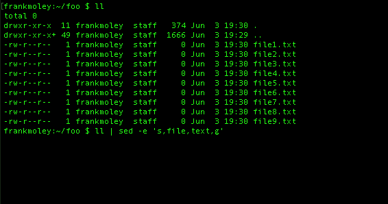
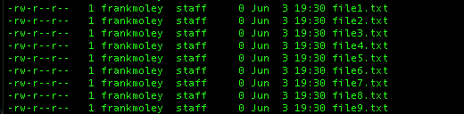
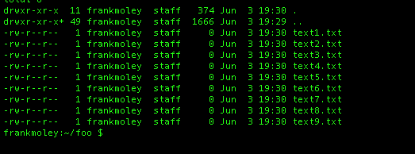
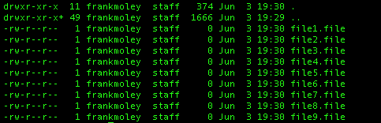

## Bash Assessment

#### Q1. Which of the three methods will copy the directory named "photo dir" recursively from the user's home directory to /backups?

```bash
cp -R "~/photo dir" /backups #method1
cp -R ~"/photo dir" /backups #method2
cp -R ~/"photo dir" /backups #method3
```

- [ ] None of the three methods will expand to the user's home directory. Only using `"$HOME/photo dir"`will be successful.
- [ ] Only method 1 will expand `"~/"` to the user's home directory and then append the quoted directory name that includes a space.
- [ ] Only method 2 will expand `"~/"` to the user's home directory and then append the quoted directory name that includes a space.
- [x] Only method 3 will expand `"~/"` to the user's home directory and then append the quoted directory name that includes a space.

#### Q2. If script.sh is run in the current directory, it will fail. Why?

```bash
$ ls -1
Beach photo1.jpg
Photo1.jpg
Photo2.jpg
Script.sh

$ cat script.sh
for i in $(ls *.jpg); do
	mv $i ${i}.bak
done
```

- [ ] ls: cannot access nonexistentfile: No such file or directory
- [x] The for loop will split on word boundaries and Beach photo1.jpg has a space in it.
- [ ] The mv command will fail because the curly bracket is a special character in Bash and cannot be used in the names of files.
- [ ] Running script.sh will be successful as the ls command builds a list of files in the current directory and for loops through that list renaming files with a .bak extension.

#### Q3. To run a copy command in a subshell, which syntax would you use?

- [x] `( command )`
- [ ] `sh command`
- [ ] `{ command; }`
- [ ] `(( command ))`

#### Q4. Using "awk", what would the output of this command string be?

```bash
echo "1 2 3" | awk '{for (i=1; i<=NF; i++) s=s+$i};END {print s}'
```

- [x] 6
- [ ] 123
- [ ] 3
- [ ] 600

#### Q5. The command below will search the root filesystem for files named "finance.db". In this context, what information is being sent to /dev/null?

```bash
find / -name "finance.db" 1>results.txt 2>/dev/null
```

- [ ] the names of files that do not match finance.db
- [x] information sent to the standard error-for example, errors that the find command displays as it runs
- [ ] the names of files that match finance.db
- [ ] information sent to the standard output-that is, the path to files the find command has located

#### Q6. To permanently remove empty lines from a file called textfile, which command could you use?

- [x] `sed -i '/^$/d' textfile`
- [ ] `sed '/^$/d' textfile`
- [ ] `cat textfile | sed '/^$/d`
- [ ] `sed -i 's/^$//' textfile`

#### Q7. Assuming that user1 existed, what would be the result of this command string?

```bash
awk -F: '/user1/{print $1 "-" $3 "-" $6}' /etc/passwd
```

- [ ] It would show the username, UID, and home directory of user1 separated by colons.
- [ ] It would print the UID, GID, and home directory of user1 separated by hyphens.
- [ ] It would print the UID, comment, and home directory of user1 separated by hyphens.
- [x] It would show the username, UID, and home directory of user1 separated by hyphens.

#### Q8. What happens if you use the `"set -e"` in a Bash script?

- [ ] It will cause Bash to exit if a function or subshell returns a nonzero status code.
- [ ] It will cause Bash to exit if a conditional returns a non-zero status code.
- [ ] It will cause Bash to exit if local, declare, or typeset assignments return a nonzero status code.
- [x] It will cause Bash to exit if a command, list of commands, compound command, or potentially a pipeline returns a nonzero status code.

#### Q9. The **\_\_** keyword pauses the script to get input from standard input.

- [ ] get
- [ ] argument
- [x] read
- [ ] input

#### Q10. If file.sql holds SQL statements to be executed, what will be in file.txt?

```bash
mysql < file.sql > file.txt
```

- [ ] a copy of the contents of file.sql
- [ ] an error indicating that this is invalid syntax
- [ ] the error output of the MySQL command
- [x] the non-error output of the MySQL command

#### Q11. How does the SUID or setuid affect executable commands?

- [ ] When the command creates files, they will be owned by the group owner of the command.
- [ ] The SUID bit allows anyone to execute the command no matter what other permissions are set.
- [x] When the command is executed, its running privileges elevate to the user owner of the command.
- [ ] When the command is executed, its running privileges elevate to the group owner of the command.

#### Q12. In order to extract text from the first column of file called textfile, which command would you use?

- [ ] `cat {$1,textfile}`
- [ ] `cat textfile | awk [print $1]`
- [x] `cat textfile | awk '{print $1}'`
- [ ] `awk textfile {print $1}`

#### Q13. What is the keyboard shortcut to call up the Bash history search as shown below?

```bash
(reverse-i-search)`':
```

- [ ] Esc + R
- [ ] Ctrl + H
- [x] Ctrl + R
- [ ] Alt + R

#### Q14. Which arithmetic expression will give the most precise answer?

- [ ] `var=$( expr 10 / 8 )`
- [ ] `(( var= 10 /8 ))`
- [ ] `var=$(( 10 / 8 ))`
- [x] `var=$(echo 'scale=2; 10 / 8' | bc)`

#### Q15. What is the result of this script?

```bash
txt=Penguins
[[ $txt =~ [a-z]{8} ]]; echo $?
```

- [ ] 0, representing 'true', because the variable "txt" contains eight letters
- [ ] 0, representing 'true', because everybody loves penguins!
- [ ] 1, representing 'false', because the variable "txt" is longer than eight characters
- [x] 1, representing 'false', because the variable "txt" does not contain eight lowercase letters between a and z

#### Q16. How would you change your Bash shell prompt to the following?

```bash
HAL>
```

- [ ] `SHELL="HAL\>"`
- [ ] `SHELL="HAL>"`
- [x] `export PS1="HAL>"`
- [ ] `PS1="HAL\>"`

#### Q17. What is the output of this code?

```bash
VAR="/var/www/html/website.com/html/"
echo "${VAR#*/html}"
```

- [x] `/website.com/html/`
- [ ] `/html/website.com/html/`
- [ ] `/var/www/html/website.com/`
- [ ] Nothing will be echoed on the screen.

#### Q18. If prompted for text at the standard input, you can tell the command you're done entering text with what key combination?

- [ ] Ctrl + A (Windows) or Command + A (Mac)
- [ ] Ctrl + E (Windows) or Command + E (Mac)
- [x] Ctrl + D (Windows) or Command + D (Mac)
- [ ] Ctrl + Z (Windows) or Command + Z (Mac)

#### Q19. In order for a Bash script to be executed like an OS command, it should start with a shebang line. What does this look like?

- [x] `#!/usr/bin/env bash`
- [ ] `~/usr/bin/env bash`
- [ ] `'$!/usr/bin/env bash`
- [ ] `#/usr/bin/env bash`

#### Q20. What line of Bash script probably produced the output shown below?

```bash
The date is: Sun Mar 24 12:30:06 CST 2019!
```

- [ ] `echo "The date is: !"`
- [ ] `echo "The date is: date!"`
- [ ] `echo "The date is: (date)!"`
- [x] `echo "The date is: $(date)!"`

#### Q21. Suppose your current working directory is your home directory. How could you run the script demo.sh that is located in your home directory? Find three correct answers.

```bash
A. /home/demo.sh
B. ./demo.sh
C. ~/demo.sh
D. bash /home/demo.sh
E. bash demo.sh
```

- [x] B, C, E
- [ ] A, B, C
- [ ] C, D, E
- [ ] B, D, E

#### Q22. How could you get a list of all .html files in your tree?

#### Idk both of them work

- [ ] `find . -type html`
- [x] `find . -name *.html`
- [ ] `find *.html`
- [x] `find . -name \*.html -print`

#### Q23. What would be in out.txt?

```bash
cat < in.txt > out.txt
```

- [ ] The output from the command line. By default STDIN comes from the keyboard.
- [ ] Nothing because you can't redirect from file (in.txt) to another file (out.txt). You can only redirect from a command to a file.
- [x] It would be the contents of in.txt.
- [ ] Nothing. The redirect will create a new empty file but there will not be any output from the cat command to redirect.

#### Q24. What does this bash statement do?

```bash
(( $a == $b ))
echo $?
```

- [ ] It loops between the values of `$a` and `$b`.
- [x] It tests whether the values of variables `$a` and `$b` are equal.
- [ ] It returns `$b` if it is larger than `$a`.
- [ ] It returns `$a` if it is larger than `$b`.

#### Q25. What do you use in a case statement to tell Bash that you're done with a specific test?

- [x] `; ;`
- [ ] `: :`
- [ ] `done`
- [ ] `$$`

#### Q26. What does the asterisk represent in this statement?

```bash
<em>#!/usr/bin/env bash</em>
case $num in
	1)
	echo "one"
	; ;
	2)
	echo "two"
	; ;
	*)
	echo "a mystery"
	; ;
esac
```

- [x] a case that matches any value, providing a default option if nothing else catches that value
- [ ] a case only for what happens when the asterisk character is passed into the script
- [ ] the action of all of the other cases combined together
- [ ] an action that is taken for any input, even if it matches a specified condition

#### Q27. What Bash script will correctly create these files?

- [ ] `touch file{1+10}.txt`
- [ ] `touch file{1-10}.txt`
- [x] `touch file{1..10}.txt`
- [ ] `touch file(1..10).txt`

#### Q28. Which variable would you check to verify that the last command executed successfully?

- [ ] `$$`
- [x] `$?`
- [ ] `$!`
- [ ] `$@`

#WARNING!
Start from this question and to Q40 I have a lot of doubts about answers
because in real assessment I get these 12 question + 3 from Q1 to Q28,
and I select other answers in Q29, Q31, Q32, Q35, Q36, Q37, Q39, Q40 and pass it

#### Q29. What is the output of this script?

```bash
#!/bin/bash
fname=john
john=thomas
echo ${!fname}
```

- [ ] `john`
- [x] `thomas`
- [ ] `Syntax error`
- [ ] `blank`

#### Q30. What will be the output of this script?



- [ ] `A` 
- [ ] `B` 
- [x] `C` 
- [ ] `D` 

Here a text based version of Q.30:

```bash
ll
-rw-r--r-- 1 frankmolev staff 374 Jun 3 19:30 .
-rw-r--r-- 1 frankmolev staff 1666 Jun 3 19:30 ..
-rw-r--r-- 1 frankmolev staff 0 Jun 3 19:30 file1.txt
-rw-r--r-- 1 frankmolev staff 0 Jun 3 19:30 file2.txt
..

ll | sed -e 's,file,text,g'

```

- [ ] A

```
  -rw-r--r-- 1 frankmolev staff 374 Jun 3 19:30 .
  -rw-r--r-- 1 frankmolev staff 1666 Jun 3 19:30 ..
  -rw-r--r-- 1 frankmolev staff 0 Jun 3 19:30 file1.file
  -rw-r--r-- 1 frankmolev staff 0 Jun 3 19:30 file2.file
  ..
```

- [ ] B

```
  -rw-r--r-- 1 frankmolev staff 374 Jun 3 19:30 .
  -rw-r--r-- 1 frankmolev staff 1666 Jun 3 19:30 ..
  -rw-r--r-- 1 frankmolev staff 0 Jun 3 19:30 file1.txt
  -rw-r--r-- 1 frankmolev staff 0 Jun 3 19:30 file2.txt
  ..
```

- [ ] C

```
  -rw-r--r-- 1 frankmolev staff 68 Jun 3 19:30 .
  -rw-r--r-- 1 frankmolev staff 1666 Jun 3 19:30 ..
```

- [x] D

```
-rw-r--r-- 1 frankmolev staff 374 Jun 3 19:30 .
-rw-r--r-- 1 frankmolev staff 1666 Jun 3 19:30 ..
-rw-r--r-- 1 frankmolev staff 0 Jun 3 19:30 text1.txt
-rw-r--r-- 1 frankmolev staff 0 Jun 3 19:30 text.txt
..
```

#### Q31. What is wrong with this script?

```bash
#!/bin/bash
read -p "Enter your pet type." PET
if [ $PET = dog ] ;then
    echo "You have a dog"
fi
```

- [ ] `If the value of PET doesn't match dog, the script will return a nonzero status code.`
- [ ] `There is nothing wrong with it. The condition checks the value of PET perfectly.`
- [x] `It will fail if the user hits the Enter (Return) key without entering a pet name when prompted.`
- [ ] `The then statement needs to be on a separate line.`

#### Q32. How can you gather history together for multiple terminals?

- [ ] `It just works by default.`
- [ ] `history --shared`
- [ ] `history --combined`
- [x] `shopt -s histappend`

#### Q33. What is the difference between the $@ and $\* variables?

- [x] `$@ treats each quoted argument as a separate entity. $* treats the entire argument string as one entity.`
- [ ] `$* treats each quoted argument as a separate entity. $@ treats the entire argument string as one entity.`
- [ ] `$* is used to count the arguments passed to a script, $@ provides all arguments in one string.`
- [ ] `$* is the wildcard that includes all arguments with word splitting, $@ holds the same data but in an array.`

#### Q34. Which command is being run in this script to check if file.txt exists?

```bash
if [ -f file.txt ]; then
    echo "file.txt exists"
fi
```

- [ ] `/usr/bin/test`
- [ ] `/usr/bin/[`
- [x] `the built-in [ command`
- [ ] `/usr/bin/[[`

#### Q35. What will be the output of this script?

```bash
#!/bin/bash
Linux=('Debian' 'Redhat' 'Ubuntu' 'Android' 'Fedora' 'Suse')
x=3

Linux=(${Linux[@]:0:$x} ${Linux[@]:$(($x + 1))})
echo "${Linux[@]}"
```

- [ ] `Debian Redhat Ubuntu Android Fedora Suse`
- [ ] `Android`
- [ ] `Fedora Suse`
- [x] `Debian Redhat Ubuntu Fedora Suse`

#### Q36. Which file allows you to save modifications to the shell environment across sessions?

- [ ] `/etc/bash.conf`
- [x] `~/.profile`
- [ ] `/etc/bashprofile`
- [ ] `~/profile`

#### Q37. Given the listed permissions on data.txt is it possible that user2 could have read, write, and execute permissions on data.txt?

```bash
$ ls -l
total 0
-rwx------+ 1 user1 user1 0 Oct 27 10:54 data.txt
```

- [ ] `No, it's clear that user2 does not have read, write, and execute permissions.`
- [x] `Yes, the + at the end of the 10-digit permission string signifies there's an access control list. This could possibly give user2 permissions not visible by ls -l.`
- [ ] `It's possible that SELinux provides read, write, and execute permissions for user2 which are not visible with ls -l.`
- [ ] `Yes, the + at the end of the 10-digit permission string signifies there's an extended attribute set. This could give user2 permissions to read, write, and execute data.txt.`

#### Q38. What does this script accomplish?

```bash
#!/bin/bash
declare -A ARRAY=([user1]=bob [user2]=ted [user3]=sally)
KEYS=(${!ARRAY[@]})

for (( i=0; $i < ${#ARRAY[@]}; i+=1 ));do
        echo ${KEYS[$i]} - ${ARRAY[${KEYS[$i]}]}
done
```

- [ ] `It sorts the associative array named ARRAY and stores the results in an indexed array named KEYS. It then uses this sorted array to loop through the associative array ARRAY.`
- [x] `Using a C-style for loop, it loops through the associative array named ARRAY using the associative array's keys and outputs both the key and values for each item.`
- [ ] `It creates an indexed array of the associative array named ARRAY. It then uses a C-style for loop and the indexed array to loop through all items in the associative array, outputting the key and value of each array item using the index number.`
- [ ] `It creates an associative array named ARRAY, which it loops through using a C-style for loop and the index numbers of each item in the associative array's keys, outputting the value of each item.`

#### Q39. What file would match the code below?

```bash
ls Hello[[.vertical-line.]]World
```

It's matches also `Hello[[.vertical-line.]]World` file but if we have this and `Hello|World` file will always be matched last one

- [ ] `Nothing, this is an invalid file glob.`
- [ ] `Hello.vertical-line.World`
- [ ] `Hello[[.vertical-line.]]World`
- [x] `Hello|World`

#### Q40. What will be in out.txt?

```bash
ls nonexistentfile | grep "No such file" > out.txt
```

- [ ] `No such file`
- [ ] `ls: cannot access nonexistentfile: No such file or directory`
- [x] `Nothing, out.txt will be empty.`
- [ ] `It will be the contents of nonexistentfile.`

#### Q41. For the script to print "Is numeric" on screen, what would the user have to enter when prompted?

```bash
#!/bin/bash
read -p "Enter text " var
if [[ "$var" =~ "^[0-9]+$" ]];then
    echo "Is numeric"
else
    echo "Is not numeric"
fi
```

- [x] Any sequence of characters that includes an integer
- [ ] The user would have to enter the character sequence of `^[0-9]]+$` Only this will prove to be true and "Is numeric" would be printed on the screen due to incorrect syntax. By encapsulating the regular expression in double quotes every match will fail except the text string `^[0-9]+$`
- [ ] One or more characters that only includes integers
- [ ] Due to a syntax error it is impossible to get the script to print "Is numeric"

#### Q42. What will be the difference between the output on the screen and the contents of out.txt

```bash
mysql < file.sql > out.txt
```

- [ ] The output on the screen will be identical to out.txt
- [x] There will be no output on the screen as it's being redirected to out.txt.
- [ ] The output on the screen will be identical to out.txt plus line numbers.
- [ ] The out.txt file will hold STDERR and STDOUT will go to the screen.

#### Q43. How would you find the last copy command run in your history?

- [ ] history | find cp
- [x] history | grep cp
- [ ] grep cp history
- [ ] cp history

#### Q44. In order to write a script that iterates through the files in a directory, which of the following could you use?

- [ ] `bash for i in $(ls); do ... done`
- [ ] `bash for $(ls); do ... done`
- [x] `bash for i in $ls; do ... done`
- [ ] `bash for $ls; do ... done`

#### Q45 When executing a command and passing the output of that command to another command, which character allows you to chain these commands together?

- [x] |
- [ ] ->
- [ ] \#
- [ ] @

#### Q46. In the script shown below, what is **greeting**?

```bash
<em>#!/usr/bin/env bash</em>
greeting="Hello"
echo $greeting, everybody!
```

- [ ] a command
- [ ] a loop
- [ ] a parameter
- [x] a vairable

#### Q47. Which statement checks whether the variable num is greater than five?

- [ ] (( \$num -gt 5 ))
- [ ] [[$num -lt 5]]
- [x] (( \$num > 5 ))
- [ ] \$num > 5

#### Q48. Using Bash extended globbing, what will be the output of this command?

```bash
$ ls -l
apple
banana
bananapple
banapple
pineapple
strawberry
$ shopt -s extglob
$ ls -l @(ba*(na)|a+(p)le)
```

- [x] a

```bash
apple
banana
```

- [ ] b

```bash
apple
banana
bananapple
banapple
pineapple
strawberry
```

- [ ] c

```bash
apple
banana
bananappple
banapple
pineapple
```

- [ ] d

```bash
apple
banana
bananapple
banapple
pineapple
```

#### Q49. When used from within a script, which variable contains the name of the script?

- [x] \$0
- [ ] \$# // number of positional parameters
- [ ] \$\$ // pid of the current shell
- [ ] \$@ // array-like construct of all positional parameters

#### Q50. What does the + signify at the end of the 10-digit file permissions on data.txt?

```bash
ls -l
-rwx------+ 1 user1 u1 0 Oct 1 10:00 data.txt
```

- [ ] There is an SELinux security context
- [ ] The sticky bit is set and the file will stay in RAM for speed
- [x] There is an access control list
- [ ] There is an extended attribute such as immutable set

#### Q51. In Bash, what does the comment below do?

```bash
cd -
```

- [x] It moves you to the directory you were previously in.
- [ ] It moves you to your home folder (whatever your current working directory happens to be).
- [ ] It deletes the current directory
- [ ] It moves you one directory above your current working directory.

Training questions

#### Q1. What does this command do?

```bash
cat > notes -
```

- [x] Accepts text from standard input and places it in "notes"
- [ ] Creates "notes" and exits
- [ ] Outputs the content of notes and deletes it
- [ ] Appends text to the existing "notes"

#### Q2. What is the output of:

```bash
VAR="This old man came rolling"
echo "\${VAR//man/rolling}"
```

- [x] This old rolling came rolling
- [ ] This old man came man
- [ ] This old man came rolling
- [ ] This old came
