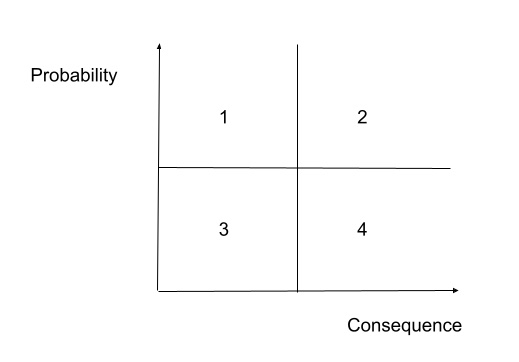

## Cybersecurity Assessment

#### Q1. According to the shared responsibility model, which cloud computing model places the most responsibility on the cloud service provider (CSP)?

- [ ] Hybrid Cloud
- [x] Software as a Service (SaaS)
- [ ] Platform as a Service (PaaS)
- [ ] Infrastructure as a Service (IaaS)

#### Q2. Which option removes the risk of multitenancy in cloud computing?

- [ ] PaaS
- [ ] public cloud
- [x] private cloud
- [ ] IaaS

#### Q3. Your organization recently implemented a unified messaging solution and VoIP phones on every desktop. You are responsible for researching the vulnerabilities of the VoIP system. Which type of attack are VoIP phones most vulnerable to experiencing?

- [x] denial-of-service
- [ ] brute force attacks
- [ ] malware
- [ ] buffer overflow

#### Q4. Which security control cannot produce an active response to a security event?

- [ ] cloud access security broker (CASB)
- [ ] intrusion prevention system (IPS)
- [x] intrusion detection system (IDS)
- [ ] next generation firewall

**Explanation**: An intrusion detection system (`IDS`) is a device or software application that monitors a network or systems for malicious activity or policy violations.

[Quizlet](https://quizlet.com/217188159/cissp-practice-testschapter-7-security-operations-domain7-flash-cards/)

#### Q5. Packet sniffer is also called **\_**.

- [ ] SIEM
- [ ] UTM
- [x] protocol analyzer
- [ ] data sink

#### Q6. Which option tests code while it is in operation?

- [ ] code review
- [ ] code analysis
- [ ] static analysis
- [x] dynamic analysis

#### Q7. Which option describes testing that individual software developers can conduct on their own code?

- [ ] gray box testing
- [ ] integration testing
- [ ] white box testing
- [x] unit testing

#### Q8. In black box penetration testing, what information is provided to the tester about the target environment?

- [x] none
- [ ] limited details of server and network infrastructure
- [ ] all information
- [ ] limited details of server infrastructure

#### Q9. Which security control can best protect against shadow IT by identifying and preventing use of unsanctioned cloud apps and services?

- [ ] intrusion prevention system (IPS)
- [ ] next generation firewall
- [x] cloud access security broker (CASB)
- [ ] intrusion detection system (IDS)

#### Q10. Which option describes the best defense against collusion?

- [ ] monitoring of normal employee system and data access patterns
- [ ] applying system and application updates regularly
- [ ] fault tolerant infrastructure and data redundancy
- [x] separation of duties and job rotation

[Stack Exchange](https://security.stackexchange.com/a/114835/249930)

#### Q11. During a penetration test, you find a file containing hashed passwords for the system you are attempting to breach. Which type of attack is most likely to succeed in accessing the hashed passwords in a reasonable amount of time?

- [x] rainbow table attack
- [ ] pass-the-hash attack
- [ ] password spray attack
- [ ] brute force attack

**Explanation**: A rainbow table attack is a more efficient and effective way of cracking many hashed passwords, whereas brute-forcing would take much longer and may not complete in a reasonable amount of time.

[Professor Messer](https://www.professormesser.com/free-a-plus-training/220-1002/brute-force-attacks-3).

#### Q12. Which area is DMZ?

- [ ] 4
- [ ] 1
- [x] 2
- [ ] 3

#### Q13. You configure an encrypted USB drive for a user who needs to deliver a sensitive file at an in-person meeting. What type of encryption is typically used to encrypt the file?

- [ ] file hash
- [ ] asymmetric encryption
- [ ] digital signature
- [x] symmetric encryption

#### Q14. What is the difference between DRP and BCP

- [x] DRP works to keep a business up and running despite a disaster. BCP works to restore the original business capabilities.
- [ ] BCP works to keep a business up and running despite a disaster. DRP works to restore the original business capabilities.
- [ ] BCP is part of DRP.
- [ ] DRP is part of BCP.

#### Q15. Which aspect of cybersecurity do Distributed Denial of Service (DDoS) attacks affect the most?

- [ ] non-repudiation
- [ ] integrity
- [x] availability
- [ ] confidentiality

#### Q16. You need to recommend a solution to automatically assess your cloud-hosted VMs against CIS benchmarks to identify deviations from security best practices. What type of solution should you recommend?

- [x] Cloud Security Posture Management (CSPM)
- [ ] Intrusion Detection and Prevention System (IDPS)
- [ ] Cloud Workload Protection Platforms (CWPP)
- [ ] Cloud Access Security Brokers (CASBs)

#### Q17. **\_** validates the integrity of data files.

- [ ] Compression
- [x] Hashing
- [ ] Symmetric encryption
- [ ] Stenography

#### Q18. Which is an example of privacy regulation at the state government level in the U.S.?

- [x] CCPA
- [ ] GDPR
- [ ] NIST Privacy Framework
- [ ] OSPF

#### Q19. what is the term for the policies and technologies implemented to protect, limit, monitor, audit, and govern identities with access to sensitive data and resources?

- [x] identity and access management (IAM)
- [ ] privileged account management (PAM)
- [ ] authentication and authorization
- [ ] least privilege

#### Q20. You have configured audit settings in your organization's cloud services in the event of a security incident. What type of security control is an audit trail?

- [ ] preventive control
- [ ] detective control
- [ ] directive control
- [x] corrective control

#### Q21. What is the name for a short-term interruption in electrical power supply?

- [ ] grayout
- [x] blackout
- [ ] brownout
- [ ] whiteout

#### Q22. Your security team recommends adding a layer of defense against emerging persistent threats and zero-day exploits for all endpoints on your network. The solution should offer protection from external threats for network-connected devices, regardless of operating system. Which solution is best suited to meet this requirement?

- [ ] Security Information Event Management (SIEM)
- [ ] Extended Detection and Response (XDR)
- [x] next generation firewall (NGFW)
- [ ] Cloud App Security Broker (CASB)

#### Q23. Which is _not_ a threat modeling methodology?

- [ ] TRIKE
- [x] TOGAF
- [ ] STRIDE
- [ ] MITRE ATT&CK

#### Q24. You organization is conducting a pilot deployment of a new e-commerce application being considered for purchase. You need to recommend a strategy to evaluate the security of the new software. Your organization does not have access to the application's source code.

#### Which strategy should you choose?

- [x] dynamic application security testing
- [ ] unit testing
- [ ] white box testing
- [ ] static application security testing

#### Q25. You need to disable the camera on corporate devices to prevent screen capture and recording of sensitive documents, meetings, and conversations. Which solution would be be suited to the task?

- [x] Mobile Device Management (MDM)
- [ ] Data Loss Prevention (DLP)
- [ ] Intrusion Detection and Prevention System (IDPS)
- [ ] Cloud Access Security Broker (CASB)

#### Q26. How many keys would be necessary to accomodate 100 users in an asymmetric cryptography system?

- [x] 200
- [ ] 400
- [ ] 100
- [ ] 300

**Explanation**: The formula for asymmetric encryption is `2n`; where `n` is the number of communicating parties.

#### Q27. Two competing online retailers process credit card transactions for customers in countries on every continent. One organization is based in the United States. The other is based in the Netherlands. With which regulation must both countries comply while ensuring the security of these transactions?

- [ ] Federal Information Security Managment Act (FISMA)
- [x] Payment Card Industry Data Security Standard (PCI-DSS)
- [ ] General Data Protection Regulation (GDPR)
- [ ] International Organization for Standardization and International Electrotechnical Commission (ISO/IEC 27018)

**Explanation**: The Payment Card Industry Data Security Standard (`PCI DSS`) is the global card industry security standard that is **required of all entities** that store, process, or transmit cardholder data, including financial institutions, online retailers and service providers.

[PCI Security Overview](https://www.pcisecuritystandards.org/pci_security/standards_overview)

#### Q28. What provides a common language for describing security incidents in a structures and repeatable manner?

- [ ] Common event format
- [ ] common weakness enumeration
- [x] common vulnerabilties and exposures
- [ ] common vulnerability scoring system

**Explanation**: The Common Vulnerabilities and Exposures (`CVE`) system provides a reference-method for publicly known information-security vulnerabilities and exposures.

#### Q29. Which type of application can intercept sensative information such as passwoprds on a network segment?

- [ ] log server
- [ ] network scanner
- [ ] firewall
- [x] protocol analyzer

**Explanation**: A `protocol analyzer` is a tool used to capture and analyze signals and data traffic over a communication channel.

[WireShark](https://www.wireshark.org) is a protocol analyzer.

#### Q30. An attacker has discovered that they can deduce a sensitive piece of confidential information by analyzing multiple pieces of less sensitive public data. What type of security issue exists?

- [ ] aggregation
- [x] inference
- [ ] SQL injection
- [ ] cross-origin resouce sharing

**Explanation**: An `Inference Attack` is a data mining technique performed by analyzing data in order to illegitimately gain knowledge about a subject or database. A subject's sensitive information can be considered as leaked if an adversary can infer its real value with a high confidence. **Source**: ([Wikipedia](https://en.wikipedia.org/wiki/Inference_attack)).

#### Q31. What act grants an authenticated party permission to perform an action or access a resource?

- [ ] Zero Trust Security
- [ ] Role-Based Access Control (RBAC)
- [x] authorization
- [ ] Single Sign-On

[Okata.com](https://www.okta.com/identity-101/authentication-vs-authorization/)

#### Q32. According to GDPR, a data \_ is the person about whom data is being collected.

- [ ] processor
- [ ] object
- [x] subject
- [ ] controller

[Intersoft Consulting](https://gdpr-info.eu/art-4-gdpr/)

#### Q33. Which is not a principle of zero trust security?

- [ ] use least privilege access
- [ ] verify explicitly
- [x] trust but verify
- [ ] assume breach

**Explanation**: zero trust assumes that the system will be breached and designs security as if there is no perimeter. Hence, don’t trust anything by default.

[NIST](https://www.nist.gov/blogs/taking-measure/zero-trust-cybersecurity-never-trust-always-verify)

#### Q34. Which attack exploits input validation vulnerabilities?

- [ ] ARP spoofing
- [ ] pharming attacks
- [x] cross-site scripting (XSS)
- [ ] DNS poisoning

[White Hat Sec](https://www.whitehatsec.com/glossary/content/input-validation)

#### Q35. You are a security analyst, and you receive a text message alerting you of a possible attack. Which security control is the _least_ likely to produce this type of alert?

- [ ] IDS
- [ ] SIEM
- [x] packet sniffer
- [ ] IPS

#### Q36. SQL injection inserts a code fragment that makes a database statement universally true, like **\_**.

- [ ] `SELECT * FROM users WHERE username = " AND 1=1--'`
- [ ] `SELECT * FROM users WHERE username = " AND 1!=1--'`
- [x] `SELECT * FROM users WHERE username = " OR 1=1--'`
- [ ] `SELECT * FROM users WHERE username = " OR 1!=1--'`

#### Q37. Which type of security assessment requires access to source code?

- [x] static analysis
- [ ] black box testing
- [ ] dynamic analysis
- [ ] penetration testing

#### Q38. Which option is an open-source solution to scanning a network for active hosts and open ports?

- [ ] Autopsy
- [ ] Snort
- [x] Nmap
- [ ] Wireshark

**Explanation**: nmap is a port scanner [https://en.wikipedia.org/wiki/Nmap](https://en.wikipedia.org/wiki/Nmap)
wireshark is a traffic analyzer
snort is an IDS
autopsy is for forensic analysis

#### Q39. When implementing a data loss prevention (DLP) strategy, what is the first step in the process?

- [x] Evaluate the features of available DLP products to determine which best meet your organizations's needs.
- [ ] Examine the flow of sensitive data in your organization to better understand usage patterns.
- [ ] Conduct an inventory of all the data in your organization to establish classifications based on sensitivity.
- [ ] Conduct a risk assessment to determine the best data labeling strategy for your organization.

#### Q40. Which malware changes an operating system and conceals its tracks?

- [ ] virus
- [ ] worm
- [x] rootkit
- [ ] Trojan horse

#### Q41. Virtual Private Networks (VPNs) use **\_** to create a secure connection between two networks.

- [x] encryption
- [ ] a metropolitan area network
- [ ] a virtual local area network
- [ ] a wide area network

#### Q42. What is the process of challenging a user to prove their identity?

- [x] authentication
- [ ] Single Sign-On
- [ ] authorization
- [ ] Role-Based Access Control (RBAC)

#### Q43. Which cyberattack aims to exhaust an application's resources, making the application unavailable to legitimate users?

- [ ] SQL injection
- [ ] dictionary attack
- [x] Distributed Denial of Service (DDoS)
- [ ] rainbow table attack

#### Q44. You are a recent cybersecurity hire, and your first assignment is to present on the possible threats to your organization. Which of the following best describes the task?

- [ ] risk mitigation
- [ ] threat assessment
- [x] risk management
- [ ] enumeration

#### Q45. You are at a coffee shop and connect to a public wireless access point (WAP). What a type of cybersecurity attack are you most likely to experience?

- [x] man-in-the-middle attack
- [ ] back door
- [ ] logic bomb
- [ ] virus

#### Q46. You have been tasked with recommending a solution to centrally manage mobile devices used throughout your organization. Which technology would best meet this need?

- [ ] Extended Detection and Responde (XDR)
- [ ] Security Information Event Management (SIEM)
- [ ] Intrusion Detection and Prevention System (IDPS)
- [x] Mobile Device Management (MDM)

#### Q47. Which type of vulnerability cannot be discovered in the course of a typical vulnerability assessment?

- [ ] file permissions
- [ ] buffer overflow
- [x] zero-day vulnerability
- [ ] cross-site scripting

#### Q48. The DLP project team is about to classify your organization's data. Whats is the primary purpose of classifying data?

- [ ] It identifies regulatory compliance requirements.
- [ ] It prioritizes IT budget expenditures.
- [x] It quantifies the potential cost of a data breach.
- [ ] It establishes the value of data to the organization.

#### Q49. You are responsible for managing security of your organization's public cloud infrastructure. You need to implement security to protect the data and applications running in a variety of IaaS and PaaS services, including a new Kubernetes cluster. What type of solution is best suited to this requirement?

- [ ] Cloud Workload Protection Platforms (CWPP)
- [ ] Cloud Security Posture Management (CSPM)
- [x] Cloud Access Security Brokers (CASBs)
- [ ] Intrusion Detection and Prevention System (IDPS)

#### Q50. Sharing account credentials violates the **\_** aspect of access control.

- [ ] identification
- [x] authorization
- [ ] accounting
- [ ] authentication

#### Q51. You have recovered a server that was compromised in a malware attack to its previous state. What is the final step in the incident response process?

- [ ] Eradication / Remediation
- [ ] Certification
- [ ] Reporting
- [x] Lessons Learned

#### Q52. Which encryption type uses a public and private key pair for encrypting and decrypting data?

- [x] asymmetric
- [ ] symmetric
- [ ] hashing
- [ ] all of these answers

#### Q53. You have just identified and mitigated an active malware attack on a user's computer, in which command and control was established. What is the next step in the process?

- [ ] Reporting
- [ ] Recovery
- [x] Eradiction / Remediation
- [ ] Lessons Learned

[Explanation: Pages 29 to 31 ->](https://nvlpubs.nist.gov/nistpubs/specialpublications/nist.sp.800-83r1.pdf)

#### Q54. Which programming language is most susceptible to buffer overflow attacks?

- [x] C
- [ ] Java
- [ ] Ruby
- [ ] Python

#### Q55. Which list correctly describes risk management techniques?

- [ ] risk acceptance, risk mitigation, risk containment, and risk qualification
- [ ] risk avoidance, risk transference, risk containment, and risk quantification
- [ ] risk avoidance, risk mitigation, risk containment, and risk acceptance
- [x] risk avoidance, risk transference, risk mitigation, and risk acceptance

#### Q56. To implement encryption in transit, such as with the HTTPS protocol for secure web browsing, which type(s) of encryption is/are used?

- [ ] asymmetric
- [x] both symmetric and asymmetric
- [ ] neither symmetric or asymmetric
- [ ] symmetric

#### Q57. Which type of program uses Windows Hooks to capture keystrokes typed by the user, hides in the process list, and can compromise their system as well as their online access codes and password?

- [ ] trojan
- [ ] keystroke collector
- [ ] typethief
- [x] keylogger

#### Q58. How does ransomware affect a victim's files?

- [ ] by destroying them
- [x] by encrypting them
- [ ] by stealing them
- [ ] by selling them

#### Q59. Your computer has been infected, and is sending out traffic to a targeted system upon receiving a command from a botmaster. What condition is your computer currently in?

- [ ] It has become a money mule.
- [x] It has become a zombie.
- [ ] It has become a bastion host.
- [ ] It has become a botnet.

#### Q60. You choose a cybersecurity framework for your financial organization that implements an effective and auditable set of governance and management processes for IT. Which framework are you choosing?

- [ ] C2M2
- [x] NIST SP 800-37
- [ ] ISO/IEC 27001
- [ ] COBIT

#### Q61. NIST issued a revision to SP 800-37 in December 2018. It provides a disciplined, structured, and flexible process for managing security and privacy risk. Which type of document is SP 800-37?

- [x] a risk management framework
- [ ] a guide to risk assessments
- [ ] a guideline for vulnerability testing
- [ ] a step-by-step guide for performing business impact analyses

#### Q62. The most notorious military-grade advanced persistent threat was deployed in 2010, and targeted centrifuges in Iran. What was this APT call?

- [ ] duqu
- [ ] agent BTZ
- [x] stuxnet
- [ ] flame

#### Q63. Where would you record risks that have been identified and their details, such as their ID and name, classification of information, and the risk owner?

- [ ] in the risk assessment documentation
- [x] in the risk register
- [ ] in the business impact ledger
- [ ] in the Orange Book

#### Q64. To prevent an incident from overwhelming resources, \_ is necessary.

- [ ] disconnection from the network
- [x] early containment
- [ ] continuation of monitoring for other incidents
- [ ] eradication of the issues

#### Q65. FUD is expensive and often causes high drama over low risk. Which computer chip exploits were reported by CNN as needing to be completely replaced, but were later fixed with firmware updates?

- [ ] fire and ice exploits
- [x] meltdown and spectre exploits
- [ ] Intel and STMicro CPU exploits
- [ ] super microboard and Apple iPhone exploits

#### Q66. The ASD Top Four are application whitelisting, patching of applications, patching of operating systems, and limiting administrative privileges. What percent of breaches do these account for?

- [ ] 40 percent
- [ ] 60 percent
- [x] 85 percent
- [ ] 100 percent

#### Q67. You are working in the security operations center analyzing traffic on your network. You detect what you believe to be a port scan. What does this mean?

- [ ] This could be a specific program being run by your accounting department.
- [ ] This is an in-progress attack and should be reported immediately
- [ ] This is normal operation for your business.
- [x] This could be a precursor to an attack.

#### Q68. How often is the ISF Standard of Good Practice updated?

- [x] annual
- [ ] biannually
- [ ] bimonthly
- [ ] monthly

#### Q69. Your incident response team is unable to contain an incident because they lack authority to take action without management approval. Which critical step in the preparation phase did your team skip?

- [ ] From an incident response committee to oversee any incidents that may occur.
- [x] Get preauthorized to take unilateral action and make or direct emergency changes.
- [ ] Bring management in as leadership on the incident response team.
- [ ] Assign a head of the emergency response team who has the correct authority

#### Q70. NIST SP 800-53 is one of two important control frameworks used in cybersecurity. What is the other one?

- [ ] ISO 27001
- [ ] NIST SP 800-54
- [x] ISO 27002
- [ ] NIST SP 751-51

#### Q71. Which organization, established by NIST in 1990, runs workshops to foster coordination in incident prevention, stimulate rapid reaction to incidents, and allow experts to share information?

- [x] Forum of Incident Response and Security Teams
- [ ] Crest UK Response Teams
- [ ] Community of Computer Incident Response Teams
- [ ] NIST Special Publication 800-61 Response Teams

#### Q72. You have implemented controls to mitigate the threats, vulnerabilities, and impact to your business. Which type of risk is left over?

- [ ] inherent risk
- [x] residual risk
- [ ] applied risk
- [ ] leftover risk

[Explanation](https://www.sans.org/brochure/course/information-security-risk-management/226)

#### Q73. There are four possible treatments once an assessment has identified a risk. Which risk treatment implements controls to reduce risk?

- [x] risk mitigation
- [ ] risk acceptance
- [ ] risk avoidance
- [ ] risk transfer

#### Q74. Which security control scheme do vendors often submit their products to for evaluation, to provide an independent view of product assurance?

- [x] Common Criteria
- [ ] risk management certification board
- [ ] OWASP security evaluation
- [ ] ISO 27000

#### Q75. Which organization has published the most comprehensive set of controls in its security guideline for the Internet of Things?

- [ ] IoT ISACA
- [x] IoT Security Foundation
- [ ] OWASP
- [ ] GSMA

#### Q76. Which main reference coupled with the Cloud Security Alliance Guidance comprise the Security Guidance for Critical Areas of Focus in Cloud Computing?

- [ ] ISO 27001
- [ ] ISO 27017
- [ ] Cloud Security Guidelines
- [x] Cloud Controls Matrix

[Explanation](https://www.cybersaint.io/blog/six-steps-of-the-nist-risk-management-framework)

#### Q77. What are the essential characteristics of the reference monitor?

- [ ] It is versatile, accurate, and operates at a very high speed.
- [x] It is tamper-proof, can always be invoked, and must be small enough to test.
- [ ] It is restricted, confidential, and top secret

#### Q78. According to NIST, what is the first action required to take advantage of the cybersecurity framework?

- [x] Identify the key business outcomes.
- [ ] Understand the threats and vulnerabilities.
- [ ] Conduct a risk assessment.
- [ ] Analyze and prioritize gaps to create the action plan.

[Explanation](https://www.cybersaint.io/blog/six-steps-of-the-nist-risk-management-framework)

#### Q79. You are implementing a cybersecurity program in your organization and want to use the "de facto standard" cybersecurity framework. Which option would you choose?

- [ ] the ISACA Cybersecurity Framework
- [ ] the COBIT Cybersecurity Framework
- [ ] the ISC2 Cybersecurity Framework
- [x] the NIST Cybersecurity Framework

#### Q80. In 2014, 4,278 IP addresses of zombie computers were used to flood a business with over one million packets per minute for about one hour. What is this type of attack called?

- [ ] a salami attack
- [ ] a DoS (Denial of Service) attack
- [x] a DDoS (Distributed Denial of Service) attack
- [ ] a botnet attack

[Explanation](https://www.forbes.com/sites/parmyolson/2014/11/20/the-largest-cyber-attack-in-history-has-been-hitting-hong-kong-sites/?sh=56e071cd38f6)

#### Q81. The regulatory requirements for notifications of data breaches, particularly the European General Data Protection Regulations, have had what sort of effect on business?

- [x] an increased business liability in the event of a data breach
- [ ] an increased consumer liability in the event of a data breach
- [ ] a decreased consumer liability in the event of a data breach
- [ ] a decreased business liability in the event of a data breach

#### Q82. Which compliance framework governs requirements for the U.S. healthcare industry?

- [ ] FedRAMP
- [ ] GDPR
- [ ] PCI-DSS
- [x] HIPAA

[Explanation](https://online.maryville.edu/blog/5-important-regulations-in-united-states-healthcare/)

#### Q83. What is the difference between DevOps and DevSecOps?

- [x] DevSecOps requires the inclusion of cybersecurity engineers in the CI/CD process of DevOps.
- [ ] DevSecOps slows down the CI/CD process of DevOps.
- [ ] DevSecOps places security controls in the CI/CD process of DevOps.
- [ ] DevSecOps lets cybersecurity engineers dictate the CI/CD process of DevOps.

[Explanation](https://www.linkedin.com/learning/devops-foundations-devsecops/introduction-to-devsecops)

#### Q84. When does static application security testing require access to source code?

- [x] always
- [ ] only when assessing regulatory compliance
- [ ] only if following the Agile model
- [ ] never

[Explanation:](https://www.synopsys.com/glossary/what-is-sast.html)

#### Q85. Your organization service customer orders with a custom ordering system developed in-hose. You are responsible for recommending a cloud model to meet the following requirements:

    Control of security required for regulatory compliance
    Legacy application and database support
    Scalability to meet seasonal increases in demand

Which cloud model is the best option for these requirements?

- [ ] government cloud
- [ ] public cloud
- [x] hybrid cloud
- [ ] private cloud

#### Q86. You have just conducted a port scan of a network. There is no well-known port active. How do you find a webserver running on a host, which uses a random port number?

- [ ] Give up on the current target network and move on to the next one.
- [ ] Switch to another network scanning tool. Resort to more resource-intensive probing, like launching random attacks to all open ports.
- [ ] Turn on the stealth mode in your network scanning tool. Check whether you missed any other active ports associated with web servers.
- [x] Turn on additional options in your network scanning tool to further investigate the details (type and version) of applications running on the rest of the active ports.

#### Q87. Executives in your organization exchange emails with external business partners when negotiating valuable business contracts. To ensure that these communications are legally defensible, the security team has recommended that a digital signature be added to these message.

What are the primary goals of the digital signature in this scenario? (Choose the best answer.)

- [x] integrity and non-repudiation
- [ ] privacy and non-repudiation
- [ ] privacy and confidentiality
- [ ] integrity and privacy

#### Q88. Which option is a mechanism to ensure non-repudiation?

- [ ] MD5
- [ ] Caesar cipher
- [ ] symmetric-key encryption
- [x] asymmetric-key encryption

[Explanation:](https://medium.com/geekoffee/ensuring-integrity-authenticity-and-non-repudiation-in-data-transmission-using-node-js-af73c2404153)

#### Q89. Which software development lifecycle approach is most compatible with DevSecOps?

- [x] Agile
- [ ] Model-Driven Development
- [ ] Waterfall
- [ ] Model-Driven Architecture

#### Q90. Which information security principle states that organizations should defend systems against any particular attack using several independent methods?

- [ ] separation of duties
- [ ] privileged account management (PAM)
- [x] defense-in-depth
- [ ] least privilege

[Explanation:](<https://en.wikipedia.org/wiki/Defense_in_depth_(computing)>)

#### Q91. Which option describes a core principle of DevSecOps?

- [x] Testing and release should be 100% automated
- [ ] Role separation is the key to software security
- [ ] Final responsibility for security rests with the architect of the application
- [ ] Everyone in the process is responsible for security

#### Q92. You need to implement a solution to protect internet-facing applications from common attacks like XSSm CSRF, and SQL injection. Which option is best suited to the task?

- [ ] Security Information Event Management (SIEM)
- [ ] an Instruction Detection and Prevention System (IDPS) appliance
- [x] a web application firewall (WAF)
- [ ] a stateful packet inspection firewall

#### Q93. Which phase of the incident response process happens immediately following identification?

- [ ] Eradication / Remediation
- [x] Reporting
- [ ] Containment / Mitigation
- [ ] Recovery

#### Q94. How can a data retention policy reduce your organization's legal liability?

- [ ] by reducing DLP licensing costs
- [x] by ensuring that data is not retained beyond its necessary retention date
- [ ] by destroying data that may implicate company executives in dishonest behavior
- [ ] by reducing cost associated with data storage and protection

#### Q95. You believe a recent service outage due to a denial-of-service attack from a disgruntled inside source. What is the name for the malicious act this employee has committed?

- [ ] espionage
- [x] sabotage
- [ ] fraud
- [ ] confidentiality breach

#### Q96. Which option is a framework widely utilized by organizations in the development of security governance standards?

- [ ] Software Capability Maturity Model (SW-CMM)
- [x] Control Objectives for Information and Related Technologies (COBIT)
- [ ] The Open Group Architecture Framework (TOGAF)
- [ ] Software Development Life Cycle (SDLC)

#### Q97. There are connection-oriented and connectionless protocols in networking. What do web browsers use to ensure the integrity of the data it sends and receives?

- [ ] UDP that is connection-oriented
- [x] TCP that is connection-oriented
- [ ] UDP that is connectionless
- [ ] TCP that is connectionless

#### Q98. Which type of attack targets vulnerabilities associated with translating MAC addresses into IP addresses in computer networking?

- [ ] DNS poisoning
- [ ] CRL trapping
- [x] ARP spoofing
- [ ] DDoS

#### Q99. You are part of an incident response team at your company. While sifting through log files collected by a SIEM, you discover some suspicious log entries that you want to investigate further. Which type of the following best refers to those recorded activities demanding additional scrutiny?

- [ ] attack
- [ ] information
- [ ] threat
- [x] event

#### Q100. You are responsible for forensic investigations in your organization.You have been tasked with investigating a compromised virtual application server. Becase a revenue generating application runs on the server, the server needs to be returned to service as quickly as possible.

What is the next step you should take to best fulfill your responsibilities and meet the needs of the business?

- [ ] Restore the server from backup immediately.
- [ ] Take the server offline until your investigation is complete.
- [x] Take a snapshot of the compromised virtual server for your investigation.
- [ ] Restart the server. Remediate the issue after business hours.

#### Q101. Site-to-site VPN provides access from one network address space (192.168.0.0/24) to another network address space _ site-to-site VPN provides access from one network address space (192.168.0.0/24) to another network address space _.

- [x] 192.168.0.1/24
- [ ] 192.168.0.3/24
- [ ] 10.10.0.0/24
- [ ] 192.168.0.2/24

#### Q102. You are researching probable threats to your company’s internet-facing web applications. Which organization should you reference as an authoritative source for information on web-based attack vectors?

- [ ] EC-Council
- [ ] ISACA
- [ ] NIST
- [x] OWASP

[Explanation:](https://www.imperva.com/learn/application-security/application-security/)

#### Q103. Which action is most likely to simplify security staff training, improve integration between security components, and reduce risk to the business? (Choose the best answer.)Which action is most likely to simplify security staff training, improve integration between security components, and reduce risk to the business? (Choose the best answer.)

- [ ] adopting a "best-in-suite" approach to securityadopting a "best-in-suite" approach to security
- [x] adopting a "trust but verify" approach to securityadopting a "trust but verify" approach to security
- [ ] adopting a "best-of-breed" approach to securityadopting a "best-of-breed" approach to security
- [ ] adopting a "defense-in-depth" approach to security

[Explanation:](https://www.law.com/njlawjournal/2021/12/03/zero-trust-security-moving-from-trust-but-verify-to-never-trust-always-verify/?slreturn=20220417191235)

#### Q104. **\_** attacks can execute the code injected by attackers as part of user inputs.

- [ ] Ping of death
- [x] Buffer overflow
- [ ] Distributed Denial of Service
- [ ] Denial of Service

#### Q105. Which activity is _not_ part of risk assessment?

- [ ] identifying and valuing assets
- [ ] analyzing risks by criticality and cost
- [x] discontinuing activities that introduce risk
- [ ] identifying threats and analyzing vulnerabilities

#### Q106. In response to an alert regarding a possible security incident, you are analyzing the logs for a web application. In the process, you see the following string: `./../../../var/secrets` What type of attack was most likely attempted against the application?

- [ ] brute force
- [ ] session hijacking
- [ ] cross-site scripting
- [x] directory traversal

#### Q107. Which quadrant should be the focus of risk management?

- 

- [x] 2
- [ ] 1
- [ ] 3
- [ ] 4

#### Q108. Which option will not actively identify a secuirty incident?

- [ ] Extended Detection and Response (XDR)
- [x] Cloud Security Posture Management (CSPM)
- [ ] Security Information Event Management (SEIM)
- [ ] Endpoint Detection and Response (EDR)

#### Q109. A website is asking for a password and also sending an authentication code to your phone. What factors are used in this multi-factor authentication scenario?

- [x] what you have and what you do
- [ ] what you know and what you are
- [ ] what you have and what you know
- [x] what you do and what you know

[Explanation:](https://www.investopedia.com/terms/t/twofactor-authentication-2fa.asp)

#### Q110. Which option is a list of publicly disclosed information security defects?

- [ ] DBIR
- [ ] CVE
- [x] CWE
- [ ] CERT

**Explanation**:  Common Weakness Enumeration (CWE) is a universal online dictionary of security defects that have been found in computer software.

#### Q111. What is cryptovirology?

- [ ] Plain cryptography
- [ ] Antivirus
- [x] Design powerful malicious software
- [x] Asymmetric backdoor

#### Q112. What does a metamorphic virus do?

- [ ] Static analyser
- [ ] Antivirus
- [x] Generates a whole variable code using a variable encryptor
- [ ] Mutation function

[Explanation:](https://link.springer.com/content/pdf/10.1007/11560647.pdf)

#### Q113. What is the most common cause of cyber incidents in organisations?

- [ ] Vulnerabilities in softwares
- [x] Social Engineering
- [ ] Ransomware
- [ ] Phishing

**Explanation**: Social Engineering and human error are the most common cause of cyber incidents as it is easier for attackers to convince employees to give up passwords or accept MFA prompts than it is to breach & exploit the system. See Recent Uber and Cisco hack

1. [Reference](https://www.protocol.com/bulletins/uber-breach-hacker-twilio-mfa)
2. [Reference](https://www.swarmnetics.com/blog/cisco-network-breach-voice-phishing-mfa-fatigue-are-becoming-common-attacks/)

#### Q114. Which of the following terms is used to describe a collection of unrelated patches?

- [x] Hotfix
- [ ] Update
- [ ] Security Fix
- [ ] Service Pack

#### Q115. How often should security teams conduct a review of the privileged access that a user has to sensitive systems?

- [x] On a periodic basis
- [x] When a User leaves the organisation
- [x] When a User changes roles
- [ ] On a daily basis

**Explanation**: Privilaged access reviews are one of the most critical components of an organisations security program as they ensure only autherised users have access to the most sensitive systems. They should occur on a fixed periodic basis as well as when ever a privileged user leaves the organisation or changes roles within the organisation

#### Q116. What Term is used to descrbe the defualt set of privileges assigned to a user when a new account is created?

- [ ] Aggregation
- [ ] Transitivity
- [ ] Baseline
- [x] Entitlement

**Explanation**:  Entitlement refers to the privileges granted to a user when their account is first provisioned

#### Q117. Who is the father of computer security??

- [x] August Kerckhoffs
- [ ] Bob Thomas
- [ ] Charles Thomas
- [ ] Robert Kerckhoffs

**Explanation**:  August Kerckhoffs, a linguist and German professor at HEC, wrote an essay in the Journal of Military Science in February 1883. Kerckhoff had unwittingly established the foundations for contemporary encryption, earning him the title of "Father of Computer Security."

#### Q118. Which type of attack uses formal emails to entice specific individuals into signing in and changing their passwords?

- [ ] vishing
- [x] spear phishing
- [ ] brute force attack
- [ ] password spray attack

#### Q119. A data asset register should contain which of the following?

- [ ] the location of the data.
- [ ] The value of the asset.
- [ ] The owner of the asset.
- [x] All of these options.

#### Q120. Once you have confirmed that Burpsuite is intercepting website requests, where can you check to see if you have credentials in cleartext to access the target webpage?

- [ ] Select Go on the Repeater tab
- [ ] See the loopback address and port are on in the Options tab
- [ ] Check the Raw section in the Intercept tab
- [x] Check for a login.php line in the Proxy tab

#### Q121. Threat actors will attempt to find an attack vector on their target by mapping the attack **\_**.

- [x] surface
- [ ] infrastructure
- [ ] threat
- [ ] door

#### Q122. How would an organisation ensure software product support in the event a supplier goes out of business or is sold to a competitor?

- [ ] They could employ the software developers once the supplier organisation has gone out of business.
- [ ] They could ensure support by acquiring the supplier organisation.
- [x] They could ensure support through an escrow agreement.
- [ ] They could reverse engineer the product so that it could be supported in-house.

#### Q123. Which of the following is the security standard that applies to the certification of security controls within products?

- [ ] ISO/IEC 27001.
- [ ] ISO/IEC 9000.
- [x] ISO/IEC 15408.
- [ ] ISO/IEC 13335.

#### Q124. What is the main role of the board member known as the information security manager?

- [x] To ensure appropriate security controls are implemented across the organisation.
- [ ] To provide day-to-day management of the information assurance function.
- [ ] To have a detailed understanding of the organisation's vulnerabilities.
- [ ] To have a detailed understanding of threats faced by the organisation.

#### Q125. What are the two main approaches used to determine the likelihood of a threat occurring?

- [ ] Qualitative and statistical
- [ ] Statistical and quantitative
- [ ] Statistical and assumptive
- [x] Qualitative and quantitative

#### Q126. Which type of hackers are often organized and funded by a nation's military intelligence or security services, and attempt to gain access to a foreign adversary's state secrets or military intelligence?

- [ ] hacktivists
- [ ] competitors
- [ ] black hat hackers
- [x] state-sponsored hackers

#### Q127. Which of the following methods combines two binary streams to create one new stream that contains hidden information that cannot be retrieved without the other stream that was used to create it?

- [ ] substitution cipher
- [ ] weaponization
- [ ] transposition cipher
- [x] XOR encryption

#### Q128. What is Drupalgeddon?

- [ ] A web app proxy tool
- [ ] A DDoS bot
- [ ] A network packet capturing device
- [x] a SQL injection flaw

#### Q129. The algorithm used by an encryption technique to hide information is known as the **\_**.

- [x] cipher
- [ ] XOR
- [ ] encoding
- [ ] cyber kill chain

#### Q130. Which of these is not an issue that could arise as a result of outsourcing software development?

- [ ] The accidental or deliberate introduction of malicious code.
- [ ] The loss of intellectual property or trade secrets.
- [ ] Legal disputes could develop between the customer and the supplier.
- [x] The laws on the protection of data do not apply to information sent to a third party.

#### Q131. A **\_** hat is a hacker who may not operate according to ethical testing standards, but does not have malicious intent.

- [x] gray
- [ ] blue
- [ ] red
- [ ] purple

#### Q132. Understanding that multifactor authentication (MFA) is a best practice, which option should be avoided as a secondary authentication factor in MFA whenever possible?.

- [ ] biometric authentication
- [ ] OAUTH Token
- [ ] authenticator apps
- [x] SMS message

[Reference](https://www.zdnet.com/article/fbi-warns-about-attacks-that-bypass-multi-factor-authentication-mfa/) `"(...)All in all, MFA is still very effective at preventing most mass and automated attacks; however, users should be aware that there are ways to bypass some MFA solutions, such as those relying on SMS-based verification."`
