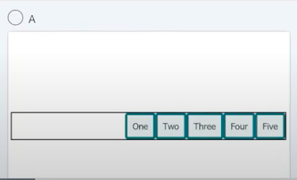
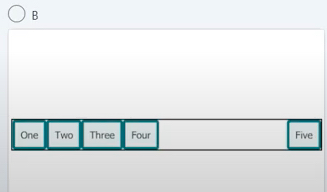
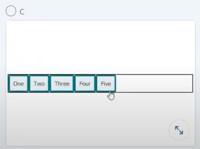
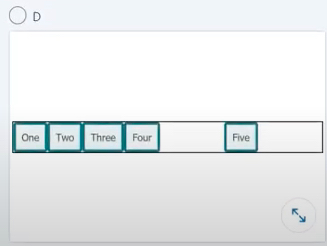

## Front-end Development

#### Q1. Which image matches the flex layout defined in this style rule?

```css
.container {
  display: flex;
}

.container div:last-child {
  margin-left: auto;
}
```

- [ ] 
- [x]
  
- [ ] 
- [ ] 

#### Q2. Variables declared with the let keyword have what type of scope?

- [ ] function scope
- [x] block scope
- [ ] inline scope
- [ ] global scope

#### Q3. Why would you surround a piece of text with `<h1></h1>` tags?

- [x] to indicate that this text is the main heading on the page
- [ ] to make the text bold
- [ ] to ensure that search engines treat the keywords as being important for this page
- [ ] to demonstrate to screen readers that this text is important

#### Q4. When might an empty alt attribute be the correct value?

- [ ] when you cannot think of useful alt text
- [ ] when you don't think it would be interesting to someone who cannot see it
- [ ] when the image has come from a CMS
- [x] when the image is purely decorative

#### Q5. Which attribute must have a unique value each time it is used in an HTML document?

- [ ] title
- [ ] class
- [ ] style
- [x] id

#### Q6. Which CSS property will not trigger layout recalculation?

- [ ] top
- [x] opacity
- [ ] width
- [ ] height

#### Q7. What will be the value of selected?

```javascript
let pocket = ['turnip', 'stone', 'log', 'apple'];
let selected = pocket[1];
```

- [ ] log
- [ ] apple
- [x] stone
- [ ] turnip

#### Q8. What does the `===` comparison operator do?

- [ ] It sets one variable equal to another in both value and type
- [ ] It tests for equality of type only
- [ ] It tests for equality of value only
- [x] It tests for equality of value and type

#### Q9. In the following code, the variable `fruit` has been assigned a value of apple. How would you change the value to plum?

```javascript
let fruit = 'apple';
```

- [ ] `let fruit = 'plum'`
- [ ] `var fruit = 'plum'`
- [ ] `const fruit = 'plum'`
- [x] `fruit = 'plum'`

#### Q10. What is the `<label>` element used for?

- [ ] to identify the difference parts of a figure
- [x] to explain what needs to be entered into a form field
- [ ] as a caption for images
- [ ] as a heading for tables

#### Q11. The browser finds some CSS that it does not understand. What is likely happen?

- [ ] The page will not display
- [ ] An error message will be displayed
- [ ] The browser will not load the stylesheet
- [x] The browser will ignore the unknown CSS

#### Q12. In this code, what is the term for the h1?

```css
h1 {
  color: red;
  font-size: 5em;
}
```

- [x] selector
- [ ] combinator
- [ ] declarator
- [ ] markup

#### Q13. Which HTML will result in text being highlighted in yellow?

```css
.highlight {
  background-color: yellow;
}
```

- [x] `<span class="highlight">#BLM</span>`
- [ ] `<span style="highlight">#BLM</span>`
- [ ] `<highlight">#BLM</span>`
- [ ] `<div id="highlight">#BLM</span>`

#### Q14. Which choice is not a value of the type attribute of the `<input>` element?

- [ ] range
- [x] address
- [ ] date
- [ ] password

#### Q15. You have used `display: none` in your stylesheet. Which users will be able to see or hear this content?

- [ ] all users
- [ ] users who can see the content on screen
- [x] no users
- [ ] screen reader users

#### Q16. Which choice is not part of CSS box model

- [ ] margin
- [ ] border
- [ ] padding
- [x] paragraph

#### Q17. Which part of the URL `https://app.uniswap.org/pool` specifies the domain name

- [ ] https
- [ ] org
- [x] uniswap.org
- [ ] app.uniswap

#### Q18. Which HTML element is not considered a landmark element?

- [ ] `<form>`
- [x] `<ul>`
- [ ] `<main>`
- [ ] `<nav>`

#### Q19. Which statement is true when an HTML tag has been deprecated?

- [ ] It employs code that can be viewed only on a desktop computer
- [x] It is obsolete and is not recommended for use in marking web content
- [ ] It employs code that will require users to update their browsers
- [ ] It employs incorrect syntax that will cause the browser to crash

#### Q20. How does the rem unit represent a font size?

- [ ] Font sizes are expressed relative to the font size of the containing div element
- [ ] Font sizes are expressed relative to the font size of the parent elements
- [ ] Font sizes are relative to the base font size of the operating system.
- [x] Font sizes are relative to the root em unit used in the HTML element.

#### Q21. Which HTML element represents either a scalar value within a known range a fractional value?

- [x] `<meter>`
- [ ] `<range>`
- [ ] `<datalist>`
- [ ] `<optgroup>`

#### Q22. What is Webpack primarily used for?

- [ ] sharing JavaScript code with other people
- [ ] making JavaScript-reliant sites accessible to users who do not have JavaScript turned on
- [x] bundling individual JavaScript files for use in your website
- [ ] source control

#### Q23. How many columns will there be, given this code?

```css
.container {
  width: 600px;
  column-width: 200px;
  column-gap: 50px;
}
```

- [ ] one
- [ ] three
- [ ] four
- [x] two

#### Q24. Which style will change the color of the text?


```html
<cite>Noam Chomsky</cite>
```

- [ ] A

```css
cite {
  text-color: cyan;
}
```

- [ ] B

```css
cite {
  font-color: cyan;
}
```

- [x] C

```css
cite {
  color: cyan;
}
```

- [ ] D

```css
cite {
  text: cyan;
}
```

#### Q25. You find this code in a stylesheet. What is it being used for?

```css
.cf::after {
  content: '';
  display: block;
  clear: both;
}
```

- [ ] inserting content that cannot be seen by screen readers
- [ ] fixing an Internet Explorer 11 bug
- [x] clearing floats in float-based layouts
- [ ] creating a new block formatting context

#### Q26. What is the correct way to initialize an array of galaxies in JavaScript?

- [ ] `String[] galaxies = new Array("Milky Way", "Whirlpool", "Andromeda");`
- [ ] `let galaxies = {Milky Way, Whirlpool, Andromeda};`
- [x] `galaxies = ["Milky Way", "Whirlpool", "Andromeda"];`
- [ ] `var galaxies = {"Milky Way", "Whirlpool", "Andromeda"};`

#### Q27. Which description correctly describes the initial values of flex items if the only thing you have done is apply `display: flex` to their parent?

- [x] Items display in a row, lined up at the start, and do not stretch to fill the container
- [ ] Items display in a column, lined up at the start, and do not stretch to fill the container
- [ ] Items stay in a column until you add some flex properties.
- [ ] Items display in a row, lined up at the start, and stretch to fill the container

#### Q28. Which line of code, if applied to all flex items in a flex container, would cause each flex item to take up an equal share of the total width of the container? For example, if there are four items, they would get 25% of each/

- [ ] `flex: 1 0 0;`
- [ ] `flex: initial;`
- [x] `flex: 1 1 auto;`
- [ ] `flex: 1 0 auto;`

#### Q29. A video on your webpage does not display and the console shows an error about mixed content. What is happening?

- [ ] The webapge is using a DOCTYPE, which renders it incapable of displayed video in addition to other web content.
- [ ] Your browser does not support HTML5 video.
- [ ] The video is from a source that cannot be displayed in your location for legal reasons.
- [x] The page is loaded via HTTPS, but the video is being served insecurely as HTTP and the browser is blocking it.

#### Q30. What will this loop print?

          let max = 3;
          for (i = 0; i > max; i++) {
            document.write("skrt ");
          }

- [ ] skrt skrt skrt
- [ ] skrt skrt
- [ ] skrt skrt skrt skrt
- [x] nothing

#### Q31. You have placed an image in a directory named images and want to reference it from a page located in the root of your site. Which choice would correctly display the image on the page?

- [ ] < img src="image.jpg">
- [ ] < a href="images/image.jpg"></a>
- [x] < img src="images/image.jpg">
- [ ] < img href="image.jpg">

#### Q32. Which choice is a correct use of the parseInt() function in Javascript that parses a string and return an integer?

- [ ] parseInt("six");
- [ ] parse_int('6');
- [x] parseInt("6");
- [ ] parseint("6");

#### Q33. How can you rewrite this function using arrow function syntax?

- [ ] let product => (x,y) { <br /> x \* y; <br />}
- [x] let product = (x,y) => x\*y;
- [ ] let product => x\*y;
- [ ] let product = (x,y) -> x\*y;

#### Q34. Lighthouse is a tool for auditing your website. Which choice is not a category of report offered by Lighthouse?

- [ ] performance
- [x] UX design
- [ ] accessibility
- [ ] SEO

#### Q35. In the context of this code, how would you describe user?

```
const user = {
  given_name: 'Joe',
  family_name: 'Bloggs',
  age: 40,
}
```

- [ ] function
- [ ] array
- [ ] variable
- [x] object

#### Q36. A webpage has `rel="preconnect"` added to a link resource. What will this do?

```
<link rel="preconnect" href="https://example.com">
```

- [ ] It will tell the browser that this link is a site belonging to the current domain.
- [ ] It will do nothing a because this is a deprecated attribute that browsers do not support.
- [x] It will tell the browser that a connection will be made to another origin and to start getting ready as soon as possible.
- [ ] It will tell the browser that a resource is needed, and that it should start getting fetched as soon as possible.

[Reference (web.dev)](https://web.dev/preconnect-and-dns-prefetch/)

#### Q37. Which choice is _not_ a render blocking resource?

- [x] images
- [ ] HTML
- [ ] CSS
- [ ] JavaScript

[Reference (blog.logrocket)](https://blog.logrocket.com/5-tricks-to-eliminate-render-blocking-resources/)

#### Q38. Which choice does _not_ provide information on browser support for a particular CSS property?

- [ ] the "Can I Use" website
- [x] the Web Platform Tests Suite
- [ ] the CSS specification
- [ ] MDN property pages

[Web platform tests site](https://web-platform-tests.org/)

#### Q39. You have a set of images that are slightly different sizes and aspect ratios. You don't mind if you crop off some of the image, but you want each image to completely fill a square box without being distorted. Which property and value would achieve this?

- [ ] object-fit: contain
- [ ] object-fit: stretch
- [ ] object-fit: all
- [x] object-fit: cover

#### Q40. what does the CSS selector a[href$="org"] select?

- [ ] all \<a> tags whose href attribute begins with "org"
- [ ] all \<a> tags whose href attribute equals "org"
- [x] all \<a> tags whose href attribute ends with "org"
- [ ] all \<a> tags whose href attribute contains "org"

#### Q41. Which choice <em>is not</em> of invoking strict mode in JavaScript?

- [ ] it eliminates some JavaScript silent errors by changing them to throw errors.
- [ ] it prohibits some syntax likely to be defined in future versions of ECMAScript.
- [x] it forces the writing of valid HTML and CSS.
- [ ] it fixes mistakes that make it difficult for JavaScript engines to perform optimizations.

[MDN docs](https://developer.mozilla.org/en-US/docs/Web/JavaScript/Reference/Strict_mode)

#### Q42. In normal flow, some elements display as block elements default and others inline. which choice contains only block-level by default elements?\*\*

- [ ] ul, li, a
- [ ] p, b, h3
- [ ] div, p, em
- [x] div, main, h1

#### Q43. Which line would you add to this code to add "Cosmos" to the list of currencies using JavaScript?

```javascript
var currencies = ['Bitcoin', 'Ethereum'];

/* Missing line */
console.log(currencies);
```

- [x] `currencies.push("Cosmos");`
- [ ] `Array.append("Cosmos", currencies);`
- [ ] `currencies.add("Cosmos");`
- [ ] `currencies(2) = "Cosmos";`

#### Q44. How would you change this code to make Vanilla selected by default?

```javascript
<input type="radio" value="strawberry">Strawberry
<input type="radio" value="vanilla">Vanilla
<input type="radio" value="chocolate">Chocolate
```

- [x] `<input type="radio" value="vanilla" checked>`
- [ ] `<input type="radio" value="vanilla" check>`
- [ ] `<input type="radio" value="vanilla" selected>`
- [ ] `<input type="radio" value="vanilla" on>`

#### Q45. **\_** moves an element completely out of the page's normal layout flow, like it is sitting on its own separate layer. From there, you can fix it in a position relative to the edges of the page's `<html>` element (or its nearest positioned ancestor element)?

- [ ] Sticky positioning
- [x] Absolute positioning
- [ ] Relative positioning
- [ ] Fixed positioning

[Source: W3Schools](https://www.w3schools.com/css/css_positioning.asp)

**position: absolute;**
`An element with position: absolute; is positioned relative to the nearest positioned ancestor (instead of positioned relative to the viewport, like fixed). However; if an absolute positioned element has no positioned ancestors, it uses the document body, and moves along with page scrolling.`

#### Q46. You have created a box that has a height set with CSS. Which line of CSS would add scroll bars if the content is taller than the box, but leave no visible scroll bars if the content fits into the box?

- [ ] .box { overflow: scroll; }
- [ ] .box { overflow: scroll-x; }
- [x] .box { overflow: auto; }
- [ ] .box { overflow: none; }

#### Q47. Which array method should you apply to run a function for every item within an array, returning an array of all items for which the function is true?

- [ ] every()
- [ ] map()
- [ ] forEach()
- [x] filter()

#### Q48. The image below has float: left applied. Text wraps the float on the right and bottom. How would you force the second paragraph to start underneath the float, leaving a gap after the preceding paragraph?


- [ ] Apply `float: left` to the second paragraph.
- [ ] Apply `clear: right` to the floated item.
- [x] Apply `clear: left` to the second paragraph.
- [ ] Apply `clear: left` to the floated item.

[Source: W3Schools](https://www.w3schools.com/css/css_float_clear.asp)

**clear: left;**
`When we use the float property, and we want the next element below (not on right or left), we will have to use the clear property. When clearing floats, you should match the clear to the float: If an element is floated to the left, then you should clear to the left. Your floated element will continue to float, but the cleared element will appear below it on the web page.`

#### Q49. You want to create striped table rows using CSS without adding a class to any element. Which CSS would correctly apply the background color to every odd row in your table?

- [ ] `tr:nth-child(2) { background-color: #ccc; }`
- [x] `tr:nth-child(2n+1) { background-color: #ccc; }`
- [ ] `tr:nth-child(2+1) { background-color: #ccc; }`
- [ ] `tr:nth-child(2n) { background-color: #ccc; }`

[Source: W3Schools](https://www.w3schools.com/cssref/sel_nth-child.asp)

#### Q50. You are designing a site and creating a navigation bar linking to the main sections. Which HTML element should you use to indicate that this is the main navigation?

- [x] `<nav>`
- [ ] `<navigation>`
- [ ] `<main>`
- [ ] `<ul>`

[Source: W3Schools](https://www.w3schools.com/tags/tag_nav.asp)

#### Q51. You discover that CSS is being loaded on a website using the following code. Why might a web developer have done this?

`<link rel="preload" href="styles.css" as="style" onload="this.onload=null;this.rel='stylesheet'"><noscript><link rel="stylesheet" href="style.css"></noscript>`

- [x] The CSS is being loaded asynchronously in order to prevent render blocking.
- [ ] This will stop the CSS being loaded for old browsers that do not support the techniques in use.
- [ ] This is part of a stylesheet-switching script to load different themes for the site.
- [ ] This will stop the CCS being loaded on slow data connections.

[Source: StackOverflow](https://stackoverflow.com/a/46750893)

#### Q52. The flex property is often applied to flex items with a value of 1. Using flex: 1 is a shorthand - what does it unpack to?

- [ ] flex: 0 0 100;
- [x] flex: 1 0 0;
- [ ] flex: 0 0 auto;
- [ ] flex: 1 1 auto;

[Source: stackoverflow](https://stackoverflow.com/questions/37386244/what-does-flex-1-mean)

#### Q53. What does the term "tree shaking" mean with regard to JavaScript performance?

- [ ] only using code that is supported by the newest browsers, and serving the site without JavaScript to old browsers
- [x] removing unused code from the JavaScript files
- [ ] splitting code into various bundles so that decisions can be made on loading priority
- [ ] allowing the browser to ignore code it believes will perform badly

[Source: MDN Docs](https://developer.mozilla.org/en-US/docs/Glossary/Tree_shaking)
