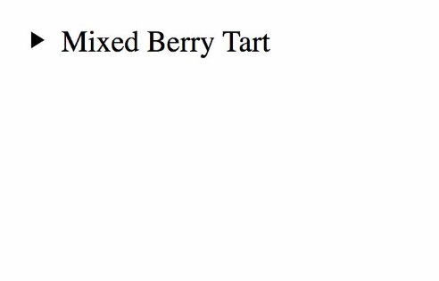
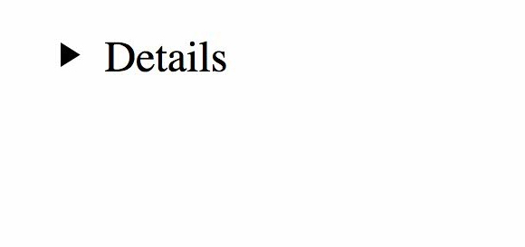
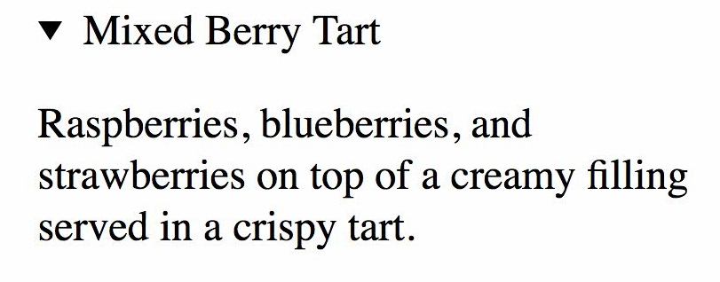
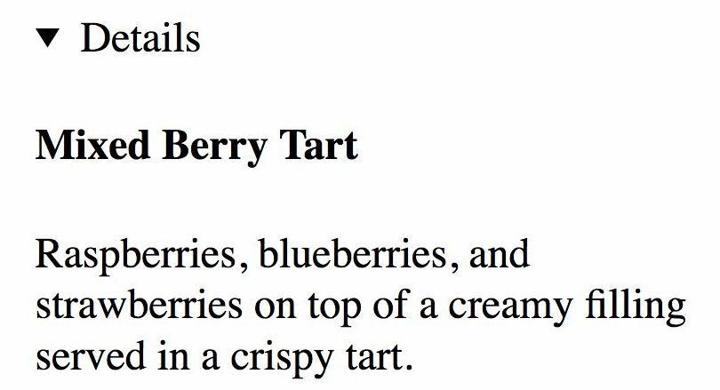

## HTML

#### Q1. What is the purpose of the `<track>` tag, and when should it be used?

- [ ] The `<track>` tag is used for specifying subtitles. It is typically applied as a child of the `<audio>` and `<video>` tags.
- [ ] The `<track>` tag is used for specifying subtitles. It is typically applied as a child of the `<video>` tag.
- [ ] The `<track>` tag is used for specifying subtitles, captions, and other types of time-based text. It is typically applied as a child of the `<video>` tag.
- [x] The `<track>` tag is used for specifying subtitles, captions, and other types of time-based text. It is typically applied as a child of the `<audio>` and `<video>` tag.

#### Q2. What are the best examples of void elements?

- [ ] `<link><meta><title>`
- [x] `<br><base><source>`
- [ ] `<input><br><p>`
- [ ] `<area><embed><strong>`

#### Q3. In HTML5, which tag or tags embed a webpage inside of a webpage?

- [ ] `<iframe>, <frame>, and <frameset>`
- [ ] `<frame>`
- [x] `<iframe>`
- [ ] `<frame> and <frameset>`

#### Q4. Where do `<header>` and `<footer>` tags typically occur?

- [ ] as children of `<body>, <article>, <aside>, and <section>` tags
- [x] as children of `<body>, <article>, and <section>` tags
- [ ] as children of `<body>, <article>, <aside>, <nav>, and <section>` tags
- [ ] as children of `<body>, <article>, <table>, and <section>` tags

#### Q5. What is the best way to apply bold styling to text?

- [x] `<strong>`
- [ ] Use CSS.
- [ ] `<bold>`
- [ ] `<b>`

#### Q6. When is the `<link>` tag used?

- [ ] when linking style sheets, JavaScript, and icons for mobile apps
- [x] when linking style sheets, favicons, and preloading assets
- [ ] when linking one webpage to another
- [ ] when linking style sheets, external URLs, and favicons

#### Q7. What should fill the two blanks in the HTML code below?

```html
<address ______ _____>
  <span itemprop="streetAddress">6410 Via Real</span><br />
  <span itemprop="addressLocality">Carpinteria</span>,
  <span itemprop="addressRegion">CA</span>
  <span itemprop="addressCode">93013</span>
</address>
```

- [x] `itemscope` `itemtype="http://schema.org/PostalAddress"`
- [ ] `itemsref="http://schema.org/PostalAddress"` `itemid="address"`
- [ ] `itemscope` `itemref="http://schema.org/PostalAddress"`
- [ ] `itemid="address"` `itemtype="http://schema.org/PostalAddress"`

#### Q8. When should you use the `<aside>` element?

- [x] when the content can be removed without detracting from the page's message
- [ ] for anything you want to move to the side, like a pull quote box, a sidebar, or an image with text wrapping around it
- [ ] for anything in parentheses
- [ ] for anything in a sidebar

#### Q9. With which tags is the `<source>` element associated?

- [ ] `<svg>, <picture>, <audio>, and <video>`
- [x] `<picture>, <audio>, and <video>`
- [ ] It is interchangeable with the `src` attribute, so any element which uses `src` may use `<source>`
- [ ] `<audio> and <video>`

#### Q10. What is NOT a valid attribute for the `<textarea>` element?

- [ ] readonly
- [x] max
- [ ] form
- [ ] spellcheck

#### Q11. What is the best way to code the sample shown?


- [ ] A

```html
<details>
  <summary>Parmesan Deviled Eggs</summary>
  <p>
    These delectable little bites are made with organic eggs, fresh Parmesan, and chopped pine nuts.
  </p>
</details>
```

- [ ] B

```html
<h4>▸ Parmesan Deviled Eggs</h4>
<p>
  These delectable little bites are made with organic eggs, fresh Parmesan, and chopped pine nuts.
</p>
```

- [x] C

```html
<details open>
  <summary>Parmesan Deviled Eggs</summary>
  <p>
    These delectable little bites are made with organic eggs, fresh Parmesan, and chopped pine nuts.
  </p>
</details>
```

- [ ] D

```html
<details>
  <h4>▸ Parmesan Deviled Eggs</h4>
  <p>
    These delectable little bites are made with organic eggs, fresh Parmesan, and chopped pine nuts.
  </p>
</details>
```

#### Q12. What is the purpose of the `<samp>` element?

- [ ] It connects the web browser to a SA-MP server.
- [ ] It identifies enclosed text as a sampler or an example.
- [x] It identifies sample output from a computer program.
- [ ] It uses a simple application messaging protocol to connect the browser to a texting device.

#### Q13. When should you use `<ol>` and `<ul>` elements?

- [x] Use `<ul>` when you want a bulleted list and `<ol>` when you want a numbered list.
- [ ] Use `<ul>` when you have a list of items in which the order of the items matters. Use `<ol>` when you have a list of items that could go in any order.
- [ ] Use `<ol>` when you want a bulleted list and `<ul>` when you want a numbered list.
- [ ] Use `<ol>` when you have a list of items in which the order of the items matters. Use `<ul>` when you have a list of items that could go in any order.

#### Q14. What is the difference between the post and get methods in a form?

- [ ] post is used for sending information to the server. get is used for retrieving form information from the server.
- [ ] get is used for sending information to the server. post is used for retrieving form information from the server.
- [ ] With get, data is included in the form body when send to the server. With post, the data goes through the URL.
- [x] With post, data is included in the form body when send to the server. With get, the data goes through the URL.

#### Q15. What is the difference between the `<div>` and `<span>` tags?

- [x] `<div>` is used where a generic block-level tag is needed, while `<span>` is used where a generic inline tag is needed.
- [ ] `<div>` is used for major divisions on a page, while `<span>` is used to span across columns.
- [ ] `<div>` is the industry-standard default tag, but you could use `<span>` if you prefer.
- [ ] `<div>` is used where a generic inline tag is needed, while `<span>` is used where a generic block-level tag is needed.

#### Q16. What should fill the blank in the HTML code bellow?

```html
<form method="post" action="mailto:info@linkedin.com" ____="text/plain"></form>
```

- [x] enctype
- [ ] media
- [ ] type
- [ ] rel

#### Q17. What is the correct markup for `alt` attribute of an image?

- [ ] A

```html

```

- [ ] B

```html

```

- [x] C

```html

```

- [ ] D

```html

```

#### Q18. In the code below, what is the purpose of the **id** attribute?

```html
<p id="warning">Be careful when installing this product.</p>
```

- [x] It establishes that id is a unique identifier in the document, used for styling CSS, scripting, and linking within a webpage.
- [ ] It establishes that id is a unique identifier in the document, used for styling CSS and with Javascript code.
- [ ] It establishes that id may be used for styling CSS several times per page.
- [ ] It establishes that id is a unique identifier in the website, used for styling CSS, scripting, and linking within a webpage.

#### Q19. What is the best semantic markup for the sentence shown?

```
On July 21, 1969, Neil Armstrong said, "One small step for man, one giant leap for mankind."
```

- [x] A

```html
<p>
  On <time datetime="1969-07-21">July 21, 1969</time>, Neil Armstrong said,
  <q cite="https://www.hq.nasa.gov/alsj/a11l/a11.html"
    >One small step for man, one giant leap for mankind.</q
  >
</p>
```

- [ ] B

```html
<p>
  On July 21, 1969, Neil Armstrong said,
  <q cite="https://www.hq.nasa.gov/alsj/a11l/a11.html"
    >"One small step for man, one giant leap for mankind."</q
  >
</p>
```

- [ ] C

```html
<p>
  On July 21, 1969, Neil Armstrong said,
  <q>"One small step for man, one giant leap for mankind."</q>
</p>
```

- [ ] D

```html
<p>
  On <time datetime="07-21-1969">July 21, 1969</time>, Neil Armstrong said,
  <q cite="https://www.hq.nasa.gov/alsj/a11l/a11.html"
    >One small step for man, one giant leap for mankind.</q
  >
</p>
```

#### Q20. What should fill the blank in this HTML code?

```html
<a href="https://es.yahoo.com/" hreflang="____" target="_blank">Visita Yahoo</a>
```

- [ ] es
- [ ] es-spanish
- [x] es-es
- [ ] spanish

#### Q21. Review the text in the red box in the image shown. What is the best way to code this in HTML?


- [ ] ordered list
- [x] unordered list inside a nav element
- [ ] ordered list inside a nav element
- [ ] unordered list

#### Q22. What is the best way to code three choices within a form so that the user can select only one item?

- [ ] A

```html
<label for="example">Make a choice:</label>
<datalist id="example">
  <option value="Choice 1"></option>
  <option value="Choice 2"></option>
  <option value="Choice 3"></option>
</datalist>
```

- [ ] B

```html
<p>Make a choice:</p>
<input id="choices" name="example" />

<datalist value="choices">
  <option value="Choice 1"></option>
  <option value="Choice 2"></option>
  <option value="Choice 3"></option>
</datalist>
```

- [ ] C

```html
<label for="example">Make a choice:</label>
<input list="example" id="choices" name="choices" />

<datalist id="choices">
  <option value="Choice 1">Choice 1</option>
  <option value="Choice 2">Choice 2</option>
  <option value="Choice 3">Choice 3</option>
</datalist>
```

- [x] D

```html
<label for="example">Make a choice:</label>
<input list="choices" id="example" name="example" />

<datalist id="choices">
  <option value="Choice 1"></option>
  <option value="Choice 2"></option>
  <option value="Choice 3"></option>
</datalist>
```

#### Q23. How do you confirm that a document is written in HTML5?

- [ ] The server wraps the webpage in an HTML5 wrapper.
- [x] Use the `<!DOCTYPE html>` declaration that starts the document.
- [ ] The browser receives encoding from the server to display the document with HTML5.
- [ ] It is enclosed in a `<html>` tag.

#### Q24. What does the code shown below accomplish?

```html
<picture>
  <source srcset="image1.jpg" media="(min-width: 1000px)" />
  <source srcset="image2.jpg" media="(min-width: 750px)" />
  
</picture>
```

- [x] It displays image1.jpg at 1000px and higher, image2.jpg at 750-999px, and image3.jpg at 749px and lower.
- [ ] It displays image1.jps at 1000px and higher and image2.jpg at 750-999px, image3.jpg is a default in case `<picture>` is not supported.
- [ ] It displays image1.jpg at 1000px and higher and image2.jpg at 750px and higher, image3.jpg is a default in case `<picture>` is not supported.
- [ ] It displays image1.jpg, image2.jpg and image3.jpg at 1000px and higher.

[Source: HTML &lt;picture> Tag](https://www.w3schools.com/tags/tag_picture.asp)

#### Q25. What code will produce this table?


- [ ] A

```html
<table>
  <scope cols="2" style="background-color: yellow">
  <tr>
    <th>Col 1</th>
    <th>Col 2</th>
    <th>Col 3</th>
  </tr>
  <tr>
    <td>first</td>
    <td>second</td>
    <td>third</td>
  </tr>
</table>
```

- [x] B

```html
<table>
  <colgroup span="2" style="background-color: yellow">
  <tr>
    <th>Col 1</th>
    <th>Col 2</th>
    <th>Col 3</th>
  </tr>
  <tr>
    <td>first</td>
    <td>second</td>
    <td>third</td>
  </tr>
</table>
```

- [ ] C

```html
<table>
  <group cols="2" style="background-color: yellow">
  <tr scope="row">
    <th>Col 1</th>
    <th>Col 2</th>
    <th>Col 3</th>
  </tr>
  <tr scope="row">
    <td>first</td>
    <td>second</td>
    <td>third</td>
  </tr>
</table>
```

- [ ] D

```html
<table>
  <columns colspan="2" style="background-color: yellow">
  <tr>
    <th>Col 1</th>
    <th>Col 2</th>
    <th>Col 3</th>
  </tr>
  <tr>
    <td>first</td>
    <td>second</td>
    <td>third</td>
  </tr>
</table>
```

#### Q26. What is the `<hr>`tag typically used for? / Alt.: What is the semantic meaning of the `<hr>` tag?

- [ ] This tag is depreciated (alt.: deprecated) and should not be used.
- [x] It designates a topic shift within a section at the paragraph level.
- [ ] It draws a horizontal line.
- [ ] It designates a shift of topic at the section level. / Alt.: It designates a separation of sections within an `<article>`.

`This is a confusing question and there can be an arguments for both the second and the third options being correct.`

[MDN](https://developer.mozilla.org/en-US/docs/Web/HTML/Element/hr): The HTML `<hr>` element represents a thematic break between paragraph-level elements. Historically, this has been presented as a horizontal rule or line. While it may still be displayed as a horizontal rule in visual browsers, this element is now defined in semantic terms, rather than presentational terms, so if you wish to draw a horizontal line, you should do so using appropriate CSS.

#### Q27. What should fill the two blanks in the HTML code below?

```html
<section itemscope itemtype="http://schema.org/Restaurant">
  <h1 itemprop="name">Nadia's Garden</h1>
  <p itemscope ______ ______>
    <span itemprop="ratingValue">4.5</span> stars - based on
    <span itemprop="reviewCount">120</span> reviews
  </p>
</section>
```

- [ ] `itemprop="aggregateRating" itemref="http://schema.org/AggregateRating"`
- [x] `itemprop="aggregateRating" itemtype="http://schema.org/AggregateRating"`
- [ ] `itemid="aggregateRating" itemtype="http://schema.org/AggregateRating"`
- [ ] `itemid="aggregateRating" itemref="http://schema.org/AggregateRating"`

#### Q28. Which HTML snippet links back to the very top of a webpage?

- [x] A

```html
<a id="top"></a>

<!-- placed at the top of the page -->

<a href="#top">back to top</a>
```

- [ ] B

```html
<a name="top"></a>

<!-- placed at the top of the page -->

<a href="#top">back to top</a>
```

- [ ] C

```html
<a href="#">back to top</a> <a href="#top">back to top</a>
```

- [ ] D

```html
<button href="#">back to top</button> <button href="#top">back to top</button>
```

#### Q29. Which three tags where deprecated in HTML4 but returned to HTML5?

- [x] `<rb> <rp> <rt>`
- [ ] `<acronym> <code> <wbr>`
- [ ] `<hgroup> <q> <wbr>`
- [ ] `<b> <i> <u>`

#### Q30. The **\_** tag is used for marking up a short code snippet, while the \_ tag is used for marking up a longer block of code

- [ ] `<kdb>`, `<pre>`
- [ ] `<pre>`, `<code>`
- [ ] `<kdb>`, `<mark>`
- [x] `<code>`, `<pre>`

1. [Source: MDN Web Docs code](https://developer.mozilla.org/en-US/docs/Web/HTML/Element/code)
2. [Source: MDN Web Docs pre](https://developer.mozilla.org/en-US/docs/Web/HTML/Element/pre)

#### Q31. What does the `<label>` element do?

- [ ] It labels webpages with important information.
- [ ] It creates an ID for a corresponding input element.
- [ ] It overrides the name attribute's value on a child input element.
- [x] It programmatically associates a text label with an interface element.

#### Q32. To get a link to open in a new window or tab, use the **\_** attribute

- [x] `_blank`
- [ ] `_self`
- [ ] `_new`
- [ ] `_parent`

#### Q33. What is the most semantically accurate way to mark up the sentence shown below? Note: "TLAs" stands for "three-letter acronyms."

**We are fond of our TLAs in web design.**

- [ ] A

```html
<p>We are fond of our <span title="three-letter acronyms">TLAs</span> in web design.</p>
```

- [ ] B

```html
<p>We are fond of our TLAs in web design.</p>
```

- [x] C

```html
<p>we are fond of our <abbr title="three-letter acronyms">TLAs</abbr> in web design.</p>
```

- [ ] D

```html
<p>we are fond of our <acronym title="three-letter acronym">TLAs</acronym> in web design.</p>
```

`<acronym>` has been removed in HTML5 and shouldn't be used anymore. Instead web developers should use the `<abbr>` element.

#### Q34. What is the correctly nested markup for this list?


- [ ] A

```html
<ul>
  <li>
    office
    <ol style="circle">
      <li>staple</li>
      <li>paper</li>
    </ol>
  </li>
  <li>
    groceries
    <ol style="circle">
      <li>milk</li>
    </ol>
  </li>
</ul>
```

- [x] B

```html
<ul>
  <li>
    Office Supplies
    <ul>
      <li>Stapler</li>
      <li>Paper clips</li>
    </ul>
  </li>
  <li>
    Groceries
    <ul>
      <li>Milk</li>
    </ul>
  </li>
</ul>
```

- [ ] C

```html
<ul>
  <li>office</li>
  <li>staple</li>
  <li>paper</li>
  <li>groceries</li>
  <li>milk</li>
</ul>
```

#### Q35. What should fill the blank below?

```html
<link href="phone.css" rel="stylesheet" _____="print" />
```

- [ ] title
- [ ] type
- [ ] device
- [x] media

#### Q36. What is the semantically correct way to mark up this layout?


- [ ] A

```html
<p>
  "Making money is what you have to do to sustain a business—being driven to make something of value
  and purpose is much more powerful."
</p>
<p><em>Lynda Weinman</em></p>
```

- [ ] B

```html
<blockquote>
  <q
    >"Making money is what you have to do to sustain a business—being driven to make something of
    value and purpose is much more powerful."</q
  >
  <cite><em>Lynda Weinman</em></cite>
</blockquote>
```

- [x] C

```html
<blockquote>
  <p>
    "Making money is what you have to do to sustain a business—being driven to make something of
    value and purpose is much more powerful."
  </p>
  <cite>Lynda Weinman</cite>
</blockquote>
```

- [ ] D

```html
<section>
  <q
    >"Making money is what you have to do to sustain a business—being driven to make something of
    value and purpose is much more powerful."</q
  >
  <cite>Lynda Weinman</cite>
</section>
```

#### Q37. Which choice uses the correct terminology in describing this markup: `<p>info</p>`?

- [ ] The element opener is `<p>`, the element closer is `</p>`, and the element information is info.
- [ ] The start tag is `<p>`, the end tag is `</p>`, and the enclosed HTML is info.
- [x] The start tag is `<p>`, the end tag is `</p>`, and the element content is info.
- [ ] The start element is `<p>`, the end element is `</p>`, and the tag content is info.

#### Q38. What is the difference between `<input type="submit" value="click me">` and `<button type="submit">Click me</button>`?

- [ ] There is no difference. Both will render a button that submits a form.
- [x] Both will submit a form. However, the `<button>` can have content other than text, like an image or nested HTML elements, while the `<input>` cannot.
- [ ] `<input type="button">` has been deprecated in HTML5. You should use the `<button>` tag instead.
- [ ] Both will submit a form. However, the `<input>` can have content other than text, like an image or nested HTML elements, while the `<button>` cannot.

#### Q39. What is the best semantic way to indicate that text refers to keyboard entry?

- [ ] `<p>Press the <tt>Enter</tt> key to proceed.</p>`
- [x] `<p>Press the <kbd>Enter</kbd> key to proceed.</p>`
- [ ] `<p>Press the <samp>Enter</samp> key to proceed.</p>`
- [ ] `<p>Press the Enter key to proceed.</p>`

#### Q40. What does this code do?

```html
<audio controls>
  <source src="sound.mp3" type="audio/mpeg" />
  <source src="sound.ogg" type="audio/ogg" />
  <source src="sound.wav" type="audio/wav" />
</audio>
```

- [x] The browser chooses the first supported format to play with the browser's default controls.
- [ ] The browser chooses the best audio format to play with JavaScript-provided controls.
- [ ] The browser plays each sound file in order automatically. The user has controls to stop playback.
- [ ] The browser chooses the first supported sound file and will loop the sound until the user stops it.

#### Q41. What attribute applies a keyboard shortcut hint to the current element?

- [x] `accesskey`
- [ ] `shortcut`
- [ ] `keyboard`
- [ ] `access`

#### Q42. What is the correct way to code a link that, when clicked, will send an email to `email@example.com` with a subject of "Hello"?

- [ ] `<a href="mailto:email@example.com&subject=Hello">Click me</a>`
- [ ] `<a href="mailto:email@example.com">Hello</a>`
- [x] `<a href="mailto:email@example.com?subject=Hello">Click me</a>`
- [ ] `<a href="mailto:email@example.com?&subject=Hello">Click me</a>`

#### Q43. Which tag is the root element of an HTML document?

- [ ] `<DOCTYPE html>`
- [x] `<html>`
- [ ] `<body>`
- [ ] `<root>`

`The <html> tag is the root element of an HTML document, which means that it contains all the contents and tags of the HTML document within it. The html element represents the root of a document.`

1. [Source](https://www.interviewbit.com/html-mcq/)
2. [Source](https://www.w3.org/TR/2010/WD-html-markup-20100624/html.html)

#### Q44. Which code snippet creates the layout shown, starting at `<table>` and ending at `</table>`?


- [ ] A

```html
<tr>
  <td>Table cell 1</td>
  <td>Table cell 2</td>
</tr>
<tr>
  <td rowspan="2">Table cell 3</td>
</tr>
```

- [ ] B

```html
<tr>
  <td>Table cell 1</td>
  <td>Table cell 2</td>
  <td>Table cell 3</td>
</tr>
```

- [x] C

```html
<tr>
  <td>Table cell 1</td>
  <td>Table cell 2</td>
</tr>
<tr>
  <td colspan="2">Table cell 3</td>
</tr>
```

- [ ] D

```html
<tr>
  <td>Table cell 1</td>
  <td>Table cell 2</td>
</tr>
<tr>
  <td>Table cell 3</td>
</tr>
```

#### Q45. Which choice is NOT a legal value for the **name** attribute within a `<meta>` tag?

- [x] charset
- [ ] viewport
- [ ] generator
- [ ] author

#### Q46. Which form is coded correctly?

- [ ] A

```html
<form>
  <legend>Title</legend>
  <fieldset>
    <label for="name">Your name:</label>
    <input type="text" name="name" id="name" />
    <button type="submit">Submit</button>
  </fieldset>
</form>
```

- [ ] B

```html
<form>
  <fieldset>
    <legend>Title</legend>
    <p>Your name:</p>
    <input type="text" name="name" id="name" />
    <input type="submit" value="Submit" />
  </fieldset>
</form>
```

- [x] C

```html
<form>
  <fieldset>
    <legend>Title</legend>
    <label for="name">Your name:</label>
    <input type="text" name="name" id="name" />
    <button type="submit">Submit</button>
  </fieldset>
</form>
```

- [ ] D

```html
<form>
  <legend>Title</legend>
  <label for="name">Your name:</label>
  <input type="text" name="name" id="name" />
  <input type="submit" value="Submit" />
</form>
```

#### Q47. What does the **poster** attribute do in the `<video>` tag?

- [x] It specifies an image that should display while the video downloads and until the video is played.
- [ ] It specifies an image that only displays if there is a problem with the video.
- [ ] It specifies an image that should display until the video is played.
- [ ] It specifies an image that should display while the video downloads.

#### Q48. What does this code do?

```html
<audio controls src="sound.mp3" type="audio/mpeg">When does this text display?</audio>
```

- [ ] The text displays over the audio controls, unless CSS is used to position it elsewhere.
- [ ] The text displays under the audio controls.
- [x] The text displays when the browser cannot play the sound.
- [ ] The text never displays.

#### Q49. What is the primary purpose of the `<canvas>` tag?

- [ ] It allows raster images to be rendered on the webpage.
- [ ] It displays annotated images.
- [x] It allows drawing on a bitmap via JavaScript.
- [ ] It allows vector images to be rendered on the webpage.

#### Q50. Which choice contains three valid block-level elements?</li>

- [ ] `<details> <abbr> <figcaption>`
- [ ] `<canvas> <select> <noscript>`
- [x] `<dt> <table> <pre>`
- [ ] `<kbd> <p> <main>`

#### Q51. In the code below, what is the purpose of the **lang** attribute?

```html
<p lang="en-GB">Welcome to our wonderful website.</p>
```

- [ ] It establishes the language for the website—in this case, English.
- [ ] It establishes the language and dialect for the website—in this case, British English.
- [x] It establishes the language and dialect for the paragraph—in this case, British English.
- [ ] It establishes the language for the paragraph—in this case, English.

#### Q52. Which image formats can be displayed by all web browsers?

- [ ] JPG, GIF, TIF
- [ ] JPG, TIF, BMP
- [ ] TIF, BMP, GIF
- [x] PNG, GIF, JPG

#### Q53. Review the code below. What is the absolute URL for a page called **page.html**?

```html
<base href="http://www.linkedin.com/dir/" />
```

- [x] `http://www.linkedin.com/dir/page.html`
- [ ] `page.html`
- [ ] `http://www.linkedin.com/page.html`
- [ ] `dir/page.html`

#### Q54. What is the correct way to include a stylesheet named **style.css** in the `<head>` of your document?

- [ ] `<style link="style.css">`
- [x] `<link rel="stylesheet" href="style.css">`
- [ ] `<style src="style.css"></style>`
- [ ] `<link style="style.css">`

#### Q55. You want to have single spacing in between some lines, like in a poem or an address. Which approach should you use?

- [ ] Wrap the text in a box that is the right width so everything wraps correctly. Set the box width with CSS.
- [x] Separate lines with a `<p>`, then use CSS to make single spacing.
- [ ] Use the `<pre>` tag to make the line spacing look exactly like you want.
- [ ] Separate the lines with the `<br>` tag.

#### Q56. What does the `<wbr>` tag do?

- [ ] It requires the browser to wrap the current line at that point.
- [ ] It breaks a word into two pieces, using a hyphen to connect the words.
- [ ] It formats a sentence to be easily breakable.
- [x] It presents an opportunity for a break in a very long word, if needed for proper page display.

#### Q57. Review the code below. How do you include subnavigation for Link 2 that includes a link?

```html
<nav>
  <ul>
    <li><a href="#">Link 1</a></li>
    <li><a href="#">Link 2</a></li>
    <li><a href="#">Link 3</a></li>
  </ul>
</nav>
```

- [ ] A

```html
<nav>
  <ul>
    <li><a href="#">Link 1</a></li>
    <li><a href="#">Link 2</a></li>
    <ul>
      <li><a href="#">Link 2a</a></li>
    </ul>
    <li><a href="#">Link 3</a></li>
  </ul>
</nav>
```

- [x] B

```html
<nav>
  <ul>
    <li><a href="#">Link 1</a></li>
    <li>
      <a href="#">Link 2</a>
      <ul>
        <li><a href="#">Link 2a</a></li>
      </ul>
    </li>
    <li><a href="#">Link 3</a></li>
  </ul>
</nav>
```

- [ ] C

```html
<ul>
  <nav>
    <li><a href="#">Link 1</a></li>
    <li>
      <a href="#">Link 2</a>
      <ul>
        <nav>
          <li><a href="#">Link 2a</a></li>
        </nav>
      </ul>
    </li>
    <li><a href="#">Link 3</a></li>
  </nav>
</ul>
```

- [ ] D

```html
<nav>
  <ul>
    <li><a href="#">Link 1</a></li>
    <li><a href="#">Link 2</a></li>
    <nav>
      <ul>
        <li><a href="#">Link 2a</a></li>
      </ul>
    </nav>
    <li><a href="#">Link 3</a></li>
  </ul>
</nav>
```

#### Q58. What is the correct way to code a comment in HTML?

- [ ] `//this is a comment`
- [ ] `/* this is a comment */`
- [ ] `<! this is a comment ->`
- [x] `<!-- this is a comment -->`

#### Q59. Which statement is **false**?

- [ ] Inline elements can be nested inside inline elements.
- [ ] Block elements can be nested inside block elements.
- [ ] Inline elements can be nested inside block elements.
- [x] Block elements can be nested inside inline elements.

#### Q60. What is the best semantic to use Quotes in HTML?

`Steve Kruz Said: "He will Win"`

- [x] `<q>`
- [ ] `<quote>`
- [ ] `<blockquote>`
- [ ] `<notation>`

[Reference (w3schools)](https://www.w3schools.com/html/html_quotation_elements.asp)

#### Q61. How will a video look displayed on a fully loaded webpage if the `<video>` tag is used and the **autoplay** attribute is not set?

- [ ] It will display a random frame from a video, unless the **poster** attribute is set.
- [x] It will display the first frame of the video, unless the **poster** attribute is set.
- [ ] It will display nothing unless the **poster** attribute is set.
- [ ] It will display a black window unless the **poster** attribute is set.

[Reference (w3schools)](https://www.w3schools.com/tags/tryit.asp?filename=tryhtml5_video)

#### Q62. What is the correct way to describe an empty element / Alt.: What is the correct way to describe an empty element, such as a line break tag?

- [ ] It has opening and closing tags but no child content.
- [ ] It display nothing on a website.
- [x] It has no child content and no closing tag.
- [ ] It has child content but no closing tag.

[Reference (MDN Web Docs)](https://developer.mozilla.org/en-US/docs/Glossary/Empty_element)

#### Q63. What is the purpose of async in this code?

`<script async src="myscript.js"></script>`

- [ ] It downloads the script from the server when resources allow.
- [ ] It runs the script after HTML parsing is complete.
- [x] It runs the script when the script is ready.
- [ ] It pauses the parsing of HTML code while the script runs.

#### Q64. What does this code do on a page you are visiting for the first time?

`<audio autoplay loop src="sound.mp3" type="audio/mpeg"></audio>`

- [ ] When the **Play** button is pressed, the browser plays the sound over and over again until the user stops it.
- [ ] The browser plays the sound once automatically in the background. The user has no control over the sound.
- [ ] The browser plays the sound automatically and continuously in the background. The user may stop the sound at any tune.
- [x] It does nothing. Modern browsers require some form of interaction before they let a page autoplay with audio.

1. [(MDN) audio](https://developer.mozilla.org/en-US/docs/Web/HTML/Element/audio),
2. [(MDN) autoplay](https://developer.mozilla.org/en-US/docs/Web/Media/Autoplay_guide)

#### Q65. What is the difference between the `<head>` and `<header>` tags?

- [ ] There is only one `<head>` tag per page, while there may be many `<header>` tags.
- [ ] The `<head>` tag may contain CSS and Javascript links, while the `<header>` tag may contain headings and navigational links.
- [x] all of these answers
- [ ] The `<head>` tag contains meta information, while the `<header>` tag contains navigation, logos, and other page identifying content.

#### Q66. In this code, what is the purpose of defer?

`<script defer src="myscript.js"></script>`

- [ ] It downloads the script from the server when resources allow.
- [x] It runs the script after HTML parsing is complete.
- [ ] It runs the script when the script is ready.
- [ ] It pauses the parsing of HTML code while the script runs.

#### Q67. The code below contains some errors. Which choice corrects all of the errors?

```html
<table>
  <tr>
    Cell 1
  </tr>
  <td>Cell 2</td>
  <caption>
    A table
  </caption>
</table>
```

- [ ] A

```html
<caption>
  A table
</caption>
<table>
  <td>
    <tr>
      Cell 1
    </tr>
    <tr>
      Cell 2
    </tr>
  </td>
</table>
```

- [ ] B

```html
<caption>
  A table
</caption>
<table>
  <tr>
    <td>Cell 1</td>
    <td>Cell 2</td>
  </tr>
</table>
```

- [x] C

```html
<table>
  <caption>
    A table
  </caption>
  <tr>
    <td>Cell 1</td>
    <td>Cell 2</td>
  </tr>
</table>
```

- [ ] D

```html
<table>
  <tr>
    <td>Cell 1</td>
    <td>Cell 2</td>
  </tr>
  <caption>
    A table
  </caption>
</table>
```

#### Q68. Given the file and directory structure shown here, what is the correct element to place in file profit.html to link to info.html?


- [ ] `<a href="../work/info.html">See Information </a>`
- [x] `<a href="../info.html">See Information </a>`
- [ ] `<a href="../../info.html">See Information </a>`
- [ ] `<a href="info.html">See Information </a>`

#### Q69. When should you use the `<article>` element?

- [ ] For blog posts and other social media items
- [ ] For the main content area of your website
- [x] When the content stands alone as a unit, is suitable for syndication, or is reusable
- [ ] To associate comments with a blog post

[Reference (MDN)](https://developer.mozilla.org/en-US/docs/Web/HTML/Element/article)

#### Q70. Which list comprises three empty elements?

- [ ] A

```html
<area />
<embed />
<strong></strong>
```

- [ ] B

```html
<input />
<br />
<p></p>
```

- [ ] C

```html
<link>
<meta>
<title>
```

- [x] D

```html
<wbr />
<base />
<source />
```

#### Q71. Which snippet of HTML, when clicked, makes a phone call on a mobile device?

- [x] `<a href="tel:802-555-1212">Call me</a>`
- [ ] `<a href="phone">802-555-1212</a>`
- [ ] `<a href="tel">802-555-1212</a>`
- [ ] `<a href="phone:802-555-1212">Call me</a>`

#### Q72. What is the purpose of the `class` attribute?

- [ ] Classes allow CSS to select specific elements on the page. You may list as many class names within the class attribute as you wish,
      separated by spaces.
- [ ] Classes allow CSS and JavaScript to select specific elements on the page. You may list only one class name per class attribute.
- [ ] Classes allow CSS to select specific elements on the page. You may list only one class name per class attribute.
- [x] Classes allow CSS and JavaScript to select specific elements on the page. You may list as many class names within the class attribute
      as you wish, separated by spaces.

[Reference (MDN)](https://developer.mozilla.org/en-US/docs/Web/HTML/Global_attributes/class)

#### Q73. Which choice is not a legal type attribute for the `<input>` tag?

- [ ] `<input type="color">`
- [ ] `<input type="tel">`
- [ ] `<input type="week">`
- [x] `<input type="num">`

[Reference (MDN)](https://developer.mozilla.org/en-US/docs/Web/HTML/Element/Input)

#### Q74. What is the most semantic way to mark up this sentence so that "happy talk must die" is rendered as an inline quote?

As Steve Krug once said, happy talk must die.

- [ ] `<p>`As Steve Krug once said, `<b>`happy talk must die.`</b>` `</p>`
- [ ] `<p>`As Steve Krug once said, `<i>`happy talk must die.`</i>` `</p>`
- [ ] `<p>`As Steve Krug once said, `<blockquote>`happy talk must die.`</blockquote>` `</p>`
- [x] `<p>`As Steve Krug once said, `<q>`happy talk must die.`</q>` `</p>`

[Source: W3Schools](https://www.w3schools.com/tags/tag_q.asp)

**`<q>` tag**
`Most browsers will display q tags as inline elements with quotes`

#### Q75. What is the most semantically accurate way to make up a main navigation bar, displayed in a horizontal direction?

- [ ] A

```html
<p>
  <a href="index.html">Home</a>
  <a href="about.html">About</a>
  <a href="contact.html">Contact</a>
</p>
```

- [ ] B

```html
<nav>
  <a href="index.html">Home</a>
  <a href="about.html">About</a>
  <a href="contact.html">Contact</a>
</nav>
```

- [ ] C

```html
<nav>
  <ol>
    <li><a href="index.html">Home</a></li>
    <li><a href="about.html">About</a></li>
    <li><a href="contact.html">Contact</a></li>
  </ol>
</nav>
```

- [x] D

```html
<nav>
  <ul>
    <li><a href="index.html">Home</a></li>
    <li><a href="about.html">About</a></li>
    <li><a href="contact.html">Contact</a></li>
  </ul>
</nav>
```

#### Q76. Which choice is the best way to mark up this layout?


- [x] A

```html
<h4>Mailing Address</h4>
<address>
  6410 Via Real <br />
  Carpinteria, CA 93013<br />
  <a href="mailto:info@linkedin.com">info@linkedin.com</a>
</address>
```

- [ ] B

```html
<h4><strong>Mailing Address</h4>
<address><em>
  6410 Via Real <br>
  Carpinteria, CA 93013<br>
  <a href="mailto:info@linkedin.com">info@linkedin.com</a>
</em></address>
```

- [ ] C

```html
<h4>Mailing Address</h4>
<p>
  <em>
    6410 Via Real <br />
    Carpinteria, CA 93013<br />
    <a href="mailto:info@linkedin.com">info@linkedin.com</a>
  </em>
</p>
```

- [ ] D

```html
<p><strong>Mailing Address</strong></p>
<p>
  <em>
    6410 Via Real <br />
    Carpinteria, CA 93013<br />
    <a href="mailto:info@linkedin.com">info@linkedin.com</a>
  </em>
</p>
```

[Source: W3Schools](https://www.w3schools.com/tags/tag_address.asp)

`The <address> tag defines the contact information for the author/owner of a document or an article. The contact information can be an email address, URL, physical address, phone number, social media handle, etc. The text in the <address> element usually renders in italic, and browsers will always add a line break before and after the <address> element.`

#### Q77. What is the primary purpose of HTML?

- [x] HTML structures the webpage, identifying its elements such as paragraphs, headings, and lists.
- [ ] HTML structures and provides a rudimentary look to webpages.
- [ ] HTML is responsible for the structure, styling, and interactivity of webpages.
- [ ] HTML is responsible for the structure and styling of webpages.

#### Q78. For the HTML code below, when will "Sample Text" display to the browser?

```html
<noscript>Sample Text</noscript>
```

- [ ] when there is no JavaScript used on this webpage
- [x] when JavaScript is not supported by the browser or if JavaScript is disabled in the browser
- [ ] when JavaScript is disabled in the web browser
- [ ] when JavaScript is not supported by the web browser

[Reference (MDN)](https://www.w3schools.com/tags/tag_noscript.asp)

#### Q79. How will this code render by default in most web browsers?

```html
<details>
  <h4>Mixed Berry Tart.</h4>
  <p>
    Raspberries, blueberries, and strawberries on top of a creamy filling served in a crispy tart.
  </p>
</details>
```

- [x] A
      
- [ ] B
      
- [ ] C
      
- [ ] D
      

#### Q80. What is the difference between the `<svg>` and `<canvas>`?

- [x] `<svg>` produces vector graphics, while `<canvas>` produces raster graphics.
- [ ] `<svg>` integrates with JavaScript, while `<canvas>` does not.
- [ ] `<svg>` produces raster graphics, while `<canvas>` produces vector graphics.
- [ ] `<svg>` cannot be used as a background image, while `<canvas>` can be used as a background

#### Q81. What is the difference between the _readonly_ and _disabled_ attributes for the `<textarea>` element?

- [x] _readonly_ allows clicking in the `<textarea>` element. _disabled_ prevents all interaction with the control.
- [ ] _readonly_ is invalid attribute for `<textarea>`, while _disabled_ is a valid attribute.
- [ ] _disabled_ allows clicking in the `<textarea>` element. _readonly_ prevents all interaction with the control.
- [ ] _disabled_ is invalid attribute for `<textarea>`, while _readonly_ is a valid attribute.

1. [Source: readonly](https://www.w3schools.com/tags/att_readonly.asp)
2. [Source: disabled](https://www.w3schools.com/tags/att_disabled.asp)

#### Q82. In this code, what is _target_?

`<a target="_blank">...</a>`

- [x] an attribute
- [ ] a tag
- [ ] content
- [ ] an element

#### Q83. What is the correct way to add a submit URL to a `button` element?

- [ ] A

```html
<button submit="http://example.com/process">Process data</button>
```

- [ ] B

```html
<button action="http://example.com/process">Process data</button>
```

- [x] C

```html
<button formaction="http://example.com/process">Process data</button>
```

- [ ] D

```html
<button method="http://example.com/process">Process data</button>
```

`formaction — The URL that processes the information submitted by the button. Overrides the action attribute of the button's form owner. Does nothing if there is no form owner.` [Source](https://developer.mozilla.org/en-US/docs/Web/HTML/Element/button#attr-formaction)

#### Q84. Which is the best markup to produce this text?

`x<y&z>w`

- [ ] `<p>x<y&z>w</p>`
- [x] `<p>x\<y&z\>w</p>`
- [ ] `<p>x<<y&&z>>w`
- [ ] `<p>x<y&z>w</p>`

`This question has an issue, however this answer will count as correct`
`It's too strange question because all of that methods doesn't work. The good method is &amp, &lt, &gt using.`

#### Q85. What is wrong with this code snippet?

```html
<label>Address:</label> <input type="text" name="address" id="address-input" />
```

- [ ] The `<label>` and `<input>` should be nested inside of a `<fieldset>` element.
- [ ] **"address"** is not a valid value for the attribute **name** on an `<input>` element.
- [ ] The `<label>` element is missing an **id** set to "address-input".
- [x] The `<label>` element is missing a **for** attribute set to "address-input".

#### Q86. What is the default method for form submission?

- [x] GET
- [ ] POST
- [ ] PUT
- [ ] SUBMIT

#### Q87. Which is the most semantically correct markup for a side comment in small print?

- [x] `<p>` Get 10% discount `<small>`not valid in France`</small></p>`
- [ ] `<p>` Get 10% discount `<!--not valid in France--> </p>`
- [ ] `<p>` Get 10% discount `<comment>`not valid in France`</comment></p>`
- [ ] `<p>` Get 10% discount `<aside>`not valid in France`</aside></p>`

#### Q88. Which choice will produce the spanish word <i>canción</i>?

- [x] `<p lang="es">canción</p>`
- [ ] `<p lang="es">canci&oacuten</p>`
- [ ] `<p lang="es">cancio'n</p>`
- [ ] `<p lang="es">canci'on</p>`

#### Q89. What is the purpose of `<caption>`?

- [ ] `<caption>` provides captions for `<audio>`,`<video>`,``, and `<table>`.
- [x] `<caption>` provides captions to `<table>`.
- [ ] `<caption>` provides captions for `<audio>`, `<video>`, and `<table>`.
- [ ] `<caption>` provides captions for ``, `<audio>`, and `<video>`.

#### Q90. The value attribute is associated with which set of tags ?

- [x] A

```html
<li>
  <input />
  <option></option>
</li>
```

- [ ] B

```html
<input>
<option>
<textarea>
```

- [ ] C

```html
<button>
  <input />
  <form></form>
</button>
```

- [ ] D

```html
<input /> <label> <meter></meter></label>
```

#### Q91. What is wrong with this code?

``

- [ ] `` should be paired with a `<caption>` tag.
- [x] The `` element is missing an alt attribute.
- [ ] `` is not a valid HTML element. Instead, use `<image src="..."/>`.
- [ ] `` should be nested within a `<figure>` tag.

#### Q92. Which choice is the most semantically correct markup for specifying the first definition of a term?

- [ ] `<p>`The `<dl>`focal length`</dl>` of a lens gives the distance from the lens to the image sensor.`</p>`
- [x] `<p>`The `<dfn>`focal length`<dfn>` of a lens gives the distance from the lens to the image sensor.`</p>`
- [ ] `<p>`The `<dt>`focal length`</dt>` of a lens gives the distance from the lens to the image sensor.`</p>`
- [ ] `<p>`The `<dd>`focal length`</dd>` of a lens gives the distance from the lens to the image sensor.`</p>`

**Definition** `element => The <dfn> HTML element is used to indicate the term being defined within the context of a definition phrase or sentence. `<br>`**Description Term element => The <dt> HTML element specifies a term in a description or definition list, and as such must be used inside a <dl> element.`<br>` **Description Details element =>The <dd> HTML element provides the description, definition, or value for the preceding term (<dt>) in a description list (<dl>).`

[Source](https://developer.mozilla.org/en-US/docs/Web/HTML/Element/dfn)

#### Q93. Which choice is the best way to code three choices within a form so that the user can select multiple items?

- [ ] :

```html
<input type="radio" name="example" /> Choice 1 <br />
<input type="radio" name="example" /> Choice 2 <br />
<input type="radio" name="example" /> Choice 3
```

- [x] :

```html
<input type="checkbox" name="example" /> Choice 1 <br />
<input type="checkbox" name="example" /> Choice 2 <br />
<input type="checkbox" name="example" /> Choice 3
```

- [ ] :

```html
<label><input type="checkbox" name="example" /> Choice 1</label><br />
<label><input type="checkbox" name="example" /> Choice 2</label><br />
<label><input type="checkbox" name="example" /> Choice 3</label>
```

- [ ] :

```html
<label><input type="radio" name="example" /> Choice 1</label><br />
<label><input type="radio" name="example" /> Choice 2</label><br />
<label><input type="radio" name="example" /> Choice 3</label>
```

`<input> elements of type checkbox are rendered by default as boxes that are checked (ticked) when activated, like you might see in an official government paper form. The exact appearance depends upon the operating system configuration under which the browser is running. Generally this is a square but it may have rounded corners.`

[Source](https://developer.mozilla.org/en-US/docs/Web/HTML/Element/input/checkbox)

#### Q94. How would you mark up a piece of ASCII art (an emoticon) in an accessible way?

- [x] `<pre role="emoticon" aria-label="ASCII emoticon of a shrug">¯\_(ツ)_/¯</pre>`
- [ ] `<pre role="img" aria-label="ASCII emoticon of a shrug">¯\_(ツ)_/¯</pre>`
- [ ] `<dfn title="ASCII emoticon of a shrug">¯\_(ツ)_/¯</dfn>`
- [ ] `<label for="art">ASCII emoticon of a shrug</label><pre role="img" id="art">¯\_(ツ)_/¯</pre>`

#### Q95. Which example is a standard way in HTML5 for adding author metadata to a page?

- [ ] `<metadata name="author" content="Author Name">`
- [ ] `<meta name="author">Author Name</meta>`
- [ ] `<meta name="creator" content="Author Name">`
- [x] `<meta name="author" content="Author Name">`

#### Q96. Given the following requirements, select the correct `input` configuration: An `input` that allows the user to select from a range of integer values between 0 and 100 (inclusive) in increments of 5.

- [ ] `<input type="range" min="0" max="100" by="5" />`
- [x] `<input type="range" min="0" max="100" step="5" />`
- [ ] `<input type="number" min="0" max="100" step="5" />`
- [ ] `<input type="number" min="0" max="100" by="5" />`

`<input> elements of type range let the user specify a numeric value which must be no less than a given value, and no more than another given value. The step attribute is a number that specifies the granularity that the value must adhere to.`

[Source](https://developer.mozilla.org/en-US/docs/Web/HTML/Element/Input/range)

#### Q97. Which choice is valid markup for a `<head>` element?

- [ ] `<head class="Page Section Information" id="head"><title>Page Title</title></head>`
- [ ] `<head><title>Page Title</title> </head>`
- [x] `<head><title>Page Title</title> <data value="email">email@example.com</data></head>`
- [ ] `<head><title>Page Title</title><address>email@example.com</address></head>`

`The <head> HTML element contains machine-readable information (metadata) about the document, like its title.The <data> tag is used to add a machine-readable translation of a given content.`
[Source 1](https://developer.mozilla.org/en-US/docs/Web/HTML/Element/head)/
[Source 2](https://www.w3schools.com/tags/tag_data.asp)

#### Q98. You need to add comments to the company blog. What is the most semantic markup for a list of comments?

- [x] A

```html
<aside>
  <h3>Comments</h3>
  <article>First comment.</article>
  <article>Second comment.</article>
</aside>
```

- [ ] B

```html
<div aria="dpub-comments">
  <h3>Comments</h3>
  <div aria="dpub-comment">First comment.</div>
  <div aria="dpub-comment">Second comment.</div>
</div>
```

- [ ] C

```html
<aside>
  <h3>Comments</h3>
  <aside>First comment.</aside>
  <aside>Second comment.</aside>
</aside>
```

- [ ] D

```html
<div typeof="comments">
  <h3>Comments</h3>
  <div typeof="comment">First comment.</div>
  <div typeof="comment">Second comment.</div>
</div>
```

`The <article> HTML element represents a self-contained composition in a document, page, application, or site, which is intended to be independently distributable or reusable (e.g., in syndication). Example:a user-submitted comment.`
[Source](https://developer.mozilla.org/en-US/docs/Web/HTML/Element/article)

#### Q99. To make something editable by the user, you need to set the **\_** attribute to **\_**.

- [ ] `access`; allow
- [ ] `designMode`; true
- [x] `contenteditable`; true
- [ ] `contenteditable`; yes

`The contenteditable global attribute is an enumerated attribute indicating if the element should be editable by the user. If so, the browser modifies its widget to allow editing. The attribute must take one of the following values: true or an empty string, which indicates that the element is editable; false, which indicates that the element is not editable.`
[Source](https://developer.mozilla.org/en-US/docs/Web/HTML/Global_attributes/contenteditable)

#### Q100. Which choice is the standard way to include a value in a form without making it visible to or editable by the user?

- [ ] `<input type="invisible" name="important" value="information">`
- [ ] `<input type="text" style="display: none;" name="important" value="information">`
- [x] `<input type="hidden" name="important" value="information">`
- [ ] `<input type="text" hidden name="important" value="information">`

`<input> elements of type hidden let web developers include data that cannot be seen or modified by users when a form is submitted. For example, the ID of the content that is currently being ordered or edited, or a unique security token. Hidden inputs are completely invisible in the rendered page, and there is no way to make it visible in the page's content.` [Source](https://developer.mozilla.org/en-US/docs/Web/HTML/Element/input/hidden)

#### Q101. What is the semantic way to add an identifying title to a table?

- [ ] `<table><label>Heading</label>...</table>`
- [ ] `<table><title>Heading</title>...</table>`
- [ ] `<table><legend>Heading</legend>...</table>`
- [x] `<table><caption>Heading</caption>...</table>`

`The <caption> HTML element specifies the caption (or title) of a table.` [Source](https://developer.mozilla.org/en-US/docs/Web/HTML/Element/caption)

#### Q102. Which image file referenced in this `img` element's `srcset` attribute should a browser on a small mobile phone load?

```html

```

- [ ] small.jpg
- [ ] medium.jpg
- [ ] none of them
- [x] large.jpg

`The browser will: 1. Look at its device width. 2. Work out which media condition in the sizes list is the first one to be true. 3. Look at the slot size given to that media query. 4. Load the image referenced in the srcset list that has the same size as the slot or, if there isn't one, the first image that is bigger than the chosen slot size.` [Source](https://developer.mozilla.org/en-US/docs/Learn/HTML/Multimedia_and_embedding/Responsive_images)

#### Q103. Which description is coded correctly?

- [x] A

```html
<dl>
  <dt>Server</dt>
  <dd>Software used to serve webpages, like Apache.</dd>
  <dd>Hardware used to provide data to other computers.</dd>
  <!-- Other terms and descriptions -->
</dl>
```

- [ ] B

```html
<dt>
  <dl>Server</dl>
  <dd>Software used to serve webpages, like Apache.</dd>
  <dd> Hardware used to provide data to other computers.</dd>
  <!-- Other terms and descriptions -->
</dt>
```

- [ ] C

```html
<dl>
  <dt>Server</dt>
  <dd>Software used to serve webpages, like Apache.</dd>
  <dt>Hardware used to provide data to other computers.</dt>
  <!-- Other terms and descriptions -->
</dl>
```

- [ ] D

```html
<dl>
  <dd>Server</dd>
  <dt>Software used to serve webpages, like Apache.</dt>
  <dt>Hardware used to provide data to other computers.</dt>
  <!-- Other terms and descriptions -->
</dl>
```

[Source 1](https://html.spec.whatwg.org/multipage/grouping-content.html#the-dl-element)
[Source 2](https://www.w3schools.com/tags/tag_dl.asp)

#### Q104. What is wrong with this code?

```html
<ul>
  <h2>Espresso Drinks</h2>
  <li>Espresso</li>
  <li>Latte</li>
  <li>Cappuccino</li>
  <li>Mocha</li>
</ul>
```

- [ ] Nothing is wrong.
- [x] `<ul>` cannot contain a heading element as a direct child.
- [ ] An `<h1>` should be used here instead of an `<h2>` tag.
- [ ] Only `<ol>` allows direct descendants to contain elements other than an `<li>`, so use an `<ol>` here instead.

`ul content model only accepts "Zero or more li and script-supporting elements".` [Source](https://html.spec.whatwg.org/multipage/grouping-content.html#the-ul-element)

#### Q105. A designer gave you CSS code that should run only when the device rendering the page is in dark mode. How would you embed that code?

- [ ] `<style media="light-mode: false">/* CSS code */</style>`
- [ ] `<style media="color-mode: dark">/* CSS code */</style>`
- [x] `<style media="prefers-color-scheme: dark">/* CSS code */</style>`
- [ ] `<style media="color-scheme: dark">/* CSS code */</style>`

#### Q106. How would you mark up a header for a table row?

- [x] A

```html
<table>
  <thead scope="row">
    <th row="1">Header</th>
  </thead>
  <tr>
    <td>10</td>
    <td>18</td>
  </tr>
</table>
```

- [ ] B

```html
<table>
  <tr>
    <th scope="row">Header</th>
    <td>10</td>
    <td>18</td>
  </tr>
</table>
```

- [ ] C

```html
<table>
  <tr>
    <thead scope="row">
      Header
    </thead>
    <td>10</td>
    <td>18</td>
  </tr>
</table>
```

- [ ] D

```html
<table>
  <tr>
    <th>Header</th>
    <td>10</td>
    <td>18</td>
  </tr>
</table>
```

#### Q107. Which statement is correct?

- [ ] The `<main>` element represents the dominant content of an `<article>` in a document.
- [ ] The `<main>` element represents the dominant content of a `<section>` of a document. You may have one `<main>` element per section.
- [x] The `<main>` element represents the dominant content of your document. There can be only one `<main>` element that is not hidden.
- [ ] The `<article>` element represents the dominant content of your document. There can be only one `<article>` element that is not hidden.

[Source](https://developer.mozilla.org/en-US/docs/Web/HTML/Element/main)

#### Q108. Users report that a form is not working. What is the culprit?

```html
<form action="/choices" disabled>
  <fieldset disabled>
    <legend>choices</legend>
    <label>Choice 1 <input type="radio" name="choice" value="choice1" /></label>
    <label>Choice 2 <input type="radio" name="choice" value="choice1" /></label>
    <label>Choice 3 <input type="radio" name="choice" value="choice1" /></label>
    <label>Choice 4 <input type="radio" name="choice" value="choice1" /></label>
    <button>Choose!</button>
  </fieldset>
</form>
```

- [ ] The form element is disabled.
- [ ] There is no <input type="submit"> element.
- [x] The fieldset is disabled.
- [ ] There is no method set on the form.

A disabled fieldset is unusable and un-clickable. [Source](https://www.w3schools.com/tags/att_fieldset_disabled.asp)

#### Q109. Which description list is coded correctly?

- [x] A

```html
<dl>
  <dt>Server</dt>
  <dd>Software used to server webpages, like Apache.</dd>
  <dd>Hardware used to provide data to other computers.</dd>
  <!--Other terms and descriptions -->
</dl>
```

- [ ] B

```html
<dl>
  <dd>Server</dd>
  <dt>Software used to server webpages, like Apache.</dt>
  <dt>Hardware used to provide data to other computers.</dt>
  <!--Other terms and descriptions -->
</dl>
```

- [ ] C

```html
<dt>
    <dl>Server</dl>
    <dd>Software used to server webpages, like Apache.</dd>
    <dd>Hardware used to provide data to other computers.</dd>
    <!--Other terms and descriptions -->
</dt>
```

- [ ] D

```html
<dl>
  <dt>Server</dt>
  <dd>Software used to server webpages, like Apache.</dd>
  <dt>Hardware used to provide data to other computers.</dt>
  <!--Other terms and descriptions -->
</dl>
```

#### Q110. What is the difference between the `<div>` and the `<span>` tag?

- [ ] `<div>` is used for major divisions on a page, while `<span>` is used to span across columns.
- [x] `<div>` is used where a generic block-level tag is needed, while `<span>` is used where a generic inline tag is needed.
- [ ] `<div>` is the industry standard default tag, but you could use `<span>` if you prefer.
- [ ] `<div>` is used where a generic inline tag is needed, while `<span>` is used where a generic block-level tag is needed.

#### Q111. what does the a in the html a tag stands for?

- [ ] assign
- [ ] add tag
- [x] anchor tag
- [ ] none of the above

[Source](https://stackoverflow.com/questions/39434659/what-does-the-a-in-the-html-a-tag-stand-for)

#### Q112. What is the correct HTML element for inserting a line break?

- [ ] `<break>`
- [ ] `<lb>`
- [x] `<br>`
- [ ] `<a>`

#### Q112. How to display preformatted text in HTML?

- [ ] `<p>`
- [x] `<pre>`
- [ ] `<hr>`
- [ ] All of the above

#### Q113. The HTML global attribute, "contenteditable" is used to:

- [ ] Update content from the server
- [ ] Specifies a context menu for an element. The menu appears when a user right-clicks on the element.
- [x] Specify whether the content of an element should be editable or not
- [ ] Return the position of the first found occurrence of content inside a string

#### Q114. HTML elements that aren't meant to store content or other elements are called **\_** elements.

- [x] void
- [ ] independent
- [ ] empty
- [ ] paragraph

[Source](https://www.w3.org/TR/2011/WD-html-markup-20110113/syntax.html#syntax-elements)

#### Q115. The **\_** attribute of an HTML label element is a referencing mechanism to state what input or element the label is tied to.

- [ ] to
- [ ] of
- [ ] with
- [x] for

[Source](https://www.w3schools.com/tags/att_label_for.asp)

#### Q116. Coding in HTML provides which of the following?

- [ ] The responsiveness of the website
- [ ] The style of the website
- [x] The core website structure
- [ ] The behavior of web elements

#### Q117. Which HTML element is the container for all the renderable aspects of the document?

- [ ] head
- [x] body
- [ ] title
- [ ] meta

#### Q118. The "h" in the HTML h1 tag is short for **\_**.

- [ ] head
- [ ] horizontal
- [ ] hypertext
- [x] heading

[Source](https://www.w3schools.com/html/html_headings.asp)
