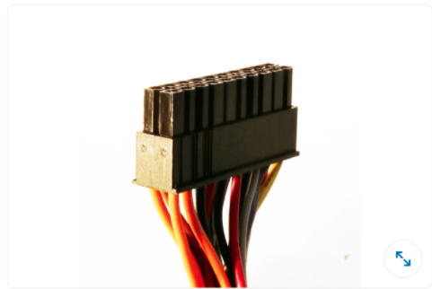
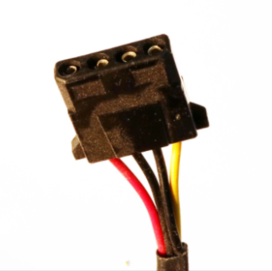

## IT Operations

#### Q1. You are configuring a Wi-Fi base station using DHCP. Which items should you set or change?

- [x]

  - Reset administrator password.
  - Set network name.
  - Set network security.
  - Set network password.

- [ ]

  - Reset administrator password.
  - Set network name.
  - Set network password.

- [ ] 

  - Set network name.
  - Set network password.
  - Assign DNS servers.

- [ ]

  - Change administrator account name.
  - Set network password.
  - Set network name.
  - Assign DNS servers.

#### Q2. Can you connect a DisplayPort monitor to a USB-C port on your computer?

- [ ] Yes. The DisplayPort cable plugs directly into the USB connector.
- [x] Yes. An adapter or dongle may be required.
- [ ] No. While you can rig a connection, video quality will be poor.
- [ ] No. The two standards are incompatible.

#### Q3. What is the I/O panel?

- [ ] the location where expansion cards can connect to peripherals
- [x] a cluster of ports and connectors found on the back of the computer case
- [ ] the switches that turn on, sleep, and turn off the computer
- [ ] the portion of the motherboard where non-power cables connect

#### Q4. The computer consistently boots into Safe Mode. How would you address this issue?

- [ ] Edit the Registry key that controls the boot sequence.
- [ ] Hold the Shift key as Windows boots.
- [ ] Check the MSCONFIG utility to ensure that Normal boot is selected.
- [x] Fix the issue in Safe Mode that is causing the system to restart in this mode.

#### Q5. Which choice is not a typical adjustment found on a monitor?

- [x] resolution
- [ ] color temperature
- [ ] contrast
- [ ] brightness

#### Q6. Assuming that the gateway, modem, and switch are separate units, in what order should a small office or home office LAN be restarted?

- [ ] The order is not important.
- [x]

  1. Modem
  2. Gateway
  3. Switch

- [ ]
  1. Modem
  2. Switch
  3. Gateway
- [ ] 1. Gateway
  2. Switch

#### Q7. A client needs to secure their cafe's wireless network, which is used only by employees. What is the best approach for a finite list of devices?

- [x] Limit access to specific MAC addresses.
- [ ] Do not broadcast the SSID.
- [ ] Apply a metered connection.
- [ ] Apply a password.

#### Q8. Which hardware port would not be found on a typical gateway?

- [ ] WAN
- [ ] USB
- [ ] LAN
- [x] uplink

#### Q9. The recent Windows update introduced some quirks in the system. How can you enter the Windows Recovery Environment to recover from the update?

- [x] Hold the Shift key when selecting the **Restart** command.
- [ ] Restart in Safe Mode where the Recovery item is located on the Start menu.
- [ ] Press the any key at the boot screen.
- [ ] Go to the Task Manager **Startup** tab.

#### Q10. Which components are typically found on the motherboard?

- [x]
  basic I/O
  graphics
  NIC
  battery
  expansion slots

- [ ] basic I/O
      cooling
      NIC
      graphics
      expansion slots
- [ ] basic I/O
      graphics
      NIC
      mass storage
      expansion slots
- [ ]
  basic I/O
  graphics
  NIC
  power supply
  expansion slots

#### Q11. What does the acronym RAID refer to?

- [ ] Repeating Architecture for Internal Drives
- [ ] Recoverable Advanced Integration and Duplication
- [x] Redundant Array of Independent Disks
- [ ] Replicated Array of Internal Devices

#### Q12. To which internal component does the illustrated (P1) connector attach?

- [x] motherboard
- [ ] I/O panel
- [ ] power supply
- [ ] primary mass storage

#### Q13. Your computer boots at very low resolution that cannot be increased through display settings. What is the most likely solution?

- [ ] The connection between the display and the computer is loose.
- [x] You need to reinstall the display drivers.
- [ ] You need to replace your monitor.
- [ ] Some of your RAM is failing.

#### Q14. To which choice can the wget program be considered similar?

- [ ] tracert
- [ ] netstat
- [ ] ping
- [x] cURL

#### Q15. Does an incognito window prevent websites from tracking your activity on the web?

- [ ] No. Incognito mode only prevents the site from appearing in your browser history.
- [ ] Yes. Incognito mode encrypts data packets, making it difficult for websites to track your activity.
- [x] No. Some websites track by ID, and if you sign into a site even in incognito, your activity is known.
- [ ] Yes. Incognito mode blocks all cookies and tracking IDs and suppresses browser history.

#### Q16. What must you confirm before performing a processor upgrade?

- [x] The new processor is compatible with the current motherboard.
- [ ] The new processor is the same type as the old.
- [ ] The new processor is compatible with the operating system.
- [ ] The new processor fits into the old processor's slot.

#### Q17. Which type of storage has the fastest data access speeds?

- [ ] Secure Sockets Layer drive
- [x] solid-state drive
- [ ] serial attached storage device
- [ ] SCSI drive

#### Q18. A Bluetooth peripheral is prompting for a passcode to complete the pairing/connection process. What is the peripheral, most likely?

- [ ] keyboard
- [x] all of these answers
- [ ] mouse
- [ ] headset

#### Q19. Walt's computer is several years old and he wants to ensure that the system works until he gets a replacement. What should he do first?

- [ ] Run a file check daily.
- [ ] Obtain an extended warranty.
- [x] Back up his data.
- [ ] Ensure that the system is protected against malware.

#### Q20. What is one difference between a drive and media?

- [x] The drive is where the data is stored and the media is the data itself.
- [ ] A drive is hardware that reads media.
- [ ] These are two terms for the same thing: storage.
- [ ] The terms apply only to removable storage, where the drive is the slot and the media is the thumb drive or media card inserted into the slot.

#### Q21. Mass storage inside a desktop computer case is usually found where?

- [ ] in an expansion slot
- [ ] attached to the front of the case
- [x] in a drive cage
- [ ] on the motherboard

#### Q22. Which statement about a modular power supply is true?

- [ ] It is built from a cluster of smaller, easier-to-install power supplies.
- [ ] Its power output can be varied to save electricity.
- [x] Its cables are detachable.
- [ ] It has dedicated power reserved for different computer components.

#### Q23. Which program controls the Windows startip sequence?

- [x] MSCONFIG
- [ ] Task Manager
- [ ] the Computer Management Console
- [ ] the UEFI

#### Q24. Angela ran a diagnostic that shows an ever-decreasing amount of memory in her computer. What could be the problem?

- [ ] DRAM is failing.
- [x] A program has a memory leak.
- [ ] There is no problem. It's normal for available memory to decrease the longer you use the system.
- [ ] Another user has signed into the system

#### Q25. Which type of power connector is this?

- [ ] Edison
- [x] Molex
- [ ] SATA
- [ ] PCI

#### Q26. What is the most important thing to do before opening a computer case?

- [x] Turn off and unplug the computer.
- [ ] Disconnect all of the cables.
- [ ] Close your programs, sign out of your account, and turn off the computer.
- [ ] Ground yourself.

#### Q27. On a trackpad, what gesture commonly replaces "center mouse wheel" for things like scrolling through documents?

- [ ] pinch outward
- [ ] scroll with thumb instead
- [x] two-finger swipe
- [ ] force click and drag

#### Q28. What is the name of the hardware that provides a computer with network access?

- [ ] BIOS
- [ ] RJ-45
- [x] NIC
- [ ] Router

#### Q24. Networking wire is referred to as **\_**

- [x] CAT-5 or CAT-6 Ethernet cable
- [ ] thin pair or twisted pair
- [ ] asynchronous digital (AD) cable
- [ ] coax cable

#### Q25. Miguel is working on the computer, and Jen needs to use it for a moment. What can Miguel do to provide for an easy transition?

- [ ] Shut down the system.
- [x] Sign out.
- [ ] Restart the computer.
- [ ] Let Jen take over.

#### Q26. A **\_** allows you to plug computers into a central location to communicate on the same local area network.

- [x] server
- [ ] layer 2 switch
- [ ] wireless access point
- [ ] firewall

#### Q27. After plugging in an external 3.5mm microphone, you stop hearing sound from the speakers. What is the most likely source of the problem?

- [x] You have plugged the microphone into the 3.5mm audio output jack.
- [ ] The sound is muted.
- [ ] The sound card has crashed.
- [ ] The computer has connected to a nearby Bluetooth headset.

#### Q28. You think that the Internet is down. How can you know for certain?

- [x] all of these answers.
- [ ] You cannot reach any websites.
- [ ] The power is out.
- [ ] The lights on the modem are off.

#### Q29. An application is unresponsive. How can you effectively close it down?

- [ ] Restart the computer.
- [ ] Sign out.
- [ ] Wait or set the application aside until it quits eventually on its own.
- [x] Use the Task Manager (Windows) or use Force Quit (Mac).

#### Q30. How can you tell that the website you are visiting is sending and receiving data that has been encrypted?

- [x] The URL is HTTPS.
- [ ] You are using an incognito window.
- [ ] The site requires a login and password.
- [ ] You can't tell because a website's security settings are not readily apparent in a browser window.

#### Q31. The client/server model best represents **\_**.

- [x] multiple hosts interacting with a single computer
- [ ] an application consisting of cooperating programs across the Internet
- [ ] any program run by a user
- [ ] a subscription service on the web

#### Q32. The primary mass storage device is divided into two partitions. What would explain this arrangement?

- [x] There is one partition for the operating system and a separate partition for user data.
- [ ] All drives contain a second partition for the MBR (Master Boot Record).
- [ ] The drive is partitioned to maintain compatibility with older versions of the operating system.
- [ ] The system has two users who are each getting a partition.

#### Q33. You are replacing a processor. How do you build the processor "sandwich", top-down?

- [x] fan, paste, processor, socket
- [ ] fan, processor, socket
- [ ] fan, paste, processor, paste, socket
- [ ] fan, processor, paste, socket

#### Q34. The operating system tells you that a file is busy. What is the fastest way to attempt to make the file un-busy?

- [ ] Run a disk-checking utility.
- [x] Close open programs.
- [ ] Restart the computer.
- [ ] Review the output of the netstat utility to check for incoming connections to the file.

#### Q35. What is the name of the hardware that provides a computer with network access?

- [ ] BIOS
- [ ] RJ-45
- [x] router
- [ ] NIC

#### Q36. Which program controls the Windows startup sequence?

- [x] MSCONFIG
- [ ] the Computer Management Console
- [ ] Task Manager
- [ ] the UEFI

#### Q37. Which service allows clients to work remotely and supplies the clients with an IP address on the same local area network as the offce?

- [ ] DNS
- [ ] FTP
- [x] VPN
- [ ] HTTP

#### Q38. Al is about to update a software driver. What would be a wise thing to do first?

- [x] Back up all files.
- [ ] Save data and close programs.
- [ ] Remove the older driver.
- [ ] Sign out of the operating system.

#### Q39. What is the process of moving data and programs from an old computer to a new one called?

- [ ] migration
- [ ] An official term does not exist, though it is colloquieally referred to as a "brain transplant."
- [x] profile transfer
- [ ] account cloning

#### Q40. The local network is up, but the computers cannot access the Internet. Your Internet configuration includes a modem, gateway (router), and a switch as separate devices. What should you do?

- [ ] Do nothing. Wait until service is restored.
- [ ] Restart all computers on the network.
- [ ] Restart the gateway (router).
- [x] Restart the modem.

#### Q41. You notice that a program crashes at a specific time. Which tool can you use in Windows to discover the cause?

- [ ] Task Manager
- [x] Event Viewer
- [ ] Perfomance Monitor
- [ ] Resource Monitor

#### Q42. While planning a conference at a center in the mountains, you call ahead to ensure that it has broadband Internet access. Wich connection type would be an unsuitable choice?

- [ ] DSL
- [ ] fiber optic
- [ ] cable
- [x] dial-up

#### Q43. On a trackpad, what gesture commonly replaces "center mouse wheel" for things like scrolling through documents?

- [x] two-finger swipe
- [ ] pinch outward
- [ ] scroll with thumb instead
- [ ] force click and drag

#### Q44. What is a fixed disk

- [ ] mass storage that has ben repaired
- [x] nonremovable mass storage
- [ ] any internal mass storage device
- [ ] any mass storage device that is not a SSD

#### Q45. What are the long-term and short-term categories of storage in a computer?

- [x] memory and permanent (drive) storage
- [ ] SSD and HDD
- [ ] RAM and ROM
- [ ] standard memory and cache memory

[Reference](https://pediaa.com/difference-between-short-term-and-long-term-memory/)

#### Q46. What is referred to by SSID

- [x] Service Set Identifier, a wireless network's name
- [ ] an older security protocol for Wi-Fi networks
- [ ] the server-side ID used to identify devices on a network
- [ ] the MAC address broadcast for a wireless network

[Reference](https://techterms.com/definition/ssid)
