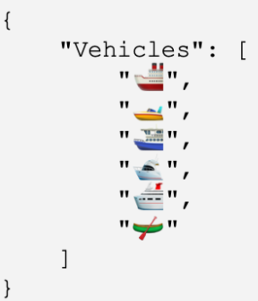

## JSON

#### Q1. By convention, what name is used for the first key in a JSON schema?
- [ ] schema
- [x] \$schema
- [ ] JsonSchema
- [ ] JSONschema

#### Q2. Which code is the closest JSON equivalent of the data shown?
- [ ]
```
[
	'red',
	'blue',
	'green'
]
```
- [ ]
```
  [
    "red",
    "blue",
    "green"
  ]
```
- [x]
```
  {
    "color": "red",
    "color": "blue",
    "color": "green"
  }
```
- [ ]
```
  {
    'red': 'red',
    'blue': 'blue',
  }
```

#### Q3. Which JavaScript method converts a JavaScript value to Json?
- [ ] JSON.parse()
- [x] JSON.stringify()
- [ ] JSON.toString()
- [ ] JSON.objectify()

#### Q4. Which data type is NOT part of JSON standard?
- [ ] string
- [ ] number
- [x] date
- [ ] array

#### Q5. Which term is commonly used to refer to converting data to JSON?
- [ ] unpacking
- [x] serialization
- [ ] deserialization
- [ ] parsing

#### Q6. Which code uses the correct JSON syntax to encode the key/value pair shown?
`accountNum: '000605802'`
- [x] "accountNum": "00060504"
- [ ] accountNum: "00060504"
- [ ] "accountNum": 00060504
- [ ] accountNum: 00060504

#### Q7. What character do you specify before a JSON control character when you want to use that control characters as a literal part of a string?
- [ ] `/`
- [x] `\`
- [ ] `:`
- [ ] `{`

#### Q8. Which date type is part of the JSON standard?
- [x] Boolean
- [ ] map
- [ ] promise
- [ ] function

#### Q9. Which key name is used to specify properties that must be included for JSON to be valid?
- [ ] important
- [ ] base
- [ ] core
- [x] required

#### Q10. Which is the valid JSON equivalent of the data shown?

```
{
	photo: {
	width: 1600,
	height: 900,
	binaries: {
	url: 'https://www.example.com/images/34097349843',
	thumbnail: 'https://www.example.com/images/thumbs/34097349843'
	},
	animated: false,
	tags: [116, 943, 234, 38793],
	}
}
```
- [ ]
```
  {
  	'photo': {
  	'width': 1600,
  	'height': 900,
  	'binaries': {
  	'url': 'https://www.example.com/images/34097349843',
  	'thumbnail': 'https://www.example.com/images/thumbs/34097349843'
  	},
  	'animated': 'false',
  	'tags': [116, 943, 234, 38793],
  	}
  }
```
- [ ]
```
  {
  	photo: {
  	width: 1600,
  	height: 900,
  	binaries: {
  	url: 'https://www.example.com/images/34097349843',
  	thumbnail: 'https://www.example.com/images/thumbs/34097349843'
  	},
  	animated: false,
  	tags: [116, 943, 234, 38793],
  	}
  }
```
- [ ]
```
  {
  	"photo": {
  	"width": 1600,
  	"height": 900,
  	"binaries": {
  	"url": "https://www.example.com/images/34097349843",
  	"thumbnail": "https://www.example.com/images/thumbs/34097349843"
  	},
  	"animated": false,
  	"tags": [116, 943, 234, 38793],
  	}
  }
  ```
- [x]
```
  {
  	"photo": {
  	"width": "1600",
  	"height": "900",
  	"binaries": {
  	"url": "https://www.example.com/images/34097349843",
  	"thumbnail": "https://www.example.com/images/thumbs/34097349843"
  	},
  	"animated": "false",
  	"tags": ["116", "943", "234", "38793"],
  	}
  }
```

#### Q11. How do you store several paragraphs of text as a string in JSON?
- [x] Escape all whitespaces expect space characters.
- [ ] Escape line breaks.
- [ ] Escape paragraphs.
- [ ] Remove all whitespaces

#### Q12. What data type is represented by the value of the key/value pair shown?
`loggedIn: true`
- [ ] string
- [x] Boolean
- [ ] number
- [ ] object

#### Q13. If you need to store the loggedIn status of a user in JSON as a boolean, what is the correct syntax?
- [ ] "loggedIn": (true)
- [ ] loggedIn: "true"
- [x] "loggedIn": true
- [ ] loggedIn: {true}

#### Q14. What does JSON with padding (JSON-P) use to make a request?
- [ ] an `<origin>` element
- [ ] a header request
- [x] the `<script>` element
- [ ] the XMLHttpRequest object

#### Q15. Which value is supported in the JSON specifications?
- [ ] undefined
- [ ] infinity
- [ ] NaN
- [x] null

#### Q16. Which JavaScript method converts a Json to JavaScript value?
- [x] JSON.parse()
- [ ] JSON.stringify()
- [ ] JSON.toString()
- [ ] JSON.objectify()

#### Q17. Transferring JSON information from client to server and back again often includes HTTP requests. Match each method with the best choice describing its use.

    1.Sends data to specific server to create or update information.
    2.Sends data to specific server to create or update information without the risk of creating the resource more than once.
    3.Previews what the GET request response might be without the body of the text.
    4.Learns the communication channels used by the target source.
    5.Requests information from a specific source.
    6.Removes information.

- [ ]
      1.POST
      2.DELETE
      3.OPTIONS
      4.HEADER
      5.GET
      6.PUT
- [ ]
      1.POST
      2.PUT
      3.HEADER
      4.OPTIONS
      5.GET
      6.DELETE
- [ ]
      1.POST
      2.DELETE
      3.OPTIONS
      4.HEADER
      5.GET
      6.PUT
- [x]
      1.POST
      2.PUT
      3.HEADER
      4.OPTIONS
      5.GET
      6.DELETE

#### Q18. Which code uses valid JSON syntax for the text "Centennial Olympics?
- [ ]
```
{
"host": "Atlanta",
"year": 1996
/_ Centennial Olympics _/
}
```
- [ ]
```
{
"host": "Atlanta",
"year": 1996,
/_ Centennial Olympics _/
}
```
- [ ]
```
{
"host": "Atlanta",
"year": 1996
// Centennial Olympics
}
```
- [x]
```
{
"host": "Atlanta",
"year": 1996,
"comments": "Centennial Olympics"
}
```

#### Q19. Can trailing commas be used in objects and arrays?
- [ ] yes
- [ ] only if there is more than one item
- [x] no
- [ ] only when arrays and objects contain more than 10 items

#### Q20. Which whitespace characters should be escaped within a string?
- [ ] All whitespace is allowed.
- [ ] double quotes, slashes new lines, and carriage returns
- [x] new lines and carriage returns only
- [ ] double quotes only

#### Q21. Which is supported by YAML but not supported by JSON?
- [ ] nested
- [x] comments
- [ ] arrays
- [ ] null values

#### Q22. Which is an invalid JSON value?
- [ ] "'|=(_)(X 72(_)|\/||\*'"
- [ ] "|=(_)(X 72(_)|\/||\*"
- [ ] "|=(_)(X\" \"72(_)|\/||\*"
- [x] "\s(_)(X 72(_)|\/||\*"

#### Q23. How do you encode a date in JSON?
- [ ] Convert the date to UTC and enclose in quotes.
- [x] Encode the date as string using the ISO-8601 date format.
- [ ] Wrap the date in double quotes.
- [ ] Add a "date" key to your object and include the date as string.

#### Q24. What’s wrong with this JavaScript?
`JSON.parse({"first": "Sarah", "last": "Connor"}) ;`
- [ ] JSON should be wrapped with curly braces.
- [ ] JSON.parse() is missing an argument.
- [x] The value supplied to JSON.parse() is not a string.
- [ ] Nothing is wrong with it.

#### Q25. What does this JavaScript code print?

```js
printNullness(JSON.parse('{ "lemmings": [] }'));
printNullness(JSON.parse('{ "lemmings": null }'));
printNullness(JSON.parse('{ "lemmings": "null" }'));

function printNullness(){
  if (testMe.lemmings == null)
    console.log("null");
  else
    console.log("not null");
}
```

- [x] A
```
not null
null
not null
```
- [ ] B
```
null
null
not null
```
- [ ] C
```
not null
null
null
```
- [ ] D
```
null
null
null
```

#### Q26. What tool might you use to validate your JSON?
- [x] JSONLint
- [ ] ValidateJSON
- [ ] JSONFiddle
- [ ] TextEdit

#### Q27. What characters denote strings in JSON?
- [x] double quotes
- [ ] smart (curly) quotes
- [ ] single or double quotes
- [ ] single quotes

#### Q28. Which code is a valid JSON equivalent of the key/value pair shown that also preserves the data type? `constant: 6.022E23`
- [x] `"constant": "6.022E23"`
- [ ] `"constant": "6\.022\E23"`
- [ ] `constant: 6.022E23`
- [ ] `constant: "6.022E23"`

Explanation: Scientific Notation is a valid JSON number. You can use `e` or `E`. [(Reference)](https://json-schema.org/understanding-json-schema/reference/numeric.html)

#### Q29. Which element is added to the DOM to create a JSON-P request?
- [ ] `<object>`
- [x] `<script>`
- [ ] `<json>`
- [ ] `<meta>`

#### Q30. Why do so many APIs use JSON?
- [ ] Because it's object-based.
- [ ] Because it's a simple and adaptable format for sharing data.
- [x] Because it's based on JavaScript.
- [ ] Because it is derived from SGML.

#### Q31. You need to assemble a list of members, but your JSON is not parsing correctly. How do you change it?

```
{
  "avengers": [
    "iron man",
    "hulk",
    "thor",
    "black widow",
    "ant man",
    "spider man'
  ]
}
```

- [x] A
```
{
  "avengers": [
    "iron man",
    "hulk",
    "thor",
    "black widow",
    "ant man",
    "spider man"
  ]
}
```

- [ ] B
```
{
  'avengers': [
  {'iron man',
  'hulk',
  'thor',
  'black widow',
  'ant man',
  'spider man'}
  ]
}
```

- [ ] C
```
{
  'avengers': [
    'iron man',
    'hulk',
    'thor',
    'black widow',
    'ant man',
    'spider man'
  ]
}
```

- [ ] D
```
{
  "avengers": {[
    "iron man",
    "hulk",
    "thor",
    "black widow",
    "ant man",
    "spider man"
  ]}
}
```

#### Q32. When building dynamic web applications using AJAX, developers originally used the \_\_\_\_ data format, which has since been replaced by JSON.
- [x] XML
- [ ] GRAPHQL
- [ ] REST
- [ ] SOAP

#### Q33. How is a true boolean value represented in JSON?
- [ ] TRUE
- [ ] "true"
- [ ] 1
- [x] true

#### Q34. Which array is valid JSON?
- [ ] ['tatooine', 'hoth', 'dagobah']
- [ ] [tatooine, hoth, dagobah]
- [ ] ["tatooine", "hoth", "dagobah",]
- [x] ["tatooine", "hoth", "dagobah"]

#### Q35. What data type is encoded in the outermost component of the JSON shown?
```json
[
  {
    "year": 2024
  },
  {
    "location": "unknown"
  }
]
```

- [ ] object
- [x] array
- [ ] number
- [ ] string

#### Q36. Which is ignored by JSON but treated as significant by YAML?
- [ ] trailing commas
- [ ] trailing decimals
- [ ] whitespace
- [x] leading zeroes

#### Q37. When you need to set the value of a key in JSON to be blank, what is the correct syntax for the empty value?
- [ ] FALSE
- [ ] 0
- [ ] ""
- [x] null

#### Q38. How do you assign a number value in JSON?
- [ ] Escape the number with a backslash.
- [ ] Enclose the number in double quotes.
- [ ] Enclose the number in single quotes.
- [x] Leave the number as is.

#### Q39. Which code uses the correct JSON syntax for encoding a key/value pair with a null value?
- [x] "lastVisit": "null"
- [ ] lastVisit: null
- [ ] "lastVisit": 0
- [ ] "lastVisit": undefined

Note: None of the above options appear to be correct. A correct answer would be `"lastVisit": null`

#### Q40. Which reference to the Unicode character U+1F602 complies with the JSON standard?
- [ ] 128514
- [ ] d83dde02
- [x] \uD83D\uDE02
- [ ] \&#128514;

#### Q41. Which code uses the correct JSON syntax for a key/Value pair containing a string?
- [x] "largest": "blue whale"
- [ ] largest: 'blue whale'
- [ ] 'largest': 'blue whale'
- [ ] largest: "blue whale"

#### Q42. Which key name is used to specify data type in a JSON schema?
- [ ] data
- [ ] schemadata
- [ ] schematype
- [x] type

#### Q43. Which code is a valid JSON equivalent of the key/value pair shown that also preserves the original value?
- [ ] "UPC": \043875
- [ ] UPC: "043875"
- [ ] "UPC": 043875
- [ ] UPC: '043875'
  **NONE OF THESE ARE CORRECT A CORRECT ANSWER WOULD LOOK LIKE `"UPC": "043875"`**

#### Q44. Which data format is a JSON schema written in?
- [ ] markdown
- [ ] YAML
- [ ] XML
- [x] JSON

#### Q45. Which code is valid JSON equivalent of the key/value pair shown that also preserves the data type?
- [x] "variance": "-0.0823"
- [ ] variance: "-0.0823"
- [ ] "variance": "\-0.0823"
- [ ] variance: -0.0823

#### Q46. With what character should key/value pairs be separated?
- [x] colon
- [ ] space
- [ ] semicolon
- [ ] comma

#### Q47. What character separates keys from values?
- [ ] `:`
- [ ] `->`
- [ ] `::`
- [x] `.`

#### Q48. If a string contains line breaks, what should you do?
- [ ] Wrap line breaks in single quotation marks
- [ ] Make no changes, because whitespace is allowed
- [ ] Replace any line breaks with `\r`
- [x] Replace any line breaks with `\n`

#### Q49. Which number types are available in javascript but not supported in json?
- [ ] Fractional and Transcendental
- [ ] Infinity or Rational 
- [ ] Rational and Irrational
- [x] Infinity or NaN

#### Q50. How should a date value be stored in JSON?
- [ ] As a string with quotes
- [ ] As a string without quotes
- [ ] As a string in ISO 8583 format 
- [x] As a string in ISO 8601 format

#### Q51. Is the JSON code shown here valid?

- [ ] No, emojis must be escaped with a backslash.
- [ ] No, JSON strings are not allowed to use emojis.
- [ ] No, emojis should never be enclosed with double quotes.
- [x] Yes, emojis are valid characters because JSON strings are unicode.

#### Q52. What data structure do you use to encode ordered information?
- [ ] list
- [x] array
- [ ] struct
- [ ] indexed hash

#### Q53. What are valid values in JSON?
- [ ] arrays, strings, numbers, true/false
- [ ] hashes, arrays, strings, numbers, booleans, null
- [ ] arrays, objects, lists, strings, numbers, booleans
- [x] objects, arrays, strings, numbers, booleans, null

#### Q54. What character separates keys from values?
- [ ] ->
- [x] :
- [ ] ::
- [ ] .

#### Q54. Which key format is valid JSON?
- [ ] key: "value"
- [x] "key": "value"
- [ ] key, "value"
- [ ] 'key': 'value'