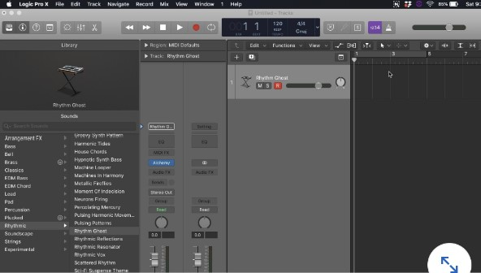
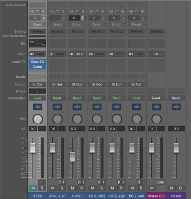
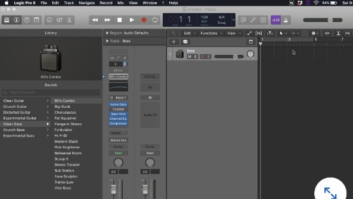

## Logic Pro

#### Q1. You recorded a MIDI bassline on a software instrument track containing an ES2 synth. It is not perfectly in tie. What can you use to alter the timing of your part?

- [ ] Arpeggiator
- [ ] the Flex tool
- [ ] beat mapping
- [x] quantization

[Source](https://macprovideo.com/article/audio-software/quantizing-in-logic-the-essentials)

#### Q2. Which button open the left window panes in the Arrange window?

- [ ] Library and Inspector
- [ ] Step Input Keyboard
- [x] Smart Controls
- [ ] Loop Browser

[Source](https://www.youtube.com/watch?v=IBIxewqcMiM&ab_channel=MusicTechExplained)

#### Q3. When you drag and drop an audio file from the Finder to the empty space in the main window, what happens?

- [ ] You software instrument tracks auto-mute
- [x] A new audio track is created named after that file
- [ ] A warning dialog box asks where you want to save this file
- [ ] Logic will not allow you to do this

[source](https://support.apple.com/it-it/guide/logicpro/lgcpd1e675e5/mac)

#### Q4. You are using a lot of plug-ins and are running out of processing power in your mix, Besides printing the audio of the track, how can you preserve processing power on tracks wit plug-ins that do not need to be automated?

- [ ] Restart your computer
- [ ] Save more often
- [x] Select Track header components > show freeze and freeze any tack on which you do not need to automate plug-ins
- [ ] lower the sample rate and bit depth of your project, and upsample when you are done mixing

#### Q5. What is an indicator that your show advanced tools check vox is not selected, resulting in beginner mode?

- [x] The sides of the main windows resemble wood panels
- [ ] The toolbar is a light shade of green
- [ ] The main windows is a light shade of green
- [ ] The project name contains the extra extension .beg

Source: This is in practice mode

#### Q6.You would like to use your cycle range to skip over a section instead of looping it. How do you do this?

- [ ] This is possible only from the Event List
- [ ] Go to Edit > Trim > Outside Locators
- [ ] Press Command + Shift + S
- [x] Control + Click the cycle range and select Swap Left and Right Locators

[Source](https://support.apple.com/it-it/guide/logicpro/lgcp9b92f74c/mac)

#### Q7.Why would you create an external MIDI track?

- [ ] to initiate an advanced surround sound mix
- [ ] to communicate with another studio outside your current Wi-Fi network
- [x] to play an attached hardware sampler instrument from a MIDI sequence on your track
- [ ] to enable higher sample rate audio recording

[source](https://www.blipinteractive.co.uk/nanostudio2/user-manual/ExtMIDIInstrument.html)

#### Q8. What does this image show?

- [ ] Drummer track
- [x] External MIDI track
- [ ] Audio track
- [ ] software instrument track

#### Q9. You are ready to bounce your two-hour movie mix, but you want to bounce the audio as a WAV and an MP3 at the same time. Can this be done?

- [x] Yes, choose PCM and MP3 destination in the File > bounce > project or section
- [ ] No, this cannot be done
- [ ] Yes, set up two separate output faders with the different destinations set in the output
- [ ] You have to bounce a second time to make a separate file

[Source](https://support.apple.com/it-it/guide/logicpro/lgcp785a41c3/mac)

#### Q10. Why is important to save your project before recording audio?

- [ ] to have access to advanced recording modes
- [ ] to make sure that the Record button can be enabled
- [x] so that the recorded files go into a project folder associated with your project
- [ ] to engage cycle mode more easily

#### Q11. Is this image, what order dows the signal flow through the plug-ins?

- [ ] first the reverb, then the auxiliary
- [x] first the compressor, then the EQ
- [ ] it depends on how you set up your audio settings in Project Settings
- [ ] first the EQ, then the compressor

#### Q12. What is the default region length when you open a Drummer track into an empty project?

- [ ] Drummer dows not populate its track with any regions by default
- [ ] the default is the length of your timeline until the end marker
- [x] The default is eight bars
- [ ] It changes depending on the Drummer personality

[Source](https://support.apple.com/guide/logicpro/drummer-lgcpa4324884/mac#:~:text=Add%20a%20Drummer%20track,-In%20the%20Logic&text=A%20Drummer%20track%20is%20added,is%20loaded%20to%20the%20track.)

#### Q13. What happens when you create a send on an available bus?

- [ ] That audio leaves your interface to an outboard piece of gear
- [ ] You get an automatic reverb send
- [x] An aux tack with its input set to that bus is automatically created
- [ ] You get an automatic delay send

[Source](https://musictech.com/tutorials/logic-pro/using-bus-sends-and-aux-channels-in-logic-pro-x/#:~:text=If%20you%20intend%20to%20have,all%20the%20respective%20bus%20sends.)

#### Q13. When you load up a patch, what happens?

- [ ] The session automatically saves
- [x] The channel strip is loaded with any of the following: plug-ins, aux sends, MIDI FX, and/or software instruments
- [ ] The main window is saved as a screenset
- [ ] The environment window opens

[Source](https://support.apple.com/en-us/HT202738)

#### Q14. You want to set a range of playback in the main windows and have the playhead stop. What tool can you make a selection with to make this happen?

- [ ] The pointer tool
- [x] The marquee tool
- [ ] The flex tool
- [ ] The pencil tool

[Source](https://www.shortcutfoo.com/app/dojos/logic-pro-x-mac/cheatsheet)

#### Q15. What dows this image show?

- [x] low-end booster
- [ ] audio track
- [ ] external MIDI track
- [ ] software instrument track

#### Q16. When opening Logic Pro X, you are presented by default with the Choose a project dialog box, how do you change this default behavior?

- [ ] Click Window > Open Project Audio
- [ ] Press Shift+Command+4
- [ ] Click File > Project Settings > General and select Song Startup Action
- [x] Click Preference > General > Project Handling > Startup Action and select the action of you choice

[Source](https://support.apple.com/guide/logicpro/project-handling-preferences-lgcp43defb63/mac)

#### Q17. When you open and work in a stock project template, such as Electronic what happens when you click Save?

- [ ] You will lose your changes
- [ ] You are focred to use a new project name, since you cannot save over a template.
- [x] You can save over the template
- [ ] You create a new template

[Source](https://support.apple.com/guide/logicpro/save-projects-lgcpce128e82/mac)

#### Q18. How do you split a region in the location where your playhead is?

- [ ] Press Command+T
- [x] Select Window > Split Region
- [ ] Press Command+R
- [ ] all of these answers

[Source](https://logicpro.skydocu.com/en/create-a-song-arrangement/arrange-regions-in-the-tracks-area/split-regions/)
