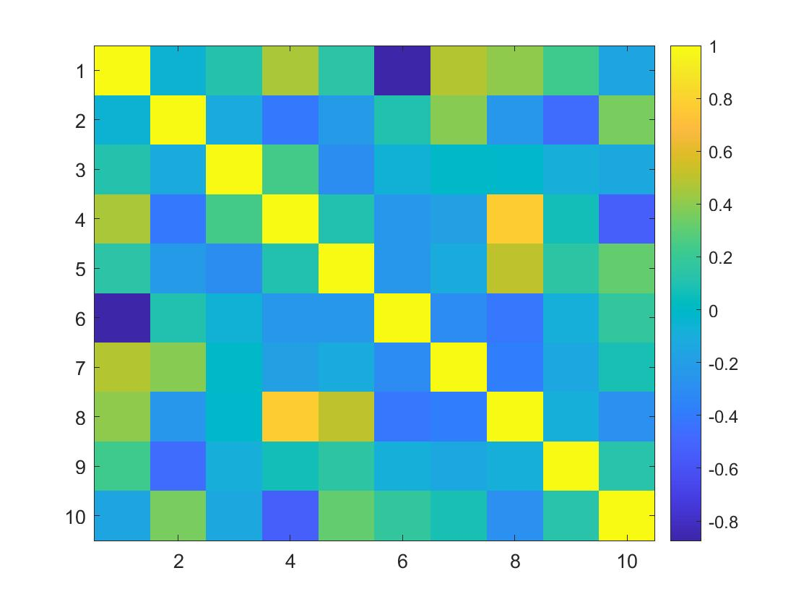

## MATLAB Assessment

#### Q1. From what distribution does the `rand()` function return value?

- [ ] normal
- [ ] poisson
- [ ] binomial
- [x] uniform

#### Q2. Based on the code below, c is the **\_** of a.

```MATLAB
a = rand(1, 11);
b = sort(a);
c = b(1, ceil(end/2));
```

- [x] median
- [ ] mode
- [ ] mean
- [ ] margin

#### Q3. What does the Profiler track?

- [x] execution time
- [ ] command history
- [ ] errors
- [ ] the value of variables

#### Q4. Which code block contains the correct syntax for a `while` loop?

- [ ]

```MATLAB
a = 0;
do
    a = a + 1;
while a < 5
end
```

- [ ]

```MATLAB
a = 0;
while(a < 5)
    a = a + 1;
```

- [ ]

```MATLAB
a = 0;
while a < 5:
    a = a + 1;
```

- [x]

```MATLAB
a = 0;
while a < 5
    a = a + 1;
end
```

#### Q5. What does `b` contain?

```MATLAB
a =
    19    20    12     0     6
     6     9    56     0     3
    46     8     9     8    19
     9     8     8    19    46
     1     9    46     6    19
```

- [x]

```MATLAB
b =

    56     0
     9     8
```

- [ ]

```MATLAB
b =

     8    19
    19    46
```

#### Q6. You have written a function `myfun` and want to measure how long it takes to run. Which code segment will return in `t` the time in seconds it takes `myfun` to run?

- [ ]

```MATLAB
t = cputime(myfun());
```

- [x]

```MATLAB
tic;
myfun();
toc;
```

- [ ]

```MATLAB
timer.start;
myfun()
t = timer.stop;
```

- [ ]

```MATLAB
t = timer(myfun());
```

#### Q7. What is `%%` used for?

- [ ] argument placeholder
- [ ] block quotes
- [x] code sections
- [ ] conversion specifier

#### Q8. what is the `.` character NOT used for?

- [ ] structure field access
- [ ] a decimal point
- [x] cell array access
- [ ] element-wise operations

#### Q9. Which function could you use for multiple linear regression?

- [ ] polyval
- [x] regress
- [ ] solve
- [ ] polyfit

#### Q10. For which of these arrays do `mean`, `median`, and `mode` return the same value?

- [x] [0 1 1 1 2]
- [ ] [1 3 5 5 6]
- [ ] [0 1 1 1 1]
- [ ] [0 0 5 5 5]

#### Q11. You are in the middle of a long MATLAB session where you have performed many analyses and made many plots. You run the following commands, yet a figure window doesn't pop up on the top of your screen with your plot. What might be the issue?

```MATLAB
x = [-1:0.1:1];
y = X.^2;
plot(x, y)
```

- [ ] Your plot doesn't plot in a figure window because `figure` was not called immediately in advance.
- [ ] Your `plot` syntax is incorrect.
- [x] Your plot is in a figure window that was already open, hidden behind other windows on your screen.
- [ ] Your plot was saved to an image file but not displayed.

#### Q12. How do you access the value for the field `name` in structure S?

- [ ] S['name']
- [x] S.name
- [ ] S('name')
- [ ] S{'name'}

#### Q13. What built-in definition does i have?

- [x] basic imaginary unit
- [ ] index function
- [ ] infinity
- [ ] index variable

#### Q14. Which statement is equivalent to this for loop?

```MATLAB
a = [1 2 3; 4 5 6];
b = zeros(size(a));
for i_row = 1:size(a, 1)
    for i_col = 1:size(a, 2)
        b(i_row, i_col) = a(i_row, i_col)^2;
    end
end
```

- [ ] b = a\*a;
- [x] b = a.^2;
- [ ] b = a^2;
- [ ] b = pow2(a);

#### Q15. You have plotted values of cosine from -10 to 10 and want to change the x-axis tick marks to every pi, from -3*pi to 3*pi. Which statement will do that?

- [ ] xticks(-3*pi:3.14:3*pi)
- [x] xticks(-3*pi:pi:3*pi)
- [ ] xticks(linespace(-3*pi(), 3*pi(), pi()))
- [ ] xticks(linespace(-3*pi, 3*pi, pi)

#### Q16. What is the value of `c`?

```MATLAB
a = ones(1,3);
b = 1:3;
c = conv(a,b)
```

- [ ] [-1 2 -1]
- [x] [1 3 6 5 3]
- [ ] 6
- [ ] [1 -2 1]

#### Q17. Which function CANNOT be used to randomly sample data?

- [ ] datasample
- [ ] randi
- [x] resample
- [ ] randperm

#### Q18. Which choice is correct syntax for a `switch` statement?

- [x]

```MATLAB
x = 7;
switch x
    case 2
        disp("two");
    otherwise
        disp("not two");
end
```

- [ ]

```MATLAB
x = 7;
switch x :
    case 2
        disp("two");
    otherwise
        disp("not two");
end
```

- [ ]

```MATLAB
x = 7;
switch x
    case 2
        disp("two");
    else
        disp("not two");
end
```

- [ ]

```MATLAB
x = 7;
switch x
    case 2
        disp("two");
    default
        disp("not two");
end
```

#### Q19. What is the result of this code?

```MATLAB
a = 1;
b = 2;
c = 3;
d = 4;
e = c / (~a - b == c - d);
```

- [ ] Error
- [ ]

```MATLAB
c =

    NaN
```

- [x]

```MATLAB
c =

    Inf
```

- [ ]

```MATLAB
c =

    -0.2500
```

#### Q20. What is true of a handle class object?

- [ ] When you pass a handle object to a function, a new object is made that is independent of the original.
- [x] All copies of handle objects refer to the same underlying object.
- [ ] Handle object cannot reference one another.
- [ ] Handle object do not have a default `eq` function.

#### Q21. Which choice has a different final result in `f10` than the other three?

- [ ]

```MATLAB
f10 = 1;
for i = 1:10
    f10 = f10 * i;
end
```

- [ ]

```MATLAB
f10 = factorial(10)
```

- [x]

```MATLAB
f10 = 1;
i = 1;
while i <= 10
    i   = i + 1;
    f10 = i * f10;
end
```

- [ ]

```MATLAB
f10 = prod(1:10)
```

#### Q22. Which choice will NOT give you a 5 x 5 identity matrix?

- [ ]

```MATLAB
a = rand(5);
round(a * inv(a))
```

- [ ]

```MATLAB
diag(ones(5, 1))
```

- [x]

```MATLAB
identity(5)
```

- [ ]

```MATLAB
eye(5)
```

#### Q23. Which statement creates this structure?

```MATLAB
dog =

      name: 'Bindy'
     breed: 'border collie'
    weight: 32
```

- [ ]

```MATLAB
dog = struct('name', 'Bindy'; 'breed', 'border collie'; 'weight', 32);
```

- [x]

```MATLAB
dog.name   = 'Bindy';
dog.breed  = 'border collie';
dog.weight = 32;
```

- [ ]

```MATLAB
dog = {
    'name'  : 'Bindy',
    'breed' : 'border collie',
    'weight': 32;
}
```

- [ ]

```MATLAB
dog('name')   = 'Bindy';
dog('breed')  = 'border collie';
dog('weight') = 32;
```

#### Q24. `my_func` is a function as follows. What is the value of `a` at the end of the code beneath?

```MATLAB
function a = my_func(a)
    a = a + 1;
end
------------------
a = 0;
for i = 1:3
    my_func(a);
end
a = my_func(a);
```

- [ ] 4
- [ ] 3
- [ ] 0
- [x] 1

#### Q25. Which statement could create this cell array?

```MATLAB
c =

    {["hello world"]}    {1×1 cell}    {["goodbye"]}    {1×3 double}
```

- [ ] c = {"hello world" {"hello"} "goodbye" [1 2 ]};
- [ ] c = {"hello world" {"hello"} "goodbye" {[1 2 3]}};
- [x] c = {"hello world" {"hello"} "goodbye" [1 2 3]};
- [ ] c = {"hello world" {"hello" "hello"} "goodbye" {[1 2 3]}};

#### Q26. Which choice adds `b` to each row of `a`?

```MATLAB
a = ones(4, 4);
b= [1 2 3 4];
```

- [ ] a = a + reshape(b, 4, 1);
- [ ] a = a + b';
- [x] a = a + repmat(b, 4, 1);
- [ ] a = a + [b b b b];

#### Q27. Which choice replaces all `a`s with `o`s?

- [ ]

```MATLAB
for i = 1:length(fruit)
    fruit{i}(fruit{i} == a) == o;
end
```

- [ ]

```MATLAB
for i = 1:length(fruit)
    fruit(i)(fruit(i) == 'a') == 'o';
end
```

- [x]

```MATLAB
for i = 1:length(fruit)
    fruit{i}(fruit{i} == 'a') == 'o';
end
```

- [ ]

```MATLAB
for i = 1:length(fruit)
    fruit{i}(fruit{i} == 'a') == 'o';
```

#### Q28. Which statement returns the roots for the polynomial `x^2 + 2x - 4`?

- [ ] poly([1 2 -4])
- [ ] solve(x^2 + 2x - 4 == 0)
- [ ] polyfit(x^2 + 2x - 4 == 0)
- [x] roots([1 2 -4])

#### Q29. Which choice is the proper syntax to append a new elements `a` to the end of 1x 2 dimensional cell array `C`?

- [ ] C = {C a};
- [ ] C = cellcat(C a)
- [ ] C = cat(2, {a}, C)
- [x] C{end+1}=a

#### Q30. You have loaded a dataset of people's heights into a 100 x 1 array called `height`. Which statement will return a 100 x 1 array, `sim_height`, with values from a normal distribution with the same mean and variance as your height data?

- [ ] sim_height = std(height) + mean(height) \* randn(100, 1);
- [x] sim_height = mean(height) + std(height) \* randn(100, 1);
- [ ] sim_height = randn(std(height), mean(height), [100, 1]);
- [ ] sim_height = randn(mean(height), std(height), [100, 1]);

#### Q31. Which statement returns a cell array of the strings containing '`burger`' from `menu`?

```MATLAB
menu = {'hot dog' 'corn dog' 'regular burger' 'cheeseburger' 'veggie burger'}
```

- [ ] menu{strfind(menu, 'burger')}
- [ ] menu(strfind(menu, 'burger'))
- [ ] menu{contains(menu, 'burger')}
- [x] menu(contains(menu, 'burger'))

#### Q32. What is the set of possible values that `a` may contain?

```MATLAB
a      = randi(10, [1, 10]);
a(3)   = 11;
a(a>2) = 12;
```

- [ ] 3, 4, 5, 6, 7, 8, 9, 10, 11, 12
- [x] 1, 2, 12
- [ ] 2, 11, 12
- [ ] 1, 12

#### Q33. Which statement is true about the sparse matrices?

- [ ] You can use the `sparse` function to remove empty cells from cell array variables.
- [x] Sparse matrices always use less memory than their associated full matrices.
- [ ] Mixtures of sparse and full matrices can be combined in all of MATLAB's built-in arithmetic operations.
- [ ] The `sparse` function requires its input to be a full matrix with at least 50% zero elements.

#### Q34. Which statement using logical indices will result in an error?

```MATLAB
a = 1:10;
```

- [ ] b = a(a ~= 11)
- [ ] b = a(a == 1)
- [x] b = a(a>6 && a<9)
- [ ] b = a(a | 1)

#### Q35. Which statement turns `menu` into the variable `menu_string` below?

```MATLAB
menu = {'hot dog' 'corn dog' 'regular burger' 'cheeseburger' 'veggie burger'}

menu_string =

    'hot dog
     corn dog
     regular burger
     cheeseburger
     veggie burger'
```

- [x] menu_string = cell2mat(join(menu, newline))
- [ ] menu_string = cell2mat(join(menu, '\n'))
- [ ] menu_string = join(menu, newline)
- [ ] menu_string = cell2mat(pad(menu))

#### Q36. Which code snippet sets a new random seed based on the current time and saves the current settings of the random number generator?

- [x]

```MATLAB
rng_settings_curr = rng('shuffle');
```

- [ ]

```MATLAB
rng(time());
rng_settings_curr = rng();
```

- [ ]

```MATLAB
rng_settings_curr = rand('shuffle');
```

- [ ]

```MATLAB
rng('shuffle');
rng_settings_curr = rng();
```

#### Q37. You have a matrix `data` in which each column is mono audio recording from a room in your house. You've noticed that each column has a very different mean and when you plot them all on the same graph, the spread across the y axis make it impossible to see anything. You want to subtract the mean from each column. Which code block will accomplish this?

- [ ]

```MATLAB
data_nomean = data - repmat(median(data), size(data, 1), 1);
```

- [x]

```MATLAB
data_nomean = bsxfun(@minus, data, mean(data));
```

- [ ]

```MATLAB
data_nomean = zeros(size(data));
for i = 1:size(data, 1)
    data_nomean(i, :) = data(i, :) - mean(data(i, :));
end
```

- [ ]

```MATLAB
data_nomean = zscore(data');
```

#### Q38. Which code block results in an array `b` containing the mean values of each array within `C`?

- [ ]

```MATLAB
b = zeros(1, size(C, 2));
for i_C = 1:size(C, 2)
    b(i_C) = mean(C(i_C));
end
```

- [ ]

```MATLAB
b = cellfun(@mean, C);
```

- [ ]

```MATLAB
b = zeros(1, size(C, 1));
for i_C = 1:size(C, 1)
    b(i_C) = mean(C{i_C}(:));
end
```

- [x]

```MATLAB
b = cellfun(@(m) mean(m(:)), C)
```

#### Q39. Which statement creates a logical array that is 1 if the element in `passwords` contains a digit and 0 if it does not?

```MATLAB
passwords = {'abcd' '1234' 'qwerty' 'love1'};
```

- [ ] contains(password, '\d')
- [ ] ~isempty(regexp(passwords, '\d'))
- [x] cellfun(@(x) ~isempty(regexp(x, '\d')), passwords)
- [ ] regexp(passwords, '\d')

#### Q40. Which is NOT a function that adds text to a plot?

- [ ] title
- [ ] text
- [x] label
- [ ] legend

#### Q41. Which code block most likely produced this graph?



- [ ]

```MATLAB
figure
x = rand(10,10);
r = corrcoef(x);
surf(r)
colorbar
```

- [x]

```MATLAB
figure
x = rand(10,10);
r = corrcoef(x);
imagesc(r)
colorbar
```

#### Q42. What kind of files are stored with the .mat extension?

- [ ] figure files
- [ ] script files
- [ ] function files
- [x] stored variable files

#### Q43. You would like to randomly reorder every element in array a and put the result into another array b. Which code is NOT necessary to do that?

```MATLAB
a = 1:10;
```

- [x]

```MATLAB
b = a(randi(10, 1, 10));
```

- [ ]

```MATLAB
m = perms(a);
i = randi(factorial(10), 1);
b = a(m(i, :))
```

- [ ]

```MATLAB
[s, j] = sort(rand(10, 1));
b      = a(i);
```

- [ ]

```MATLAB
b = a(randperm(10));
```

#### Q44. Which statement returns **1** (true)?

```MATLAB
a = 'stand'
b = "stand"
```

- [x] a == b
- [ ] ischar(b)
- [ ] length(a) == length(b)
- [ ] class(a) == class(b)

#### Q45. Which does E contain?
```MATLAB
C = {'dog' 'cat' 'mouse'}
D = {'cow' 'piranha' 'mouse'}
E = setdiff(C,D)
```

- [x] E = {'cat'} {'dog'}
- [ ] E = {'mouse'}
- [ ] E = {'cat'} {'cow'} {'dog'} {'piranha'}
- [ ] E = 

