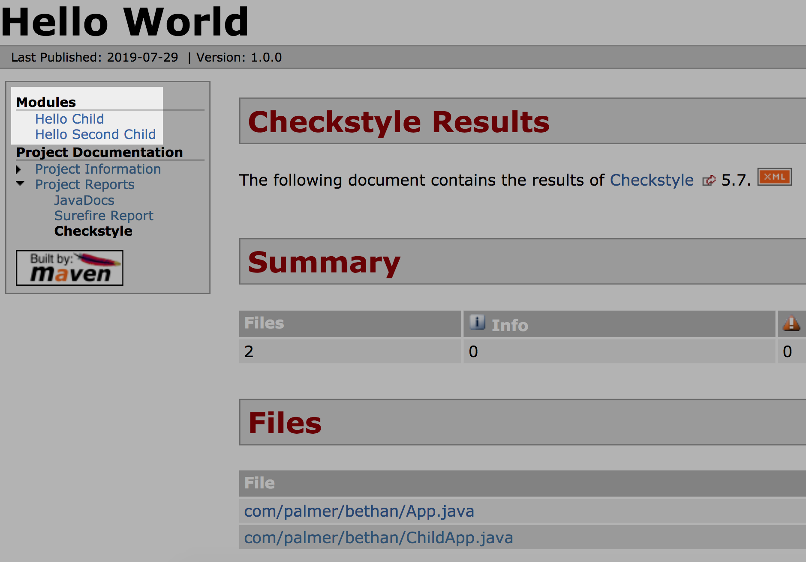

## Maven

#### Q1. What element in the pom.xml file allows you to provide values that can be reused in other elements of the pom.xml?

- [ ] Plugins
- [ ] Build
- [ ] Properties
- [x] Parent

#### Q2. If you wish to build and package your artifact using the Maven package goal but don't want to execute the unit tests, which environment variable and value would you use?

- [ ] `maven.test.ignore=TRUE`
- [ ] `maven.test.run=FALSE`
- [x] `maven.test.skip=TRUE`
- [ ] `maven.verify.execute=FALSE`

#### Q3. When building a Maven EAR project and specifying the configuration of which projects to include, what is the element in the plugin configuration that contains Enterprise Java Bean projects?

- [ ] modules/webModule
- [x] modules/ejbModule
- [ ] modules/enterpriseModules
- [ ] modules/services

#### Q4. The goal that is executed to generate and deploy a documentation website is \_.

- [ ] deliver
- [x] site
- [ ] doc
- [ ] deploy

#### Q5. What does the `mvn -version` command do?

- [ ] It builds your Maven project.
- [ ] It installs Maven on your computer.
- [ ] It updates Maven to the latest version.
- [x] It print out your installed version of Maven.

#### Q6. There are several properties available for use in a pom.xml file that refer to details of the project, such as groupId and version. What do all of these properties start with?

- [ ] pom
- [ ] maven
- [ ] jar
- [x] project

#### Q7. What directory structure contains the source code of your artifact?

- [ ] src/code
- [ ] src/test/java
- [x] src/main/java
- [ ] src/main/resources

#### Q8. Which command is used to run the clean lifecyle followed by verify, install, and package with Maven?

- [ ] `mvn clean istall package`
- [x] `mvn package`
- [ ] `mvn clean install`
- [ ] Option 4

```shell script
mvn clean
mvn package
mvn verify
mvn install
```

#### Q9. Which goal would you use with the Dependency plugin to determine which included dependencies are not used, as well as those you are using that you have not defined?

- [ ] `dependency:tree`
- [ ] `dependency:properties`
- [ ] `dependency:evaluate`
- [x] `dependency:analyze`

#### Q10. In a multimodule project, if you have a plugin bound to a phase in the parent, it will be bound to the same phase in the module. What strategy could you employ to prevent the plugin from executing in the module?

- [ ] In the excluded element of the build section of the POM, list the plugin you do not want to run.
- [ ] Set the phase in the module to none.
- [x] Set a value in the configuration of the plugin in the module to be excluded like this: TRUE.
- [ ] Do not specify the plugin in the module.

#### Q11. When building a web application with a WAR type project, which project directory should contain the style sheet, JavaScript, and other static file?

- [ ] src/main/static
- [ ] src/main/web
- [ ] src/main/resources
- [x] src/main/webapp

#### Q12. When performing a build, which Maven plugin will allow you to set the specific version of the artifact to be built without manual modifying the pom.xml file?

- [ ] Compiler
- [ ] Surefire
- [x] Versions
- [ ] Javadoc

#### Q13. When building a Maven Archetype, what is the filepath and file of the archetype descriptor that specifies how to lay out the prototype files?

- [ ] `src/main/template/descriptor.xml`
- [x] `src/main/resources/META-INF/maven/archetype-descriptor.xml`
- [ ] `src/main/archetype/descriptor.xml`
- [ ] `src/main/resources/META-INF/maven/maven-archetype.xml`

#### Q14. What is a valid packaging type for a Maven project?

- [ ] WAR
- [x] all of these answers
- [ ] POM
- [ ] EAR

#### Q15. When two dependencies of your Maven project introduce the same transitive dependency with different versions, which one(s) will be included in the dependency list for your project?

- [ ] the dependency with the higher version
- [ ] the transitive dependency that comes from the dependency listed first in the pom.xml file
- [ ] the transitive dependency that comes from the dependency listed last in the pom.xml file
- [x] the transitive dependency version of the artifact that is closest to your project

#### Q16. Many organizations set up local mirrors to the Maven central repository. In order to leverage your company's Maven repository as a proxy for the Maven central repository, which element should you put into the settings.xml file?

- [ ] Replacements
- [ ] Proxies
- [ ] Mirrors
- [x] LocalRepositories

#### Q17. Which Maven plugin would you leverage to specify the version of the compiler to target as well as the source level of the language?

- [ ] Versions
- [ ] Surefire
- [ ] Target
- [x] Compiler

#### Q18. If your machine is behind a proxy, where should you specify the proxy server settings in order for Maven to access remote resources?

- [ ] `.m2/proxy.txt`
- [ ] `pom.xml`
- [ ] `proxy.xml`
- [x] `settings.xml`

#### Q19. What environment variable can you alter to increase the memory Maven uses?

- [x] MAVEN_OPTS
- [ ] M2_HOME
- [ ] MAVEN_MEMORY
- [ ] PATH

#### Q20. How can you use Maven to run unit tests in parallel?

- [ ] It is not possible to do this.
- [ ] Implement the JUnit dependency and add a configuration that sets the parallel element to true.
- [x] Specify the Maven Surefire Plugin and add a configuration that sets the parallel element to true.
- [ ] Move each test suite into a separate submodule.

#### Q21. What will the mvn dependency:tree command do?

- [ ] Verify the dependencies defined in the POM file.
- [x] Print out a report of your project's dependencies in a tree format.
- [ ] Download all the transitive dependencies.
- [ ] Prune unused dependencies from your dependency tree.

#### Q22. How do you run a single unit test in Maven?

- [ ] Maven runs only a single unit test by default.
- [x] Use the -Dtest= flag and pass in the name of the test.
- [ ] Use a plugin that can specify the test you want to run.
- [ ] It is not possible to do this.

#### Q23. How can Maven profiles be triggered?

- [ ] by explicitly calling the profiles using the -P flag
- [ ] based on environment variables
- [x] all of these answers
- [ ] through Maven settings

#### Q24. Why will an mvn install command not deploy any artifacts to a remote repository?

- [ ] The name of the artifact must also be specified in the command.
- [ ] The name of the remote repository must also be specified in the command.
- [ ] Deploying artifacts to a remote repository must be done manually.
- [x] The deploy phase of the default Maven lifecycle comes after the install phase.

#### Q25. Suppose you want to include a properties file in the JAR generated by your Maven build. What directory should you put it in?

- [x] `${basedir}/src/main/resources`
- [ ] `${basedir}/src/main/java/resources`
- [ ] `${basedir}/resources`
- [ ] `${basedir}/src/main/properties`

#### Q26. Which structure in a settings.xml file allows for flexing properties based on some value for the runtime of Maven?

- [ ] Environment
- [ ] Properties
- [ ] Switch
- [x] Profiles

#### Q27. What does it mean if the scope of a dependency is runtime?

- [x] The dependency is not required to compile the project, but is needed at runtime.
- [ ] The dependency is needed at compile time and at runtime, and must be packaged for distribution.
- [ ] The dependency is needed at compile time and at runtime, but does NOT need to be packaged for distribution.
- [ ] The dependency is required for compilation.

#### Q28. If you want to utilitze a locally developed JAR file in another project and that JAR file has not been deployed to either the Maven central repository or your own locally sourced mirror repository, what Maven goal do you need to execute on the locally developed JAR project?

- [ ] package
- [x] install
- [ ] compile
- [ ] test

#### Q29. What is the default packaging type for a Maven project build artifact?

- [ ] WAR
- [x] JAR
- [ ] EAR
- [ ] POM

#### Q30. What does the following command do?

    > mvn archetype:generate \
    -DgroupID=sample-maven-project \
    -DartifactID=com.palmer.bethan.sample \
    -Dversion=1.0.0 \
    -DinteractiveMode=false

- [ ] It does nothing since no archetype has been specified
- [ ] It generates a new Maven archetype
- [x] It generates a new Maven projet using the default Maven archetype
- [ ] It cleans and installs the sample-maven-project project

#### Q31. When defining a dependency that is included with the runtime container, what scope do you use in the pom.xml?

- [x] provided
- [ ] compile
- [ ] execution
- [ ] runtime

#### Q32. What argument do you pass to Maven in order to update SNAPSHOT from the remote repository?

- [x] -U
- [ ] -J
- [ ] -X
- [ ] -S

#### Q33. When performing a release using the Maven release plugin, which environment variable for batch mode is used to define the stamp placed in SCM to indicate the state of the artifact for the actual release?

- [ ] tag
- [ ] scmMark
- [ ] developmentVersion
- [x] releaseVersion

#### Q34. These are two general uses of plugins. The first is build and the second is \_

- [x] reporting
- [ ] servers
- [ ] dependencies
- [ ] distribution management

#### Q35. What does the mvn clean command do?

- [x] It removes the target directory
- [ ] It updates the version of the plugins defined in the POM file.
- [ ] It removes unused dependencies in your project
- [ ] It builds your project

#### Q36. If you want to utilize a locally develop JAR file in another project and that JAR file has not been deployed to either the Maven central repository or your own locally sourced mirror repository, what Maven goal do you need to execute on the locally developed JAR project?

- [x] install
- [ ] test
- [ ] compile
- [ ] package

#### Q37. Bellow is a definition of the Maven JAR Plugin, where the main class is set to com.palmer.bethan.App. What is the effect of this?

```
<configuration>
    <archive>
        <manifest>
            <addClasspath>true</addClasspath>
            <mainClass>com.palmer.bethan.App</mainClass>
        </manifest>
    </archive>
</configuration>
```

- [ ] Maven will generate javadocs for the App class.
- [x] Maven will generate an executable JAR, which can be used to run the App class.
- [ ] Maven will include only the App class when it compiles the source code.
- [ ] Maven will add an empty main method to the App class.

#### Q38. Suppose you are packaging a Maven project and see the following error "[WARNING] Using platform encoding (CP1252 actually) to copy filtered resources, i.e. build platform dependent!" What do you add to your POM file to set platform encoding to ensure your build is not platform dependet ?

- [ ] <project.build.resources>
- [ ] <maven.compiler.source>
- [x] <project.build.sourceEncoding>
- [ ] <project.compiler.encoding>

#### Q39. Why might you not want to include groupId and version elements in child POM files?

- [x] all of these answers
- [ ] dependencies
- [ ] version
- [ ] groupId

#### Q40. The settings.xml file that provides the user-specific settings for Maven is contained in which directory by default?

- [ ] `${maven.home}/${user.name}/settings.xml`
- [x] `${user.home}/.m2/settings.xml`
- [ ] `${maven.home}/conf/settings.xml`
- [ ] `${user.home}/maven/settings.xml`

#### Q41. Suppose you are using Maven in a corporate environment and, to save bandwidth, you want to prevent the need for large numbers of developers to download the same dependency from the internet. What do you do to limit this?

- [x] Create an internal corporate repository to store copies of the necessary artifacts.
- [ ] It is not possible to do this.
- [ ] When defining the dependency, set the scope to provided.
- [ ] Each developer should define the dependency in the POM file in the local copy of the project.

#### Q42. In multimodule projects, what do child POMs inherit from the parent POM?

- [x] all of these answers
- [ ] dependencies
- [ ] groupId
- [ ] version

#### Q43. Below is a report generated for a multimodule project with the Checkstyle Plugin. Why might the highlighted links to the two child projects _not_ work?



- [ ] The Checkstyle Plugin does not work on child modules.
- [ ] Each Checkstyle report is in the target/site folder of the respective module.
- [ ] All links in Checkstyle reports must be specified in the plugin definition.
- [ ] Checkstyle reports for child modules have to be behind a firewall.

#### Q44. Which build plugin allows you to create a "fat" JAR file that contains all of the dependencies in the final JAR file?

- [ ] Fatjar
- [x] Shade
- [ ] Dependency
- [ ] Package

#### Q45. What is the default scope for Maven dependencies?

- [ ] Test
- [x] Compile
- [ ] Runtime
- [ ] Build

#### Q46. How many times is compiler:compile called when executing mvn clean compile test package?

- [ ] one
- [ ] two
- [ ] none
- [ ] three

#### Q47. What is one of the advantages of using properties in Maven?

- [ ] Properties provide a template for you to build Maven projects with a certain structure.
- [ ] Properties allow you to inherit values from the parent POM in the child POM.
- [x] You can avoid hard-coding values in multiple places.
- [ ] Properties speed up your Maven build.

#### Q48. What are the phases of the clean lifecycle?

- [x] pre-clean,clean and post-clean
- [ ] Compile, clean and install
- [ ] clean and install
- [ ] validate, clean and deploy

#### Q49. A compile-time dependency of a dependency for your project is often called **a\_** dependency.

- [ ] Transitive
- [ ] runtime
- [ ] provided
- [ ] test
