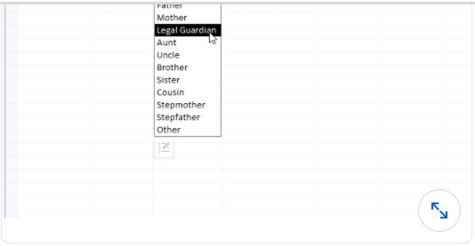

# Microsoft Access Assessment

#### Q1. Which form view mode allows you to preview live data while you work on the design of the form?

- [ ] **Preview** view
- [ ] **Layout** view
- [ ] **Design** view
- [ ] **Form** view

#### Q2. How can you add multiple view button controls to a form at once? 

- [ ] Double-click the button control to lock it on, then left-click in the form to add each button
- [ ] Right-click the button control and select Drop Multiple Controls. Then left-click to add each button to a form
- [ ] Select the Multiple Object check box in the Design tab before selecting the button control
- [ ] Left-click the button control to select it, then add multiples to the form by right-clicking in the position you'd like to add them

#### Q3. What is the Access string operator that joins or concatenates text strings together?

- [ ] &
- [ ] !
- [ ] #
- [ ] +

#### Q4. The relationship field in this table has been created with what feature?

- [ ] lookup
- [ ] reference integrity
- [ ] pick list
- [ ] validation rule

#### Q5. On a report, you want to display a header for each change in month name. How should you set up the Group and Sort options so that they are in the proper chronological order?

- [ ] Sort on month number, then sort on month name
- [ ] Sort on month number, then group on month name
- [ ] Group on month number, then sort by month name
- [ ] Group on month number, then sort on month number

#### Q6. What kind of query will display data with both column headers and row headers?

- [ ] crosstab
- [ ] select
- [ ] simple
- [ ] spreadsheet

#### Q7. What currency format displays a thousand separator, but not a currency symbol, such as $ or €?

- [ ] Scientific
- [ ] Standard
- [ ] General Number
- [ ] Fixed

#### Q8. In Access Option > Current Database, what does turning off the Allow Full Menus option do?

- [ ] removes the ribbon interface
- [ ] removes all ribbon tabs except Home and Print Preview
- [ ] disable the right-click menu when working with objects
- [ ] removes the **Design** view contextual tabs, which forces most design changes to be made in **Layout** view

#### Q9. You want to create a form to view customer's details, as well as some information about all order that the customer has placed with your company. What is the best way to display this information on a single screen?

- [ ] Use a form to display the customer details with a subform linked to their order information
- [ ] Create a split form that displays the customer information at the top and the order history in the table below
- [ ] Create a navigation form that includes a form for the customer details and a separate form for the order history
- [ ] Create a continous form that uses a query to gather all of the customer details and order history in a single record source

#### Q10. You want a form to appear automatically, whenever the database starts. How do you do this?

- [ ] In the **Access Options** dialog box, click **Current Database**, then select the form you want to open in the **Display Form** property
- [ ] Open the form you want to display automatically in **Design** view. Then in the property sheet, set **Open on Launch** to **true**
- [ ] Right-click the form you want to open automatically and select **Startup Form**
- [ ] On the **Database Tools** tab, click **Database Options**, then set the form you want to open as the **Initial View** object

#### Q11. In Design view, which area of a form is the primary location for text boxes, buttons, and other control objects?

- [ ] **Page Layout**
- [ ] **View** section
- [ ] Form body
- [ ] **Detail** section

#### Q12. What tool builds a report containing detailed information about the object in the database?

- [ ] Object dependencies
- [ ] Table analyzer
- [ ] Access database manager
- [ ] Database documenter

#### Q13. You want to validate a proposed modification to a record's value before the table is saved to the database. What data macro can you add to the table to do this?

- [ ] After Insert
- [ ] Before Change
- [ ] After Update
- [ ] Before Delete

#### Q14. When you add a group to a report, what automatically gets added to the structure?

- [ ] a group header
- [ ] nothing
- [ ] a group header and footer
- [ ] a group footer

#### Q15. A table contains a field with the lookup properties set as shown. What will be the value of the field when the end user clicks Normal from the combo box when entering a record into the table? 

| General | Lookup |
|-----------------|-----------|
| Display Control | Combo Box |
| Raw Source Type | Value List|
| Raw Source |1:"High"; 2 :"Normal"; 3: "Low"|
| Bound Column | 1 |
| Column Count | 2 |
| Column Heads | No |
| Column Widths|0; 1 |
| List Rows | 16 |
| List Width | Auto |

- [ ] 1
- [ ] 3
- [ ] 2
- [ ] Normal

#### Q16. What program flow function evaluates a condition and either returns a truepart or a falsepart?

- [ ] `Switch()`
- [ ] `IsError()`
- [ ] `IIf()`
- [ ] `Choose()`

#### Q17. The display fo numerical data defaults to a___alignment, and text data defaults to___aligntment

- [ ] left; right
- [ ] right; left
- [ ] left; left
- [ ] right; right

#### Q18. Which data type is a modern replacement for the OLE Object data type?

- [ ] Attachment
- [ ] Replication ID
- [ ] BLOB
- [ ] Hyperlink

#### Q19. How can you ensure that each value saved in a particular field is unique from all other values in the field?

- [ ] Set the Indexed property to No
- [ ] Set the Required property to Yes (Unique Values)
- [ ] Set the Validation Rule property to No Duplicates
- [ ] Set the Indexed property to Yes (No Duplicates)

#### Q20. Which Access database tool will help you split a single, large, unnormalized data table into multiple related tables that follow the best practices of good database design?

- [ ] Database Documenter
- [ ] Compact and Repair Database
- [ ] Database Splitter Wizard
- [ ] Table Analyzer Wizard

#### Q21. When backing up an Access database, what is added to the file name automatically?

- [ ] A serialized backup number, such as "_Backup_2"
- [ ] The current date, such as "_2019-08-21"
- [ ] The characters "_bu"
- [ ] The word "_Archive"

#### Q22. Which table field property, if supplied, will display instead of the field name as a column header when viewing the datasheet of as a label when the field is added toa form or report?

- [ ] Popup Text
- [ ] Description
- [ ] Caption
- [ ] Tool Tip

#### Q23. Which form control property creates a small pop-up flag that contains text when a user hovers the mouse cursor over the object?

- [ ] ControlTip Text
- [ ] Status Text
- [ ] Tool Text
- [ ] Help Text

#### Q24. The expression values <=, <>, and > are found in what expression category?

- [ ] comparison operators
- [ ] logical operators
- [ ] string operators
- [ ] arithmetic operators

#### Q25. Which section of a report appears at the top pf every page in the printed report?

- [ ] page header
- [ ] group header
- [ ] detail header
- [ ] report header

#### Q26. When would you use a left join query?

- [ ] When you want to retrieve every record from the left table, plus any matching information from the right table where it exists
- [ ] When you want to retrieve all of the records from the right table that have matching records in the left table
- [ ] When you want to retrieve just the records from the left table that have matching records in the right table
- [ ] When you want to retrieve just the records from the left table that do not have any matching records in the right table
