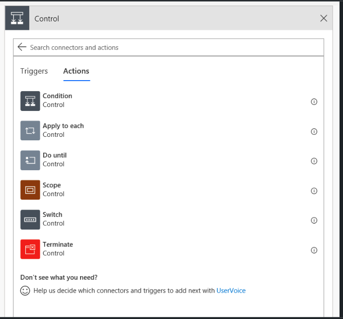
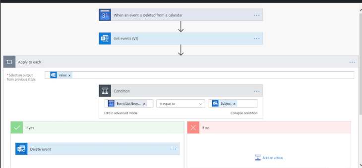
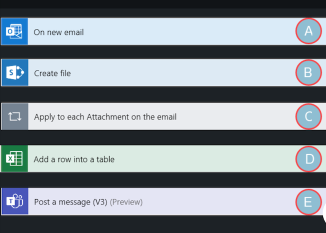

## Microsoft Power Automate

#### Q1. How do you rename a template step?

- [ ] click the name and type over it
- [ ] highlight the step and, in the menu bar, select Rename step.
- [ ] at the top-right corner of the step card, click the small ellipsis and select Rename
- [ ] from the flow's detail page, in the menu var, click Rename.

#### Q2. If you create the flow directly in Microsoft Teams, who can use the flow?

- [ ] only members of the specific team channel in which you created the flow
- [ ] only people with whom you specifically share the flow
- [ ] anyone in your team
- [ ] anyone in your organization

#### Q3. You are using a scheeduled flow to copy information from one databse to another. What is an important caveat to keep in your mind?

- [x] All field names in both DB must match exactly and there must be the same number of records in each DB
- [ ] you must alays create a loop to verify your data has been successfully copied
- [ ] Power automate does not support two-way synchronization, so changes made in the destination are not copied back to the source.
- [ ] you can copy data only between DBs in the same environment.

#### Q4. The flow pictured saves new email attachments in SharePoint, adds a row to Excel to document the file save, and sends a message to TEAMS. What is the proper placement of steps B, D, and E?

- [x] B, D and E belong inside C in the order listed.

#### Q5. Why would you use geofencing with Power Automate?

- [ ] to create areas within a business where flows do not process
- [x] to trigger automated flow when a device enters or exists a defined area
- [ ] to create flows that process whenever an emplotee moves from one region to another
- [ ] to create instant flows that sends a user's current location with the push of a button

[source](https://powerusers.microsoft.com/t5/Power-Automate-Cookbook/Power-Automate-flow-Location-Trigger-Geofence-Workout-tracking/td-p/426650)

#### Q6. What is a necessary requirement to using a flow template?

- [x] must have access to all connectors used in the flow
- [ ] must have Power Automate installed on your mobile device
- [ ] must have permission from template owner
- [ ] must have access to OneDrive

[source]'MT: lame qns, template are pre-set flows available freely for use. PA will have already been installed so not an issue. OneDrive is not specified so a non issue. Connectors include all nodes of the flow, including repos such as OneDrive, or SharePoint etc.'

#### Q7. What is the purpose of the flow?

- [ ] to add events. to an Outlook calender if they are deleted in Google Calender
- [x] to delete Outlook calender events when they are deleted in Google Calender
- [ ] to send an email if there are discrepancies betweeb Outlook and Google calenders
- [ ] to delete Google calender events when they are deleted in Outlook

#### Q8. Which choice is an example of using an automated trigger?

- [ ] a flow that starts when a mobile button is pushed
- [x] a flow that starts when a new record is added to a SharePoint list
- [ ] a flow that starts when users request approval for documents
- [ ] a flow that starts at a specified time

[source](https://docs.microsoft.com/en-us/power-automate/triggers-introduction)

#### Q9. How do you make a flow available to a single team channel in Microsoft Teams?

- [x] in the channel, click 'Add a tab' and select 'Flow', then share flow with matching user group
- [ ] create a new channel called 'Shared Teams Flows' and post a link in the team chat
- [ ] you cannot restrict users at the channel level
- [ ] share the flow only with the users in the channel, then advise them to add the URL to their list of saved links in Teams.

[source](https://powerautomate.microsoft.com/en-us/blog/introducing-the-flow-tab-in-teams-and-new-teams-triggers/#:~:text=To%20get%20started%2C%20navigate%20to,choosing%20Install%2C%20followed%20by%20Save.)
'navigate to the Strategy and Planning team in Teams and add the Flow tab to the General channel.'

#### Q10. What is the difference between Delay and Delay until actions?

- [x] Delay until postpones an action until a specific date and time
- [ ] Delay until postpones an action until a field condition is reached in a loop (wrong)
- [ ] Delay postpones an action by a specific number of minutes (can be day, week etc)
- [ ] Delay postpones an action to give users time to input information (wrong)

[source](https://d365demystified.com/2020/06/17/pause-a-flow-using-delay-and-delay-until-power-automate/)

#### Q11. In the context of Power Automate, what is a solution?

- [ ] a flow thats created specifically to be shared with an entire organization
- [ ] a flow that prcesses more than 7% of the time
- [x] a portable container for flows that enables you to move and share them between environments
- [ ] a flow used to calculate numerical values

[source] (https://docs.microsoft.com/en-us/power-platform/alm/solution-concepts-alm)

#### Q12. what expression allows you to get details about the current workflow instance at run time?

- [x] workflow()
- [ ] details()
- [x] workflowDetails()
- [ ] runDetails()

#### Q13. What are the prerequisites for creating solutions?

- [ ] Office 365 admins status - shared outside an organization
- [x] Common Data Service and an environment with version 9.1.0.267 or later
- [ ] an enterprise license for Msft Office 365
- [ ] certification in Msft Power Platform

[source](https://docs.microsoft.com/en-us/power-automate/overview-solution-flows)

#### Q14. you want to update multiple items in an excel spreadsheet with information from multiple email messages. How can you do this in a single flow?

- [ ] create auto flow that triggers when email received, add Update Excel action, then re-add it as many times as needed.
- [ ] create instant flow that updates a single record, then select multiple emails in your inox and start the flow from the menu bar
- [x] Add and Apple to each loop after the Get email actio, then add another action to write the records to Excel
- [ ] create scheduled flow that triggers when u submit a request, adda acondition that defines the info to extracted, add an Update Excel action and change the Advanced settings to repeat as needed.

#### Q15. What control would you use to build parallel branches of conditional logic based on a single value?

- [x] Apply to each
- [ ] Scope
- [ ] Condition
- [ ] Switch
