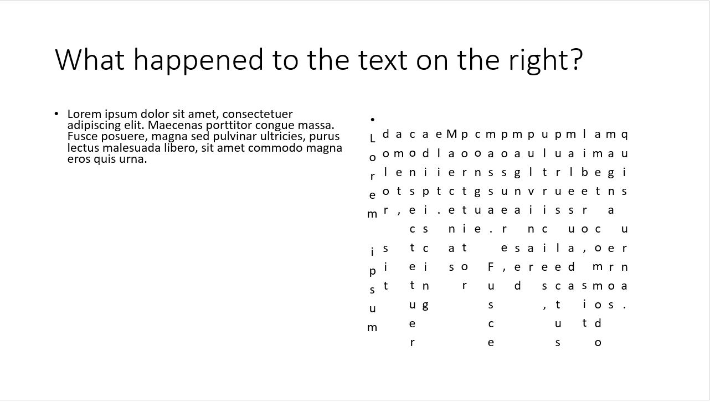

## Microsoft PowerPoint

#### Q1. When you create a new, blank presentation, you begin with one blank slide. What is the layout name of this slide?

- [ ] Blank
- [x] Title slide
- [ ] Title and Content
- [ ] Title Onty

#### Q2. What do you use to align objects on a slide to one another?

- [ ] Layout tools
- [x] Arrange tools
- [ ] Design Ideas feature
- [ ] Picture tools

`In MS PP 2019 it's called "Drawing Tools". There is no such answer but there is a function called "Arrange"`

#### Q3. Which option must be enabled if you want to manipulate the playback of a video file during a presentation?

- [ ] Record Side Show
- [ ] Use Presenter View
- [ ] Show Playback Controls
- [x] Show Media Controls

#### Q4. Which feature analyzes the content of your slides and offers suggested options?

- [x] Design ideas
- [ ] Smartart
- [ ] Browse for Themes
- [ ] Add-Ins

#### Q5. Where can you configure advanced PDF options?

- [ ] the Options tab
- [ ] the Home tab
- [x] the Print dialog box
- [ ] the Share tab

`Should be in the printer window not in the options menu`

#### Q6. Which tab is best for adding various types of objects to slides?

- [ ] Animations
- [ ] view
- [ ] File
- [x] Insert

#### Q7. Which SmartArt category can you use to make informational graphics out of bullet points?

- [x] all of these answers
- [ ] Pyramid
- [ ] List
- [ ] Matrix

#### Q8. What is NOT checked when you run the Accessibility Checker?

- [ ] reading order
- [ ] slide titles
- [ ] missing alt text
- [x] grammar

[Source](https://support.microsoft.com/en-us/office/rules-for-the-accessibility-checker-651e08f2-0fc3-4e10-aaca-74b4a67101c1?ns=powerpnt&version=16&ui=en-us&rs=en-us&ad=us)

#### Q9. How can you change the appearance of a table in one click?

- [ ] Apply a cell stye.
- [ ] Apply a graphic style.
- [x] Apply a table style.
- [ ] Right-click a table and choose a new style.

`Table Tools -> Design Tab -> Table Styles`

#### Q10. Which option changes a text box so that it automatically changes shape to fit longer text?

- [x] Resize shape to fit text
- [ ] Do not autofit
- [ ] none of these answers
- [ ] Shrink text on overflow

#### Q11. Which three shadow properties can be adjusted in PowerPoint?

```
A. Focal Point
B. Depth
C. Blur
D. Angle
E. Distance
```

- [ ] A, B, C
- [ ] A, C, E
- [ ] B, C, D
- [x] C, D, E

#### Q12. You want your presentation to play continuously on screen, What option must you set?

- [ ] Use Presenter view
- [ ] Advance slides manually
- [ ] Advance slides automatically
- [x] Loop continuously until 'Esc'

`Slide Show Tab -> Set Up Slide Show -> Show options -> Loop continuously until 'Esc'`

#### Q13. Which statement about the Compress Pictures command is true?

- [x] You can compress all images at the same time.
- [ ] You cannot delete cropped areas.
- [ ] There are no options for print output.
- [ ] You can compress only one image at a time.

#### Q14. You have a Word document you would like to import as an outline into a PowerPoint presentation. How should you format the text in your Word document that you want to be the slide content?

- [x] Heading Style 2
- [ ] Subtitle
- [ ] Content Style
- [ ] List 2

```
Highlight the content you want to use as a slide title, and select Heading 1 in Styles.
Highlight the content you want to use as the slide text, and select Heading 2 in Styles.
If your Word document contains no Heading 1 or Heading 2 styles, PowerPoint will create a slide for each paragraph in your content.
```

#### Q15. In what manner can you filter comments?

- [ ] by length
- [x] by author
- [ ] by date
- [ ] by urgency

#### Q16. Which Arrow Options choice will hide the mouse cursor when presenting, except when the cursor is moved?

- [x] Automatic
- [ ] Hidden
- [ ] none of these answers
- [ ] Visible

`If hidden is selected the courser stays hidden no matter what.`

#### Q17. Which chart type is best suited for displaying annual financial data for a 10-year period?

- [ ] donut chart
- [x] line or area chart
- [ ] area chart
- [ ] pie chart

#### Q18. If you want to create an organizational chart, which SmartArt category works best?

- [ ] Pyramid
- [ ] Relationship
- [x] Hierarchy
- [ ] Matrix

#### Q19. When printing multiple handouts, which option will group multipage documents together and make them easier to distribute?

- [ ] Print on Both Sides
- [ ] Uncollated
- [ ] Print One-sided
- [x] Collated

#### Q20. How can you adjust which data in a table is used when working on a chart?

- [ ] Click the Switch Row/Column button.
- [ ] Click the Refresh Data button.
- [x] Click the Select Data button.
- [ ] Click the Edit Data button.

#### Q21. Which view lets you see additional information on a second monitor when delivering a presentation?

- [ ] Normal view
- [ ] Reading view
- [ ] Slide Sorter view
- [x] Presenter view

#### Q22. A picture looks good in your slide show but pixelated when you print it. How can you fix this?

- [ ] Compress the picture and use the Print (220 ppi) resolution setting.
- [ ] Select Best scale for slide show, increase the picture resolution and resize the picture to the original size
- [x] Remove picture compression.
- [ ] Change the printer property settings to print in a higher resolution.

`Personal Hint: File Tab -> Options -> Advanced -> Image Size and Quality -> Do not compress images in file File Tab -> Options -> Advanced -> Print -> High quality `

#### Q23. You have inserted a video on a slide and want the video to automatically start 2 seconds after the associated slide appears. How can you accomplish this?

- [ ] Use playback timings.
- [x] Use animation timings.
- [ ] Use animation triggers.
- [ ] Use video timings.

#### Q24. When inserting pictures, how can you avoid distorting the pictureif it is resized later?

- [ ] Use best scale for slide show.
- [x] Lock the aspect ratio.
- [ ] Compress the picture.
- [ ] Set the picture to be relative to the orignal picture size.

#### Q25. Which Protect Presentation option protects a presentation from accidental changes?

- [x] Always Open Read-Only
- [ ] Add a Digital Signature
- [ ] Encrypt with Password
- [ ] Mark as Final

#### Q26. How can you change colors in your presentation all at once without changing the design?

- [ ] Apply a Color Template.
- [x] Apply a Color Theme.
- [ ] Apply a Color Palette.
- [ ] Customize the Color Fills.

#### Q27. What function allows you to borrow slides from a presentation fro an other presentation?

- [ ] Borrow Slides
- [ ] There is no special fuction. You must use Copy and Pase
- [x] Reuse Slides
- [ ] Find Slides

#### Q28. What is the term used for the arrangement of elements on a slide, such as Title and Content?

- [ ] theme
- [ ] design
- [ ] sheme
- [x] layout

#### Q29. How would you change a list of text to a visual diagram on a slide?

- [ ] Convert to WordArt.
- [ ] Convert to Shapes.
- [x] Convert to SmartArt.
- [ ] Convert to Picture.

#### Q30. How can you reorder the levels of shapes in a SmartArt diagram?

- [ ] Retype the text
- [ ] Change the shapes from rifht to left.
- [x] Promote or Demote the shapes
- [ ] Move the shapes up and down.

#### Q31. Why would you trim a video?

- [ ] To crop the video thumbnail.
- [ ] To resize the video.
- [ ] To remove background noise in the video.
- [x] To remove some of the beginning and/or end of the video.

#### Q32. How would you save your layouts, colors, fonts, effects, background styles and content for others to use with their presentations?

- [x] Export the file as a template.
- [ ] Save the file as a PDF.
- [ ] Save the file as a POTX.
- [ ] Save the file as a PPTX.

`Personal Hint: There are multiple file suffixes for templates (.potx, .potm, .pot).`

#### Q33. You are creating an industrial presentation of a new software program and would like to include an image of your program. How can you use PowerPoint to do this?

- [ ] Use the Copy command.
- [x] Use the Screenshot command. (Office2019)
- [ ] Use the Print key.
- [ ] Use the Capture Screen command.

#### Q34. How can you add more layouts to the Layout Gallery?

- [ ] Customize the Layout Gallery.
- [x] Add Slide Layouts to the Slide Master.
- [ ] Use the Add Layouts command.
- [ ] Use the Insert Layouts command.

#### Q35. Why would you use the Outline view?

- [x] To see only the text in placeholders.
- [ ] To present the slides at a high level.
- [ ] To add text from a Word document.
- [ ] To organize your slides.

#### Q36. The text on the left and right of the slide are cut off in print preview. How can you fix this in the printer settings?

- [ ] Unselect High Quality.
- [x] Select Scale to Fit Paper.
- [ ] Select Frame Slides.
- [ ] Select Frame Slides.

#### Q37. In addition to organizing your slides, how else can sections increase your productivity?

- [ ] In addition to organizing your slides, how else can sections increase your productivity?.
- [x] All the slides in a section can be selected at once to apply changes such as transitions, layouts or hiding slides.
- [ ] Sections can be exported as a separate presentation.
- [ ] You can resize all the slides in a section at once.

#### Q38. You have many slides that you need to reorder. How would you accomplish this?

- [ ] Move the slides in Slide Show view.
- [ ] Renumber the slides in Outline view.
- [x] Move the slides in the Slide Sorter view.
- [ ] Reset the slide footers.

#### Q39. What can be seen in Presenter view?

- [ ] Timer.
- [ ] Notes.
- [ ] Side Navigator.
- [x] all of these answers.

#### Q40. How can you format the entire contents of a text box?

- [x] Click the dashed/dotted border of the text box.
- [ ] Right-click the text box and select Select All.
- [ ] Click the Fond button on the Home tab.
- [ ] Double-click any word in the text box.

#### Q41. You have a large number of objects on your slide. How can you use the selection pane to help you identify the objects quickly?

- [ ] Select the show/hide icons next to the objects.
- [x] Rename the objects with meaningful names.
- [ ] Drag and drop the objects.
- [ ] Tab through the objects and note each object as it's highlighted.

#### Q42. How would you ensure a consistent appearance and placement across your slides even though the content might be different?

- [ ] Use fonts.
- [ ] Use styles.
- [ ] Use bullet points.
- [x] Use layouts.

#### Q43. How can you add icons to SmartArt?

- [ ] Select the picture icon in a SmartArt Picture Diagram.
- [ ] Select the icon in a SmartArt Icon Diagram.
- [x] Select Insert Icon and place it on top of the SmartArt Diagram.
- [ ] Select a SmartArt shape and select Insert Icon.

[reference](https://answers.microsoft.com/en-us/msoffice/forum/all/using-icons-in-smartart-vertical-picture-list/25230ba4-50b2-426a-88ce-caa0d4c71672)

#### Q44. You are having trouble playing back a presentation smoothly. What should you do?

- [ ] Copy the presentation to your internal hard drive.
- [ ] Clear the **Disable hardware graphics acceleration** option.
- [x] all of these answers
- [ ] Select the **Show without animation** option.

#### Q45. Which feature lets you configure multiple combinations of specific slides for playback from a larger slide show?

- [ ] Record Slide Show
- [ ] Rehearse Timings
- [x] Custom Slide Show
- [ ] Hide Slide

#### Q46. When working with a mapchart, which options can be drawn?

- [ ] Postal code
- [ ] State
- [ ] Country
- [x] All of these answers

#### Q47. You receive feedback from two clients on your presentation. Each person sent you an edited file. What's the best way to review their changes?

- [ ] Review > Accept
- [ ] Review > Smart Lookup
- [x] Review > Compare
- [ ] Review > Show Comments

#### Q48. How do you promote subbullets to top-level bullets?

- [x] Press Shift+Tab.
- [ ] Right-click the bulleted text and select Promote.
- [ ] Press the Esc key.
- [ ] Press the Spacebar.

#### Q49. After you select the chart icon in a placeholder, what is the next step to create a chart?

- [ ] Select the chart elements.
- [ ] Select the chart type.
- [x] Select the chart data in Excel.
- [ ] Select the chart style.

#### Q50. How would you show a correlation between the amount of chocolate a city consumes and the number of crimes committed?

- [ ] Use a bar chart.
- [ ] Use a column chart.
- [ ] Use a line chart.
- [x] Use a scatter chart.

#### Q51. You want to use a morph transition between two slides. How do you set up the slides?

- [ ] The two slides must have multiple objects in common with different names in the Selection pane
- [x] The two slides must have at least one obiect in common that is in a different position on the second slide
- [ ] The second slide must have different objects that are in the same position as the objects on the first slide
- [ ] The two slides must have at least one obiect in common that is in the same position on the second slide

1. [Reference](https://support.microsoft.com/en-us/office/use-the-morph-transition-in-powerpoint-8dd1c7b2-b935-44f5-a74c-741d8d9244ea#:~:text=The%20Morph%20transition%20allows%20you%20to%20animate%20smooth,of%20things%E2%80%94text%2C%20shapes%2C%20pictures%2C%20SmartArt%20graphics%2C%20and%20WordArt.)
2. [Reference](https://twist.learningguild.net/2019/03/morph-magic-for-incredible-effects-in-powerpoint-richard-goring/#:~:text=Morph%20recognizes%20any%20duplicate%20objects%20across%20two%20slides,make%20objects%20change%20size%2C%20or%20shape%2C%20or%20color.)

#### Q52. Why would you use the Rehearse Timings command?

- [ ] to adiust animation timings
- [ ] to record your slide show
- [ ] to remove transition timings
- [x] to determine how long it takes to present your slide show

[Reference](https://it.nmu.edu/docs/rehearsing-timings-powerpoint)

#### Q53. How can you make an inserted picture look like it has been sketched or painted?

- [ ] Apply a picture effect
- [ ] Apply a draw effect
- [x] Apply an artistic effect
- [ ] Apply a picture style

[Reference](https://edu.gcfglobal.org/en/powerpoint2010/formatting-pictures/1/)

#### Q54. How can you modify your presentations entire set of colors with a single change?

- [ ] Apply a color template
- [ ] Customize a color fill
- [ ] Apply a color palette
- [x] Apply a color theme

[Reference](https://slidesgo.com/slidesgo-school/powerpoint-tutorials/how-to-change-colors-in-a-powerpoint-presentation)

#### Q55. You want to print full-page slides to fill 8. 5-by-11-inch paper, but they appear too small in the preview. What is the best way to rectify this?

- [ ] Change the slide size to standard
- [ ] Repeatedly bump up the scale setting print option until it fills the page in the preview
- [ ] Change the scale setting print option to 100%
- [x] Select the **Scale to Fit Paper** print option

[Reference](https://www.rdpslides.com/pptfaq/FAQ00774_Printing_PowerPoint-_Slide_size_v-_Printer_Page_size.htm)

#### Q56. You want to import a Word document as an outline into a Powerpoint presentation. How should you format the Word documents text that you want to be the slide content?

- [ ] List 2
- [ ] Content Style
- [ ] Subtitle
- [x] Heading Style 2

[Reference](https://support.microsoft.com/en-us/office/import-a-word-outline-into-powerpoint-a25f6e01-9a19-4c0d-a108-7f533e42dfe9)

#### Q57. What is not reviewed when you check a slide shows accessibility?

- [x] missing alt text
- [ ] slide titles
- [ ] grammar
- [ ] reading order

1. [Reference](https://support.microsoft.com/en-us/office/rules-for-the-accessibility-checker-651e08f2-0fc3-4e10-aaca-74b4a67101c1)
2. [Reference](https://webaim.org/resources/evaloffice/)

#### Q58. What is the easiest way to change the appearance of a table?

- [ ] Apply a graphic style
- [x] Apply a table style
- [ ] Right-click a table and select a new style
- [ ] Apply a cell style

[Reference ](https://support.microsoft.com/en-us/office/change-the-look-of-a-table-a18cbaa8-e681-455f-a99f-a2378fe5ff06)

#### Q59. Why would you use Outline view?

- [x] to quickly edit titles or bulleted text in the Slide pane
- [ ] to view the comments on all slides
- [ ] to add notes in the Slide pane
- [ ] to change the font on all slides

[Reference](https://support.microsoft.com/en-us/office/create-and-print-a-presentation-in-outline-view-3516310c-c9c0-4d4f-8c11-2759313477a5#:~:text=Working%20in%20Outline%20view%20is,A%20main%20title%20slide)

#### Q60. Before publishing a presentation, which option should you use to scan a presentation and look for issues that may make it difficult for someone with a visual impairment to read?

- [ ] Protect Presentation
- [ ] Inspect Document
- [ ] Check Compatibility
- [x] Check Accessibility

[Reference](https://support.microsoft.com/en-us/office/make-your-powerpoint-presentations-accessible-to-people-with-disabilities-6f7772b2-2f33-4bd2-8ca7-dae3b2b3ef25#bkmk_testwin)

#### Q61. How can you filter the series and/or categories in a chart?

- [ ] Edit the data to remove the data for the series or category.
- [ ] Switch the rows and columns.
- [x] Use a filter so the data series or category does not display.
- [ ] Change the chart type.

#### Q62. You have an object that needs to follow a specific motion path - including curves, straight lines, and loops - on the slide. Which animation gives the capability to draw this?

- [ ] Loops
- [ ] Arc
- [ ] Turns
- [x] Custom Path.

#### Q63. When you add encryption to a PowerPoint presentation, what does it do?

- [ ] scrambles the text so it is unreadable when opened.
- [ ] shares the file in cloud-based platform.
- [x] protects the file with a password.
- [ ] requires the user to log in to their Office 365 account.

#### Q64. Which type of shape allows you to add text that can be moved around, formatted with styles and effects, or grouped with other objects?

- [ ] screenshot
- [x] text box.
- [ ] icon
- [ ] 3D model

#### Q65. You need to apply a special effect that will display as the presentation moves from one slide to the next slide. Which should you apply?

- [ ] theme
- [x] transition
- [ ] animation
- [ ] design ideas

#### Q66. Which option can be used to import selected slides from a previously created presentation into a new presention without manually copying and pasting them?

- [ ] Slide Zoom
- [x] Reuse Slide
- [ ] Slides from Outline
- [ ] Add Section

#### Q67. The picture on the left is the original image. The image on the right is smaller, but the flowers are the same size and part of the picture has been removed. What method was used to format this picture?


- [ ] changing the width and height with aspect ration locked
- [ ] drapping a corner sizing handle
- [ ] using the **Crop to Shape** tool
- [x] using the **Crop** tool

#### Q68. You are copying and pasting slides from another presentation into your presentation. How will you ensure the new slides are consistent in appearance with your existing slides?

- [ ] Select **Keep Source Formatting** when pasting the slides.
- [x] Select **Use Destination Theme** when pasting the slides.
- [ ] Change both presentations to the same theme before copying and pasting.
- [ ] Select **Picture** when pasting the slides.

#### Q69. What happens when you press the Esc key while playing a **From Current Slide** or **From Beginning** slide show?

- [ ] The current slide is temporary hidden.
- [x] The slide show ends and you return to your previous view.
- [ ] The next slide appears.
- [ ] Nothing happens.

#### Q70. When you save a presentation with a `.potx` file extension, which type of Powerpoint file is created?

- [ ] macro-eanbled presentation
- [x] template
- [ ] show
- [ ] theme

[Reference](https://docs.fileformat.com/presentation/potx/)

#### Q71. You are presenting with two monitors. Which view displays a preview of next slide and speaker notes on the second monitor?

- [x] Presenter view
- [ ] Master view
- [ ] Normal view
- [ ] Reading view

[Reference](https://support.microsoft.com/en-us/office/use-presenter-view-in-powerpoint-fe7638e4-76fb-4349-8d81-5eb6679f49d7#:~:text=PowerPoint%20Presenter%20View%20shows%20you,Select)

#### Q72. Which effect can a presenter use to add motion to an object on a slide?

- [ ] Add-in
- [ ] Zoom
- [x] Animation
- [ ] Transition

[Reference](https://support.microsoft.com/en-us/office/animate-text-or-objects-305a1c94-83b1-4778-8df5-fcf7a9b7b7c6)

#### Q73. When you copy data from an Excel worksheet into a slide to create a table, which Paste option will allow you to edit the table data in Excel?

- [ ] Keep Formatting
- [x] Embed
- [ ] Keep Text Only
- [ ] Picture

[Reference](https://support.microsoft.com/en-us/office/insert-excel-data-in-powerpoint-19767daf-672c-43bc-bda1-330b242c57c9)

#### Q74. You created a photo album with transitions and want to send it to friends, but the file size is too large for email. How can you use one command to fix this?

- [ ] Click **Export** in Backstage view and embed the presentation in an email.
- [x] Compress all the pictures to the **Email (96 ppi) resolution**.
- [ ] Use the Share feature in Backstage view and petty email to automatically compress the pictures.
- [ ] Use the Share feature in Backstage view to create a pdf to send as an attachment.

[Reference](https://www.officetooltips.com/powerpoint_2016/tips/how_to_compress_pictures_in_the_presentation.html)

#### Q75. In a presentation about voter turnout, you are illustrating various data with charts. Which type of information would you present in a pie chart?

- [ ] the decline of voter turnout by county
- [ ] trends in voter turnout over the part 10 years
- [x] what percentage of the whole population voted
- [ ] how many people voted in various geographic regions on a map

#### Q76. A few lines of text are overflowing the placeholder on your slide. How can you fix it on your slide?


- [ ] Delete the overflowing text.
- [ ] Select **Stop Fitting Text to This Placeholder**.
- [x] Select **Autofit Text to Placeholder**.
- [ ] Click **Collapse**.

#### Q77. If you want to create an organizational chart that illustrates the reporting relationships within the organization, which SmartArt category would you use?

- [x] Hierarchy
- [ ] Matrix
- [ ] Pyramid
- [ ] Relationship

#### Q78. What do the labels Introduction and ProjectsByMonth indicate?


- [x] section names
- [ ] layouts
- [ ] hidden slides
- [ ] links to the next slide

[Reference](https://support.microsoft.com/en-us/office/organize-your-powerpoint-slides-into-sections-de4bf162-e9cc-4f58-b64a-7ab09443b9f8#:~:text=Right%2Dclick%20between%20slides%20and,next%20to%20the%20section%20name.)

#### Q79. There are objects and text hidden behind an image on your slide. With the image selected, what could you adjust to make the objects and text appear "through" the image?

- [ ] Compress Picture
- [x] Transparency
- [ ] Corrections
- [ ] Artistic Effects

#### Q80. How can you create a new presentation that includes prebuild layouts, colors, fonts, background styles, and content?

- [x] Use a theme.
- [ ] Use a design.
- [ ] Use a template.
- [ ] Use a style.

#### Q81. How can you reorder the levels of shapes in a SmartArt diagram?

- [ ] Promote or demote the shapes.
- [x] Move the shapes up and down.
- [ ] Change shapes from left to right.
- [ ] Retype the text.

#### Q82. When you insert a new slide in a presentation, where is it placed in relation to the exsisting slides?

- [ ] as the first slide.
- [ ] before the current slide.
- [ ] at the end of the exsisting slide.
- [x] after the currently selected slide.

#### Q83. In Normal view, which pane is used to add text and reference information for the speaker?

- [ ] Comments
- [ ] Reading
- [ ] Slide
- [x] Notes

#### Q84. What is the best way to modify slide's appearance or content while in Note Page view?

- [x] Edit the thumbnail of the slide as needed.
- [ ] Slides cannot be modified while in Note Page view.
- [ ] Use the Zoom slider to magnify the slide contents
- [ ] Right-click the slide and select edit

#### Q85. You want to group your slides based on their content to better organize your presentation. How would you accomplish this?

- [ ] Create an outline in the outline view and rearrange slides.
- [ ] Add a table of contents slide and link the remaining slides to it.
- [x] Add sections and move the slides into the appropriate sections.
- [ ] Create custom shows and add the slides into the shows.

#### Q86. How do you remove the background of an inserted impage?

- [ ] Select the image and, on the Design tab, use the Format Background feature
- [ ] Select the image and, on the Picture Format tab, use the Compress Picture feature
- [x] Select the image and, on the Picture Format tab, click the Remove Background button
- [ ] On the Drawing Tools Format tab, select Graphics Fill > Remove Background

#### Q87. In a SmartArt graphic, how can you add text to the shapes other than directly in each shape?

- [x] Open th Text Pane for the graphic and enter the text.
- [ ] Create a bulleted list and then convert it to a shape.
- [ ] Select all of the shapes and start typing.
- [ ] You can only add text by typing directly into each shape.

#### Q88. You want to add two images to a presentation, but one is a bit blurry and another is quite dark. What feature on the Picture Format tab can you use to adjust them?

- [x] Corrections.
- [ ] Picture Effects.
- [ ] Trasparency.
- [ ] Crop.

#### Q89. A colleague has given you a presentation file, and you want to use one of the slides from that presentation in your own. How would you do this?

- [ ] Use the Reuse Slides command.
- [x] Use the Import slides command.
- [ ] Use the Insert Slides command.
- [ ] Use the Duplicate Slides command.

#### Q90. Which type of shape allows you to add text that can be moved around, formatted with styles and effects, or grouped with other objects?

- [ ] Screenshot
- [x] Textbox
- [ ] Icon
- [ ] 3D model

#### Q91. Which view allows you to select individual objects on a slide?

- [ ] Slide Sorter view
- [ ] Slide Show view
- [x] Normal view
- [ ] Design view

[Reference](https://support.microsoft.com/en-us/office/select-individual-objects-on-a-slide-c9c89522-65e1-40dd-a4b2-469c1b19adf8#:~:text=To%20select%20objects%20that%20are,the%20options%20that%20you%20want.)

#### Q92. When in Slide Show view, what happens when you hold Ctrl (Windows) or Command (Mac) and click the left mouse button?

- [x] You activate the laser pointer
- [ ] You end the slide show
- [ ] You toggle the mouse pointer on/off
- [ ] You terminate animations

[Reference](https://www.techrepublic.com/article/use-powerpoints-laser-pointer-to-catch-attention-and-add-excitement/#:~:text=To%20turn%20on%20the%20laser,turn%20on%20the%20laser%20pointer.)

#### Q93. Which PowerPoint feature is best used to set up slide timings so slides automatically advance?

- [ ] **Timing** on the **Animations** tab
- [ ] **Advanced Animation** on the **Animations** tab
- [ ] **Reharse Timings** on the **Slide Show** tab
- [x] **Timing** on the **Transitions** tab

[Reference](https://bluevalleyk12.libguides.com/c.php?g=140667&p=921228#:~:text=In%20Normal%20view%2C%20click%20the,to%20set%20the%20timing%20for.)

#### Q94. You plan to distribute a presentation. In which format might you save it to ensure that it appears as an automatically playing slide show composed of individual slides, regardless of the recipients' platform or software applications?

- [ ] PDF (.pdf)
- [ ] PowerPoint Show (.ppsx)
- [ ] OpenDocument Presentation (.odp)
- [x] MPEG-4 Video (.mp4)

#### Q95. Which type of illustration can be rotated while in Slide Show view, allowing the audience to see all sides of an image?

- [ ] action button
- [ ] animated image
- [ ] icon
- [x] 3D model

#### Q96. You inserted audio into a presentation. Which two options must you enable for the audio to play throughout all slides and repeat until it is stopped?

```
A. Loop untill Stopped
B. Play Across Slides
C. Rewind after Playing
D. Start When Clicked On
```

- [ ] B and C
- [ ] C and D
- [ ] B and D
- [x] A and B

#### Q97. Your presentation has a slide on which the text appears scrambled. What happened?



- [ ] The text direction has been changed to Vertical.
- [ ] The text direction has been changed to Stacked.
- [ ] The text direction has been changed to 360 degrees.
- [x] The text direction has been changed to 90 degrees.

#### Q98. Your colleagues have collaborated in a presentation with you, adding new content and reusing slides from other presentations. You notice the layouts vary throughout the slides: differently sized and positioned containers, and different headers and footers. Where can you make a change that will automatically be applied to all slides in the presentation?

- [ ] Quick Styles
- [x] Slide Master
- [ ] Header & Footer
- [ ] Handout Master

[Reference](https://support.microsoft.com/en-us/topic/create-a-slide-master-in-powerpoint-19cf3e28-707a-5059-134e-29513e6f6161#:~:text=A%20slide%20master%20is%20the,View%20tab%2C%20click%20Slide%20Master.)

#### Q99. Your company logo appears on all slides in a presentation as part of the overall design template's Slide Master. How can you prevent the logo from appearing on one particular slide?

- [x] Hide the graphic using Design > Format Background.
- [ ] Right-click the logo (Windows) or select the logo (Mac), and then select Delete.
- [ ] Insert a blank shape to mask the logo.
- [ ] Remove the logo graphic from the Slide Master template.
