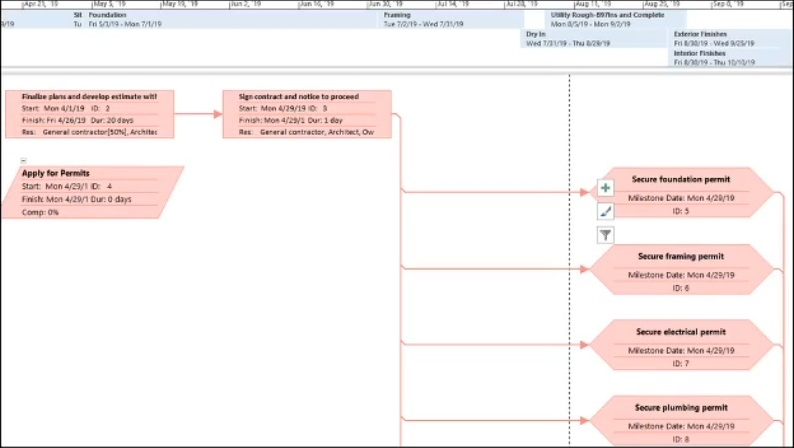
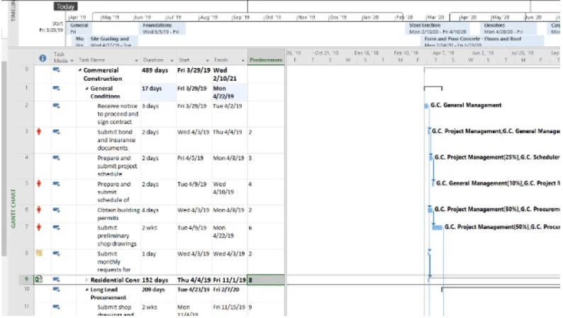

## Microsoft Project

#### Q1. Where can you set fixed duration, effort driven, and manually scheduled?

- [ ] Team Planner
- [ ] Project Information dialog box
- [x] task form
- [ ] Resource Sheet

#### Q2. You would like the ability to edit your typed entries in the Entry Bar, which appears below the ribbon and above the default Entry table in the Gantt Chart view. You recently received a new computer and noticed that the Entry Bar is missing. How do you fix this?

- [x] Use the **Display** tab in the **Project Options** dialog box to enable the Entry Bar.
- [ ] Change the from Gantt Chart view to Tracking Gantt view.
- [ ] Use the **Advanced** tab in the **Project Options** dialog box to enable the Entry Bar.
- [ ] On the **View** tab on the ribbon, in the **Split View** group, select **Details**.

#### Q3. Which of the following defines the project scope in terms of deliverables and components, and provides the framework on which the project status is based?

- [ ] work package
- [x] work breakdown structure
- [ ] baseline
- [ ] milestone

#### Q4. When setting the **Calculate multiple critical paths** option in a master project's **Advanced** settings, which statement is correct?

- [x] Subprojects will have critical paths calculated individually.
- [ ] Individual resources will have critical paths calculated.
- [ ] Milestones will have critical paths fixed.
- [ ] Only one critical path will be calculated for a linked project.

#### Q5. What Microsoft Project view is shown in the image below?

- [x] Network Diagram
- [ ] Task Dependency Report
- [ ] Flow Chart
- [ ] Gantt Chart

#### Q6. You want to switch the scheduling mode for a project from scheduling from a start date to scheduling from a finish date. This action will change the default constraint from As Soon As Possible to As Late As Possible. Which dialog box should you use to make this change?

- [ ] Resource Information
- [x] Project Information
- [ ] Task Information
- [ ] Change Working Time

#### Q7. A project contains many elements. What is used to describe the sum of the work required?

- [ ] task links
- [ ] Resource Sheet
- [x] work breakdown structure
- [ ] baseline

#### Q8. Which option is not available in the Report tab on the ribbon?

- [ ] New Report
- [x] Network Diagram
- [ ] Recent
- [ ] Custom

#### Q9. You are troubleshooting a schedule on someone else's computer The schedule has 10,000 tasks. When a change is made to a task's duration on a Fixed Units task, the start and finish dates do not change. change highlighting does not appear, and the Gantt Chart bat does not update. What is the cause of this issue?

- [ ] Inserted projects are calculated like summary tasks is selected.
- [ ] Calculate multiple critical paths is not selected.
- [ ] One of the Com add-ins is not selected.
- [x] Calculate project after each edit is set to Off.

`The hint being "The schedule has 10,000 tasks" and the fact that the Gantt Chart does not update.`

#### Q10. You would like to understand which tasks are critical and which are not. When looking at the Gantt chart, how are these tasks identified by default?

- [x] Critical tasks are indicated in red and other tasks are indicated in blue.
- [ ] Critical tasks are indicated in dark blue end other tasks are indicated in light blue.
- [ ] Critical tasks are indicated in a report while the Gantt chart indicates all tasks in blue.
- [ ] Critical tasks are indicated with an icon and other tasks are indicated in blue.

#### Q11. You are working on a project that has tasks with no flexibility. Which constraint type offers no flexibility?

- [x] Must Finish On
- [ ] Start No Earlier Than
- [ ] As Soon As Possible
- [ ] Finish No Earlier Than

#### Q12. In a project, duration can have different units. Which duration unit is _not_ valid?

- [ ] weeks
- [ ] hours
- [ ] days
- [x] quarters

#### Q13. Microsoft Project uses calendars to schedule a project. Which project components can be assigned a calendar?

- [ ] tasks and work
- [ ] work and units
- [ ] resources and work
- [x] tasks and resources

#### Q14. You are working on a project file that contains many linked subprojects. When saving the files, what option can you use to immediately save the open files, including those that have not changed?

- [x] Yes to All
- [ ] Yes
- [ ] Save As
- [ ] Save

#### Q15. A resource is assigned to a task that is scheduled for 2 days. The resource is scheduled for 8 hours (8h) per day at 100%. The resource performs actual work of 10 hours on the first day. How has the Peak for this resource changed?

- [ ] It has changed to 10h.
- [ ] It has changed to 6h.
- [x] It has changed to 125%.
- [ ] It has changed to 110%.

[reference link](https://support.microsoft.com/en-us/office/peak-task-field-a9947235-b552-4ae5-9f26-d58fdc1a27d3)

#### Q16. What is another name for a work breakdown structure?

- [x] a hierarchy of tasks
- [ ] a linking of tasks
- [ ] a duration of tasks
- [ ] a leveling of tasks

#### Q17. A report for Earned Value Over Time has been requested, You decide to use a Microsoft Project visual report. What values does this report template compare when run?

- [x] Earned Value. Planned Value, and Actual
- [ ] Earned Value and Planned Value
- [ ] Earned Value and Actual Cost
- [ ] Planned Value and Actual Cost

#### Q18. You are preparing a meal comprising a main dish and multiple side dishes. You want the finish of the main dish to drive the finish of the side dishes. The main dish will start before and take longer than the side dishes. You need to create a link from the main dish to each of the side dishes. Which link type is appropriate?

- [ ] Start-to-Finish (SF)
- [x] Finish-to-Finish(FF)
- [ ] Finish-to-Start (FS)
- [ ] Start-to-Start (SS)

**Reasoning:** the problem states that the finish of the secondary dishes should be the same with the finish of the main course. The main course takes longer to complete than the secondary dishes. If we set Start-to-Finish, the secondary dishes will begin after the main dish is complete and this is not what the problem stated.

#### Q19. A resource is overallocated in a project. This resource is responsible for two tasks that are to happen at the same time. The first of these tasks is on the critical path. Which solution should you use to remedy the overallocation?

- [x] Use the Leveling Gantt view adjust the edays field for the second task.
- [ ] Use the Task usage view to change the second task contour to an early Peak.
- [ ] Use the Task usage view to change the second task contour to a bell.
- [ ] Use the Leveling Gantt view adjust the edays field for the first task.

#### Q20. How do you mark a task's progress and have that progress reflected in the task's summary task?

- [ ] Use the **Task** tool on the ribbon's **Task** tab for the subtask.
- [ ] Enter a value in the %**Complete** field.
- [x] Use the **Task** tool en the ribbon's **Task** tab for the summary task.
- [ ] Use the **Project Information** dialog box.

#### Q21. You have many tasks in a project file and want to convert them into milestones. How can you do this?

- [ ] Recreate the tasks and set them as summary tasks.
- [ ] Set the tasks as summary tasks.
- [ ] Unassign any resources from the tasks, as resources are not needed for milestone task.
- [x] Change the tasks' duration to 0.

#### Q22. A project has been delayed by three months. In this project, you have set deadlines that also need to be delayed by three months. What feature should you use to accomplish both of these delays?

- [ ] On the **Project** tab, click **Project Information**.
- [ ] On the **Task** tab, click **Move Task**.
- [ ] On the **Report** tab, click **Compare Projects**.
- [x] On the **Project** tab, click **Move Project**.

#### Q23. How many default base calendars does Microsoft Project set up for a project?

- [ ] five
- [x] three
- [ ] two
- [ ] six

#### Q24. A task has a fixed duration If the units on the task are changed, what value for the task will automatically change as a result?

- [ ] allocation
- [x] work
- [ ] contour
- [ ] effort

#### Q25. You are working with subproject files (the master project file is not open) and have saved the changes you made. What happens to the master project when it is opened?

- [ ] The master project will not reflect any changes until the subproject files ate opened as well.
- [ ] The master project will display an error.
- [ ] The master project will display message stating that changes were made and the subproject files must be opened first.
- [x] The master project will reflect the changes made to the subproject files.

#### Q26. You need to modify a resource pool. When opening the file that contains the pool, which option is not valid?

- [ ] Open as read-write into d new master project file.
- [ ] Open as read-write and allow others to use the pool.
- [x] Open as read-only and allow others to use the pool.
- [ ] Open as read-write while locking others from updating the pool.

#### Q27. On your computer, **Automatically add new views, tables. filters. and groups to the global** is selected. You are using a custom filter that you created in one of your schedules, and you modify it to better meet your needs. You now notice that this modification is not available in other schedules. How do you fix this?

- [ ] Using More Filters, make a copy of the modified filter.
- [ ] In the **Project Options** dialog bays clear and reselect **Automatically add new views, tables, filters. and groups to the global**.
- [ ] Using the Organizer, copy the modified filter from your schedule to global.mpt and replace the filter when prompted.
- [x] Using Compare Projects, select the appropriate options from the **Task Table** and **Resource Table** lists.

#### Q28. A graduated scale of rates can be created for a resource by using cost rate tables. What is the maximum number of cost rate tables each resource in a project have?

- [x] five
- [ ] ten
- [ ] six
- [ ] two

#### Q29. A project currently has a software developer performing two tasks at the same time. The first task is 5 days long; the second task is day long. It has been decided that the developer can take some time to work on the shorter task in the middle the longer task without impacting the schedule. What is the best way to this!

- [ ] Create a link between the tasks with dependency.
- [ ] Change the first task's contour to Double Peak.
- [ ] Add lag time of -1d to the second task.
- [x] Split the longer task to accommodate the shorter task.

#### Q30. You want to change the view of the timescale on Gantt chart to be more granular. How many tiers does the timescale support?

- [ ] three
- [ ] five
- [x] ten
- [ ] four

#### Q31. You are assigned the ownership of schedule comprising approximately 12,000 tasks. You need to know exactly, with detail, which tasks have a constraint other than ASAP. The most effective method do this is to create a filter that tests for which set of conditions?

- [ ] Constraint TypeSummaryRecurring% CompleteActive  
       1\. does not equal As Soon As Possible.  
       2\. equals Yes.  
       3\. equals No.  
       4\. equals 100%.  
       5\. equals Yes.
- [ ] Constraint TypeSummaryRecurring% CempleteActive  
       1\. is less than As Soon As Possible.  
       2\. does not equal Yes.  
       3\. equals No.  
       4\. is equal to 0%.  
       5\. equals Yes.
- [ ] Constraint TypeDetailRecurringDurationActive  
       1\. is greater than As Soon As Possible.  
       2\. equals Yes.  
       3\. equals Yes.  
       4\. equals 0d.  
       5\. equals Ongoing.
- [x] Constraint TypeSummaryRecurring% CompleteActive  
       1\. does not equal As Soon As Possible.  
       2\. does not equal Yes.  
       3\. equals No.  
       4\. is 1ess than 100%.  
       5\. equals Yes.

#### Q32. You are working with two project files. You want the second project to contain some of the same tasks, along with their work assignments, as the first project. You Choose to copy the tasks between the projects. What else is copied along with the task when performing basic copy and paste action?

- [x] resources
- [ ] baseline
- [ ] calendars
- [ ] work breakdown structure

#### Q33. You are working with a master project that contains subprojects, and you want to see a list of tasks on which a subproject file is dependent. How can you do this in Microsoft Project?

- [x] On the **Project** tab, click **Subproject**.
- [ ] On the **View** tab, click **Group by**.
- [ ] On **Project** tab. click **Links Between Projects**.
- [ ] On the **View** tab, click **Filter**.

#### Q34. You want to manage multiple projects with one project designated as the master project. Which button on the ribbon do you use?

- [x] Subproject
- [ ] Share Resources
- [ ] Move project
- [ ] Link Between Projects

#### Q35. When you create a new blank project in Microsoft Project, what is the default view?

- [ ] Resource Sheet
- [ ] Task Form
- [x] Gantt Chart with Timeline
- [ ] Detail Gantt

#### Q36. A project contains numerous linked tasks. What is the name for a task that is controlled or driven by another task(s)?

- [ ] overlapped
- [ ] predecessor
- [ ] callout
- [x] successor

#### Q37. You have several Microsoft Project files open. One contains sensitive information, so you hide that file. What is true regarding the hidden file?

- [ ] The **Switch Window** lists the hidden file.
- [ ] The **Switch Window** command does not list the hidden file.
- [x] To unhide the file, select **Switch Window**.
- [ ] To view a hidden file, on the **View** tab, click **Arrange Windows**.

#### Q38. In the image below, what does the indicator in Task ID 9 represent?

- [x] subproject
- [ ] linked file
- [ ] custom field
- [ ] resource pool

#### Q39. You are using work breakdown structure (WBS) codes for an in-progress project. Due to some schedule changes, tasks have been moved around, which has modified the WBS. How do you fix the WBS codes?

- [ ] From the **Project** tab on the ribbon, click **WBS > Define Code**.
- [x] From the **Project** tab on the ribbon, click **WBS > Renumber**.
- [ ] From the **View** tab on ribbon, click **Sort**.
- [ ] From the **View** tab on the ribbon, in the **Data** group, select **Group by**.

#### Q40. You are managing a construction project schedule with key tasks that have dependencies on each other. You need to supply key materials to your team they begin to build different of the building. All materials must be inventoried before they can be used for the project. The completion of the materials delivery and inventory task, which will take longer than the different building sections, will drive the completion of the building sections. You need to create a link from the delivery and inventory task to of building task. Which link type is appropriate?

- [ ] Finish-to-Finish (FF)
- [ ] Start-to-Start (SS)
- [ ] Start-to-Finish (SF)
- [ ] Finish-to-Start (FS)

#### Q41. When breaking down the work that needs to be done on a project, what is the smallest unit of work known as?

- [x] work package
- [ ] duration
- [ ] work breakdown structure
- [ ] task assignment

#### Q42. A resource's hours have increased over the span of five days for a particular task. The duration has not changed, and the task is effort driven. What element can you add to the Task Usage view to see what has changed?

- [ ] Add a column for the actual duration.
- [ ] Add a column for the level assignments.
- [x] Add a column for the Peak value.
- [ ] Add a column for the assignment.

#### Q43. You are modifying a project's work breakdown structure (WBS) code. What is the default length for any selected sequence type?

- [x] any
- [ ] 5
- [ ] 3
- [ ] 1

#### Q44. You are working on a project schedule. You need two tasks to end at the same time so that your review team can do their work on both tasks. Which link type is appropriate?

- [ ] Start-to-Start (SS)
- [ ] Finish-to-Start (FS)
- [ ] Start-to-Finish (SF)
- [x] Finish-to-Finish (FF)

#### Q45. In a project, duration can have different units. Which duration unit is _not_ valid?

- [ ] weeks
- [ ] hours
- [ ] days
- [x] quarters
