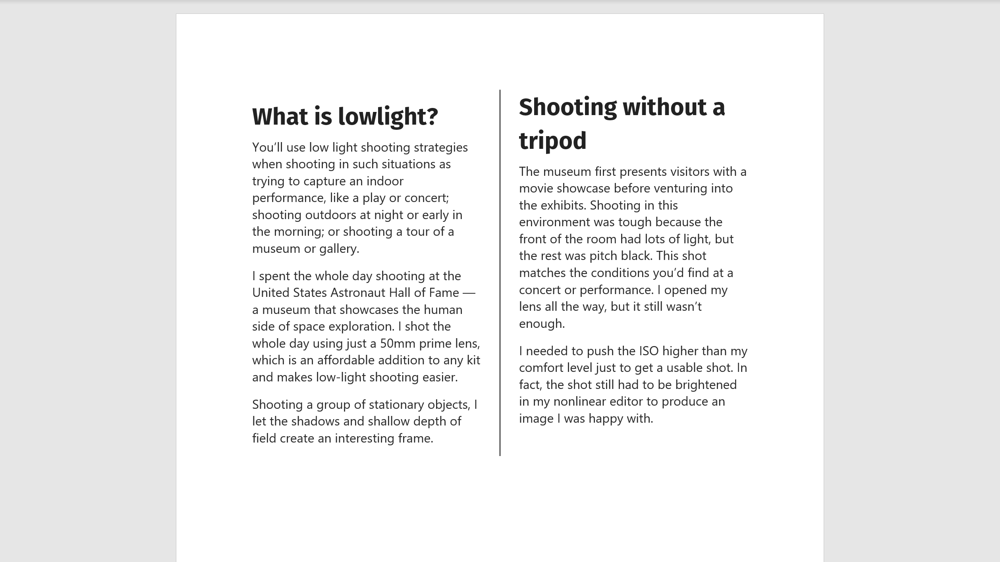
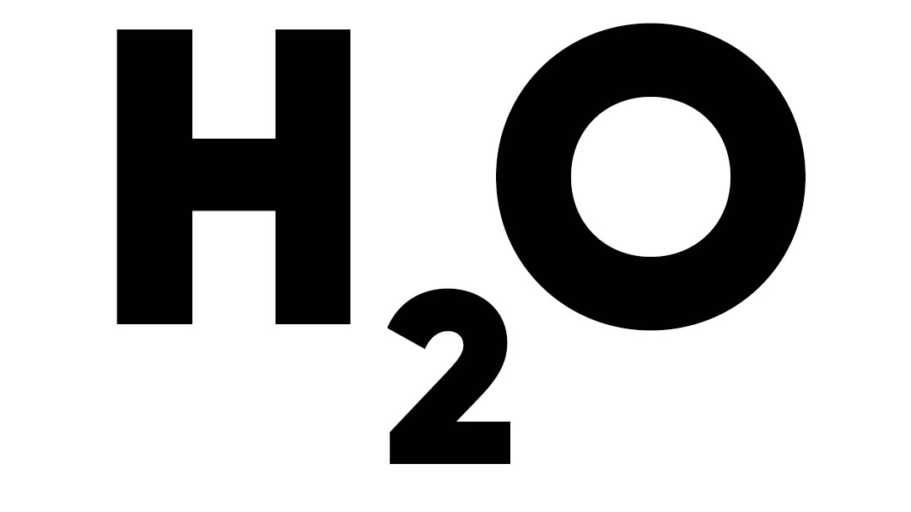
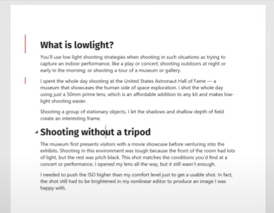

## Microsoft Word

#### Q1. Which feature allows you to copy attributes of selected text and apply them to another selection?

- [ ] Merge Formatting command
- [ ] Copy and Paste Styles command
- [ ] Copy and Paste Attributes command
- [x] Format Painter tool

#### Q2. To protect a document from accidental changes, which option should you select from the Protect Document (Windows) or Protect (Mac) menu?

- [ ] Mark as Final.
- [ ] Add a Digital Signature.
- [ ] Encrypt with Password.
- [x] Always Open Read-Only.

#### Q3. You are finalizing a two-page memo. Rather than having Word decide where page 1 ends, you want the next paragraph to begin on the top of page 2. How do you achieve this?

- [ ] Change the bottom margin to your current location.
- [x] Insert a page break.
- [ ] Press Shift + Enter (Shift + Return).
- [ ] Insert a column break.

#### Q4. How do you insert the content of an existing Word document into your current Word document?

- [ ] Click Layout > Text > Text from File.
- [ ] Click Insert > Text > Building Blocks Organizer.
- [x] Click Insert > Text > Text from File.
- [ ] Click Insert > Media.

#### Q5. You want to set a wider inside margin to accommodate binding a document where pages are printed in both sides. Which option should you choose in the Page Setup dialog box?

- [x] Book Fold.
- [ ] Different Odd & Even Pages.
- [ ] Mirror Margins.
- [ ] Landscape.

[Reference](https://support.microsoft.com/en-us/office/create-a-booklet-or-book-in-word-dfd94694-fa4f-4c71-a1c7-737c31539e4a)

#### Q6. Which feature lets you place a ghosted logo or text behind the regular text on your document?

- [ ] Background.
- [x] Watermark.
- [ ] Imagemark.
- [ ] Overlay.

#### Q7. Where do you select the paper size for a document?

- [ ] Design > Size.
- [ ] File > Page Setup.
- [x] Layout > Size.
- [ ] Layout > Margins.

#### Q8. Which option lets you mark your favorite templates for quick reuse in the future?

- [ ] Drag to Home tab.
- [ ] Add to chooser.
- [x] Pin to list.
- [ ] Mark as favorite.

#### Q9. If you want to add a caption to a table, where should you look?

- [ ] Insert tab.
- [ ] Design tab.
- [x] References tab.
- [ ] Layout tab.

#### Q10. How can you change the appearance of an entire table in a single step?

- [x] Apply a table style.
- [ ] Apply a graphic style.
- [ ] Right-click a table and choose a new style.
- [ ] Apply a cell style.

#### Q11. Which option does the Find and Replace feature **NOT** support?

- [ ] Whole Word Only.
- [ ] Replace All.
- [x] Check Spelling.
- [ ] Match Case.

#### Q12. Which statement best describes how a bookmark is used in a Word document?

- [ ] A bookmark is a hyperlink where the label is automatically generated.
- [x] A bookmark works in conjunction with hyperlinks to allow you to quickly jump to a specific location in your document.
- [ ] A bookmark is a link in your document that can give you quick access to webpages, files, and other locations within your document.
- [ ] A bookmark is a color-coded graphic that appears in the navigation pane for easy access to a specific location in your document.

#### Q13. What is **NOT** an option when inviting a colleague to collaborate on a document?

- [ ] including a personalized message
- [ ] giving the collaborator the option to edit a document
- [ ] setting the collaborator's access to view only
- [x] granting administrator access

#### Q14. You split a document into three sections. What happens if you change the margins in the first section?

- [ ] The document reverts back to a single section with the new margin settings.
- [ ] The new margin settings are applied to all of the sections.
- [ ] The new margin settings are applied to the second and third sections.
- [x] The new margin settings are applied to just the first section.

#### Q15. Which ribbon tab includes commands to add various types of objects or media to your document?

- [x] Insert
- [ ] File
- [ ] Layout
- [ ] Design

#### Q16. What type of page is useful at the front of a large document, to identify the document title, author, and other metadata?

- [x] cover page
- [ ] blank page
- [ ] master page
- [ ] table of contents page

#### Q17. What happens in this SmartArt object when you press the Delete key?


- [x] The boxes resize to maintain the same overall height.
- [ ] The object is deleted and a hole is left behind.
- [ ] The text merges with the second box.
- [ ] The gaps between the boxes close and the boxes remain the same size.

#### Q18. What happens in this SmartArt diagram when you delete the selected object?


- [ ] The text from the deleted box merges with the next box's text.
- [ ] The selected object is deleted and the spacing is preserved where the object was.
- [x] The remaining objects resize to maintain the same overall height.
- [ ] The gaps between the objects close and the objects remain the same size.

#### Q19. Which command builds an overview of document contents based on applied headings styles?

- [ ] Manage Sources
- [ ] Cross-Reference
- [ ] Insert Index
- [x] Table of Contents

#### Q20. Which statistic does the Word Count feature **NOT** collect?

- [ ] paragraphs
- [ ] lines
- [x] page breaks
- [ ] characters (no spaces)

#### Q21. What is the default view when you open a document or create a new document?

- [x] Print Layout view
- [ ] Draft view
- [ ] Edit view
- [ ] Web Layout view

#### Q22. You are working on a local copy of a document when Word unexpectedly closes. After you relaunch Word, how can you find the most recently saved version of the document?

- [ ] Click Open > Recent and select Recover Unsaved Documents.
- [ ] Click File > Options > Recover Unsaved Documents.
- [x] Click File > Open > Recent > Documents.
- [ ] Click File > Recent > Recover Unsaved Documents.

Explanation:

Solutions found in Office2019:  
File -> Open -> Recent -> Recover Unsaved Documents  
File -> Info -> Manage Document -> Recover Unsaved Documents  
Read carefully. It's not about recovering, but only the last recent file!

#### Q23. Which object type can you *not* insert into a Word document from the **Insert** tab?

- [x] a sketch
- [ ] a symbol
- [ ] a 3D model
- [ ] an equation

#### Q24. What Microsoft Word feature lets you capture a portion of your screen to be used as an image in your document?

- [x] Screen Clipping
- [ ] Screen Grab
- [ ] Screen Capture
- [ ] none of these answers

#### Q25. You want to create a shortcut that replaces an acronym that you type with the acronym's full text-for example, replacing `"/mt"` with `"Microsoft Teams"`. What Word feature do you use to create this shortcut?

- [ ] Replace All
- [ ] AutoFormat As You Type
- [ ] Find and Replace
- [x] AutoCorrect Options

**Explanation:** The keyword here is creating a "shortcut" which is set with the Autocorrect Options by navigating to File -> Options -> Proofing -> AutoCorrect Options -> Replace text as you type.

#### Q26. Your document contains two columns of content with a vertical line between the columns, as shown. From where can you delete the line?



- [ ] Insert > Text
- [x] Columns dialog box
- [ ] Insert > Line > Vertical
- [ ] Insert > Line > Remove

**Explanation:** Layout -> Columns -> More columns -> Line between

#### Q27. When you crop an image in a document, what happens to the image and the overall document file size?

- [ ] The cropped parts of the image are hidden and the overall file size increases.
- [ ] The cropped parts of the image are removed and the overall file size does not change.
- [x] The cropped parts of the image are hidden and the overall file size does not change.
- [ ] The cropped parts of the image are removed and the overall file size decreases.

#### Q28. When you are typing in a paragraph and reach the end of the line, Word automatically starts a new line for you. What is this feature called?

- [ ] line wrap
- [x] word wrap
- [ ] a new line return
- [ ] a soft return

#### Q29. You want to create an organizational chart. Which SmartArt category should you choose?

- [ ] Pyramid
- [ ] Relationship
- [x] Hierarchy
- [ ] Matrix

#### Q30. When you insert page numbers, which position is **NOT** an option?

- [ ] page margins
- [x] inset
- [ ] current position
- [ ] bottom of page

#### Q31. How can you quickly move an insertion point up to the start of the previous paragraph?

- [x] Press Ctrl+Up Arrow (Windows) or Command+Up Arrow (Mac).
- [ ] Press Ctrl+Page Up (Windows) or Command+Page Up (Mac).
- [ ] Press Ctrl+Left Arrow (Windows) or Command+Left Arrow (Mac).
- [ ] Press Alt+Left Arrow (Windows) or Option+Left Arrow (Mac).

#### Q32. You send a document to two clients for review, and each client returns a separate, edited version of the document. How do you most efficiently review their feedback?

- [ ] Click **Review > Accept**.
- [ ] Turn on **Track Changes**.
- [x] Click **Review > Compare**.
- [ ] Click **Review > Smart Lookup**.

#### Q33. What is the difference between a footnote and an endnote?

- [ ] Footnotes use Arabic numerals and endnotes use letters.
- [ ] A footnote is placed in the page footer, and an endnote is placed on a blank page at the end of the document.
- [x] A footnote is placed at the bottom of the page, and an endnote is placed at the end of the document.
- [ ] An endnote always appears on the bottom of the same page that it references.

#### Q34. Which formatting option was used to create the effect shown below?



- [ ] Drop Cap
- [x] Subscript
- [ ] Small Caps
- [ ] Superscript

#### Q35. What Word building block uses headings to help users identify the contents of a document?

- [x] table of contents
- [ ] page break
- [ ] cover page
- [ ] index

#### Q36. You have been reviewing a Word document using Track Changes. There are still changes that need to be reviewed, but you cannot see them. Why is this? (Select all that apply.)

```
A. Display for Review is set to No Markup.
B. Track changes has been turned off.
C. Display for Review is set to Original.
D. Inserts and Deletions and Formatting are turned off in Show Markup.
```

- [ ] A, C, D
- [x] A, B
- [ ] D
- [ ] A, C

#### Q37. You are coordinating the update of your company's 10-chapter operations manual. You begin by saving each chapter as a separate document. What Word feature can you use to manage all of these chapter documents?

- [ ] the Organizer
- [x] master document
- [ ] outline view
- [ ] versioning

#### Q38. Which is a benefit of using heading styles to format a report?

- [ ] You can reformat all headings by changing style sets.
- [ ] You can navigate from heading to heading in the Navigation pane.
- [x] all of these answers
- [ ] You can easily generate a table of contents.

#### Q39. You need to add a trademark symbol to a new product name. How can you accomplish this? (Select two items.)

```
 A. Type "(TM)".
 B. On the **Insert** tab, in the **Symbols** group, select **Symbol**. From the symbols gallery, select the trademark symbol, then click **Insert**.
 C. On the **Insert** Tab, in the **Illustrations** group, select **Icons**. From the icons gallery, select the **Signs and Symbols** category. Then select the trademark symbol and click **Insert**.
 D. Type "(R)".
```

- [ ] B and D
- [x] A and B
- [ ] B and C
- [ ] A and D

**Hint:**

(TM) : Unregistered trademark symbol  
(R): Registered trademark symbol

#### Q40. You are reformatting a professional document that you created previously using manual formatting. In your document, first-level headings are formatted with Arial 11 Bold. What is the fastest way to create and apply a Heading 1 style using these properties?

- [ ] In the **Styles** task pane, click **New Style** and select **Arial 11 Bold**.
- [ ] Hold the Ctrl key (Windows) or Command key (Mac) and click the **Format Painter**. Then select **New Style**.
- [x] Select one of the first level headings. Right-click **Heading 1** and update it to match the selection.
- [ ] Select the text, right-click to display the formatting bar, and select **Styles > Copy**.

#### Q41. You are typing text in two columns. When you reach the end of a paragraph in column 1, you want to start the next paragraph in column 1 on the next page. What type of break should you insert at this point?

- [ ] next page section break
- [ ] continuous section break
- [ ] column break
- [x] page break

#### Q42. You want to capture all the content and design elements in your current document, so you can use them as a starting point when creating new documents. To do so, save the current document as **\_**.

- [x] a template file
- [ ] a PDF
- [ ] an OpenDocument Text file
- [ ] a Rich Text Format file

#### Q43. Which file format best preserves formatting and allows editing when a Word document is transferred to another application?

- [ ] XML Paper Specification (XPS)
- [ ] OpenDocument Text (ODT)
- [x] Rich Text Format (RTF)
- [ ] plain text (TXT)

#### Q44. How can you break a table into two parts?

- [x] Use the Split Table command.
- [ ] Press Shift + Enter (Windows) or Sift + Return (Mac).
- [ ] Use the Section Break command.
- [ ] Use the Split Cells command.

**Explanation:** Tables Layout tab -> Merge group -> Split Table

#### Q45. What can you **NOT** create from a Word document?

- [ ] a Word macro-enabled document
- [ ] a plain text file
- [x] a multipage website
- [ ] a Word 2003 XML document

**Explanation:** Each Word document can be saved as a Web Page.

#### Q46. How can you add a manual line break to a paragraph?

- [ ] Press Enter twice (Windows) or Return twice (Mac).
- [ ] Press Alt+Enter (Windows) or Option+Return (Mac).
- [ ] Press Enter (Windows) or Return (Mac).
- [x] Press Shift+Enter (Windows) or Shift+Return (Mac)

#### Q47. You want to repeat an element (such as the date) on all pages of the document. Which options should you choose?

- [x] Insert > Header & Footer
- [ ] Insert > Text
- [ ] Design > Header & Footer
- [ ] View > Header & Footer

#### Q48. You want to repeat an element (such as the date) at the bottom of all pages of a document. Which option should you choose?

- [ ] Insert > Text
- [ ] View > Header & Footer
- [ ] Design > Footer
- [x] Insert > Footer

#### Q49. A document has been shared with you from your colleague's OneDrive library. They have given only you editing access. What can you do with this document?

- [x] Share the document with others.
- [ ] Assume ownership of the document.
- [ ] Remove access from another user.
- [ ] Coauthor the document with your colleague.

#### Q50. In the image below, what do the red bars next to the text indicate?



- [ ] Draw tools were used in these areas.
- [x] Changes were made to these areas.
- [ ] Comments were added to these areas.
- [ ] none of these answers

#### Q51. What formatting must you use to use both portrait and landscape pages in the same Word document?

- [ ] templates
- [ ] page
- [ ] columns
- [x] sections

#### Q52. Which option does the Find and Replace feature **NOT** support?

- [x] Match Punctuation
- [ ] Replace All
- [ ] Match Case
- [ ] Whole Word Only

#### Q53. What is the name of the text effect that displays a large capital letter at the beginning of a paragraph?

- [ ] superscript
- [x] drop cap
- [ ] subscript
- [ ] small caps

#### Q54. You need to document a procedure. Which paragraph format is best to help readers follow the sequence of instructions?

- [ ] line numbers
- [x] numbered list
- [ ] columns
- [ ] bulleted list

#### Q55. How can you adjust which data in a table is used when creating a chart?

- [ ] Click the Select Data button.
- [ ] Click the Refresh Data button.
- [ ] Click the Switch Row/Column button.
- [x] Click the Edit Data button.

#### Q56. You want to be able to edit your Word document simultaneously with other Word users in your organization. Which save location should you select in the Save As dialog box?

A. OneDrive
B. SharePoint document library
C. Google Drive
D. DropBox

- [ ] A
- [ ] A, B, C, D
- [ ] A, B, C
- [x] A or B

#### Q57. Why is it important to use alternative text for objects in your document?

- [ ] Adding alternative text to an object is one way to apply a caption to an object.
- [ ] It allows you to display the text in a language other than the default language-for example, English to French, French to German.
- [x] It helps a user with a visual impairment who is using a screen reader understand the content of the object.
- [ ] It enables you to provide another explanation of the object, in case the user does not understand what the object is.

[Reference](https://support.microsoft.com/en-us/office/add-alternative-text-to-a-shape-picture-chart-smartart-graphic-or-other-object-44989b2a-903c-4d9a-b742-6a75b451c669)

#### Q58. What is a benefit of using sections in a Microsoft Word document?

- [ ] You can restrict printing for specific document sections.
- [x] You can apply unique formatting to each section.
- [ ] You can collaborate on specific sections with other authors.
- [ ] You can restrict access to each section individually.

[Reference](https://support.microsoft.com/en-us/office/insert-delete-or-change-a-section-break-0eeae2d6-b906-42d3-a1bd-7e77ca8ea1f3)

#### Q59. How can you tell if a colleague is coauthoring a document at the same time as you? (Select all that apply.)

```markdown
A. Colleague's name appears in the Share panel.
B. Colleague's picture appears in the upper-right corner of the ribbon.
C. A banner notification pops up as the colleague edits the document.
D. A flag icon with the colleague's name appears where their edit is being made.
```

- [ ] A, B, C
- [ ] B, C, D
- [ ] A, B, D
- [x] A, C, D

[Reference](https://support.microsoft.com/en-us/office/coauthor-documents-anywhere-ed0cf685-f619-4d54-9c42-a61c8795c87f)

#### Q60. When you insert a picture into a document, what happens to the picture?

- [ ] Word stretches the photo to fill the page.
- [x] Word scales the image to the largest size possible to fit within the height or width of the page.
- [ ] Word converts the photo's file format.
- [ ] Word analyzes and corrects the image for tone and color.

[Reference link](https://support.microsoft.com/en-us/office/insert-pictures-3c51edf4-22e1-460a-b372-9329a8724344)

#### Q61. When working with Track Changes, what is the difference between Simple Markup and all Markup?

- [ ] Simple Markup shows the final version without inline markups; All Markups shows the final version with inline markups.
- [x] Simple Markup shows the markup versions by one selected author; All Markup shows the combined markup version of all authors.
- [ ] Simple Markup shows the revisions of one selected author in the Review pane; All Markup shows the revisions of all authors with inline markups.
- [ ] Simple Markup shows the final version with inline markups; All Markup shows the final version without inline markups.
      [Reference link](https://support.microsoft.com/en-us/office/video-track-changes-and-show-markup-3faf8a07-26ed-4b76-b6a0-43cca013e6d3)

#### Q62. REMOVED (Duplicate of Q5)

#### Q63. Which object can you NOT insert into a Word document from the Insert tab?

- [ ] a 3D model
- [ ] an equation
- [x] a sketch
- [ ] a symbol

#### Q64. You're finalizing a document that contains some high-resolution images. You want to reduce the picture size while ensuring image quality is adequate for online viewing. What is a best-practice approach?

- [ ] Review the images and crop as needed. Compress the images. Save the document and then compress the entire document.
- [ ] Replace the images with lower-resolution images. Save the document and then compress it.
- [x] Review the images and crop as needed. Then compress the images and delete cropped areas.
- [ ] Review the images and crop as needed. Save document and then compress it.

[Reference link](https://support.microsoft.com/en-us/topic/reduce-the-file-size-of-a-picture-in-microsoft-office-8db7211c-d958-457c-babd-194109eb9535)

#### Q65. Before you send a document to an external client, you must remove personal information--including document author names, comments, and hidden text--from the doc. What tool can help you locate and clean up these details??

- [ ] Accessibility Checker
- [ ] Check Compatibility
- [ ] Manage Document
- [x] Document Inspector

[Reference](https://support.microsoft.com/en-us/topic/remove-hidden-data-and-personal-information-by-inspecting-documents-presentations-or-workbooks-356b7b5d-77af-44fe-a07f-9aa4d085966f#:~:text=Click%20File%20%3E%20Info%20%3E%20Remove%20Personal,from%20the%20document%20check%20box.)

#### Q66. What chart type cannot be used for more than one data series?

- [x] Pie
- [ ] Column
- [ ] Line
- [ ] Bar

#### Q67. What is the difference between a footnote and an endnote?

- [ ] An endnote always appears on the bottom of the same page that it references
- [ ] Footnote use Arabic numerals and endnotes use letters.
- [x] A footnote is placed at the bottom of the page, and an endnote is placed at the end of the document
- [ ] A footnote is placed in teh page footer and an endnote is placed on a blank page at the end of the document

#### Q68. In the image below, where do you click to hide comments when a document prints?


- [ ] A
- [x] B
- [ ] C
- [ ] D

#### Q69. Which page orientation should you select to accommodate a wide chart or table?

- [ ] Tall
- [x] Portrait
- [ ] Wide
- [ ] Landscape

#### Q70. What is the first step in sharing a document that is currently saved on your local hard drive?

- [ ] Get a sharing link for the document.
- [ ] Create a new document in OneDrive.
- [x] Upload the document to OneDrive.
- [ ] Send an invitation to the document.

#### Q71. You are working in another application and want to move text into a Word document. How can you do it?

- [ ] Export the text from the other application as a Word document.
- [x] Use the Insert command and select the Word document.
- [ ] Select the text and save it as Word document.
- [ ] Use the Clipboard to copy and paste text into the Word document.

#### Q72. What is typically created as the first page of a document and contains information such as the document title and author?

- [x] cover page
- [ ] master page
- [ ] blank page
- [ ] table of contents page

### Q73. before publishing a document you want to identify issues that may make it difficult for people with disabilities to read. which feature should you use?

- [x] check Accessibility
- [ ] inspact document
- [ ] check compatibility
- [ ] protect document

[Reference](https://support.microsoft.com/en-us/office/improve-accessibility-with-the-accessibility-checker-a16f6de0-2f39-4a2b-8bd8-5ad801426c7f)
