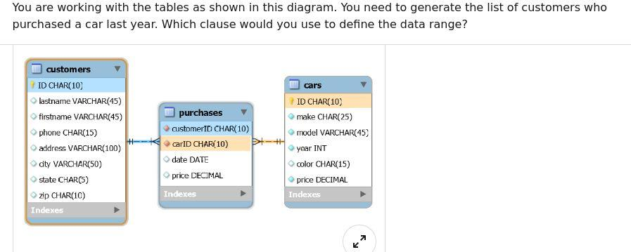
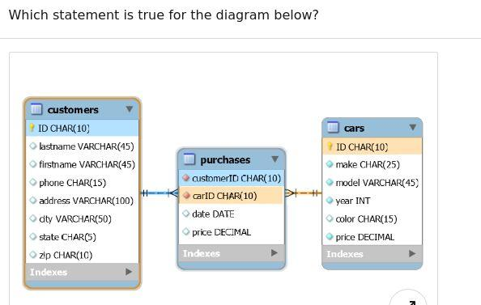
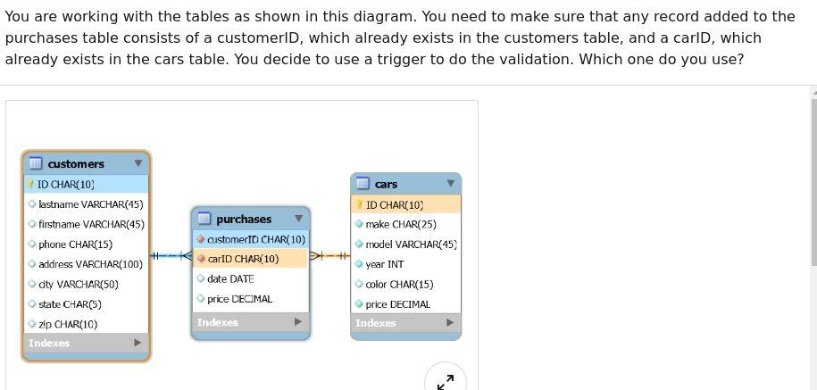
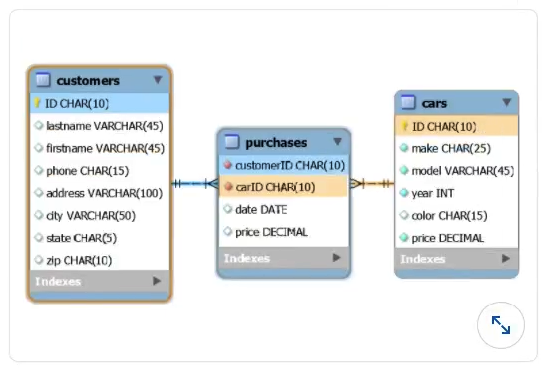

## mysql Assessment

#### Q1. When you have a subquery inside of the main query, which query is executed first?

- [ ] The subquery is never executed. Only the main query is executed.
- [ ] They are executed at the same time
- [ ] the main query
- [x] the subquery

#### Q2. You need to export the entire database, including the database objects, in addition to the data. Which command-line tool do you use?

- [ ] mysqlexport
- [ ] mysqladmin
- [x] mysqldump
- [ ] mysqld

#### Q3. You must ensure the accuracy and reliability of the data in your database. You assign some constraints to limit the type of data that can go into a table. What type of constraints are you assigning?

- [ ] row level
- [ ] database level
- [x] column level
- [ ] function leve

#### Q4. Which option of most MySQL command-line programs can be used to get a description of the program's different options?

- [ ] --options
- [ ] ?
- [x] --help
- [ ] -h

#### Q5. MySQL uses environment variables in some of the programs and command-line operations. Which variable is used by the shell to find MySQL programs?

- [ ] DIR
- [ ] HOМЕ
- [x] PATH
- [ ] MYSQL_HOME

#### Q6. How can you create a stored procedure in MySQL?

- [ ] `-`

```sql
1 CREATE PROCEDURE P () AS
2 BEGIN
3 END;
```

- [x] `-`

```sql
1 CREATE PROCEDURE P ()
2 BEGIN
3 END
```

- [ ] `-`

```sql
1 CREATE PROCP
2 BEGIN
3 END;
```

- [ ] `-`

```sql
1 CREATE PROC P AS O
2 BEGIN
3 END;
```

#### Q7. If you were building a table schema to store student grades as a letter (A, B, C, D, or F) which column type would be the best choice?

- [x] ENUM
- [ ] OTEXT
- [ ] VARCHAR
- [ ] LONGTEXT

#### Q8. Management has requested that you build an employee database. You start with the employee table. What is the correct syntax?

- [ ] `-`

```sql
    1 CREATE TABLE employee (
    2 employee ID char(10),
    3 firstName varchar(50),
    4 lastName varchar(50),
    5 phone varchar(20),
    6 address varchar(50),
    7 PRIMARY KEY ON employeeID
    8 );
```

- [ ] `-`

```sql
    1 CREATE TABLE employee (
    2 employee ID char(10),
    3 firstName varchar(50),
    4 lastName varchar(50),
    5 phone varchar(20),
    6 address varchar(50),
    7 PRIMARY KEY employeeID
    8 );
```

- [ ] `-`

```sql
    1 CREATE TABLE IF EXISTS employee (
    2 employee ID char(10),
    3 firstName varchar(50),
    4 lastName varchar(50),
    5 phone varchar(20),
    6 address varchar(50),
    7 PRIMARY KEY (employeeID)
    8 );
```

- [x] `-`

```sql
    1 CREATE TABLE IF NOT EXISTS employee (
    2 employee ID char(10),
    3 firstName varchar(50),
    4 lastName varchar(50),
    5 phone varchar(20),
    6 address varchar(50),
    7 PRIMARY KEY (employeeID)
    8 );
```

#### Q9. You are working with the tables as shown in this diagram. You need to generate the list of customers who purchased certain car models. Which SQL clause do you use?



- [ ] LIKE
- [x] IN
- [ ] BETWEEN
- [ ] HAVING

#### Q10. Which query would NOT be used to administer a MySQL server?

- [ ] USE db
- [x] SELECT column FROM tbl
- [ ] SHOW COLUMNS FROM tb1
- [ ] SHOW TABLES

#### Q11. What is the product of the database designing phase?

- [ ] system definition
- [x] logical model
- [ ] physical model
- [ ] normalized database
      NOT SURE THE QUESTION IS CORRECT. Logical, physical and normalized are all products of the designing phase in this order.

#### Q12. MySQL server can operate in different SQL modes, depending on the value of the sql_mode system variable. Which mode changes syntax and behavior to conform more closely to standard SQL?

- [ ] TRADITIONAL
- [x] ANSI
- [ ] MSSQL
- [ ] STRICT

#### Q13. MySQL programs are a set of command-line utilities that are provided with typical MySQL distributions. MySQL is designed to be a database.

- [ ] database and programming
- [ ] user and administrator
- [x] client and server
- [ ] syntax and objects

#### Q14. Which MySQL command shows the structure of a table?

- [ ] INFO table;
- [ ] SHOW table;
- [ ] STRUCTURE table;
- [x] DESCRIBE table;

#### Q15. MySQL uses security based on**\_**for all connections, queries, and other operations that users can attempt to perform.

- [ ] administrator schema
- [ ] encrypted algorithms
- [ ] user settings
- [x] access control lists (https://dev.mysql.com/doc/refman/8.0/en/security-guidelines.html)

#### Q16. Which MySQL command modifies data records in a table?

- [x] UPDATE
- [ ] MODIFY
- [ ] CHANGE
- [ ] ALTER

#### Q17. What is the best type of query for validating the format of an email address in a MySQL table?

- [ ] a SQL query using partitions
- [ ] a SQL query using IS NULL
- [x] a SQL query using a regular expression
- [ ] a SQL query using LTRIM Or RTRIM

#### Q18. In MySQL, queries are always followed by what character?

- [ ] line break
- [ ] colon
- [x] semicolon
- [ ] period

#### Q19. How can you remove a record using MySQL?

- [ ] DELETE
- [x] DELETE FROM
- [ ] REMOVE
- [ ] REMOVE FROM

#### Q20. Which choice is NOT a statement you would use to filter data?

- [x] GROUP_BY
- [ ] WHERE
- [ ] LIMIT
- [ ] LIKE

#### Q21. What does the following SQL statement return?

`SELECT * FROM Employees WHERE EmployeeName LIKE 'a%'`

- [ ] It records in the Employees table where the value in the EmployeeName column doesn't have an "a".
- [x] It records in the Employees table where the value in the EmployeeName column starts with "a".
- [ ] It records in the Employees table where the value in the EmployeeName column has an "a".
- [ ] It records in the Employees table where the value in the EmployeeName column ends with "a".

#### Q22. In `SELECT * FROM clients;` what does clients represent?

- [ ] a SQL query
- [ ] a SQL statement
- [ ] a database
- [x] a table

#### Q23. How does MySQL differ from SQL?

- [ ] SQL is a standard language for retrieving and manipulating data from structured databases. MySQL is a nonrelational database management system that is used to manage SQL databases.
- [x] SQL is a standard language for retrieving and manipulating data from structured databases. MySQL is a relational database management system that is used to manage SQL databases.
- [ ] They are not different. MySQL and SQL refer to the same thing.
- [ ] My SQL is a language, and SQL is a software application.

#### Q24. If you need to order a table of movies by name, which query will work?

- [ ] SELECT \* FROM movies GROUP BY name
- [x] SELECT \* FROM movies ORDER BY name
- [ ] SELECT \* FROM movies ORDER TABLE by name
- [ ] SELECT \* FROM movies FILTER BY name

#### Q25. A trigger is a database object that is associated with a table, and that activates when a particular event occurs for the table. Which three events are these?

- [x] INSERT, UPDATE, DELETE
- [ ] CREATE, ALTER, DROP
- [ ] OPEN, FETCH, CLOSE
- [ ] DECLARE, SET, SELECT

#### Q26. You are working with very large tables in your database. Which SQL clause do you use to prevent exceedingly large query results?

- [ ] UNIQUE
- [x] LIMIT
- [ ] DISTINCT
- [ ] CONSTRAINT

#### Q27. What is the default port for MySQL Server?

- [ ] 25
- [ ] 990
- [ ] 0
- [x] 3306

#### Q28. How can you filter duplicate data while retrieving records from a table?

- [x] DISTINCT
- [ ] WHERE
- [ ] LIMIT
- [ ] AS

#### Q29. What is the difference between DROP and TRUNCATE?

- [ ] They both refer to the same operation of deleting the table completely.
- [ ] They both refer to the same operation of clearing the table, but keeping its definition intact.
- [ ] TRUNCATE deletes table completely, removing its definition as well. DROP clears the table but does not delete the definition.
- [x] DROP deletes table completely, removing its definition as well. TRUNCATE clears the table but does not delete the definition.

#### Q30. How do you select every row in a given table named "inventory"?

- [ ] SELECT all FROM inventory;
- [ ] FROM inventory SELECT all;
- [ ] FROM inventory SELECT \*;
- [x] SELECT \* FROM inventory;

#### Q31. In an efficiently designed relational database, what does every table have?

- [ ] set of triggers
- [ ] sequential id field
- [ ] minimum of three columns
- [x] primary key

#### Q32. MySQL option files provide a way to specify commonly used options so that they need not be entered on the command line each time you run a program. What is another name for the option files?

- [ ] variable settings
- [x] configuration files
- [ ] help files
- [ ] default settings

#### Q33. After installing MySQL, it may be necessary to initialize the \_\_ which may be done automatically with some MySQL installation methods.

- [ ] storage engine
- [ ] user accounts
- [ ] grant tables
- [x] data directory

#### Q34. You need to export the data in the customers table into a CSV file, with columns headers in the first row. Which clause do you add to your MySQL command?

- [ ] JOIN
- [ ] WITH HEADERS
- [x] UNION
- [ ] WITH COLUMNS

#### Q35. One form of backup, replication, enables you to maintain identical data on multiple servers, as a \_\_\_ configuration.

- [ ] remote-local
- [ ] parent-child
- [x] master-slave
- [ ] logical-physical

#### Q36. What is the requirement for using a subquery in the SELECT clause?

- [ ] the subquery must use an aggregate function.
- [ ] the subquery must refer to the same table as the main query.
- [x] the subquery must return a single value.
- [ ] the subquery must return at least one value.

#### Q37. Each time MySQL is upgraded, it is best to execute mysql_upgrade, which looks for incompatibilities with the upgraded MySQL server. What does this command do, upon finding a table with a possible incompatibility?

- [x] it performs a table check and, if problems are found, attempts a table repair.
- [ ] it stops and notifies the server administrator that the upgrade cannot complete until the incompatibility issue are resolved.
- [ ] it provides a full report of the table specifications and the incompatibilities to the server administrator.
- [ ] it performs a table check and, if problems are found, displays the information for the server administrator to take action.

#### Q38. What mysql statement is used to check which accounts have specific privileges?

- [x] show grants (displays the privileges and roles that are assigned to a MySQL user account or role)
- [ ] show privileges (shows the list of system privileges that the MySQL server supports)
- [ ] show access
- [ ] show user permissions

#### Q39. What table cannot have a trigger associated with it?

- [ ] temporary
- [x] system
- [ ] large
- [ ] new

#### Q40. later versions of mysql support the native json data type for storing json documents. What is a drawback of json columns?

- [ ] inefficient for storing json documents
- [x] cannot be indexed directly
- [ ] documents cannot be validated when stored in json columns
- [ ] cannot be normalized --- no

#### Q41.Which statement is true for the diagram below



- [ ] carid is the primary key for purchases
- [ ] carid is the foreign key for cars.carid
- [x] customerid is the foreign key for customers.id
- [ ] customerid is the primary key for purchases

#### Q42.Which statement can you use to load data from a file into the table?

- [ ] cat file|mysql
- [x] load data infile (correct if the file is already on the server)
- [ ] load data local infile (also correct but only if the file is from the client)
- [ ] extended insert statement

#### Q43.See tables in the diagram. Make sure that any record added to the purchase table consists of a customerId, which exists in the customer table and a carId, which exists in the car table. You decide to use a trigger to do the validation. Which one?



- [ ] after insert
- [ ] if exists (invalid not a trigger; IF function + EXISTS clause)
- [x] before insert
- [ ] cross join (valid for a check but not a trigger)

#### Q44. Which is the correct syntax of an extended insert statement?

- [ ]
  insert into cars (make, model, year) values ('Ford', 'Mustang', 2002)
  ('Mercedes', 'C', 2003)

- [ ]
  insert into cars (make, model, year) values ('Ford', 'Mustang', 2002)
  values ('Mercedes', 'C', 2003)

- [ ]
  insert into cars (make, model, year) extended ('Ford', 'Mustang', 2002),
  ('Mercedes', 'C', 2003)

- [x]
  insert into cars (make, model, year) values ('Ford', 'Mustang', 2002),
  ('Mercedes', 'C', 2003)

### Q 45. You need an exact copy of a table with all columns and indexes. How?

- [ ] create table
- [ ] clone table
- [ ] insert into
- [x] show create table

#### Q46. you need to make your mysql system secure against hackers. What are you not supposed to do?

- [ ] Run the server as normal user
- [x] grant process or super privilege to other user
- [ ] run the server as the unix root user
- [ ] use the compressed protocol

#### Q47. You manage a database with a table "customers". You created a temporary table also called "customers" with which you are working for the duration of your session. You need to recreate the temporary table with different specs. Which command do you need to run first?

- [ ] create temporary table customers;
- [ ] drop temp table customers;
- [ ] drop table customers;
- [x] drop temporary table customers;

#### Q48. you need to run a complex query with recursive subqueries but without creating a stored procedure or a function. Which command or clause do you use?

- [ ] collate
- [x] union
- [ ] full join
- [ ] with

#### Q49. Which choice is not a processing algorithm for database views?

- [ ] merge
- [x] updatable
- [ ] temptable
- [ ] undefined

#### Q50. What is the MySQL `perror` command-line utility used for?

- [ ] to display your version of MySQL
- [ ] to display operating system error codes
- [ ] to display default settings that are in error
- [x] to display storage error codes

(\*note: perror prints a description for a system error code or for a storage engine (table handler) error code. link: https://dev.mysql.com/doc/refman/5.7/en/perror.html#:~:text=2%20perror%20%E2%80%94%20Display%20MySQL%20Error%20Message%20Information,-For%20most%20system&text=You%20can%20find%20out%20what,(table%20handler)%20error%20code.)

#### Q51. How can you list all columns for a given table?

- [ ] SHOW table COLUMNS;
- [x] SHOW COLUMNS FROM table; (\*not on test but `DESCRIBE tablename` is a shortcut for this command)
- [ ] LIST table COLUMNS;
- [ ] SELECT COLUMNS FROM table;

#### Q52. How would you list the full set of tables in the currently selected database?

- [ ] SELECT \* FROM DATABASE;
- [x] SHOW TABLES;
- [ ] LIST TABLES;
- [ ] SELECT ALL TABLES;

#### Q53. Which choice is not one of the table maintenance statements?

- [ ] CHECK TABLE;
- [x] CREATE TABLE;
- [ ] ANALYZE TABLE;
- [ ] OPTIMIZE TABLE;

#### Q54. In which table does MySQL store passwords for user accounts?

- [ ] mysql.accounts;
- [ ] mysql.passwords;
- [ ] mysql.admin;
- [x] mysql.user;

#### Q55. Management has requested that you build an employee database. You need to include each employee's current position and salary, as well as all prior positions and salaries with the company. You decide to use a one-to-many structure: an employee table with the main information such as name and address, and an employment table with position and salary history. You can use the employeelD field to connect them. What is employment.employeelD an example of?

- [ ] primary key;
- [ ] secondary key;
- [x] foreign key;
- [ ] alternet key;

#### Q56. In recent versions of MySQL (8.0+), what's the correct syntax to declare a CTE (Common Table Expression)?

- [ ] WITH (SELECT id FROM users) as cte, SELECT ...
- [ ] WITH (SELECT id FROM users) as cte SELECT ...
- [ ] WITH cte as (SELECT id FROM users), SELECT ...
- [x] WITH cte as (SELECT id FROM users) SELECT ...

#### Q57. What is one reason to introduce data redundancy into a normalized database design?

- [x] to reduce corruption in data
- [ ] to reduce storage space
- [ ] to make the system faster
- [ ] to prevent data anomalies

#### Q58. The code snippet below is used to read data from an XML file into a table. Which XML structure is **not** supported by the statement?

```sql
1 LOAD XML LOCAL INFILE 'cars.xml'
2 INTO TABLE cars
3 ROWS IDENTIFIED BY `<car>`;
```

- [ ]

```xml
<car>
   <field name="make"> Lexus </field>
   <field name="model"> IS300 </field>
   <field name="make"> 2016 </field>
</car>
```

- [x]

```xml
<car name="make"> Dodge </car>
<car name="model"> Ram </car>
<car name="year"> 2000 </car>
```

- [ ]

```xml
<car make="Ford" model="Mustang" year="2002/>
```

- [ ]

```xml
<car year="2010>
    <make>Mercedes</make> <model> C-Class</model>
</car>
```

#### Q59. You are loading data into a table. Which command can you use to make sure that all data is inserted and duplicated rows are discarded?

- [x] `INSERT IGNORE`
- [ ] `INSERT UNIQUE`
- [ ] `INSERT INTO`
- [ ] `INSERT DISTINCT`

#### Q60. Which statement about the `TRUNCATE TABLE` statement is true?

- [ ] It will stop and issue an error when it encounters a row that is referenced by a row in a child table.
- [x] It always first drops, then re-creates a new table.
- [ ] It deletes rows one by one on tables with foreign key contraints.
- [ ] It does not invoke the `DELETE` triggers associated with the table.

#### Q61. You are working with the tables as shown in this diagram. You need to get the number of cars sold per the home state of each customer's residence. How can you accomplish this?



- [ ] `SELECT state, COUNT(*) FROM customers WHERE ID IN (SELECT customerID FROM purchases) GROUP BY state;`
- [ ] `SELECT state, COUNT(*) FROM customers c LEFT JOIN purchases p ON c.ID = p.ustomerID GROUP BY state;`
- [x] `SELECT state, COUNT(*) FROM customers c, purchases p WHERE c.ID = p.customerID GROUP BY state;`
- [ ] `SELECT state, COUNT(*) FROM customers GROUP BY state;`

#### Q62. In data migration, there is often a need to delete duplicate rows as part of data cleanup. Which statement works best?

- [ ] `DELETE DUPS`
- [ ] `DELETE DISTINCT`
- [x] `DELETE JOIN`
- [ ] `DELETE WITH`

#### Q63. When working with MySQL cursor, what must you also declare?

- [ ] `DEFAULT` value
- [ ] `RETURN` variable
- [ ] `SQLEXCEPTION` routine
- [x] `NOT FOUND` handler

#### Q64. Which type of backup includes all the changes made to the data since the last full backup was performed?

- [x] snapshot
- [ ] logical
- [ ] differential
- [ ] incremental
