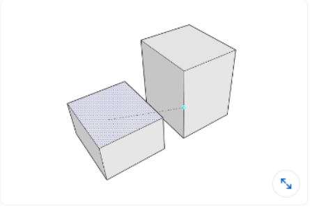
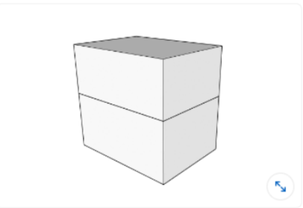
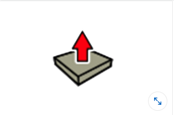
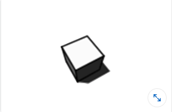

## Sketchup

#### Q1. Which of these will NOT stretch geometry if you click it with the Move tool and move your cursor outward?

- [x] a group
- [ ] and edge
- [ ] an endpoint
- [ ] a face

#### Q2. What is needed to use the Follow Me tool?

- [ ] a continuous path of edges
- [x] a correctly oriented face
- [ ] the Push/Pull tool
- [ ] the Offset and Move tools

#### Q3. What does dragging a selection windows arround entities from left to right do?

- [ ] It deselect any preselect items.
- [ ] It causes selected entities to turn from blue to yellow.
- [x] It selects entities that are entirely contained in the selection box.
- [ ] It selects anything the selection touch box.

#### Q4. What do layers control?

- [x] Visibility
- [ ] Grouping
- [ ] Stacking groups
- [ ] Separating entities.

#### Q5. What action is demonstrated in this image?

- [x] inference
- [ ] push
- [ ] pull
- [ ] offset

#### 6. Which action keeps two edges from "Stacking" together?

- [x] grouping
- [ ] intersection
- [ ] avoiding edges touch
- [ ] drawing perpendicular

#### Q7. In LayOut, how can you set the default lenght of dimension leader lines?

- [ ] 1.Create a dimension and select it with the Select tool.
      2.Open the Dimension Style window and change the Leader Line Length input to your desired length.
      3.Create subsequent dimensions with the new leader line length applied.

- [ ] 1.Create a dimension, double-click the dimension with the Select tool, and drag each leader line to your desired length.
      2.Select the Eyedropper tool and click the dimension leader line.
      3.Continue to draw subsequent dimensions with the new leader line length applied.

- [ ] 1.Open the Dimension Style window and change the Leader Line Length input to your desired length
      2.Create dimensions with the new length applied.

- [x] 1.Create a dimension and click and drag each leader line to your desire length with the select-tool.

2. Right-click the leader line and select Copy.
3. Continue to draw subsequence dimension with the new leader line length applied.

#### Q8. Which tool allows you to scale an edge to a new size that you specify by the typing in the desired measurement?

- [ ] Right-Click
- [ ] Protractor
- [ ] Type measurement
- [x] Scale

#### Q9. How do you round off and trim a corner with only a 2 Point Arc tool?

- [ ]     1.Click once to start drawing an arc near a corner.

  2.Double-click at adjacent edge where it says Tangent to Edge while the inference color is cyan.

- [ ]     You cannot do this with only the 2 Point Arc tool.
- [x] 1.Click once to start drawing an arc near a corner.

2. Double-click at adjacent edge where it says Tangent to Edge while the inference color is magenta.

- [ ]     1.Draw an arc with endpoints at equidistant points from the corner with the 2 Point Arc tool.
  2.Right-click and select Trim.

#### Q10. What is the best way to click in the measurement box?

- [ ] to start a new measurement
- [x] when you would like to edit a measurement
- [ ] there is never
- [ ] to delete a measurement

#### Q11. You have created a 3D model and are concerned that some of the edges that are intended to be aligned with the axis and not. How can you check this?

- [x] Click Camera > Standar View > By Axis
- [ ] &shy;
- [ ] &shy;
- [ ] &shy;

#### Q12. The drawing on the left has hidden line style...

- [ ] &shy;
- [ ] &shy;
- [ ] &shy;
- [x] In the Style Window, select the edit tab, click The Edges icon and select the back edge option.

#### Q13. Which arrow key allows you to toggle between parallel and perpendicular (magenta) inference direction?

- [ ] Left
- [x] Down Arrow
- [ ] Right
- [ ] Up

#### Q14. How can you check the length of an edge?

- [ ] Use the select tool
- [ ] Right-click on an edge
- [x] Use the tape measurement tool to click...
- [ ] Use the tape measurement tool to hover over...

#### Q15. Where can you quickly find helpful hints and trick while using tools?

- [ ] measurement box
- [ ] ywllow dialog box
- [x] help menu
- [ ] status bar

#### Q16. The image below shows the Label and Auto-Text function in LayOut. This data is added when the component is created. How can you edit the data after it is created?

- [x] 1.In SketchUp, open the Components window.

2. Click the arrow next to the home icon and select In Model.
3. Select the large cylinder component.
4. Right-click the title and select Edit.
5. Change the information listed

- [ ]     1.In SketchUp, select the component.

2. In the Entity Info window, select Advanced Attributes and edit the information listed.

- [ ] 1.In Layout, select the model and open the Components window.

2. Choose Info and edit the information listed.

- [ ] 1. In Layout, use the Select tool to double-click the drawing.

2. Right-click the cylinder and select Edit Component.
3. Choose Smart Data and edit the information listed

#### Q17. Which method creates a perpendicular view of a selection cut?

- [ ] Orbit
- [ ] Righ-Click
- [ ] Righ-Click
- [x] Click view > Selection Plane Direct

#### Q18. You are creating an entity that will repeat in your model multiple times. What should you do?

- [ ]     Make it a group.
- [ ] Save it to the 3D Warehouse for later use.
- [ ]     Save it to its own .skp file so you can reuse it.
- [x] Make it a component.

#### Q19. Which image would work best when creating a model using the Match Photo function?

- [ ]     an image shot with a wide-angle lens
- [ ] an image with only one or two edges showing
- [ ] an image with one vanishing point
- [x]     an image taken at a 45-degree angle

#### Q20. What function does the Zoom Extents tool perform?

- [ ] It allows you to zoom and extend an edge in the same action.
- [ ] It zooms to 400%.
- [ ] It allows you to zoom in on a selected group.
- [x] It centers your entire visible model in the viewport.

#### Q21. What does the dash blue line in this image represent?

- [ ] The unbidden edge
- [ ] The inference edge
- [ ] The map edge
- [x] The control edge

#### Q22. You have created a 3D model and are concerned that some of the edges that are intended to be aligned with the axis are not. How can you check this?

- [ ] Click view > Edge Style > By Axis.
- [ ] Click Styles > Edges > Color > By Axis.
- [ ] Click Camera > Parallel Projection.
- [x] Click Camera > Standard Views > By Axis.

#### Q23. You want to import a floor plan file to trace over.How can you bring this image into your drawing space?

- [x] Click File > import > Select File > Use as image.
- [ ] Click File > Import > Select File > Use as Texture.
- [ ] Click File > Page Setup > Select File > import.
- [ ] Click File > Document Setup > Select File > Import.

#### Q24. You are creating a section fill from a section cut. However, one area is not filling like the rest. What can you do?

- [ ] click View > Section Fill All.
- [x] Draw a rectangle over the fill area and use the Paint Bucket to fill the face with the section fill color.
- [ ] Right-click the section plane and select Troubleshoot Section Fill.
- [ ] Right-click the face and select Fill.

#### Q25. How do you efficiently select all instances of a component in the model?

- [ ] Using the Select tool, hold down Ctrl (Option) and click each component in the Drawing window..
- [ ] Right click the component in the Drawing window and select Select Instances from the context menu.
- [ ] Right click the component in the Components window and select Select Instances from the context menu.
- [x] Select the component in the Drawing window and then select Edit > Select > All Instances from the menu.

#### Q26. Which images work best to apply as a tiled (repeating) texture?

- [ ] images with darker material finishes
- [ ] photos of tile
- [ ] high-resolution photographs
- [x] seamless images with no visible seams when tiled

#### Q27. Which is not a function that the scroll wheel on a three-button mouse performs?

- [ ] Roll forward and backward to zoom in and zoom out.
- [x] Click and hold the mouse button and the Spacebar to activate the selection addition function.
- [ ] Click and hold the mouse button, and add Shift to activate Pan.
- [ ] Click and hold to activate Orbit.

#### Q28. What is the minimum geometry needed in order to create a face?

- [ ] 4 edges that are within 1" of each other
- [x] 3 coplanar edges
- [ ] 4 coplanar edges
- [ ] 3 edges that are connected

#### Q29. The drawing on the left has a hidden line style selected, but some of the information seems lost. The drawing on the right has the samestyle, but seems to be showing all geometry. What setting was changed to fix this?

- [x] In the Styles window, select the Edit tab, click the Edges icon, and select the Back Edges option.
- [ ] In the Styles window, select the Edit tab, click the Edges icon, and select the Depth Cue option.
- [ ] In the Styles window, select the Edit tab, click the Edges icon, and select the Profiles option.
- [ ] In the Styles window, select the Edit tab, click the Edges icon, and select the Edges option.

#### Q30. You are creating a model of a small object for 3D printing. Because of its small size, you run into modeling ssues. What is a possiblefix for this?

- [ ] Use Zoom Extents to see your model more fully.
- [ ] Be sure not to click and drag your mouse while drawing.
- [x] Scale your model up(100x, for example), build it, and then scale it back down to the same ratio before printing.
- [ ] work on the model in a file without any other entities in it so that the file size stays small.

#### Q31. You are trying to cut an opening in a countertop that is the same shape as an oval sink, so that the sink bowl is visible.Whichfunction would create this?

- [x] Intersect Faces with Model
- [ ] Circle tool and Push/Pull
- [ ] JointPushPull
- [ ] Reverse Faces and Delete

#### Q32. What is an extension?

- [x] a plug-in developed for SketchUp that gives added functionality
- [ ] a line that is 2 inches longer than the measured distance
- [ ] a program that comes with SketchUp Pro for added functionality
- [ ] a rectangle that is offset outward of its original shape
      Q33. Which Styles window settings icon would you select to change the color of the ground in your model?
- [ ] A 

- [ ] B 

- [x] C 

- [ ] D 

#### Q34. While working on a kitchen model, you try using the Move tool to move a cabinet but accidentally click the stove and begin to moveit. What should you do?

- [x] Press the Esc key to cancel the Move tool operation, then click the cabinet.
- [ ] Press the D key to drop the stove, then click the cabinet.
- [ ] Activate the Select tool to let go of the stove.Activate the Move tool again, and click the cabinet.
- [ ] Set the stove down, move it back with the Move tool, and then click the cabinet.

#### Q35. which of these icons is the Arc tool?

- [ ] A 

- [x] B 

- [ ] C 

- [ ] D 

#### Q36. How do you add to a selection?

- [ ] Activate the Select tool, hold down the Tab key, and click each entity that you would like to add to the selection set.
- [ ] Hold down the A key, activate the Select tool, and click each entity that you would like to add to the selection set.
- [x] Activate the Select tool, hold down the Shift key, and click each entity you would like to add to the selection set.
- [ ] Activate the Select tool, press the Plus Sign (+), and click each entity that you would like to add to the selection set.

#### Q37. which icon represents a tool that will extrude a surface?

- [ ] A 

- [x] B 

- [ ] C 

- [ ] D 

#### Q38. what is the purpose of the 2D people included in some sketchUp templates?

- [ ] to create a point of inference
- [x] to show a scale reference
- [ ] to introduce you to SketchUp staff
- [ ] to practice using the Select and Eraser tools

#### Q39. How would you move a group from an existing layer called walls to an existing layer called Ceiling?

- [x] Right-click the group and select Entity info, and then use the drop-down menu and select ceiling.
- [ ] Right-click the group and select Make Component.Then, in the component dialog box, select the Ceiling layer.
- [ ] Right-click the group and select Layers, and then use the drop-down menu and select ceiling.
- [ ] Right-click the group and select edit Group > Layers, and then use the drop-down menu and select ceiling.

#### Q40. which method creates a perpendicular view of a section cut?

- [x] Right-click the section plane and select Align View.
- [ ] click view > Section Plane Direct.
- [ ] orbit and pan through your model until you see the correct view.
- [ ] Right-click the section plane and select orbit to Direct View.

#### Q41. How many edges are in this image?

- [x] seven
- [ ] eight
- [ ] three
- [ ] four

#### Q42. What action is being demonstrated in this image?

- [ ] Offset
- [ ] Rise
- [x] Inference
- [ ] Pull

#### Q43. what is the Hybrid rendering option for in Layout?

- [ ] This option is used when there is more than one scale among multiple viewports on a page.
- [x] It combines scalable vector linework with raster rendering for materials.
- [ ] It combines scalable vector linework with faster rendering speed.
- [ ] There are not any rendering options in Layout.

#### Q44. When some faces are oriented correctly and others are not, what is considered the most efficient way to correctly orient all faces?

- [ ] Select all geometry and choose orient Faces.
- [ ] Hold the Shift key and select all backward faces, right-click the selection, and select Reverse Faces.
- [x] Right-click a correctly oriented face and select orient Faces.
- [ ] Right-click each backward face and select Reverse Face.

#### Q45. How do you sample a material that has been used in the model?

- [ ] In the Tools drop-down menu, select Material, right-click the material, and select Texture > Sample.
- [ ] Activate the Paint Bucket tool, right-click the material, and select Texture > Sample.
- [ ] Open the Materials window. Under the Colors In Model file, scroll down until you find the reference material, and then click the thumbnail.
- [x] Activate the Paint Bucket tool, hold down Ctrl (Command), and then click the material that has already been applied to a face in the model.

#### Q46. The cube on the bottom is in one group and the cube on top is in another group.How can you keep them in two separate groups,but have them appear as one when not selected?

- [ ] Erase the bottom edges in the top group and the top edges in the bottom group.
- [ ] Extrude both farther so that the geometry is overlapping.
- [ ] offset the bottom of the top group and the top of the bottom group.
- [x] Hide the bottom edges in the top group and the top edges in the bottom group.

#### Q47. How can you create a component that will always face your view?

- [ ] Right-click the component after creating it and select Always face camera from the menu.
- [x] when creating the component, select Face Me in the dialog box.
- [ ] Right-click the component after creating it and select Face Me from the menu.
- [ ] when creating the component, select Always face camera in the dialog box.

#### Q48. What tool is commonly used to create rounded or curved surfaces in SketchUp?

- [ ] Push/Pull tool.
- [ ] Line tool.
- [x] Follow Me tool.
- [ ] Move tool.

#### Q49. How can you create a copy of a selected object or group in SketchUp?

- [ ] Right-click and choose "Delete" to duplicate it..
- [ ] Press the "D" key to create a copy.
- [ ] Use the "Rotate" tool to make a copy.
- [x] Press the "Ctrl" (or "Cmd" on Mac) key while using the Move tool to copy the selection.

#### Q50. In SketchUp, what is the purpose of the "Eraser" tool?

- [ ] To draw straight lines and shapes.
- [ ] To add materials and textures to surfaces.
- [ ] To measure distances and angles.
- [x] To delete lines and surfaces.

#### Q51. How can you add dimensions and labels to your SketchUp model?

- [ ] Use the Paint Bucket tool.
- [ ] Right-click on the model and select "Add Dimensions."
- [x] Select the "Dimension" tool and click on two points in your model.
- [ ] Use the "Follow Me" tool to extrude labels.

#### Q52. What does the "Outliner" panel in SketchUp allow you to do?

- [ ] Change the background color of your model.
- [ ] Add new layers to your model.
- [ ] Apply materials to surfaces.
- [x] Organize and manage components and groups in your model.

  #### Q53. Which feature in SketchUp allows you to create a 3D model from a 2D image or photo?

- [ ] Match Perspective
- [ ] Extrusion
- [x] Match Photo
- [ ] Scale Tool

  #### Q54. What is the purpose of the "Section Plane" tool in SketchUp?

- [x] To create a cutting plane in your model to show cross-sections.
- [ ] To add lighting and shading effects to your model.
- [ ] To create 3D text labels.
- [ ] To draw circles and ellipses.

#### Q55. How can you apply a specific texture or material to a single face in SketchUp?

- [x] Click File > Save
- [ ] Use the Export tool
- [ ] Press Ctrl+S (or Command+S on Mac)
- [ ] It's automatically saved

#### Q36. How do you add to a selection?

- [ ] Activate the Select tool, hold down the Tab key, and click each entity that you would like to add to the selection set.
- [ ] Hold down the A key, activate the Select tool, and click each entity that you would like to add to the selection set.
- [x] Activate the Select tool, hold down the Shift key, and click each entity you would like to add to the selection set.
- [ ] Activate the Select tool, press the Plus Sign (+), and click each entity that you would like to add to the selection set.

#### Q37. what is the purpose of the 2D people included in some sketchUp templates?

- [ ] to create a point of inference
- [x] to show a scale reference
- [ ] to introduce you to SketchUp staff
- [ ] to practice using the Select and Eraser tools

#### Q38. How would you move a group from an existing layer called walls to an existing layer called Ceiling?

- [x] Right-click the group and select Entity info, and then use the drop-down menu and select ceiling.
- [ ] Right-click the group and select Make Component.Then, in the component dialog box, select the Ceiling layer.
- [ ] Right-click the group and select Layers, and then use the drop-down menu and select ceiling.
- [ ] Right-click the group and select edit Group > Layers, and then use the drop-down menu and select ceiling.

#### Q39. which method creates a perpendicular view of a section cut?

- [x] Right-click the section plane and select Align View.
- [ ] click view > Section Plane Direct.
- [ ] orbit and pan through your model until you see the correct view.
- [ ] Right-click the section plane and select orbit to Direct View.

#### Q40. How many edges are in this image?

- [x] seven
- [ ] eight
- [ ] three
- [ ] four

#### Q41. What action is being demonstrated in this image?

- [ ] Offset
- [ ] Rise
- [x] Inference
- [ ] Pull

#### Q42. what is the Hybrid rendering option for in Layout?

- [ ] This option is used when there is more than one scale among multiple viewports on a page.
- [x] It combines scalable vector linework with raster rendering for materials.
- [ ] It combines scalable vector linework with faster rendering speed.
- [ ] There are not any rendering options in Layout.

#### Q43. When some faces are oriented correctly and others are not, what is considered the most efficient way to correctly orient all faces?

- [ ] Select all geometry and choose orient Faces.
- [ ] Hold the Shift key and select all backward faces, right-click the selection, and select Reverse Faces.
- [x] Right-click a correctly oriented face and select orient Faces.
- [ ] Right-click each backward face and select Reverse Face.

#### Q44. How do you sample a material that has been used in the model?

- [ ] In the Tools drop-down menu, select Material, right-click the material, and select Texture > Sample.
- [ ] Activate the Paint Bucket tool, right-click the material, and select Texture > Sample.
- [ ] Open the Materials window. Under the Colors In Model file, scroll down until you find the reference material, and then click the thumbnail.
- [x] Activate the Paint Bucket tool, hold down Ctrl (Command), and then click the material that has already been applied to a face in the model.

#### Q45. The cube on the bottom is in one group and the cube on top is in another group.How can you keep them in two separate groups,but have them appear as one when not selected?

- [ ] Erase the bottom edges in the top group and the top edges in the bottom group.
- [ ] Extrude both farther so that the geometry is overlapping.
- [ ] offset the bottom of the top group and the top of the bottom group.
- [x] Hide the bottom edges in the top group and the top edges in the bottom group.

#### Q46. How can you create a component that will always face your view?

- [ ] Right-click the component after creating it and select Always face camera from the menu.
- [x] when creating the component, select Face Me in the dialog box.
- [ ] Right-click the component after creating it and select Face Me from the menu.
- [ ] when creating the component, select Always face camera in the dialog box.

#### Q47. which icon represents a tool that will extrude a surface?

- [ ]
- [x]
- [ ]
- [ ]

- [ ] Use the "Paint Bucket" tool and paint the entire model.
- [ ] Create a group or component, and then apply the texture.
- [ ] Right-click on the face and select "Apply Material."
- [x] Use the "Materials" panel to select and paint individual faces.
