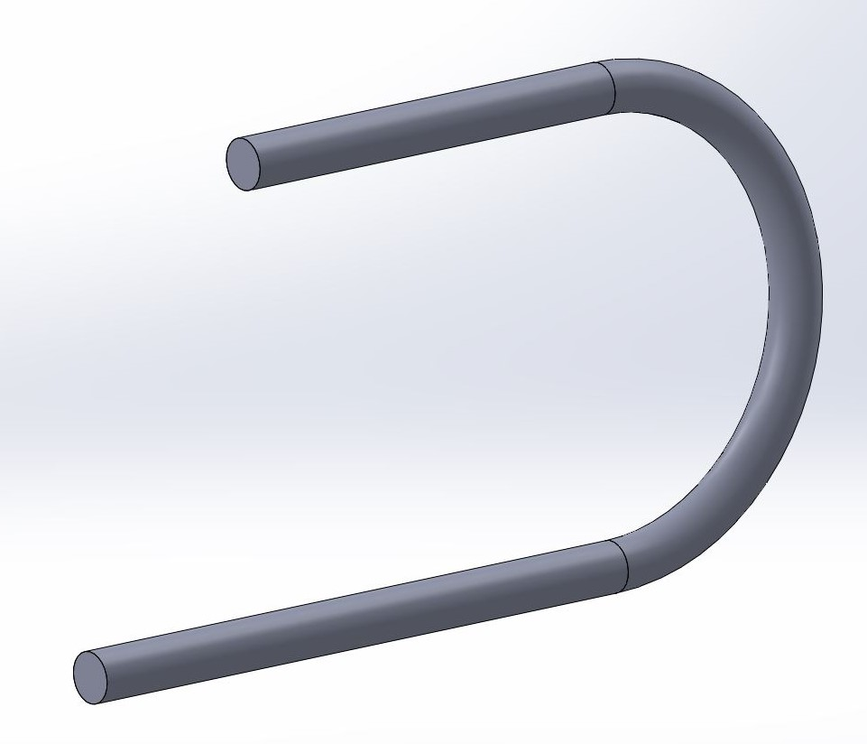

## SOLIDWORKS

#### Q1. Which file contains all the drawing document-specific information, such as specifications for units, drafting standard, font selections, etc?

- [x] SOLIDWORKS drawing template
- [ ] SOLIDWORKS composer file
- [ ] SOLIDWORKS part file
- [ ] SOLIDWORKS sheet format

[Reference : drawing template](https://www.cati.com/blog/2017/07/tech-tip-the-difference-between-a-sheet-format-and-a-drawing-template-in-solidworks/#:~:text=The%20drawing%20template%20has%20the,pre%2Ddefined%20views%2C%20etc.)

#### Q2. You need to design a steel spring with a pitch diameter of 3 inches, free length of 10 inches, and pitch of 1 inch. How would you accomplish this in SOLIDWORKS?

- [ ] Create a new sketch of a circle with a diameter of 1 inch. Then use the Helix/Spiral curve command and define a height of 10 inches and pitch of 3 inches.
- [x] Create a new sketch of a circle with a diameter of 3 inches. Then use the Helix/Spiral curve command to define a height of 10 inches and pitch of 1 inch.
- [ ] First, create a new sketch of a circle of 10 inches. Then use the Helix/Spiral curve command and define by pitch of 1 inch and 3 revolutions.
- [ ] Use the Helix/Spiral curve command and define a diameter of 3 inches, height of 10 inches, and pitch of 1 inch.

#### Q3. Which single feature could you use to create this image?

- [ ] Loft
- [ ] Extruded Boss/Base
- [x] Sweep
- [ ] Revolved Boss/Base

#### Q4. Which choice is NOT a fillet type in SOLIDWORKS?

- [ ] constant size
- [ ] variable size
- [ ] face
- [x] angled

#### Q5. Your sketch is not extruding correctly. It does not seem to be a properly closed contour, although from a simple visual inspection, it looks to be fully closed. You think perhaps there are some very small gaps in your contour that are causing the issue. What tool can you use to find these small gaps?

- [ ] Quick Snaps
- [ ] Rebuild
- [x] Repair Sketch
- [ ] Show Error

[reference](https://blogs.solidworks.com/tech/2016/12/solidworks-fix-sketch-repair-sketch.html)

#### Q6. Which choice is an example of a skected feature?

- [ ] chamfer
- [x] extrusion
- [ ] fillet
- [ ] shell

[Reference](https://help.solidworks.com/2016/English/SolidWorks/acadhelp/c_Feature_based_Models.htm)

#### Q7. You want to make two circles have the same center point within a SOLIDWORKS sketch. How can you do this?

- [ ] Add a tangent relation between the circles
- [x] Add a concentric relation between the circles
- [ ] Add a horizontal relation between the circles
- [ ] Add an equal relation between the circles

#### Q8. Which reference geometry is NOT available in SOLIDWORKS?

- [x] sphere
- [ ] plane
- [ ] point
- [ ] axis

[Reference](https://www.cati.com/blog/2020/02/solidworks-basics-of-reference-geometry-axis/)

#### Q9. Specifying two lines to be perpendicular to each other would be an example of what?

- [ ] feature
- [x] relation
- [ ] extrude
- [ ] dimension

[Solidworks: Sketch Relations](https://help.solidworks.com/2022/english/SolidWorks/sldworks/c_Description_of_Sketch_Relations.htm)

#### Q10. You want to focus on a single component within your assembly and hide all the rest. How can you do this?

- [ ] Right-click the component you want to focus on and select Change Transparency
- [ ] Right-click the component you want to focus on and select Hide
- [x] Right-click the component you want to focus on and select Isolate
- [ ] Right-click the component you want to focus on and select Suppress

[Solidworks: Isolate](https://help.solidworks.com/2022/english/SolidWorks/sldworks/hidd_comp_isolate_dlg.htm?verRedirect=1)

#### Q11. What will Save As do on an existing saved part?

- [ ] It will delete the original part and save the current part with a new name
- [x] It will keep the original part and save the current path with a new name
- [ ] It will save both the original part and the new part in the current state
- [ ] It will rename the original part

[Reference](https://help.solidworks.com/2022/English/SolidWorks/sldworks/AFX_HIDD_FILESAVE.htm)

#### Q12. You want to show a list of the raw materials, subassemblies, intermediate assemblies, subcomponents, and parts, and the quantities of each, needed to manufacture an end product. What would be useful to accomplish this?

- [x] bill of material
- [ ] isometric view
- [ ] exploded view
- [ ] hole list

[Reference](https://en.wikipedia.org/wiki/Bill_of_materials)

#### Q13. Freezing a portion of a model can be used if you work with complex models with many features. Why

- [ ] Freezing the features helps to show only the critical features of the model
- [ ] Freezing the features helps to show the internal features of the model
- [x] Freezing the features helps to reduce the rebuild time and prevent unintentional changes to the model
- [ ] Freezing the features helps to show the external features of the model

[Reference](https://help.solidworks.com/2021/English/SolidWorks/sldworks/c_Feature_Freeze.htm)

#### Q14. Which single features could you use to design a cube, a sphere, and a paperclip, respectively?

- [ ] Revolved Boss/Base, Shell, and Sweep
- [ ] Shell, Revolved Boss/Base, and Extruded Boss/Base
- [x] Extruded Boss/Base, Revolved Boss/Base, and Sweep
- [ ] Draft, Extruded Boss/Base, and Shell

#### Q15. Which choice is NOT a standard mate within SOLIDWORKS?

- [ ] parallel
- [ ] coindicent
- [x] equal
- [ ] concentric

[Reference](https://help.solidworks.com/2019/English/SolidWorks/sldworks/r_Types_of_Mates_SWassy.htm)

#### Q16. How would you temporarily remove a feature from a model?

- [x] Click the feature in the FeatureManager design tree or graphics area, then select Suppress
- [ ] Drag the feature to the Suppression folder, located at the top of the FeatureManager design tree
- [ ] You cannot remove features temporarily-you can only delete them completely
- [ ] Drag the feature to the bottom of the FeatureManager design tree, then drag the Suppression bar above it

[Reference](https://help.solidworks.com/2022/English/SolidWorks/sldworks/c_Suppress_and_Unsuppress_Features.htm)

#### Q17. You want to show an assembly's components spread out and positioned to show how they fit together when assembled. How do you accomplish this?

- [ ] Use Assembly Visualization
- [ ] Use a bill of materials
- [ ] Use isometric view
- [x] Use exploded view

[Reference](https://help.solidworks.com/2018/english/solidworks/sldworks/c_Exploded_Views_in_Assemblies.htm)

#### Q18. How would you fix a Lofted Boss/Base feature that appears twisted?

- [x] Drag the loft connectors to the correct position, or use guide curves
- [ ] Reduce the spacing between the loft profiles, then scale the loft body as required
- [ ] Loft shapes are driven entirely by the loft profiles, adjust the skecthes to remove any ambiguity in the loft path
- [ ] Ensure that the Twist Along Path option is not selected

[Reference](https://help.solidworks.com/2022/English/SolidWorks/sldworks/c_Recommendations_Lofts_Guide_Curves.htm)

#### Q19. When creating a sweep feature, you receive this error: "Cannot get to a point on the path to start with. For an open path, the path must intersect with the section plane." How can you fix this?

- [x] Ensure that the path sketch touches the profile sketch at some point
- [ ] Select the Path Merge option within the sweep feature
- [ ] Select the Path Intersection option within the sweep feature
- [ ] Edit the path sketch and reduce any areas of tight curvature

#### Q20. With injection molding, one common manufacturing requirement or preference is applying a taper or angle to faces to help with part removal from the mold. Which feature can help you meet this requirement?

- [ ] Loft
- [x] Draft
- [ ] Wrap
- [ ] Sweep

#### Q21. You want to simplify a very large and complex assembly to improve performance while working within it. What should you use?

- [ ] DFMXpress
- [x] SpeedPak
- [ ] a flexible subassembly
- [ ] Design Checker

[reference](https://help.solidworks.com/2014/english/SolidWorks/sldworks/c_Improving_Large_Assembly_Performance_SWassy.htm

#### Q22. If you are working with ISO standards, which projection method would you most likely be using?

- [ ] second angle projection
- [ ] fourth angle projection
- [x] first angle projection
- [ ] third angle projection

[Reference](https://www.mcadcafe.com/nbc/articles/1/1551676/Which-standard-should-you-adopt-2D-Drawing-ISO-ASME)

#### Q23. You have a single line within a sketch that you would like to split into three separate lines. How can you achieve this?

- [ ] Use the Offset Entities tool
- [x] Use the Split Line tool
- [ ] Use the Split Entities tool
- [ ] Use the Split tool

#### Q24. What controls the direction and magnitude of a spline curvature?

- [ ] inflection point
- [ ] control point
- [ ] spline point
- [x] spline handle

[Reference](https://www.cati.com/blog/2016/06/creating-splines-in-solidworks-made-easy/)

#### Q25. You want to build a new part within an assembly to ensure in-context relations and dimensions. You also want to save out this part file as its own unique file. After navigating to the Assembly ribbon tab, what do you do next?

- [ ] Under Insert Component, select Part to create a new in-context part. Right-click the new part and select isolate
- [ ] Select Insert Component to create a new in-context part. Right-click te new part and select Save Part (in External File)
- [ ] Under Insert Components, select New Part to create a new in-context part. Right-click the new part and select Save Selection
- [x] Under Insert Components, select New Part to create a new in-context part. Right-click the new part and select Save Part (in External File)

[Reference](https://help.solidworks.com/2018/english/SolidWorks/sldworks/t_Creating_a_Part_in_an_Assembly.htm)

#### Q26. The ribbon bar at the top of your SOLIDWORKS screen has disappeared. How can you get it back?

- [ ] Click View > Toolbars > CommandManager
- [ ] Click View > Toolbars > FeatureManager
- [ ] Click View > Toolbars > MotionManager
- [x] Click View > Toolbars > Task Pane

[reference](https://www.javelin-tech.com/blog/2017/02/solidworks-task-pane-missing/)

#### Q27. Representing a three-dimensional object by a number of two-dimensional views is generally called

- [ ] isometric projection
- [ ] oblique projection
- [ ] object projection
- [x] orthographic projection

[Reference](https://www.britannica.com/technology/orthographic-projection-engineering)

#### Q28. How can you rename a feature?

- [x] Select the feature name and press F2, or slow-double-click the feature name
- [ ] Select the feature name and press F3 key, or right-click the feature name
- [ ] Select the feature name and press F7, or quick-double-click the feature name
- [ ] Select the feature name and press F5 key, or double-click the feature name

[reference](http://support.ptc.com/help/creo/creo_pma/usascii/index.html#page/part_modeling/part_modeling/part_five_sub/To_Rename_a_Feature.html)

#### Q29. When using the Fillet tool, what does the Tanget Propagation option do?

- [ ] It creates a fillet that is tanget to the direction of view
- [ ] It creates a fillet that varies in size, depending on lcoal tangency
- [ ] It creates a constant-size fillet around all selections
- [x] It extends the fillet to all faces that are tangent to the selected face

[Reference](https://help.solidworks.com/2022/english/swconnected/swdotworks/c_example_tangent_propagation.htm)

#### Q30. You notice that one of the subassemblies in your main assembly is rigid and does not have mobility it should. How can you resolve this issue?

- [x] Select the subassembly and then select **Make Subassembly Flexible** from the context menu
- [ ] Select the subassembly and then select **Set Resolved from LightWeight** from the context menu
- [ ] Select the subassembly and then select **Edit Assembly** from the context menu
- [ ] Select the subassembly and then select **Make Independent** from the context menu

[Reference](https://help.solidworks.com/2018/english/solidworks/sldworks/c_flexible_sub-assemblies.htm)

#### Q31. You dimension an arc in a drawing and notice that the dimension is coming in as the radius value. You want to show the diameter value. To do this, first you click the dimension to open the dimension PropertyManager. What do you do next?

- [x] On the **Leaders** tab, select **Diameter**
- [ ] On the **Other** tab, select **Diameter**
- [ ] On the **Value** tab, and select **Diameter**
- [ ] On the **Value** tab, seect **Override Value**

#### Q32. In the image below, which are the parents and children of the Vertical Boss Feature?

- [x] The parent is Base Feature; the children are Slot Cutout, Sketch3, CBORE Hole, and Fillet2
- [ ] The parent is Vertical Boss; the childre are Base Feature, Slot Cutout, Sketch3, CBORE Hole, and Fillet2
- [ ] The parent is Base Feature; the children are Vertical Boss, Slot Cutout, Sketch3, CBORE Holde, and Fillet2
- [ ] The parents are Vertical Boss and Base Feature; the children are Slot Cutout, Sketch3, CBORE Hole, and Fillet2

#### Q33. In this image, which parts are fixed?

- [ ] BASE
- [ ] LINK 3
- [x] LINK 5
- [ ] LINK 1

[Reference](https://help.solidworks.com/2022/English/SolidWorks/sldworks/t_Fixing_the_Position_of_a_Component.htm)

#### Q34. What is this image an example of?

- [x] a hole table
- [ ] a revision table
- [ ] a tolerance table
- [ ] a punch table

[Reference](https://help.solidworks.com/2022/English/SolidWorks/sldworks/c_hole_tables.htm)

#### Q35. What type of dimensioning is shown here?

- [ ] smart dimensioning
- [ ] angular running dimensioning
- [x] ordinate dimensioning
- [ ] chain dimensioning

#### Q36. In the image below, what types of hole are A1 and B1 respectively?

- [ ] countersink and counterbore
- [x] counterbore and countersink
- [ ] standard and threaded/tapped
- [ ] threaded/tapped and standard

#### Q37. What is this sketch an example of?

- [x] an open contour sketch
- [ ] a multi-contour or intersecting sketch
- [ ] a triple contour sketch
- [ ] a closed contour sketch

#### Q38. Can this skecth be extruded?

- [ ] Yes, you can extrude it using the standard extrude boss option
- [ ] Yes, you can extrude it using the Selected Contours option
- [ ] No, the sketch is an open contour and this cannot be extruded
- [x] Yes, you can extrude it using the Thin Feature option

#### Q39. Why is it useful to suppress a feature?

- [ ] Suppressing changes the color of a feature. This is useful to help easily distinguish between different features.
- [x] Suppressing removes a feature from a model, but does not delete it. This is useful if you need that feature back in the future.
- [ ] Suppressing removes a feature from a model forever. This is useful if you no longer need that feature.
- [ ] Suppressing makes a feature transparent. This is useful if you ever need to see through a feature when modeling.

#### Q40. Which choice is not a standard view orientation in SOLIDWORKS?

- [ ] back
- [x] down
- [ ] right
- [ ] front

#### Q41. What type of view is used to show a portion of some parent view, usually at an enlarged scale?

- [x] detail view
- [ ] auxiliary view
- [ ] break view
- [ ] section view

#### Q42. How can you create relationships between parts within an assembly?

- [x] Use mates.
- [ ] Use constraints.
- [ ] Use relations.
- [ ] Use dimensions.

#### Q43. What is required to create a solid using the Swept Boss/Base tool?

- [x] a profile and a path
- [ ] a sketch and an axis of revolution
- [ ] atleast two profiles
- [ ] a sketch

#### Q44. Which statement best describes the term "parametric modeling"?

- [ ] This type of modeling is often compared to working with modeling clay.
- [x] The dimensions and relations used to create a feature are captured and stored in the model.
- [ ] You can simply push and pull the geometry until you arrive at the shape you require.
- [ ] Dimensions and relations are not captured or stored within the model.

#### Q45. What is required to create a solid using the Extruded Boss/Base tool?

- [ ] at least two profiles
- [ ] a sketch and an axis of revolution
- [x] a sketch
- [ ] a profile and a path

#### Q46. Which choice is an example of an applied feature?

- [ ] extrusion
- [ ] revolve
- [x] fillet
- [ ] sweep

#### Q47. How can you change the size of a toolbox screw in an assembly?

- [x] Right-click the component and select Edit Toolbox Component.
- [ ] Toolbox part sizes cannot be changed once added. You have to delete the screw and then readd one of the correct size.
- [ ] Edit the screw part and add a scale feature using only the required axes.
- [ ] Open the screw part, then manually adjust the dimensions and save as a copy.

#### Q48. Which choice is not a standard 3D view in SOLIDWORKS?

- [ ] dimetric
- [ ] trimetric
- [ ] isometric
- [x] oblique

#### Q49. You are designing a robotic arm assembly. You want the first link of the arm to be able to rotate about the base, but only a total of 270 degrees from the start point and no further. How would you achieve this?

- [ ] Use an Angle mate.
- [ ] Use a Mechanical mate.
- [x] Use a Limit Angle mate
- [ ] Use a Gear mate.

#### Q50. How can you reattach a broken reference in a derived split part?

- [ ] Right-click the filename at the top of the FeatureManager design tree and select Relink Stock Part.
- [ ] Once derived part references are broken, they cannot be readded. Consider resplitting the part.
- [ ] Locate the child part using SOLIDWORKS Explorer and select Relink Parent.
- [x] Edit the stock feature at the start of the FeatureManager design tree, then adjust the Defining Stock Part option.

[Reference](https://help.solidworks.com/2022/English/SolidWorks/sldworks/HIDD_FEAT_EDIT_SPLIT_FEAT_BODY.htm)

#### Q51. You have designed a plastic part that you want to split and save in two separate unique parts. You use the Split tool to split the part in half and create the two bodies. What do you do next?

- [ ] Navigate to the Solid Bodies folder, right-click the body name, and select Isolate to save to a new file. Repeat for the other body.
- [ ] Within the Split tool, select Consume Bodies.
- [ ] Within the Split tool, select Save as New Files.
- [x] Within the Split tool, click File, double-click the body name, type a name for the new part, and click Save.

#### Q52. What is required to create a new 2D sketch?

- [ ] any existing geometry
- [ ] any existing plane or curved face
- [x] any existing plane or planar face
- [ ] any planar or curved surface

#### Q53. You want to enlarge your current design by 3%. What tool would you use?

- [ ] Extrude
- [ ] Loft
- [x] Scale
- [ ] Truncate

#### Q54. Earlier within your part design, you created a sketch. Now you want to make a copy of this sketch to use on a different plane or face. You want to ensure that the two sketches will always be the same, so that if you modify the original sketch, the new sketch is updated to reflect the same changes. How can you achieve this?

- [ ] Copy and paste the original sketch.
- [ ] Copy and paste the original sketch using Paste Special.
- [ ] Create a composite sketch.
- [x] Create a derived sketch.

#### Q55. When creating sketches, small boxes show up next to the sketch lines. What are these boxes called?

- [ ] check boxes
- [ ] locks
- [ ] statuses
- [x] relations

#### Q56. You notice your sketch is blue. How can you make your sketch fully defined?

- [ ] Add in any additional required features.
- [x] Add in the additional dimensions or relations.
- [ ] Nothing, the sketch is already fully defined.
- [ ] Remove any additional dimensions or relations.

#### Q57. Which sketch relation can you NOT apply to a rectangle?

- [ ] coincident
- [ ] collinear
- [x] concentric
- [ ] fix
