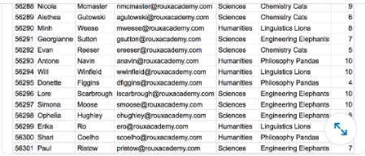
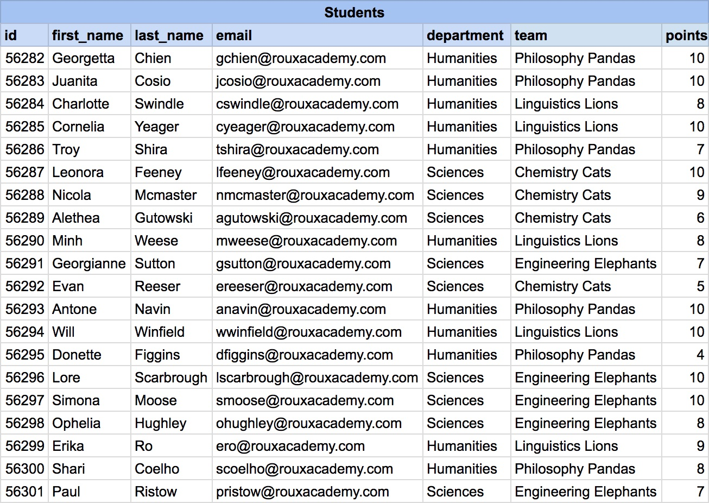

## Transact-SQL (T-SQL)

#### Q1. Which answer is NOT a type of table index?

- [ ] nonclustered
- [ ] unique
- [x] heap
- [ ] hash

#### Q2. The keywords AND, IN, LIKE, and between all belong to a category called what?

- [ ] joining operations
- [ ] linking operations
- [ ] criteria operations
- [x] logical operations

#### Q3. What is the result of this series of statements?

```
BEGIN TRY
SELECT 'Foo' AS Result;
END TRY
BEGIN CATCH
SELECT 'Bar' AS Result;
END CATCH
```

- [x] Foo
- [ ] FooBar
- [ ] Foo Bar
- [ ] Bar

#### Q4. Given these two tables, which query generates a listing showing student names and the department office location where you could reach each student?

- [ ] SELECT Students.first_name, Students.last_name, Departments.office_location FROM Students, Departments;
- [x] SELECT Students.first_name, Students.last_name, Departments.office_location FROM Students JOIN Departments ON Students.department = Departments.department;
- [ ] SELECT Students.first_name, Students.last_name, Departments.office_location FROM Students JOIN Departments;
- [ ] SELECT Students.first_name, Students.last_name, Departments.office_location FROM Students ON Students.department = Departments.department;

#### Q5. What is an example of a DDL command in SQL?

- [ ] TRUNCATE TABLE
- [ ] DELETE
- [ ] MERGE
- [x] DROP

#### Q6. Given the Games table pictured, which query generates the results shown?

- [ ] SELECT GameType, MaxPlayers, count(\*) AS NumberOfGames
      FROM Games
      GROUP BY MaxPlayers, GameType
      ORDER BY MaxPlayers, GameType;
- [x] SELECT GameType, MaxPlayers, count(\*) AS NumberOfGames
      FROM Games
      GROUP BY GameType, MaxPlayers
      ORDER BY GameType;
- [ ] SELECT GameType, count(Players) AS MaxPlayers, NumberOfGames
      FROM Games
      GROUP BY GameType, MaxPlayers
      ORDER BY GameType;
- [ ] SELECT GameType, MaxPlayers, count(\*) AS NumberOfGames
      FROM Games
      GROUP BY GameType
      ORDER BY MaxPlayers;

#### Q7. Which answer is a possible result of the sequence of commands below?

```
DECLARE @UniqueID uniqueidentifier = NEWID();
SELECT @UniqueID AS Result;
```

- [ ] 1
- [x] bb261196-66a5-43af-815d-123fc593cf3a
- [ ] z350mpj1-62lx-40ww-9ho0-4u1875rt2mx4
- [ ] 0x2400001155F04846674AD4590F832C0

#### Q8. You need to find all students that are not on the "Chemistry Cats" team. Which query does NOT work for this task?

- [x] SELECT \* FROM Students
      WHERE team NOT 'Chemistry Cats';

- [ ] SELECT \* FROM Students
      WHERE team <> 'Chemistry Cats';

- [ ] SELECT \* FROM Students
      WHERE team != 'Chemistry Cats';

- [ ] SELECT \* FROM Students
      WHERE NOT team = 'Chemistry Cats';

#### Q9. You need to write a query that returns all Employees that have a LastName starting with the letter A. Which WHERE clause should you use to fill in the blank in this query?

- [ ] WHERE LastName = A\*
- [ ] WHERE LastName = LIKE '%A%'
- [x] WHERE LastName LIKE 'A%'
- [ ] WHERE LastName IN ('A\*')

#### Q10. Which query shows the first name, department, and team of all students with the two lowest points?

- [ ] SELECT LIMIT(2) first_name, department, team FROM Students ORDER BY points ASC;
- [ ] SELECT TOP(2) first_name, deprtment, team FROM Students ORDER BY points DESC;
- [x] SELECT TOP(2) WITH TIES first_name, department, team FROM Students ORDER BY points;
- [ ] SELECT BOTTOM(2) first_name, department, team FROM Students ORDER BY points ASC;

`the picture of table is important here and there it can be seen that there are only two value with min points. Secondly, the previous answer was wrong because order by DESC will put highest points into the beginning of result list and TOP(2) will take first two highest points, and we need the lowest points.`

#### Q11. What is the result of this statement?

`SELECT FLOOR(-1234.321)`

- [ ] -1234.3
- [ ] -1234
- [x] -1235
- [ ] 1234.321

#### Q12. Which is the best approach to update the last name of the student Donette Figgins to Smith

- [ ] UPDATE Students SET last_name = 'Smith' WHERE email = 'dfiggins@rouxacademy.com';
- [ ] UPDATE Students SET last_name = 'Figgins' WHERE email = 'dfiggins@rouxacademy.com';
- [ ] UPDATE Students SET last_name = 'Figgins' WHERE last_name = 'Smith' AND first-name = 'Donette';
- [x] UPDATE Students SET last_name = 'Smith' WHERE last_name = 'Figgins' AND first-name = 'Donette';

#### Q13. Which of these data types is an approximate numeric?

- [x] real
- [ ] bit
- [ ] decimal
- [ ] numeric

#### Q14. You need to remove all data from a table name Products. Which query fully logs the removal of each record?

- [ ] TRUNCATE FROM Products \*;
- [x] DELETE FROM Products;
- [ ] DELETE \* FROM Products;
- [ ] TRUNCATE TABLE Products;

#### Q15. What is the result of the following query? SELECT 1 / 2 AS Result;

- [ ] 0.5
- [ ] error
- [x] 0
- [ ] 2

#### Q16. which data type will most efficiently store a person's age in years?

- [ ] float
- [ ] int
- [x] tinyint
- [ ] bigint

#### Q17. What is the result of this query?

    SELECT 'abc\
    def' AS Result;

- [x] abc\def
- [ ] abcdef
- [ ] error
- [ ] abc def

#### Q18. To select a random student from the table, which statement could you use?

- [x] SELECT TOP(1) first_name, last_name FROM Students ORDER BY NEWID();
- [ ] SELECT TOP(1) RAND(first_name, last_name) FROM Student;
- [ ] SELECT TOP(1) first_name, last_name FROM Student;
- [ ] SELECT TOP(1) first_name, last_name FROM RAND(Student);

[https://www.petefreitag.com/item/466.cfm](https://www.petefreitag.com/item/466.cfm)

#### Q19. What result is returned after executing the following commands?

    DECLARE @MyVariable int;
    SET @MyVariable = 1;
    GO
    SELECT @MyVariable;

- [x] error
- [ ] 1
- [ ] null
- [ ] @MyVariable

#### Q20. Which statement creates a new database schema named Sales and establish Sharon as the owner?

- [ ] ALTER USER Sharon WITH DEFAULT_SCHEMA = Sales;
- [ ] ALTER USER Sharon SET SCHEMA Sales;
- [x] CREATE SCHEMA Sales SET OWNER Sharon;
- [ ] CREATE SCHEMA Sales AUTHORIZATION Sharon;

#### Q21. The result of a CROSS JOIN between a table with 4 rows, and one with 5 rows, will give with \_\_\_\_ rows.

- [ ] 1024
- [x] 20
- [ ] 0
- [ ] 9

#### Q22. You need to write a query that returns all products that have a SerialNumber ending with "10_3". Which WHERE clause should you use to fill in the blank in this query?

    SELECT ProductID, ProductName, SerialNumber
    FROM Products______ ;

- [x] `WHERE SerialNumer LIKE '%10_3'`
- [ ] `WHERE SerialNumer LIKE ('%10'+'_'+'3')`
- [ ] `WHERE SerialNumer LIKE '%10"_"3'`
- [ ] `WHERE SerialNumer LIKE '%10[_]3'`

#### Q23. When no join type between multiple tables in a query's FROM clause is specified, what type of join is assumed?

- [x] INNER
- [ ] RIGHT
- [ ] LEFT
- [ ] FULL

#### Q24. How many bytes of storage does the int data type consume?

- [ ] 1 byte
- [ ] 2 bytes
- [x] 4 bytes
- [ ] 8 bytes

#### Q25. What does a RIGHT JOIN ensure?

- [ ] that only records from the rightmost table will be displayed
- [ ] that no records from the rightmost table are displayed if the records dont have corresponding records in the left table
- [ ] that records from the rightmost table will be displayed only if the records have a corresponding value in the leftmost table
- [x] that all records from the rightmost table are represented in the result, even if there are no corresponding records in the left table

#### Q26. You execute the following three queries. What is the result?

    Create table students(id int identity(1000,1), firstname varchar(20),
    lastname varchar(30));
    insert into students(firstname,lastname)values('mark','twain');
    select * from students;

- [ ]
  studentid firstname lastname
  1 1001 mark twain

- [ ]
  studentid firstname lastname
  1 1 mark twain

- [x] studentid firstname lastname
      1 1000 mark twain

- [ ]
  studentid firstname lastname
  1 null mark twain

#### Q27. Which Query returns all student names with the highest grade?

`create table students( studentname varchar(50), grade int);`

- [ ] select studentname from students where grade=max(grade);
- [ ] select top(1) studentname from students order by grade;
- [x] select top(1) with ties studentname from students order by grade desc;
- [ ] select studentname,max(grade) from students order by grade desc;

`top(1) with ties will take the highest grade and all other students with the same grade (because they are order by grade) and matches the highest grade.`

#### Q28. What role does "inventory" play?

`select bookid, boooktitle, bookauthor,quantityonhand from inventory.books;`

- [ ] you only want to see results from books currently in inventory
- [x] it instructs the query engine to find the books table in the inventory schema
- [ ] it instructs the query engine to find the books table in the inventory database
- [ ] it instructs the query engine to join the books table to the inventory schema

`select * from dbo.books here dbo is a schema and the inventory is also schema; if we'd like to specify a database we should use db_name.schema_name.table_name`

#### Q29. What is the result of an INNER JOIN between table1 and table2?

- [x] Only records that have corresponding entries in table1 and table2 are displayed.
- [ ] No records from table1 are ever displayed.
- [ ] All records from table1 are displayed, regardless of whether the records have a corresponding row in table2
- [ ] Only records that have no corresponding records in table1 or table2 are displayed.

#### Q30. To remove all of the content from the Students table but keep the schema, which statement should you use?

- [x] TRUNCATE TABLE Students;
- [ ] TRUNCATE \* FROM Students;
- [ ] DROP TABLE Students;
- [ ] REMOVE \* FROM Students;

#### Q31. Review the CREATE TABLE statement below. Which option, when placed in the blank space, ensures that the BookISBN column will not contain any duplicate values?

```
CREATE TABLE Books (
    BookID int PRIMARY KEY,
    BookISBN char(13) NOT NULL _____,
    BookTitle nvarchar(100) NOT NULL
);
```

- [ ] NO DUPLICATES
- [ ] UNIQUE CONSTRAINT AK_Books_BookISBN
- [ ] DUPLICATE CONSTRAINT (AK_Books_BookISBN)
- [x] CONSTRAINT AK_Books_BookISBN UNIQUE

#### Q32. Given a table with the following structure, which query will not return the lowest grade earned by any student?

```
CREATE TABLE Students (
    StudentName varchar(50),
    Grade int
);
```

- [ ]

```
SELECT StudentName
FROM Students
WHERE Grade = (SELECT MIN(Grade) FROM Student);
```

- [x]

```
SELECT TOP(1) Grade
FROM Students
ORDER BY Grade;
```

- [ ]

```
SELECT MIN(Grade)
FROM Students
ORDER BY Grade;
```

- [ ]

```
SELECT MIN(Grade)
FROM Students
```

#### Q33. Given a table with the following structure, which query will not return the lowest grade earned by any student?



- [ ] UPDATE Students SET last_name='Smith', email = 'dsmith@rouxacademy.com' WHERE id='56295';
- [ ] UPDATE Students SET last_name='Smith' AND email = 'dsmith@rouxacademy.com' WHERE id='56295';
- [ ] UPDATE Students SET last_name='Smith' AND email = 'dsmith@rouxacademy.com' WHERE id=56295;
- [x] UPDATE Students SET last_name='Smith', email = 'dsmith@rouxacademy.com' WHERE id=56295;

#### Q34. You would like to have a record added to a TableB every time a record is modified in TableA. What technique should you look at implementing?

- [ ] You should create a DML trigger on the server.
- [ ] You should create a DDL trigger on the database.
- [ ] You should create a DML trigger on TableA.
- [x] You should create a DML trigger on TableB.

#### Q35. What is the problem with this code?

    DECLARE @Counter int;
    SET @Counter = 1;
    WHILE @Counter > 0
    BEGIN
      SET @Counter = @Counter +1;
    END;

- [x] There is no END WHILE statement;
- [ ] The local varaible is not available to the WHILE block.
- [ ] The query causes an infinite loop.
- [ ] "Counter" is an invalid variable name.

#### Q36. Which is the right query to change the name of the Philosophy Pandas team to the Philosophy Parrots?



- [x] UPDATES Students SET team = 'Philosophy Parrots' WHERE team = 'Philosophy Pandas';
- [ ] UPDATES Students SET team = `Philosophy Parrots` WHERE team = `Philosophy Pandas`;
- [ ] UPDATES Students SET team = "Philosophy Parrots" WHERE team = "Philosophy Pandas";
- [ ] UPDATES Students SET team = Philosophy Parrots WHERE team = Philosophy Pandas;

#### Q37. What is the result of this query?

```
SELECT '123'+'123' AS Result;
```

- [x] error
- [ ] '123''123'
- [ ] 123123
- [ ] 246