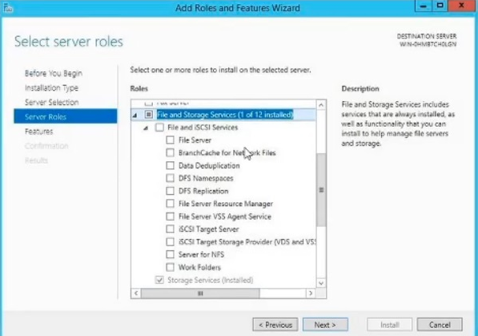
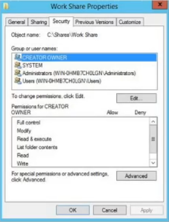
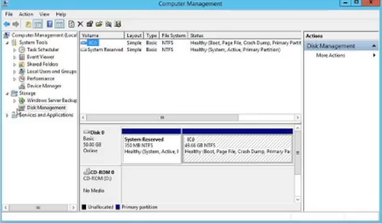
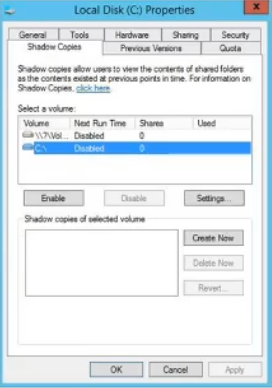
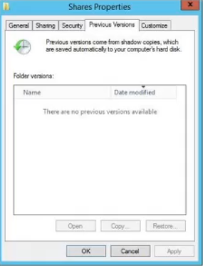
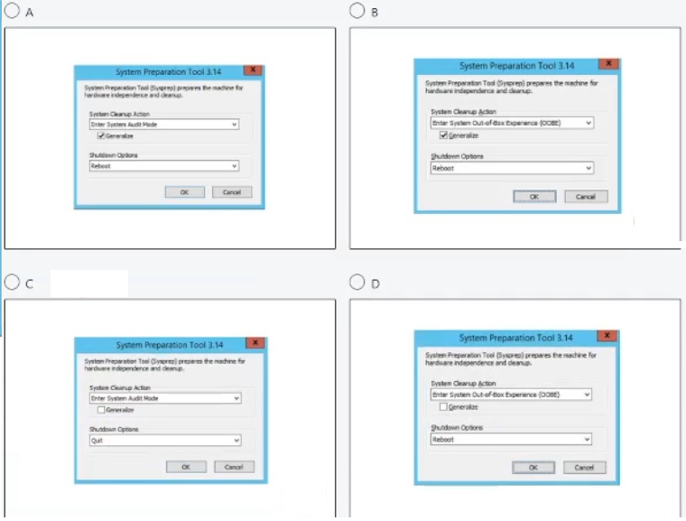
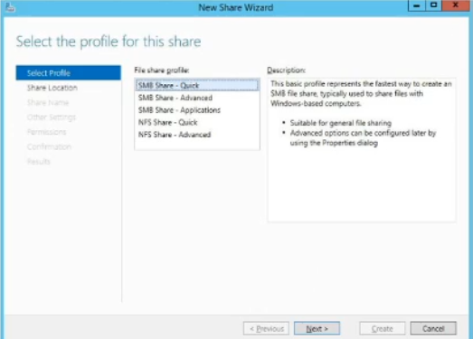
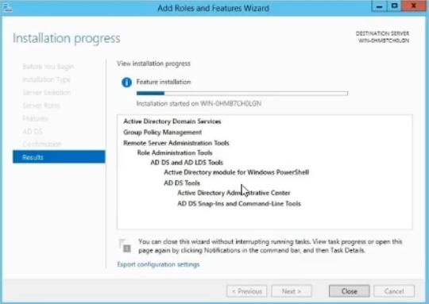

## Windows Server

#### Q1. You need to create a file share for your company that must be accessible from all branch offices and its share path must have the name Work Share. Which server role do you install?

- [x] BranchCache for Network Files
- [ ] File Server
- [ ] Work Folders
- [ ] DFS Namespaces

#### Q2. You support an IT infrastructure for an organization that has physical locations and WAN connections from the main office to each branch. You are designing a network where users at all locations have access to shared files, both online and offline. Which Windows technology is best for your design?

- [ ] Data Deduplication
- [x] BranchCache
- [ ] DFS Replication
- [ ] File and Storage Services

#### Q3. Which type ot DNS record is most commonly used in a forward lookup zone to resolve a host name to a specific IP address?

- [ ] an MX record
- [x] an A record
- [ ] an RTP record
- [ ] a TXT record

#### Q4. What can you perform to free up space on a Windows Server 2012 R2 C: drive?

- [ ] a disk migration
- [x] a disk cleanup
- [ ] a disk consolidation
- [ ] a disk defragmentation

#### Q5. A Windows Server 2012 R2 VM is available to use. You created an XML file that includes all the server roles and features you require for a file server. The XML tile is stored at the root of the D: drive. What PowerShell command do you run to configure the server?

- [ ] `Install-WindowsServices -ConfigurationFilePath d:\PowerShellConfig.xml`
- [ ] `Install-WindowsFeature -ConfigurationFilePath d:\root\PowerShellConfigFile.xml`
- [ ] `Install-WindowsRole -ConfigurationFilePath d:\FileServerConfig.xml`
- [x] `Install-WindowsFeature -ConfigurationFiIePath d:\FileServerConfig.xml`

#### Q6. When configuring a CA which role service provides a web interface for users to easily request and renew certificates?

- [ ] Network Device Enrollment Service
- [x] Certification Authority Web Enrollment
- [ ] Online Responder
- [ ] Certificate Enrollment Policy Web Service

#### Q7. Two companies with different names and domains are merging. What do you set up to ensure that name resolution requests are forwarded directly to the other company's authoritative server?

- [x] DNS conditional forwarder
- [x] DNS secondary zone
- [ ] DNS forward lookup zone
- [ ] DNS reverse lookup zone

#### Q8. Hyper-V \_ is a disaster recovery tool that replicates virtual machines from one Hyper-V host server to another in a Hyper-V Windows Server 2016 environment.

- [ ] Manager
- [x] Replica
- [ ] Backup
- [ ] Data Protection Manager

#### Q9. You deployed a Windows Server 2012 R2 virtual machine and configured the File and Storage Services server role. Where do you begin configuring the use of Previous Versions for restoring files?

- [ ] A

- [ ] B

- [ ] C

- [x] D

#### Q10. You have installed the Remote Desktop Services role. Which remote desktop mode comes with two built-in licenses?

- [x] RDA Administration Mode
- [x] RDS Session Mode
- [ ] RDS User Mode
- [ ] RDA Application Mode

#### Q11. How would you link a unique users policy made for the Human Resources Department users in your domain?

- [ ] Link the GPO to the Human Resources OU.
- [ ] Link the GPO to the Default Domain Policy.
- [ ] Link the GPO to the domain root
- [x] Link the GPO to the Computers OU.

#### Q12. You've deployed a Server Core installation of Windows Server 2016. Which is NOT a way to update the server?

- [x] Configure the server to use a WSUS server with Group Policy.
- [ ] Run the following command: `Net stop wuauserv %systemroot%\system32\Cscript scregedit.wsf /AU 4 Net start wuauserv`.
- [ ] Run the following command: `Wusa <updatename>.msu /quiet`.
- [ ] Install the WSUS server role.

#### Q13. When deploying a Windows Server as a print server, which role needs to be installed?

- [ ] Print Services
- [ ] File Services
- [x] Print and Document Services
- [ ] Print Server

[Reference](https://www.faqforge.com/windows-server-2012-r2/install-configure-print-server-windows-server-2012-r2/)

#### Q14. Which type of DNS record is NOT specifically associated with an AD domain controller?

- [ ] LDAP
- [ ] Kerberos
- [x] GC
- [ ] PTR

#### Q15. Your Hyper-V server has two physical disks installed, Disk 1 is a C: drive that hosts the Windows system files, and disk 2 is a D: drive that has no data. You need to connect the D: drive to a newly created VM using a pass-through disk configuration. What is true about the D: drive?

- [ ] The physical disk must be in a RAID 6 configuration.
- [x] The physical disk must be reformatted.
- [x] The physical disk must be offline.
- [ ] The physical disk must use iSCSI.

#### Q16. Which Windows Server technology enables replication of volumes between servers or clusters for disaster recovery?

- [x] Storage Replica
- [ ] Storage Spaces Direct
- [ ] Stretch Cluster
- [ ] Storage Spaces

#### Q17. You are setting up new branch that has 50 client computers, all of which have been joined to the existing Active Directory domain. You deployed a DHCP server and were able to log in with your domain admin credentials, however the local clients are not receiving IP addresses. What is the cause of this issue?

- [ ] The DHCP server is not part of the DHCP Servers OU in AD.
- [x] The DHCP server has not been authorized.
- [ ] Your domain admin account is not part of the local computer's Administrators group.
- [ ] The DHCP server is not part of the AD domain.

#### Q18. You want to verify that a DHCP server has been authorized use in Active Directory. Which cmdlet do you run in Windows PowerShell?

- [ ] Add-DhcpServerInDC
- [x] Get-DhcpServerInDC
- [ ] Get-WindowsFeature DHCP
- [ ] Instä11-WindowsFeature DHCP

#### Q19. You log in to the domain controller to manage some user and computer accounts in Active Directory (AS) and you cannot find the AD tools. To resolve this using the Add Roles and Features Wizard, which feature would you install without any unnecessary services?

- [ ] Hyper-V Management Tools
- [ ] Remove Server Administration Tools
- [ ] Active Directory Rights Management Services
- [x] AD DS and AD LDS Tools

#### Q20. You deploy Windows Server 2012 R2 server as a VPN server and must configure new firewall rules for workstation connections. Which command do you use to configure the new rules with the least amount of effort?

- [ ] Use dism.exe from the command prompt.
- [ ] Use dsadd.exe from the command prompt.
- [x] Use the New-NetFirewallRule command in PowerShell.
- [ ] use the Enable-NetFirewallRule in PowerShell.

#### Q21. A basic DHCP server can provide clients with an IP address, subnet mask, default gateway, DNS IP address. and what other IP address?

- [ ] file server
- [x] WINS server
- [ ] WSUS
- [ ] proxy server

#### Q22. When setting up a disaster recovery plan for your Hyper-V virtual machines in a System Center Virtual Machine Manager (VMM) cloud, what happens during the initial replication?

- [ ] A Hyper-V VM snapshot is taken.
- [x] Delta replication begins.
- [ ] Delta disk changes are logged and merged with the parent disk.
- [ ] Virtual hard disks on the VM are replicated to the secondary site.

#### Q23. You want to secure your Windows server so the built-in web browser can navigate only to sites listed in Internet Explorer's 'trusted sites' list. How can you configure this security capability?

- [ ] Go to the Manager and enable IE Enhanced Security Configuration.
- [ ] Go to Internet Explorer's Internet Options end add unauthorized website URLs te the 'restricted sites' list.
- [x] Go to Internet Explorer's Internet Options and add authorized website URLs to the 'trusted sites' list.
- [ ] Go to the Control Panel and enable user Account Control.

#### Q24. After adding a network printer to the Windows print server, you try to add the printer to a Windows 8 desktop client. While typing the network path to the new printer, you are unable to find it. Why is the new network printer unavailable for selection?

- [ ] You did not add the printer drivers to the print server.
- [x] You did not select the Share the Printer check box.
- [ ] You need to re-add the printer to the Print Management console.
- [ ] The printer lost connection to the network.

#### Q25. You built a container image on Nano Server. The container image has multiple layers, including a custom application built for your company, and your development team pushed the image to your Azure image registry. What happens if you attempt to pull that image to a new server with previously downloaded OS images?

- [ ] Your custom layers will be pulled from your Azure registry and you will receive an notifying you of the missing base image.
- [x] You will receive an notifying you of the missing base image and you will not be allowed to pull the image.
- [ ] All layers will be downloaded from your Azure registry.
- [ ] The base OS image layers will automatically be pulled from Microsoft's registry at Docker Hub, and your custom layers will be pulled from your Azure registry.

#### Q26. You need to configure your DHCP server to deny certain client MAC addresses receiving an IP address. Where do you configure this setting?

- [ ] Filters folder
- [x] Policies folder
- [ ] Scope Default folder
- [ ] Scope Options folder

#### Q27. Where can you go to restore deleted objects in Active Directory without the use of Microsoft PowerShell or ldp.exe?

- [x] Active Directory Administrative Center
- [ ] Active Directory Domains and Trusts
- [ ] Active Directory and Computers
- [ ] Active Directory Sites and Services

#### Q28. You have a running Active Directory Certificate Services (AD CS) server and need to back up the certificate databases and private keys. How do you accomplish this?

- [x] Use the certutil.exe command.
- [ ] Schedule a full backup of the server.
- [ ] Perform a direct copy of database files and private keys to a file share.
- [ ] Schedule an incremental backup of the server.

#### Q29. You must configure set of three DNS IP addresses to be given to clients that receive IP configuration from your DHCP server. The DNS IP will apply to all DHCP created on the server. Where on your DHCP do you configure this setting?

- [ ] Server Options
- [ ] Scope Options
- [ ] Scope Clients
- [x] Policies

#### Q30. You are working toward managing cross-forest certificate enrollment deployment and need to copy objects in the source forest to the target forest. How do you keep the source and target forest synchronized?

- [x] storage replication
- [x] pkisync.ps1
- [ ] site replication
- [ ] certificate templates

#### Q31. A company IIS server will host the corporate site, which is accessible only by company computers. You need to configure this website to SSL. You obtain certificate to install on the server. Into which certificate store should you import the server's certificate?

- [ ] Trusted Root Certification Authorities under Local Computer
- [ ] Trusted Root Certification Authorities under Current User
- [x] Personal under Local Computer
- [ ] Client Authentication Computer

#### Q32. You are preparing a Windows Server 2016 server image for deployment. You want to further customize your server by adding applications and device drivers, and to test your computer in Windows environment. What sysprep.exe parameters would you select when customizing your server image?

- [ ] A
- [ ] B
- [x] C
- [ ] D

#### Q33. A domain GPO must apply to users based on the location of the computer to which they are logging in. You set up this ability by using which group policy feature?

- [ ] inheritance
- [ ] administrative
- [x] loopback
- [ ] filter

#### Q34. You are planning to install a SAN that will utilize iSCSI storage. You want to provide automatic discovery, management and configuration of iSCSI devices. After running the Get-WindowsFeature \* PowerShell command, which should you install?

- [ ] Network Load Balancing
- [ ] EnhancedStorage
- [x] iSNS
- [ ] Multipath IO

#### Q35. As you create a new share, you are unable to configure the default classification of data on the folder. Why would the New Share Wizard prevent this configuration?

- [ ] The File Resource Manager must be installed.
- [x] The Distributed File System server must also be installed.
- [ ] The Windows server license is not compatible with the feature.
- [ ] The file share groups must be configured first.

#### Q36. When installing the AD DS server role, which will NOT be installed as part of the requited features and services for AD DS to run?

- [ ] DFS Replication
- [ ] DFS Namespaces
- [x] Active Directory Lightweight Directory Services
- [ ] File Replication services

#### Q37. Which is NOT a reason to deploy a DHCP super scope in your network?

- [ ] The current address pool is almost depleted and more clients will added.
- [x] Clients will be migrated to a new scope in a phased approach.
- [ ] More than one DHCP server wants to manage separate logical IP networks on the same physical network segment.
- [ ] A proven failover option is required so clients are always connected.

#### Q38. You prestaged a computer in Active Directory in a domain controller at company headquarters. After 30 minutes, that new computer object is still not available at the branch office domain What should you run from prompt to get a summary of the AD replication status in your domain from the perspective of all domain controllers?

- [ ] `repadmin /replsum`
- [x] `repadmin /showrepl *`
- [ ] `ntdsutil.exe`
- [ ] `repadmin /queue`

#### Q39. You currently have a DHCP server issuing addresses to clients. Which task should you perform first to set up your DHCP server to dynamically issue addresses to clients on the network?

- [x] Add IPv6 scope.
- [x] Configure an IPv6 address for the interface on the DHCP server.
- [ ] Set up Windows client configuration.
- [ ] Install the DHCPv6 server role.

#### Q40. In the Add Roles and Features Wizard window, you are unable to remove Active Directory domain Services—the check box is greyed out. How can you remove AC DS from a Windows Server 2012 R2?

- [ ] Click Next and review the Features section.
- [ ] Click Previous choose a different server.
- [ ] Click Cancel and restart the server.
- [x] Click Cancel and open the Remove Roles and Features Wizard.

#### Q41. In the image below, what is being installed on the server?

- [ ] AD CS
- [ ] AD FS
- [x] AD DS
- [ ] AD LDS

#### Q42. The first ot root server in a PKI must have the Active Directory Certificate Services installed running which role service?

- [x] Certification Authority Web Enrollment
- [ ] Certificate Authority
- [ ] Network Device Enrollment Service
- [ ] Online Responder

#### Q43. You have shared folder on your FILESVR01 server. You want to be notified vie email when files are saved in the folder. How do you automate this task?

- [x] Use Storage Reports.
- [ ] Use File Management Tasks.
- [ ] Use Quota Management.
- [ ] Use File Screen Management.

#### Q44. What you use to implement a secure hardware store for your CA keys?

- [ ] storage area network
- [ ] network attached storage
- [x] hardware security module
- [ ] encrypted hard drive

#### Q45. You are deploying a highly available file server using a Hyper-V cluster configuration. After creating the cluster, why must you add d disk as a cluster shared volume (CSV)?

- [ ] to provide nodes in cluster independent VMs slot age location
- [x] to implement fault tolerance zero downtime for the VM
- [ ] to protect data from loss
- [ ] to prevent nodes in a cluster from accessing a storage location

#### Q46. When setting up a new RADIUS client, what piece of information verifies a secure and trusted connection with the RADIUS server?

- [x] shared secret
- [ ] hash key
- [ ] vendor name availability
- [ ] authentication methods

#### Q47. You run a script to encrypt a client computer's hard drive with BitLocker and back up the recovery password to Active Directory. When researching the computer object's properties, you cannot find the BitLocker recovery password. What may be the cause?

- [x] BitLocker Drive Encryption Administration Utilities are not installed on the client computer.
- [ ] BitLocker Drive Encryption Administration Utilities are not installed on the domain controller.
- [ ] BitLocker Drive Encryption Tools are not installed on the domain controller.
- [ ] BitLocker Drive Encryption Tools are not installed on the client computer.

#### Q48. After running the PowerShell cmdlet Add-WindowsFeature Adcs-Cert-Authority -IncludeManagementTool on a Windows Server 2016 server, which command will make it a Root Certificate Authority (CA)?

- [ ] Install-CertificationAuthority
- [ ] Install-CertificationAuthority -CAType RootCA
- [x] Install-AdcsCertificationAuthority -CAType EnterpriseRootCA
- [ ] Install-AdcsCertificationAuthority -CAType RootCA

#### Q49. A set of computer and user settings can be applied to multiple clients and servers in a domain through the use of `___`.

- [x] Group Policy Objects
- [ ] Microsoft Management Console
- [ ] Users and Groups
- [ ] Computer Objects

#### Q50. What is the Microsoft implementation of a RADIUS server?

- [ ] IP address Management (IPAM) Server
- [x] Network Policy Server (NPS)
- [ ] Network Load Balancing
- [ ] Web Server (IIS)

#### Q51. After installing the active directory domain services role to your windows server 2016 OS, how do you promote the server to a domain controller using the GUI?

- [ ] Open mmc.exe
- [ ] Run dcpromo.exe
- [ ] Click Add Roles and Features.
- [x] Click the notification flag in the Server Manager windows.

#### Q52. You want to host two virtual machines on the same physical server. Their memory settings in Hyper-V are set to optimize the use of physical memory for each virtual machine. What makes this optimization possible?

- [ ] dynamic memory
- [ ] memory buffer
- [x] virtual memory
- [ ] ReadyBoost

#### Q53. In a two-tier hierarchy CA design, what is a common security best practice?

- [ ] The issuing CA servers are placed in different geographical locations.
- [ ] The intermediate or policy CA server is offline.
- [ ] The root CA server is offline.
- [ ] Only FIPS-compliant hardware security modules are used.

#### Q54. Group policy objects are not being applied to domain controllers because the Default Domain Controllers and Default Domain group policies are corrupt. What can you run in a command prompt to recover them?

- [x] dcgpofix.exe
- [ ] dcdiagfix.exe
- [ ] ntdsutil.exe
- [ ] dcpromo.exe

[Ref](https://www.sourceonetechnology.com/my-default-domain-policy-and-default-domain-controller-policy-are-broke/)

#### Q55. You set up a storage area network that makes use of iSCSI storage. You then install the iSNS Server service feature on Windows Server 2012 R2. Why do you need this feature?

- [ ] to set up storage Fibre Channels
- [ ] to provide discovery services of iSCSI devices
- [ ] to view information about host bus adapters
- [ ] to manage RAID storage volumes

#### Q56. A domain controller is a server running \_\_.

- [ ] DFS
- [ ] RDS
- [ ] IIS
- [ ] AD DS

#### Q57. You want to ensure there are redundant DHCP services avaliable for your network. What should you set up on your server to make this possible?

- [ ] create new multicast scope
- [ ] create new superscope
- [ ] replicate failover scopes
- [x] configure failover

[ref](https://biztechmagazine.com/article/2013/03/4-solutions-ensuring-dhcp-availability)
